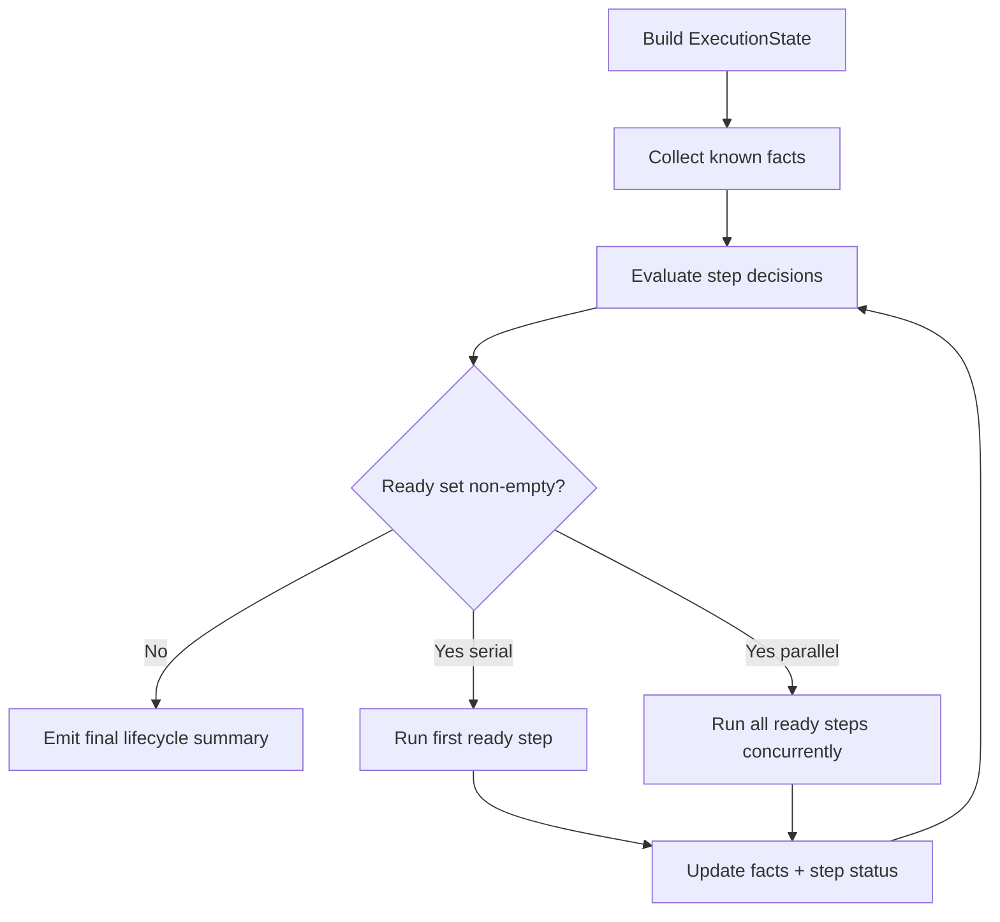

# DL Preliminary Execution Design

This document turns lifecycle reporting into an execution-planning model: given known and unknown resource facts, decide what runs now, what waits, and how we preserve deterministic logging while adding parallel execution.

## Scope

- Build a general run-decision model for `dl` pipeline steps.
- Keep compatibility with current lifecycle reporting in [`/src/dl/lifecycle.ts`](/src/dl/lifecycle.ts).
- Prepare for both execution modes:
  - serial one-at-a-time
  - parallel when dependencies are satisfied

## Current Baseline

Today, execution context in [`/src/dl/types.ts`](/src/dl/types.ts) is:

- `DlContext = { roots, options, log }`

This is orchestration context, not execution state. Runtime facts (exists, missing, conflict, failed dependency, deferred) are implicit and scattered across step code.

## Proposed Execution State Object

Add a dedicated runtime state object in `src/dl/` (new module), separate from options:

```ts
type Known<T> = { known: true; value: T } | { known: false }

type StepState = "off" | "skip" | "ensure" | "force"
type StepId =
  | "archlist"
  | "archive"
  | "archive-jj"
  | "simplify-org"
  | "simplify-repo"
  | "wiki-dexport"
  | "wiki-git"

type StepDecision = "run" | "skip" | "defer"

type RuntimeFacts = {
  archiveGit: Known<boolean>
  archiveJj: Known<boolean>
  wikiDir: Known<boolean>
  wikiGit: Known<boolean>
  archlistContains: Known<boolean>
  simplifyOrgLink: Known<"correct" | "missing" | "conflict">
  simplifyRepoLink: Known<"correct" | "missing" | "conflict">
}

type StepNode = {
  id: StepId
  state: StepState
  dependsOn: Array<StepId>
  decision: StepDecision
}

type ExecutionState = {
  repoUrl: string
  facts: RuntimeFacts
  nodes: Record<StepId, StepNode>
  mode: "serial" | "parallel"
}
```

Key point: this lets `dl/index.ts` evaluate policy from one object instead of embedding policy into each sync callsite.

## Invariant Rules

1. **Policy first**: step state (`off/skip/ensure/force`) determines allowed transitions.
2. **Fact monotonicity**: unknowns become known; known facts never revert during one execution.
3. **Dependency satisfiability**: step can move from `defer` to `run` only when dependencies become terminal (`ok` or `skipped` as allowed).
4. **Single terminal step result**: each step yields one terminal lifecycle result.
5. **Mode equivalence**: serial and parallel modes must produce equivalent terminal states for same inputs.

## Decision + Scheduler Model



### Serial Mode

- Stable deterministic order (topologically sorted by step id list).
- Simplest debugging baseline.

### Parallel Mode

- Run only satisfiable ready-set steps.
- Keep dependency barriers:
  - `archive-jj` waits on `archive`
  - `simplify-repo` waits on `simplify-org` structural readiness
- Must preserve lifecycle report determinism (see logging boundary appendix).

## Logging and Ordering Pattern (Unresolved Name)

We need parallel execution with ordered reporting. Existing similar behavior exists in `~/src/exec-all` (buffer output per task, emit on completion).

Working label options for this pattern:

- `resolve-ordered deferred logging`
- `buffered span flush`
- `completion-ordered emission`

Pattern contract:

1. Task executes and logs into a task-local buffer.
2. Buffer closes at task completion (success/failure).
3. Aggregator emits task logs in deterministic order (for example, resolve order or configured index order).
4. Final lifecycle summary references emitted task boundaries.

## Appendix A: Natural Next Steps (from prior 3 points)

These expand the immediate next items already identified.

### A1. StepState parsing and compatibility layer

- Introduce `StepState` + `StepControl` in [`/src/dl/types.ts`](/src/dl/types.ts).
- Parse:
  - `--archive=ensure`
  - `--archive` => `ensure`
  - `--no-archive` => `off`
- Fail fast on invalid state values.

### A2. Policy extraction from `processRepoContext`

- Add `ExecutionState` planner module (pure decision logic).
- Make `processRepoContext` consume planner output.
- Keep side-effect code in sync modules (`archive`, `wiki`, `simplify`) and keep policy logic out of side-effect modules.

### A3. Dexport plan semantics by explicit wiki state

- Thread wiki state into dexport policy entrypoint.
- Replace implicit `directory exists => skip` with explicit state table.
- Preserve current detached mode behavior (`queue`) while making `ensure` reruns explicit.

### A4. Scheduler modes

- Add `--execution=serial|parallel` (default serial until stable).
- Validate mode equivalence with test fixtures.
- Reuse lifecycle records as assertion source for equivalence tests.

## Appendix B: gunsho11y Span Contexts as Logging Boundaries

`dl` needs span-aware log boundaries to support parallel run + deterministic emit. `gunsho11y` is the natural boundary owner because it already centralizes pino + plugin extensions.

Desired boundary semantics:

- `beginSpan(name, metadata)` returns span handle.
- `span.log(...)` writes to span buffer, not global stream.
- `span.end({ status })` closes span and publishes buffered records.
- Parent/child spans capture depth for nested step work.

Why this matters for `dl`:

- parallel task execution can keep logs isolated by step
- final output can be emitted in deterministic ordering without losing per-task chronology
- lifecycle summary and span summaries can be cross-referenced by step id

This appendix is intentionally scoped to `dl` needs; full gunsho11y span design is tracked in gunsho11y docs.
