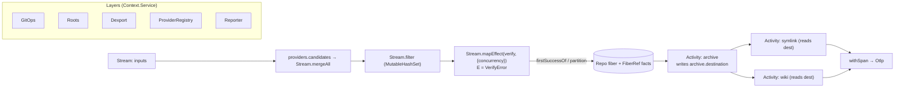

# What an effect.ts of dl would look like

An assessment of `dl` (rekon) through the lens of [Effect-TS](https://github.com/Effect-TS/effect),
and a grounded design for adopting **effect-smol** (Effect v4).

> Decision taken: the substrate is **effect-smol** — published as `effect@4.0.0-beta.68`.
> Pure ESM, `sideEffects: []`, subpath exports (`effect/Effect`, `effect/Stream`,
> `effect/Layer`, `effect/Context`, `effect/Schedule`, `effect/Schema`, plus
> `effect/unstable/{cli,process,observability,...}`). dl currently has **zero** effect
> dependencies, so this is greenfield adoption.

Reference materials read for this assessment:

- [`~/archive/doc/effect-smol-rundown.md`](/home/rektide/archive/doc/effect-smol-rundown.md) — v4 module inventory and dependency layering
- [`~/archive/doc/effect-smol-changes.md`](/home/rektide/archive/doc/effect-smol-changes.md) — 934 commits, Jan–Jun 2026; API/breaking changes
- effect-smol checkout at `~/archive/Effect-TS/effect-smol/` (`packages/effect`, v4.0.0-beta.68)

---

## 1. Thesis: dl is already ~70% an effect system

`dl` has independently reinvented most of Effect's vocabulary — it just spells the
pieces out by hand rather than unifying them in one type. The "Functional Core /
Imperative Shell" comments atop [`/src/execute/stage.ts`](/src/execute/stage.ts) and
[`/src/execute/executor.ts`](/src/execute/executor.ts) are exactly the discipline Effect
formalizes.

So the question is not "should dl become effectful" — it already is. It is **"what
happens when those scattered conventions collapse into one type."**

### Concept mapping (dl → effect-smol v4)

| dl today | effect-smol v4 | Notes |
|---|---|---|
| `Stage = (AsyncIterable, ctx) => AsyncIterable` ([`stage.ts`](/src/execute/stage.ts)) | `Stream<Repo, RepoError, R>` | `runStages`' reduce → plain `pipe(source, dedupe, verify, …)`; operators are pipeable |
| `fanIn` over candidate streams ([`fan-in.ts`](/src/execute/fan-in.ts)) | `Stream.mergeAll(streams, { concurrency })` | drop the hand-rolled merge |
| `dedupeRepos` ([`flow/steps/dedupe.ts`](/src/flow/steps/dedupe.ts)) | `Stream.filter` over a scoped `MutableHashSet` (or the `Filter` module) | |
| `verifyStage` (silently skips `!attempt.repo`) | `Stream.mapEffect(verify, { concurrency })` ▸ `Stream.filterMap` | failures become typed, not a silent `continue` |
| `FLOW_GOAL.firstSuccess` ([`flow/types.ts`](/src/flow/types.ts)) | **`Effect.firstSuccessOf`** (changes §39) | maps *exactly*; newly ported in this window |
| `FLOW_GOAL.allSuccesses` + `continueOnError` | **`Effect.partition` / `Effect.validate`** (§18) | accumulates all failures: `[failures, successes]` |
| `Services` god-record ([`planner/types.ts`](/src/planner/types.ts)) | one `Context.Service` per capability (`GitOps`, `Reporter`, `Roots`, `Dexport`) | `ServiceMap`→`Context` rename (§10); class syntax |
| gunshi `plugin()` + `Assembly.bind` ([`archive/plugin.ts`](/src/archive/plugin.ts)) | a `Layer` per domain; `Layer.mock` for tests (§20) | the plugins already *are* layers |
| `Binding.run => Promise<ActionResult \| void>` | the Action **is** an `Effect` via `Effectable.Class` (§1) | the Activity/Statement pattern — `yield*` the action directly |
| `ActionResult.hadError` boolean | `Data.TaggedError("CloneError")<{…}>` in the `E` channel | recoverable failures typed; unexpected → `Effect.die` (see §4) |
| `RepoFacts.get/set` stringly map | a `FiberRef` scoped to each repo's fiber | the cross-action channel becomes first-class |
| `AbortSignal` threaded everywhere | **`Effect.abortSignal`** (§19) → hand to `fetch`/process | scope-managed; interruption replaces manual checks |
| `RunOptions.timeoutMs` / retry-less clone | `Effect.timeout` + `Schedule.exponential.pipe(jittered)` (§30) | `Schedule.tap` (§59) for retry observability |
| `Reporter`/`LifecycleRecord` ([`report/types.ts`](/src/report/types.ts), [`action/lifecycle.ts`](/src/action/lifecycle.ts)) | `Effect.withSpan` + `annotateCurrentSpan` + `Effect.log`; export via `Otlp.layerFromEnv` (§53) | ok/skipped/failed → span status + events |
| `tinyexec` for git/jj | `effect/unstable/process` (Command/Process service) | testable, interruptible subprocesses |
| `ProviderRegistry` ([`provider/types.ts`](/src/provider/types.ts)) | `LayerMap` / `RcMap` keyed by host | reference-counted per-host provider layers |
| git temp dirs / dexport handle | `Effect.acquireRelease` / **`Effect.acquireDisposable`** (§40) + `Scope` | `using`-protocol cleanup |
| `Repo`, provider HTTP payloads | `Schema.Class` / `Schema.Struct` | validate GitHub/GitLab responses at the edge |

(`§N` references are section numbers in
[`effect-smol-changes.md`](/home/rektide/archive/doc/effect-smol-changes.md).)

---

## 2. The shape it wants to take



The streaming pipeline (resolve → dedupe → verify → staged actions) replaces the
`runStages` reducer in [`/src/execute/stage.ts`](/src/execute/stage.ts) with pipeable
`Stream` operators. Each input fans out to candidate streams, merges, dedupes, verifies
with bounded concurrency, then drives the per-repo action graph.

---

## 3. The punchline: actions as Effectable Activities

The real "effect.ts of dl" is that `archiveAction` ([`/src/archive/handler.ts`](/src/archive/handler.ts))
— with its double `try/catch`, mirrored `report.failed` calls, and `hadError` boolean —
collapses to an **`Activity`** (`effect/unstable/workflow`, changes §47). dl's
`ensure/force/skip/off` states ([`/src/action/state.ts`](/src/action/state.ts)) **are** an
idempotency policy, and the natural `idempotencyKey` is `repo.id + ":archive"`.

```ts
import * as Data from "effect/Data"
import * as Effect from "effect/Effect"
import * as FiberRef from "effect/FiberRef"
import * as Schedule from "effect/Schedule"
import * as Activity from "effect/unstable/workflow/Activity"

class ArchiveError extends Data.TaggedError("ArchiveError")<{ repo: string; cause: unknown }> {}

const archive = Activity.make({
  name: "archive",
  error: ArchiveError,
  execute: Effect.fn(function* (repo: Repo) {
    const git = yield* GitOps
    const dest = yield* git.cloneOrUpdate(repo.url /*, roots */).pipe(
      Effect.retry(Schedule.exponential("500 millis").pipe(Schedule.take(3))),
      Effect.mapError((cause) => new ArchiveError({ repo: repo.id, cause })),
    )
    yield* FiberRef.update(facts, (m) => m.set("archive.destination", dest))
    yield* Effect.annotateCurrentSpan("destination", dest)
    return dest
  }),
}) // Activity is Effectable → `yield* archive(repo)` directly
```

`symlink` / `wiki` then `yield* FiberRef.get(facts)` to read `archive.destination`. The
cross-stage dependency that is invisible today (smuggled through `facts.set`) becomes
something the planner can topologically order:

- **facts-as-build-graph.** Today [`/src/planner/plan.ts`](/src/planner/plan.ts) hardcodes
  `ACTION_STAGE_ORDER` (`verified → catalog → materialize → document → link → report`),
  and each action hand-places itself into a stage. But the real dependency edges already
  live in `RepoFacts`: `archive` writes `archive.destination`; `symlink`/`wiki` read it.
  If each action **declares the facts it reads/writes** (its `R` and its outputs), the
  planner can topologically sort bindings from the fact graph — a build graph over repos
  (Bazel/Nix-like) — and the six hand-maintained stage names largely evaporate. Effect
  makes this expressible because actions are real Effects with declared requirements.

---

## 4. Two reconciliations with AGENTS.md (load-bearing)

- **"Let It Fail" vs typed errors.** [`/AGENTS.md`](/AGENTS.md) §Coding-advice says: don't
  `try/catch` just to print — let the stack trace show the fault. Effect's pitch looks
  opposite, but the clean split honors the principle: model *expected, recoverable*
  failures as `Data.TaggedError` in the `E` channel (clone failed, verify 404, timeout);
  let everything unexpected be a **defect** (`Effect.die` / `Cause.Die`), which *preserves
  the stack trace* and surfaces loudly. That is the typed version of Let-It-Fail, and it
  deletes the print-only `try/catch` blocks.

- **Toolchain.** `effect@4` is ESM with `sideEffects: []` and tree-shaking hardened in
  this very window (changes §56), so `tsdown` bundling and `node src/cli.ts` type-stripping
  are fine (stripping only erases dl's own annotations; `effect` is imported as compiled
  JS). The real cost to watch is `tsgo` typecheck time over Effect's deep generics —
  measure on a spike before committing the whole tree.

Note also [`/AGENTS.md`](/AGENTS.md) §Project-Planning: never a flat layout — the refactor
keeps domain grouping (`provider/`, `git/`, `archive/`, …), now expressed as one `Layer`
per domain.

---

## 5. The fork that shapes everything next

effect-smol ships its **own** CLI (`effect/unstable/cli`: `Flag`, `Command`, static
completions, "global flags as services" — changes §42, §44), which competes head-on with
**gunshi** — dl's AGENTS.md-mandated CLI layer and the entire [`/src/plugin/`](/src/plugin/)
+ c12 + completion stack. How far Effect reaches reshapes the whole design.

### Blast-radius options

1. **Engine core only.** Replace the flow/execute/planner internals (Stream + Layer +
   typed errors + spans). Keep gunshi CLI, providers, and IO adapters at the edges,
   bridged in. Lowest risk, biggest payoff per line.
2. **Core + IO + providers.** Above, plus `Context.Service`/`Layer` for
   GitOps/Dexport/Roots, `effect/unstable/process` for git/jj, and Schema-validated
   provider responses. Effect owns everything but the CLI parse layer.
3. **Whole app incl. CLI.** Also migrate gunshi → `effect/unstable/cli`: one runtime
   end-to-end, but it discards the plugin/c12/completion stack and conflicts with current
   AGENTS.md guidance.

### Recommendation

Start at **(1) engine core only** — it is where dl is already strongest-shaped (Stream,
Services, lifecycle) and weakest-typed (the `hadError` boolean, silent verify skips). It
delivers typed errors, real concurrency/retry, and span-based observability without
touching the gunshi/plugin investment. Promote to (2) once the `tsgo` cost is measured and
acceptable. Defer (3) until there is a concrete reason to give up gunshi's plugin model.

### Open questions for the next pass

- Blast radius: (1), (2), or (3) above?
- Next deliverable: a **concrete spike** (one vertical — input → verify → archive — as
  runnable `.ts`, measuring `tsgo` cost), a **full design doc** (layers, service tags,
  error taxonomy, migration order), or **keep daydreaming** (Workflow/DurableQueue,
  provider registry as `LayerMap`)?

---

## 6. Further effect-smol facilities worth a daydream

- **`Workflow` / `DurableQueue`** (changes §33, §47) — the full lifecycle
  (archive → symlink → wiki) with idempotency keys and crash-resumable steps. Heavyweight;
  daydream territory, not v1.
- **`LayerMap` / `RcMap`** (rundown Layer 5) — the provider registry as dynamic,
  reference-counted per-host layers instead of [`/src/provider/registry.ts`](/src/provider/registry.ts).
- **`Schema`** for `Repo`, frontmatter (replacing `gray-matter` typing), and provider HTTP
  payloads — validate at the edge, derive JSON Schema for free.
- **`Config` / `Config.nested`** (changes §23) — an alternative to c12/xdg for
  `RunOptions` and roots, if the CLI ever moves onto Effect.
- **`Otlp.layerFromEnv`** (changes §53) — `LifecycleRecord` is already a span event in all
  but name; formalizing report.ok/skipped/failed as spans yields a real `--trace`
  waterfall via standard `OTEL_*` env vars.
