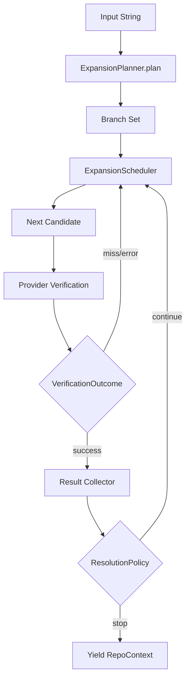

# ADR: Expansion Space and Wave-Head Scheduling

## Status

Draft

## Decision Summary

Adopt an **expansion-space architecture** where expanders produce independent interpretation branches and a configurable scheduler advances the wave-head across those branches. Verification remains the filter, but scheduling becomes explicit and policy-driven so we can optimize for either fast first-hit resolution or exhaustive coverage.

This keeps the current pipeline shape (`expand -> verify -> enrich`) while replacing "one-shot candidate list" with a branch-aware candidate stream.

## Context

Current behavior is implemented by:

- [`/src/url/types.ts`](/src/url/types.ts): `Expander.expand(input): URL[]`
- [`/src/url/index.ts`](/src/url/index.ts): `expand(input, expanders)` flattens and deduplicates
- [`/src/repo/resolve.ts`](/src/repo/resolve.ts): `verify(...)` iterates candidates serially and skips failures
- [`/src/plugin/repo.ts`](/src/plugin/repo.ts): wires expander list and provider registry

The architecture is intended to be speculative (many guesses in, verified matches out), but in practice some expanders mutually exclude others (notably shorthand vs dotted first segment), so one interpretation often suppresses the rest.

That means we do **not** really explore expansion space; we evaluate a narrow path and stop learning from adjacent interpretations.

## Problem Statement

We need to support both of these goals at runtime, per use case:

1. **Fast likely answer**: short path to first high-confidence success.
2. **Broad verification**: explore all plausible interpretations to avoid false negatives.

The missing concept is the **wave-head**: where we are in the search frontier across branches. Today that frontier is implicit and mostly collapsed to one branch.

## Decision Drivers

- Preserve existing provider registry and verify semantics.
- Make branch overlap normal, not accidental.
- Support multiple search strategies without rewriting expanders.
- Keep deterministic behavior and debuggable traces.
- Allow future adaptive feedback from verification outcomes.

## Proposed Architecture

### 1) Expansion Space Model

Treat each expander interpretation as a **branch** with its own ordered candidates.

- A branch can be finite and precomputed (array-backed) or lazy.
- Branches are independent; no branch can suppress creation of another.
- Global dedupe still applies on canonical candidate identity.

### 2) Scheduler Owns the Wave-Head

A scheduler decides which branch advances next.

- `serial-best-first`: consume one branch fully, then next.
- `round-robin`: one candidate per branch per round.
- `tiered`: exhaust high-confidence tier before speculative tier.
- `exhaustive-serial`: deterministic serial order over all branches, never abandons untried branches.

### 3) Verifier Remains Filter Boundary

Verifier receives scheduled candidates and emits outcomes (`success`, `miss`, `error`, `redirect`, `timeout`).

- Scheduler may update priorities from outcomes.
- Resolution policy decides stop condition (`first-success` vs `all-successes` vs bounded exploration).

### 4) Resolution Policy Is Configurable

Expose strategy selection in plugin options so different commands can choose different tradeoffs.

## Concrete Interfaces (Draft)

```ts
export type CandidateId = string

export interface ExpandCandidate {
  id: CandidateId
  url: URL
  expander: string
  branchId: string
  depth: number
  confidence: "definitive" | "likely" | "speculative"
}

export interface ExpansionBranch {
  id: string
  expander: string
  confidence: ExpandCandidate["confidence"]
  next(): ExpandCandidate | null
}

export interface ExpansionPlanner {
  plan(input: string): ExpansionBranch[]
}

export interface VerificationOutcome {
  candidate: ExpandCandidate
  status: "success" | "miss" | "error" | "redirect" | "timeout"
  context?: RepoContext
  canonicalUrl?: URL
}

export interface ExpansionScheduler {
  name: string
  next(branches: ExpansionBranch[], seen: Set<CandidateId>): ExpandCandidate | null
  onOutcome(outcome: VerificationOutcome): void
}

export interface ResolutionPolicy {
  goal: "first-success" | "all-successes"
  maxCandidates?: number
  stopOnDefinitive?: boolean
}
```

### Adapter Layer to Reuse Existing Expanders

Existing `Expander.expand(input): URL[]` can be wrapped into branches immediately:

- `ArrayBranch(expanderName, confidence, urls)` implements `next()` with cursor index.
- No expander rewrite required for baseline rollout.
- Later we can add true lazy expanders without changing scheduler/verifier contracts.

## Execution Flow



## Baseline Strategy Profiles

- `fast-default`: `tiered` scheduler + `first-success` policy.
- `balanced`: `round-robin` scheduler + `first-success` policy.
- `audit`: `exhaustive-serial` scheduler + `all-successes` policy.

These profiles should be selectable per command invocation or config.

## Invariants

- A failed candidate must not terminate exploration unless policy says stop.
- Branch overlap is required; branch exclusivity is not allowed as architecture.
- Exhaustive modes terminate only when all branches are exhausted (or budget reached).
- Candidate dedupe must be global across branches.

## Alternatives Considered

### A. Keep Flat `URL[]` Expansion and Remove Guards Only

- **Pros**: tiny change, immediate correctness improvement for many inputs.
- **Cons**: no explicit wave-head control; difficult to tune cost/coverage behavior.

### B. First-Match Fallback Chain

- **Pros**: minimal network calls on happy path.
- **Cons**: reproduces current flaw; misses valid alternatives after one miss.

### C. Branch + Scheduler Architecture (Chosen Baseline)

- **Pros**: supports both fast and exhaustive strategies in one model; clear interfaces.
- **Cons**: introduces planner/scheduler abstractions.

### D. Fully Adaptive Search (Bandit / learned ranking)

- **Pros**: potentially best cost/accuracy over time.
- **Cons**: premature complexity without baseline observability and deterministic controls.

## Migration Plan

1. Add planner/scheduler interfaces and array-branch adapter.
2. Keep current expanders, but remove mutual exclusion assumptions.
3. Route `plugin/repo` resolution through scheduler loop.
4. Add strategy profile config with default `fast-default`.
5. Add debug trace events: branch creation, candidate scheduling, outcome, stop reason.
6. Add tests for:
   - dotted-handle fallback (`mary.my.id/atcute` style)
   - first-success mode
   - exhaustive mode proving all branches were attempted

## Consequences

- We retain current architecture strengths (clean stages, provider isolation, dedupe).
- We gain explicit control of the search frontier (wave-head).
- We can test and evolve resolution behavior by swapping strategies instead of rewriting expansion logic.
