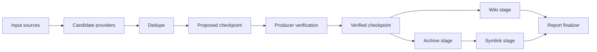

# Fancy contribution graph

## Status

Fanciful design note. Not the phase 3 plan.

## Purpose

Capture the more general version of the flow architecture: plugins contribute small pieces of behavior, and the runtime assembles a flow from those contributions based on intent, ordering constraints, and applicability predicates.

This is the tempting end-state behind the phase 3 work. Phase 3 should not implement this graph directly. It should keep the door open while converting actions into repo-native verified stages.

Related docs:

- [`/doc/flow.md`](/doc/flow.md)
- [`/doc/flow-runtime-stage-plan.md`](/doc/flow-runtime-stage-plan.md)
- [`/doc/phase3.md`](/doc/phase3.md)

## Core idea

Today, `dl` has several contribution shapes:

- Providers contribute candidate and verification behavior.
- Input plugins contribute streams.
- Action plugins contribute CLI specs and legacy handlers.
- The flow plugin owns runtime execution and checkpoint observers.

The fancy graph model makes those pieces part of one contribution system. A plugin would not ask the command to know exactly how it should be wired. It would describe what it contributes, when it applies, what it needs, and where it belongs.

The runtime would assemble the graph for one command invocation.



## Contribution contract sketch

The graph would need contributions with identity, placement, predicates, and ordering hints.

```ts
type FlowContribution = Readonly<{
  id: string
  kind: "input" | "provider" | "stage" | "observer" | "policy"
  checkpoint?: "candidate" | "proposed" | "verified" | "completed"
  requires?: ReadonlyArray<string>
  provides?: ReadonlyArray<string>
  before?: ReadonlyArray<string>
  after?: ReadonlyArray<string>
  applies(context: FlowAssemblyContext): boolean
  create(context: FlowAssemblyContext): unknown
}>
```

This is intentionally broad. A real version should probably split this into narrower contracts instead of using one large union too early.

## What this buys us

The graph model separates contribution from assembly.

A plugin can say:

- "I provide a verified repo stage named `archive`."
- "I apply when the archive action state is not `off`."
- "I provide the fact `archive.destination`."
- "I should run before `symlink`, because symlink expects the archive directory to exist."

The command does not manually know about archive, wiki, deepwiki, archlist, or symlink. It expresses command intent, then asks the assembler for the flow for that invocation.

## Risks

The graph can become a second programming language.

Main risks:

- Ordering bugs become harder to see than an explicit stage list.
- Diagnostics need to explain why a contribution did or did not run.
- Cycles and missing requirements need good errors.
- Contributors may start relying on incidental facts from other contributors.
- The abstraction may hide too much while the current action model is still unsettled.

This is why phase 3 should not start here.

## Good stepping stone

Phase 3 can implement a smaller version: action plugins contribute stage factories, and the `dl:actions` plugin assembles an ordered list of verified stages.

That proves the important parts without creating a general graph engine:

- plugin-owned behavior contribution
- command-time activation from parsed options
- dependency binding at assembly time
- repo-native action execution
- shared action run state for errors, lifecycle, and sidecar facts

If this smaller system works, it can evolve toward graph assembly later by adding metadata around each action contribution:

```ts
type DlActionContribution = Readonly<{
  id: string
  spec: DlActionSpec
  order: number
  provides?: ReadonlyArray<string>
  requires?: ReadonlyArray<string>
  createStage(config: ActionStageConfig): Stage<Repo, FlowContext>
}>
```

The `order` field can later become `before` / `after`. The `provides` and `requires` fields can initially be documentation and test assertions before they become a full graph solver.

## When to revisit

Revisit the graph model after action stages are real and the legacy bridge is gone.

Signals that the graph is worth building:

- Plugins outside the built-in action set need to contribute flow behavior.
- Ordering rules are no longer a simple fixed list.
- Multiple commands need to assemble different flows from the same contribution catalog.
- Sidecar facts become common enough that explicit `provides` / `requires` checks would prevent bugs.
- Reporting, policy, and action contributions need to compose without command-specific glue.

Until then, keep the phase 3 design smaller and more explicit.
