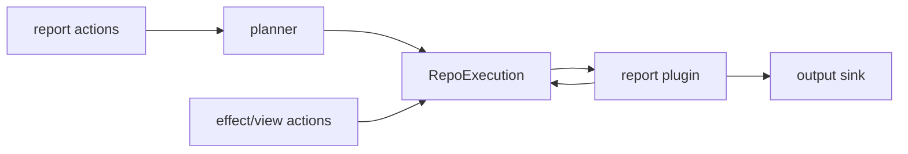

# Reporting and structured log design

## Status

Draft.

This replaces the older direction in [`/doc/log.md`](/doc/log.md). That document was written before the Phase 3 planner/action architecture landed, so it treats reporting as mostly a replacement for the old action pipeline and `logPlugin`. The useful idea remains: events and per-repo reports should share one structured substrate.

## Problem

`rekon dl` now runs through planner actions and repo-stage bindings. Reporting has not caught up.

There are still two surfaces:

- [`/src/plugin/log.ts`](/src/plugin/log.ts) emits fire-and-forget structured log lines through `LogExtension`.
- [`/src/action/lifecycle.ts`](/src/action/lifecycle.ts) accumulates per-repo lifecycle records through `LifecycleReporter`.

They solve related problems but do not compose. Candidate and verified views log directly. Effect actions record lifecycle outcomes. Flow handoffs are bridged into lifecycle records by planner code in [`/src/planner/lifecycle.ts`](/src/planner/lifecycle.ts). Lifecycle summary emission is also planner-owned.

That leaves planner with reporting knowledge it should not need:

- `--report-lifecycle` means install lifecycle bindings.
- flow handoffs become lifecycle records.
- lifecycle summaries are emitted at the `report` stage.

Planner should execute bindings. Reporting should be a service that actions can use and a set of report actions that can opt into output.

## Current architecture after Phase 3

The new action model gives us a better place to put reporting.

| Concept | Current role |
| --- | --- |
| `Action` | Generic planner participant. Effects, views, reports, and modes can all be actions. |
| `ActionSpec` | Declarative metadata for selection, defaults, and states. |
| `RepoExecution` | Per-repo execution context shared across bindings for that repo. |
| `ActionRunState` | Planner-owned facts, errors, and current lifecycle reporters. |
| `Binding` | Concrete stage entry installed for one run. |
| `Services` | Runtime services exposed to actions. Currently includes `log`, git, dexport, roots, and options. |

The reporting redesign should build on this instead of inventing a parallel pipeline.

## Target shape

Create a report subsystem with two layers:

1. **Report service plugin**: provides structured recording, per-subject reporter storage, fire-and-forget events, formatting, sinks, and child process stdio settings.
2. **Report actions**: opt into specific report behavior during planner assembly, such as lifecycle capture and summary output.

The service is always available. Report actions decide what accumulated records, scoped reports, or summaries become visible for a run.



## Report service

The report plugin replaces the long-term responsibilities of `logPlugin` and the current lifecycle module. It should not own planner execution.

Suggested directory layout:

```text
src/report/
  types.ts          # ReportRecord, Reporter, ReportService, ReportSink
  reporter.ts       # createReporter(), createReportService()
  format.ts         # text/json formatters
  output.ts         # stdio and file sinks
  plugin.ts         # gunshi plugin wiring
  lifecycle.ts      # compatibility helpers for lifecycle-shaped records
```

Core contracts:

```ts
type ReportStatus = "info" | "ok" | "skipped" | "failed" | "needs-attention"

type ReportRecord = Readonly<{
  subject: string | null
  step: string
  source: string
  status: ReportStatus
  event: string
  details: Readonly<Record<string, unknown>>
  timestamp: string
}>

type Reporter = Readonly<{
  info(input: ReportInput): void
  ok(input: ReportInput): void
  skipped(input: ReportInput): void
  failed(input: ReportInput): void
  needsAttention(input: ReportInput): void
  records(): ReadonlyArray<ReportRecord>
  summary(hadError: boolean): ReportSummary
}>

type ReportService = Readonly<{
  forSubject(subject: string | null, initial?: ReadonlyArray<ReportRecord>): Reporter
  emit(input: ReportEmitInput): void
  writeRecord(record: ReportRecord): void
  writeSummary(summary: ReportSummary): void
  getOutputStdout(): "inherit" | "ignore" | "pipe" | number
  getOutputStderr(): "inherit" | "ignore" | "pipe" | number
}>
```

`Reporter` is for per-subject accumulation. In `dl`, the subject is usually a repo URL. Reporter methods do not write to sinks directly. They append records so report actions can decide what to flush and when.

`emit()` is for events that should be output immediately but not accumulated into a repo summary, such as watch input, clipboard input, dry-run plans, or command-level diagnostics. `writeRecord()` and `writeSummary()` are the explicit sink boundary for report actions that make accumulated data visible.

The report service owns the per-subject reporter map. Planner state should not keep reporter storage after migration. `ActionRunState` should keep planner execution facts only: errors, per-repo errors, de-dupe records, and repo facts.

## Report actions

Reporting behavior that participates in a planner run should be an `Action` with `role: "report"`.

Example shape:

```ts
export const lifecycleReportAction: Action = {
  spec: {
    name: "report-lifecycle",
    description: "Emit lifecycle records and per-repo lifecycle summaries",
    role: "report",
    defaultParticipation: "explicit-only",
    suppressesDefaultsWhenExplicit: false,
    defaultState: "enabled",
    states: ["enabled", "off"],
  },
  assemble(ctx) {
    if (!ctx.intent.enabled("report-lifecycle")) return
    ctx.assembly.bind(/* record flow handoffs at verified */)
    ctx.assembly.bind(/* emit summary at report */)
  },
}
```

This removes lifecycle special cases from planner execution. Planner still runs the bindings, but it does not know lifecycle exists. Flow handoffs should be recorded by the lifecycle report action through `ctx.report`, not seeded implicitly through planner-owned reporter creation.

Report actions are also the right place for future report scopes:

- `--report=archive`
- `--report=wiki`
- `--report=all`
- `--report=json`
- `--report=none`

Those can be report action states or a separate report selection action. We should not encode them in planner core.

## What planner should own

Planner should own execution mechanics:

- collect actions from extensions
- create invocation intent
- create a binding plan
- create per-run execution state
- attach binding stages to flow
- execute flow
- return `PlannerRunResult`

Planner should not own reporting policy:

- no lifecycle-specific binding ids
- no report flag registration beyond generic planner modes, if any
- no lifecycle summary formatting
- no report scope decisions

Planner can keep `ActionRunState` temporarily, but reporter storage should move out of it. During migration, `ActionRunState.reporterFor()` can delegate to `services.report.forSubject()`. In the target shape, `RepoExecution.report` comes from the report service and `ActionRunState` no longer knows about reporter records.

## What flow should own

Flow should keep runtime introspection separate from reporting:

- session phase
- queued count
- provider handoffs
- checkpoint counters
- last error

Flow should expose enough data for report actions to record flow events. It should not format or emit report output itself.

The current `flowLifecycleRecords()` bridge should become a small helper under `src/report/lifecycle.ts` or disappear when flow checkpoints can write records directly through `RepoExecution.report`.

## Output and formatting

The report plugin should own these flags:

- `--json`
- `--output`
- `--output-stdout`
- `--output-stderr`

It may also own report-specific flags:

- `--report-lifecycle`
- future `--report=<scope>`

This keeps child process stdio policy and record formatting in one service. Existing git/dexport code can keep asking a service for stdout/stderr modes, but that service should be report/output, not generic logging.

Formatting should be pure:

```ts
function formatReportRecordText(record: ReportRecord): string
function formatReportRecordJson(record: ReportRecord): string
function formatReportSummaryText(summary: ReportSummary): string
```

Sinks should be imperative:

```ts
type ReportSink = Readonly<{
  write(record: ReportRecord): void
  writeSummary(summary: ReportSummary): void
}>
```

## Data model decisions

| Decision | Reason |
| --- | --- |
| `step` is `string` | Domain modules own step names. Shared reporting should not require editing a central union for every action. |
| `subject` is on every record | Fire-and-forget and accumulated records can share one shape. |
| `timestamp` is set at emission time | Formatting time is too late for ordering and correlation. |
| `status` includes `info` | Candidate, verified, input, and dry-run events are observations, not terminal outcomes. |
| `status` includes `needs-attention` | The future `check` state in [`/doc/existing-state.md`](/doc/existing-state.md) needs read-only warnings that are not failures. |
| Reporters accumulate; sinks output | Accumulation and presentation are different responsibilities. |

## Migration plan

### 1. Create report core

Add `src/report/types.ts`, `src/report/reporter.ts`, `src/report/format.ts`, and tests.

Keep existing code working by adapting [`/src/action/lifecycle.ts`](/src/action/lifecycle.ts) to re-export or wrap the new reporter types.

Acceptance:

- lifecycle tests still pass
- report formatter tests cover text and JSON output
- reporter tests prove per-subject accumulation is stable and does not write to sinks
- no planner behavior changes

### 2. Add report plugin beside log plugin

Introduce `reportPlugin` without deleting `logPlugin` yet.

The first version should provide:

- `forSubject()`
- `emit()`
- `writeRecord()`
- `writeSummary()`
- `getOutputStdout()`
- `getOutputStderr()`

Acceptance:

- no call sites migrated yet
- plugin can be installed in `dlPlugins`
- tests can use an in-memory sink
- child output flag names are `--child-output*`, not `--output*`

### 3. Move lifecycle reporting to a report action

Create a `role: "report"` lifecycle action. Move current lifecycle binding creation out of [`/src/planner/lifecycle.ts`](/src/planner/lifecycle.ts).

Acceptance:

- planner no longer imports lifecycle binding creation
- `--report-lifecycle` is registered by a report/lifecycle plugin
- lifecycle still emits the same summary shape for now
- flow handoffs are recorded explicitly by the lifecycle report action, not by `reporterFor()` initial seeding

### 4. Migrate `RepoExecution.report`

Change `RepoExecution.report` from `LifecycleReporter` to `Reporter`.

Update effect actions to call the new reporter methods. Keep method names compatible where possible: `ok`, `skipped`, `failed`.

During this stage, make `ActionRunState.reporterFor()` delegate to `ReportService.forSubject()` or remove it if binding stage creation can read the service directly. Do not keep a planner-owned reporter map in the final shape.

Acceptance:

- archive/wiki/deepwiki/archlist/symlink records are stored as `ReportRecord`
- `action/lifecycle.ts` compatibility can shrink or disappear
- planner run state has no direct dependency on lifecycle/report record types in the final shape

### 5. Replace `LogExtension` call sites gradually

Migrate fire-and-forget logs to `ReportService.emit()`.

Good first targets:

- candidate and verified view actions
- watch/clipboard/input events
- dry-run messages

Leave standalone commands with direct `console.*` unless they need structured output.

Acceptance:

- `LogStage` disappears
- `plugin/log.ts` is either deleted or reduced to a compatibility wrapper

### 6. Add report scopes

Implement report scope selection after records have one shared shape.

This should align with [`/doc/existing-state.md`](/doc/existing-state.md): archive/wiki/symlink/archlist/all scopes, `check` records, and dry-run summaries.

Acceptance:

- summary output is derived from records
- exit code still depends on all failures, not just visible report scopes
- `--report=all --dry-run` can show would-run/check-style output

## What not to do yet

- Do not replace planner execution with a reporting lifecycle framework.
- Do not add a separate report capability registry unless the generic `Action` model proves insufficient.
- Do not move all standalone command output into report service immediately.
- Do not make flow format output.
- Do not require every record to be terminal; observations need `info`.

## Near-term cleanup before implementation

No more planner decomposition is required before starting this work.

The one cleanup worth doing first is small: remove lifecycle binding creation from planner by turning it into a report action. That can happen as stage 3 above after the report plugin exists. Doing it before the report service would just move the same special case to a new file.

The current planner split is good enough for the reporting design to proceed.
