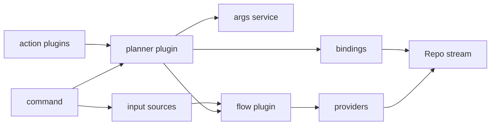

# Phase 3 architecture

## Status

Implemented in commit `a97e558`.

## Purpose

Phase 3 moved `dl` action execution onto the flow runtime. The old path converted `Repo` into `RepoContext`, then ran a separate `runPipeline()` of `ActionHandler`s. That bridge is gone.

The new architecture keeps flow resolution and action assembly separate:

- The flow runtime resolves repo streams.
- The planner assembles what this command invocation does with those repos.
- Action plugins register their own actions into the planner.
- Actions run against `Repo` through `ActionExecutionContext`.

Related docs:

- [`/doc/flow.md`](/doc/flow.md)
- [`/doc/flow-runtime-stage-plan.md`](/doc/flow-runtime-stage-plan.md)
- [`/doc/phase3.md`](/doc/phase3.md)

## Design vocabulary

| Term | Meaning |
| --- | --- |
| Stage | Named point in the flow order. Examples: `proposed`, `verified`, `materialize`, `document`. |
| Action | User-visible repo effect. Examples: `archive`, `wiki`, `deepwiki`, `archlist`, `symlink`. |
| View | User-visible output effect. Examples: `candidates`, `verified`. |
| Binding | Concrete record installed for one run: id, kind, plugin, stage, state, and runner. |
| Planner | Imperative shell that turns plugin actions and command args into flow bindings. |

The important split is: **stages define order; actions define outcomes**. Actions are not themselves stream stages. The planner lowers action bindings into flow stages.

## Runtime shape



The command still chooses input sources. It no longer decides `showCandidates`, `showVerified`, or `runActions`. Those are derived by the planner from command values, explicit flags, tokens, and optional subcommand overrides.

## Planner subsystem

Planner code lives under [`/src/planner/`](/src/planner/):

- [`/src/planner/types.ts`](/src/planner/types.ts) defines `ActionSpec`, `Binding`, `Args`, `Services`, `ActionExecutionContext`, and stage names.
- [`/src/planner/args.ts`](/src/planner/args.ts) resolves view intent and action state.
- [`/src/planner/run-state.ts`](/src/planner/run-state.ts) owns per-run errors, per-repo facts, and lifecycle reporters.
- [`/src/planner/stages.ts`](/src/planner/stages.ts) lowers bindings into `Stage<Repo, FlowContext>`.
- [`/src/planner/plugin.ts`](/src/planner/plugin.ts) composes args, action capabilities, services, bindings, and the flow plan.

This keeps the Functional Core / Imperative Shell split visible. `args.ts` is pure policy. `plugin.ts`, `run-state.ts`, and `stages.ts` coordinate runtime services and side effects.

## Binding model

Bindings use one shape for actions, views, and direct stage hooks:

```ts
type Binding = Readonly<{
  id: string
  kind: "view" | "action" | "stage"
  plugin: string
  stage: StageName
  state: string
  run(ctx: ActionExecutionContext): Promise<ActionResult | void>
}>
```

Every binding has `state`, even when the state is inert for views. This keeps the manifest simple and inspectable.

Initial stage names are:

| Stage | Current bindings |
| --- | --- |
| `proposed` | `candidates` view |
| `verified` | `verified` view, lifecycle handoff capture |
| `catalog` | `archlist` |
| `materialize` | `archive` |
| `document` | `wiki`, `deepwiki` |
| `link` | `symlink` |
| `report` | lifecycle report emission |

There are no numeric priorities. The stage name carries the ordering semantics.

## Action plugin contract

Action plugins now expose `actions` capabilities. Each capability owns both its CLI metadata and its assembly logic.

```ts
type ActionCapability = Readonly<{
  spec: ActionSpec
  assemble(ctx: ActionAssemblyContext): void
}>
```

Assembly is bottom-up. The planner does not know which actions exist ahead of time. It collects capabilities from plugin extensions, gives them `Args` and `Assembly`, and each action decides whether to bind itself.

Example shape:

```ts
export const archiveAction: ActionCapability = {
  spec: ARCHIVE_ACTION_SPEC,
  assemble: ({ args, assembly }) => {
    const state = args.actionState(ARCHIVE_ACTION_SPEC)
    if (state === OFF) return
    assembly.bind({
      id: "archive",
      kind: "action",
      plugin: "action:archive",
      stage: "materialize",
      state,
      run: runArchive,
    })
  },
}
```

This replaces the old `dl:actions`/`dl:handlers` aggregator.

## Args and action state

The `Args` service is the policy boundary for command values:

```ts
type Args = Readonly<{
  value(name: string): unknown
  explicit(name: string): boolean
  inlineValue(name: string): string | null
  actionState(spec: ActionSpec): string
  hasActionIntent(): boolean
  hasViewIntent(): boolean
}>
```

The policy preserves the old user behavior:

- If no action flag or view flag is explicit, default actions run.
- If a view flag is explicit, default actions are off.
- If any action flag is explicit, only explicit actions run.
- Subcommands pass an action override, so one action runs and the rest stay off.

This is in [`/src/planner/args.ts`](/src/planner/args.ts) and tested in [`/src/planner/args.test.ts`](/src/planner/args.test.ts).

## Action execution context

Actions receive one context object:

```ts
type ActionExecutionContext = Readonly<{
  repo: Repo
  flow: FlowContext
  binding: Binding
  stage: StageName
  state: string
  args: Args
  services: Services
  facts: RepoFacts
  report: LifecycleReporter
  markError(error?: unknown): void
}>
```

This replaces `RepoContext`, `DlContext`, and `LifecycleReporter` parameters. It also keeps `Repo` clean. Derived or cross-action state goes into sidecar facts:

```ts
ctx.facts.set("archive.destination", destination)
ctx.facts.get<string>("archive.destination")
```

Facts are scoped per repo by planner run state. They are intentionally not stored on `Repo`, because mutable repo bags make stage ordering invisible.

## Flow integration

[`/src/plugin/flow.ts`](/src/plugin/flow.ts) now lets callers attach real stages:

```ts
plan.proposed(stage)
plan.verified(stage)
```

The flow runtime still owns provider lookup, dedupe, verification, reinjection, and session lifecycle. The planner only installs proposed and verified stream stages around that runtime.

This is the main boundary:

| Owner | Responsibilities |
| --- | --- |
| Flow plugin | inputs, providers, dedupe, verification, reinjection, session state |
| Planner plugin | args, bindings, action/view assembly, action services, action errors |
| Action plugins | CLI metadata, action state interpretation, binding registration, repo effect |

## Removed legacy pieces

Phase 3 removed the bridge path:

- `src/command/run.ts`
- `src/command/run.test.ts`
- `src/action/handler.ts`
- `src/action/pipeline.ts`
- `src/action/registry.ts`
- `src/action/types.ts`
- `src/plugin/dl-actions.ts`

`RepoContext` still exists because legacy `src/repo/` tests and old repository infrastructure still use it. It is no longer the normal `dl` action path.

## Plugin IDs

Plugin IDs no longer use `rekon:` or `dl:` prefixes in the changed runtime path.

Examples:

- `flow`
- `planner`
- `log`
- `roots`
- `git`
- `dexport`
- `input:positional`
- `action:archive`

This makes extension keys shorter and keeps names focused on subsystem role.

## Verification

The implementation was verified with:

```sh
pnpm typecheck
pnpm test
pnpm lint
pnpm build
```

`pnpm lint` still reports only pre-existing warnings outside the new planner/action migration.

## Open follow-up work

- Delete or migrate the remaining legacy `src/repo/` resolver/plugin path.
- Add a user-facing `--plan` or debug output that prints installed bindings.
- Decide whether lifecycle reporting should move from `src/action/lifecycle.ts` into a broader `src/report/` subsystem.
- Consider replacing same-stage registration order with explicit `after` constraints if action dependencies grow.
