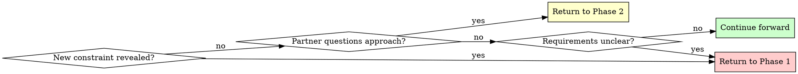
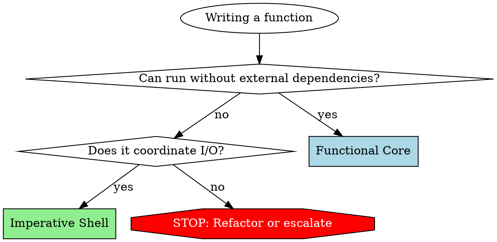
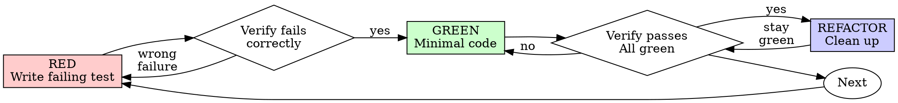

# Phase 3 action stages architecture (fork #1)

**Session ID:** ses_1fbd28fa3ffe2GERBRK4ov3Cpo
**Created:** 5/7/2026, 8:42:27 PM
**Updated:** 5/7/2026, 9:09:51 PM

---

## User

we are trying to work on phase 3 of a big plan, @doc/flow.md with @doc/flow-runtime-stage-plan.md breaking it up. we've done a lot of the set up, but actually moving actions to the new architecture is todo. i tried to draft a @doc/phase3.md to help prepare us for this work, and it has some context, and possible speculative direction, but honestly doesn't really click for me. i want your help shaping where we go now, how we make this happen. the overall shape of how this assembles together is still not clear to me, is something i want help & dialogue to refine out. this idea of having plugins contribute things generally, that are turned on or off in cirumstances, maybe conditionally, to make the flow somewhat self assembling by the piplines themselves: disaggregating control and assembly, is very tempting to me, but how we make that happens feels like it's really not clear to me, not well formed. please assess, form your own opinions. figure out what makes sense & is clear, and what needs careful shaping, and help us surface those design decisions, give options, and find ways forward to clarity.

---

## Assistant (Build · GPT-5.5 · 6.7s)

_Thinking:_


**Tool: skill**

**Input:**
```json
{
  "name": "using-plan-and-execute"
}
```

**Output:**
```
<skill_content name="using-plan-and-execute">
# Skill: using-plan-and-execute

<EXTREMELY-IMPORTANT>
If you think there is even a 1% chance a skill might apply to what you are doing, you ABSOLUTELY MUST read the skill.

IF A SKILL APPLIES TO YOUR TASK, YOU DO NOT HAVE A CHOICE. YOU MUST USE IT.

This is not negotiable. This is not optional. You cannot rationalize your way out of this.
</EXTREMELY-IMPORTANT>

# Getting Started with Skills

## MANDATORY FIRST RESPONSE PROTOCOL

Before responding to ANY user message, you MUST complete this checklist:

1. ☐ List to yourself ALL available skills (shown in your system context)
2. ☐ Ask yourself: "Does ANY available skill match this request?"
3. ☐ If yes: use the `Skill` tool to invoke the skill and follow the skill exactly.

**Responding WITHOUT completing this checklist = automatic failure.**

## Critical Rules

1. **Follow mandatory workflows.** Brainstorming before coding. Check for relevant skills before ANY task.

2. Execute skills with the Skill tool

## Common Rationalizations That Mean You're About To Fail

If you catch yourself thinking ANY of these thoughts, STOP. You are rationalizing. Check for and use the skill.

- "This is just a simple question" → WRONG. Questions are tasks. Check for skills.
- "I can check git/files quickly" → WRONG. Files don't have conversation context. Check for skills.
- "Let me gather information first" → WRONG. Skills tell you HOW to gather information. Check for skills.
- "This doesn't need a formal skill" → WRONG. If a skill exists for it, use it.
- "I remember this skill" → WRONG. Skills evolve. Read the current version.
- "This doesn't count as a task" → WRONG. If you're taking action, it's a task. Check for skills.
- "The skill is overkill for this" → WRONG. Skills exist because simple things become complex. Use it.
- "I'll just do this one thing first" → WRONG. Check for skills BEFORE doing anything.

**Why:** Skills document proven techniques that save time and prevent mistakes. Not using available skills means repeating solved problems and making known errors.

If a skill for your task exists, you must use it or you will fail at your task.

## Skills with Checklists

If a skill has a checklist, YOU MUST create task todos for EACH item using TaskCreate (or TodoWrite in older Claude Code versions).

**Don't:**
- Work through checklist mentally
- Skip creating todos "to save time"
- Batch multiple items into one todo
- Mark complete without doing them

**Why:** Checklists without task tracking = steps get skipped. Every time. The overhead of task management is tiny compared to the cost of missing steps.

## Announcing Skill Usage

Before using a skill, announce that you are using it.
"I'm using [Skill Name] to [what you're doing]."

**Examples:**
- "I'm using the brainstorming skill to refine your idea into a design."
- "I'm using the test-driven-development skill to implement this feature."

**Why:** Transparency helps your human partner understand your process and catch errors early. It also confirms you actually read the skill.

# About these skills

**Many skills contain rigid rules (TDD, debugging, verification).** Follow them exactly. Don't adapt away the discipline.

**Some skills are flexible patterns (architecture, naming).** Adapt core principles to your context.

The skill itself tells you which type it is.

## Instructions ≠ Permission to Skip Workflows

Your human partner's specific instructions describe WHAT to do, not HOW.

"Add X", "Fix Y" = the goal, NOT permission to skip brainstorming, TDD, or RED-GREEN-REFACTOR.

**Red flags:** "Instruction was specific" • "Seems simple" • "Workflow is overkill"

**Why:** Specific instructions mean clear requirements, which is when workflows matter MOST. Skipping process on "simple" tasks is how simple tasks become complex problems.

## Summary

**Starting any task:**
1. If relevant skill exists → Use the skill
3. Announce you're using it
4. Follow what it says

**Skill has checklist?** TaskCreate for every item (or TodoWrite in older versions).

**Finding a relevant skill = mandatory to read and use it. Not optional.**

Base directory for this skill: file:///home/rektide/.config/opencode/skill/ed3d-plan-and-execute/skills/using-plan-and-execute
Relative paths in this skill (e.g., scripts/, reference/) are relative to this base directory.
Note: file list is sampled.

<skill_files>

</skill_files>
</skill_content>
```

---

## Assistant (Build · GPT-5.5 · 4.9s)

I’m going to treat this as design shaping, not implementation. I’ll ground the assessment in the current code paths first, then separate what seems settled from the decisions that still need a deliberate architecture choice.

**Tool: skill**

**Input:**
```json
{
  "name": "investigating-a-codebase"
}
```

**Output:**
```
<skill_content name="investigating-a-codebase">
# Skill: investigating-a-codebase

# Investigating a Codebase

## Overview

Understand current codebase state to ground planning and design decisions in reality, not assumptions. Find existing patterns, verify design assumptions, and provide definitive answers about what exists and where.

## When to Use

**Use for:**
- Verifying design assumptions before implementation ("Design assumes auth.ts exists - verify")
- Finding existing patterns to follow ("How do we currently handle API errors?")
- Locating features or code ("Where is user authentication implemented?")
- Understanding component architecture ("How does the routing system work?")
- Confirming existence definitively ("Does feature X exist or not?")
- Preventing hallucination about file paths and structure

**Don't use for:**
- Information available in external docs (use internet research)
- Questions answered by reading 1-2 specific known files (use Read directly)
- General programming questions not specific to this codebase

## Core Investigation Workflow

1. **Start with entry points** - main files, index, package.json, config
2. **Use multiple search strategies** - Glob patterns, Grep keywords, Read files
3. **Follow traces** - imports, references, component relationships
4. **Verify don't assume** - confirm file locations and structure
5. **Report definitively** - exact paths or "not found" with search strategy

## Verifying Design Assumptions

When given design assumptions to verify:

1. **Extract assumptions** - list what design expects to exist
2. **Search for each** - file paths, functions, patterns, dependencies
3. **Compare reality vs expectation** - matches, discrepancies, additions, missing
4. **Report explicitly**:
   - ✓ Confirmed: "Design assumption correct: auth.ts:42 has login()"
   - ✗ Discrepancy: "Design assumes auth.ts, found auth/index.ts instead"
   - \+ Addition: "Found logout() not mentioned in design"
   - \- Missing: "Design expects resetPassword(), not found"

**Why this matters:** Prevents implementation plans based on wrong assumptions about codebase structure.

## Quick Reference

| Task | Strategy |
|------|----------|
| **Where is X** | Glob likely names → Grep keywords → Read matches |
| **How does X work** | Find entry point → Follow imports → Read implementation |
| **What patterns exist** | Find examples → Compare implementations → Extract conventions |
| **Does X exist** | Multiple searches → Definitive yes/no → Evidence |
| **Verify assumptions** | Extract claims → Search each → Compare reality vs expectation |

## Investigation Strategies

**Multiple search approaches:**
- Glob for file patterns across codebase
- Grep for keywords, function names, imports
- Read key files to understand implementation
- Follow imports and references for relationships
- Check package.json, config files for dependencies

**Don't stop at first result:**
- Explore multiple paths to verify findings
- Cross-reference different areas of codebase
- Confirm patterns are consistent not one-off
- Follow both usage and definition traces

**Verify everything:**
- Never assume file locations - always verify with Read/Glob
- Never assume structure - explore and confirm
- Document search strategy when reporting "not found"
- Distinguish "doesn't exist" from "couldn't locate"

## Reporting Findings

**Lead with direct answer:**
- Answer the question first
- Supporting details second
- Evidence with exact file paths and line numbers

**Provide actionable intelligence:**
- Exact file paths (src/auth/login.ts:42), not vague locations
- Relevant code snippets showing current patterns
- Dependencies and versions when relevant
- Configuration files and current settings
- Naming, structure, and testing conventions

**Handle "not found" confidently:**
- "Feature X does not exist" is valid and useful
- Explain what you searched and where you looked
- Suggest related code as starting point
- Report negative findings prevents hallucination

## Common Mistakes

| Mistake | Fix |
|---------|-----|
| Assuming file locations | Always verify with Read/Glob before reporting |
| Stopping at first result | Explore multiple paths to verify findings |
| Vague locations ("in auth folder") | Exact paths (src/auth/index.ts:42) |
| Not documenting search strategy | Explain what was checked when reporting "not found" |
| Confusing "not found" types | Distinguish "doesn't exist" from "couldn't locate" |
| Skipping design assumption comparison | Explicitly report: confirmed/discrepancy/addition/missing |
| Reporting assumptions as facts | Only report what was verified in codebase |

Base directory for this skill: file:///home/rektide/.config/opencode/skill/ed3d-research-agents/skills/investigating-a-codebase
Relative paths in this skill (e.g., scripts/, reference/) are relative to this base directory.
Note: file list is sampled.

<skill_files>

</skill_files>
</skill_content>
```

**Tool: skill**

**Input:**
```json
{
  "name": "brainstorming"
}
```

**Output:**
```
<skill_content name="brainstorming">
# Skill: brainstorming

# Brainstorming Ideas Into Designs

## Overview

Transform rough ideas into fully-formed designs through structured questioning and alternative exploration.

**Core principle:** Ask questions to understand, explore alternatives, present design incrementally for validation.

**Announce at start:** "I'm using the brainstorming skill to refine your idea into a design."

## Quick Reference

| Phase | Key Activities | Tool Usage | Output |
|-------|---------------|------------|--------|
| **1. Understanding** | Ask questions (one at a time) | AskUserQuestion for choices, agents for research | Purpose, constraints, criteria |
| **2. Exploration** | Propose 2-3 approaches | AskUserQuestion for approach selection, agents for patterns | Architecture options with trade-offs |
| **3. Design Presentation** | Present in 200-300 word sections | Open-ended questions | Complete design with validation |

## The Process

**REQUIRED: Create task tracker at start**

Use TaskCreate to create todos for each phase (or TodoWrite in older Claude Code versions):

- Phase 1: Understanding (purpose, constraints, criteria gathered)
- Phase 2: Exploration (2-3 approaches proposed and evaluated)
- Phase 3: Design Presentation (design validated in sections)

Use TaskUpdate to mark each phase as in_progress when working on it, completed when finished (or TodoWrite in older versions).

## Research Agents

**DO NOT perform deep research yourself. Delegate to specialized agents.**

### When to Use codebase-investigator

**Use codebase-investigator when you need to:**
- Understand how existing features are implemented
- Find where specific functionality lives in the codebase
- Identify existing patterns to follow
- Verify assumptions about codebase structure
- Check if a feature already exists

**Example delegation:**
```
Question: "How is authentication currently implemented?"
Action: Dispatch codebase-investigator with: "Find authentication implementation, including file locations, patterns used, and dependencies"
```

### When to Use internet-researcher

**Use @agent-ed3d-research-agents:internet-researcher when available. Otherwise use WebSearch/WebFetch aggressively.**

**Use internet research when you need to:**
- Find current API documentation for external services
- Research library capabilities and best practices
- Compare technology options
- Understand current community recommendations
- Find code examples and patterns from documentation
- Verify "what's the latest version" type questions
- Look up "how do people solve X" patterns

**Example delegation (with agent):**
```
Question: "What's the recommended way to handle file uploads with this framework?"
Action: Dispatch internet-researcher with: "Find current best practices for file uploads in [framework], including official docs and common patterns"
```

**Example without agent (use WebSearch):**
```
Question: "What's the current Stripe API for subscriptions?"
Action: Use WebSearch for: "Stripe subscriptions API latest version 2025"
Then use WebFetch to read the official docs
```

**When to use internet research:**
- External API documentation (always get latest)
- "How do people solve X?" (community patterns)
- Library comparison (which one is maintained?)
- Best practices (what's current recommendation?)
- Version checking (what's latest?)

**Don't overdo it:**
- Don't research things Claude already knows well
- Don't research project-specific code (use codebase-investigator)
- Don't research for every small decision

**Balance:** Use research for external knowledge and current information. Use Claude's existing knowledge for general programming concepts.

### Research Protocol

**If codebase pattern exists:**
1. Use codebase-investigator to find it
2. Unless pattern is clearly unwise, assume it's the correct approach
3. Design should follow existing patterns for consistency

**If no codebase pattern exists:**
1. Use internet research to find external patterns
2. Present 2-3 approaches from research in Phase 2
3. Let user choose which pattern to adopt

**If agent/research can't find answer:**
- Redirect question to user via AskUserQuestion
- Explain what was searched and not found
- Present as a design decision for user to make

**Be persistent with research:**
- If first query doesn't yield results, refine the question
- Try alternative search terms or approaches
- Don't give up after one attempt

## Phase 1: Understanding

**Before asking questions:**

1. **Investigate current state** - DON'T do this yourself:
   - Dispatch codebase-investigator to verify project structure
   - Ask investigator to find existing architecture and patterns
   - Ask investigator to identify constraints from current codebase
   - Review investigator's findings before proceeding

2. **Then gather requirements:**
   - Use TaskUpdate to mark Phase 1 as in_progress
   - Ask ONE question at a time to refine the idea
   - **Use AskUserQuestion tool** when you have multiple choice options
   - **Use agents** when you need to verify technical information
   - Gather: Purpose, constraints, success criteria
   - Mark Phase 1 as completed when understanding is clear

**Example using AskUserQuestion:**
```
Question: "Where should the authentication data be stored?"
Options:
  - "Session storage" (clears on tab close, more secure)
  - "Local storage" (persists across sessions, more convenient)
  - "Cookies" (works with SSR, compatible with older approach)
```

**When to delegate vs ask user:**
- "Where is auth implemented?" -> codebase-investigator
- "What auth library should we use?" -> internet-researcher (if not in codebase)
- "Do you want JWT or sessions?" -> AskUserQuestion (design decision)

**Ask only useful, coherent, and effective questions:**
Do not ask a question when only one answer is useful, coherent, and effective. For example, in an auth system with magic links and social logins:

```
Example (WRONG):
What should happen when a logged-in user requests a magic link for their own email address?

1. Send new magic link (allow re-login)
   User can request magic links even when logged in. Useful for re-authentication or session refresh scenarios.
2. Return error or redirect to home
   Logged-in users can't request magic links. They must log out first. Simpler, prevents confusion.
3. Silent success (no email sent)
   Say 'check your email' but don't send anything. Prevents leaking login state but may confuse legitimate users.
```

In this case, only #1 is a useful, coherent, and effective option. Option #2 doesn't make any sense (magic links can be used to verify emails after a social login) and #3 is aggressively bad (lies to the user).

```
Example (WRONG):
How should the magic link token verification be structured?

1. Single-use token with immediate session creation
   Token is consumed on first click, session created immediately. Simple flow. User can't re-click the link. Standard pattern for passwordless auth.
2. Token valid for multiple users within TTL
   Token can be used multiple times within 15 minutes. Allows re-clicking link if session cookie is lost. More complex state management.
3. Token with idempotent verification
   First use creates session, subsequent uses within TTL return same session. Safe re-clicking, prevents double-session creation. Moderate complexity.
```

No reasonably secure system would do either options #2 or #3. The way this question is written obviously indicates one acceptable answer and the other two answers are trap answers. Do not suggest trap answers for human users.

**If you want to ask a question where there is only one useful, coherent, and effective path, state your assumption and continue onward.**

**Do not ask questions just to ask them. If you have no useful, coherent, and effective questions, cease asking questions.**

**If starting-a-design-plan already gathered context:**
- Phase 1 may be very short
- Focus on remaining unknowns
- Don't re-ask questions already answered in clarification
- Still complete Phase 1 (don't skip it)

## Phase 2: Exploration

**Before proposing approaches:**

1. **Research existing patterns** - DON'T do this yourself:
   - Dispatch codebase-investigator: "Find similar features and patterns used"
   - If similar feature exists, base one approach on that pattern
   - If no codebase pattern, use internet research: "Find recommended approaches for [problem]"
   - Review research findings before proposing

2. **Then propose approaches:**
   - Use TaskUpdate to mark Phase 2 as in_progress
   - Propose 2-3 different approaches based on research
   - At least one approach should follow codebase patterns (if they exist)
   - For each: Core architecture, trade-offs, complexity assessment
   - **Use AskUserQuestion tool** to present approaches as structured choices
   - Mark Phase 2 as completed when approach is selected

**Example using AskUserQuestion:**
```
Question: "Which architectural approach should we use?"
Options:
  - "Event-driven with message queue" (matches existing notification system, scalable, complex setup)
  - "Direct API calls with retry logic" (simple, synchronous, easier to debug)
  - "Hybrid with background jobs" (balanced, moderate complexity, best of both)
```

**Research integration:**
- If codebase has pattern -> Present it as primary option (unless unwise)
- If no codebase pattern -> Present internet research findings
- If research yields nothing -> Ask user for direction

## Phase 3: Design Presentation

- Use TaskUpdate to mark Phase 3 as in_progress
- Present in 200-300 word sections
- Cover: Architecture, components, data flow, error handling, testing
- **Use research agents if you need to verify technical details during presentation**
- Ask after each section: "Does this look right so far?" (open-ended)
- Use open-ended questions here to allow freeform feedback
- Mark Phase 3 as completed when all sections validated

**Level of detail:** Present architecture and components, not implementation code.

- **Contracts/interfaces: OK.** If a component exposes an API or interface that other systems depend on, show the shape (types, method signatures, request/response formats).
- **Implementation code: NOT OK.** Function bodies, algorithms, and executable logic belong in implementation plans, not design.

The distinction: contracts define boundaries between components. Implementation defines behavior within components. Brainstorming validates the boundaries; implementation planning fills in the behavior.

**Output:** Validated design held in conversation context, ready for documentation.

## Question Patterns

### When to Use AskUserQuestion Tool

**Use AskUserQuestion for:**
- Phase 1: Clarifying questions with 2-4 clear options
- Phase 2: Architectural approach selection (2-3 alternatives)
- Any decision with distinct, mutually exclusive choices
- When options have clear trade-offs to explain
- When agent research yields no answer (present as open decision)

**Benefits:**
- Structured presentation of options with descriptions
- Clear trade-off visibility for partner
- Forces explicit choice (prevents vague "maybe both" responses)

### When to Use Open-Ended Questions

**Use open-ended questions for:**
- Phase 3: Design validation ("Does this look right so far?")
- When you need detailed feedback or explanation
- When partner should describe their own requirements
- When structured options would limit creative input

**Example decision flow:**
- "What authentication method?" -> Use AskUserQuestion (2-4 options)
- "Does this design handle your use case?" -> Open-ended (validation)

### When to Use Research Agents

**Use codebase-investigator for:**
- "How is X implemented?" -> Agent finds and reports
- "Where does Y live?" -> Agent locates files
- "What pattern exists for Z?" -> Agent identifies pattern

**Use internet research for:**
- "What's the current API for X?" -> Research finds docs
- "How do other projects solve Y?" -> Research finds patterns
- "What libraries exist for Z?" -> Research compares options

**Don't do deep research yourself** - you'll consume context and may hallucinate. Delegate to agents or use web tools.

## When to Revisit Earlier Phases



**You can and should go backward when:**
- Partner reveals new constraint during Phase 2 or 3 -> Return to Phase 1
- Validation shows fundamental gap in requirements -> Return to Phase 1
- Partner questions approach during Phase 3 -> Return to Phase 2
- Something doesn't make sense -> Go back and clarify
- Agent research reveals constraint you didn't know -> Reassess phase

**Don't force forward linearly** when going backward would give better results.

## Common Rationalizations - STOP

These are violations of the skill requirements:

| Excuse | Reality |
|--------|---------|
| "Idea is simple, can skip exploring alternatives" | Always propose 2-3 approaches. Comparison reveals issues. |
| "Partner knows what they want, can skip questions" | Questions reveal hidden constraints. Always ask. |
| "I'll present whole design at once for efficiency" | Incremental validation catches problems early. |
| "Checklist is just a suggestion" | Create task todos with TaskCreate. Track progress properly. |
| "I can research this quickly myself" | Use agents or web tools. You'll hallucinate or consume excessive context. |
| "Agent didn't find it on first try, must not exist" | Be persistent. Refine query and try again. |
| "Partner said yes, done with brainstorming" | Design is in conversation. Next step is documentation. |
| "I know this codebase, don't need investigator" | You don't know current state. Always verify. |
| "Obvious solution, skip research" | Codebase may have established pattern. Check first. |
| "Don't need internet research for this" | External knowledge and current docs matter. Research when relevant. |
| "I'll show the implementation so partner understands" | Show contracts/interfaces, not implementation. Implementation planning generates code later. |

**All of these mean: STOP. Follow the requirements exactly.**

## Key Principles

| Principle | Application |
|-----------|-------------|
| **One question at a time** | YOU MUST ask single questions in Phase 1, use AskUserQuestion for choices |
| **Delegate research** | YOU MUST use agents or web tools for codebase and internet research, never do it yourself |
| **Be persistent with research** | If search doesn't find answer, refine query and try again before asking user |
| **Follow existing patterns** | If codebase pattern exists and is reasonable, design must follow it |
| **Structured choices** | YOU MUST use AskUserQuestion tool for 2-4 options with trade-offs |
| **YAGNI ruthlessly** | Remove unnecessary features from all designs |
| **Explore alternatives** | YOU MUST propose 2-3 approaches before settling |
| **Incremental validation** | Present design in sections, validate each - never all at once |
| **Task tracking** | YOU MUST create task todos at start with TaskCreate, update with TaskUpdate as you progress (or TodoWrite in older versions) |
| **Flexible progression** | Go backward when needed - flexibility > rigidity |
| **Internet research matters** | Use research agents or web tools for external knowledge and current information |

## After Brainstorming

When Phase 3 is complete, announce:

"Design is validated and ready for documentation."

**Next step:** The orchestrating skill (starting-a-design-plan) will invoke writing-design-plans to document this design.

**You do NOT:**
- Write design document (that's writing-design-plans)
- Set up worktrees (that's later in workflow)
- Create implementation plans (that's writing-plans)

**You DO:**
- Hold validated design in conversation context
- Have clear understanding of architecture, components, and approach
- Know which existing patterns were followed (from investigation)

Base directory for this skill: file:///home/rektide/.config/opencode/skill/ed3d-plan-and-execute/skills/brainstorming
Relative paths in this skill (e.g., scripts/, reference/) are relative to this base directory.
Note: file list is sampled.

<skill_files>

</skill_files>
</skill_content>
```

**Tool: skill**

**Input:**
```json
{
  "name": "asking-clarifying-questions"
}
```

**Output:**
```
<skill_content name="asking-clarifying-questions">
# Skill: asking-clarifying-questions

# Asking Clarifying Questions

## Overview

Bridge the gap between raw user input and structured brainstorming by understanding what the user actually means, not what they said.

**Core principle:** Resolve contradictions first, then disambiguate. Conflicting goals must be reconciled before technical clarification - otherwise you're precisely defining the wrong thing.

**Announce at start:** "I'm using the asking-clarifying-questions skill to make sure I understand your requirements correctly."

## When to Use

Use this skill:
- After gathering initial context from user
- Before starting brainstorming or design exploration
- When user mentions technical terms that could mean multiple things
- When scope boundaries are unclear
- When assumptions need verification

Do NOT use for:
- Exploring design alternatives (that's brainstorming)
- Proposing architectures (that's brainstorming)
- Validating completed designs (that's brainstorming Phase 3)
- Asking for initial requirements (that's starting-a-design-plan Phase 1)

## Before Clarifying

Try to answer your own questions and disambiguate from the context of the working directory. Use available subagents, such as `codebase-investigator`, to explore for existing work that can help explain the the subject under clarification. When you recognize elements such as common technologies or proper nouns, use `combined-researcher` instead to synthesize both the codebase and internet searches.

You may have other skills or MCPs containing useful information, such as connections to remote datastores used for product management purposes. You should send out `haiku-general-purpose` subagents to investigate them when they're appropriate.

## What to Clarify

### 0. Contradictions (First Pass)

Before disambiguating technical details, scan for logical contradictions in requirements. If the user has stated mutually exclusive goals, resolve these first - technical clarification is wasted effort if the foundation shifts.

**Look for:**

Explicit contradictions (user stated both):
- "Real-time updates" + "batch processing is fine" → Which is the actual need?
- "Keep it simple" + "handle every edge case" → Trade-off not acknowledged
- "Use existing patterns" + "complete rewrite" → Mutually exclusive approaches
- "No external dependencies" + "integrate with Stripe" → Implicit contradiction

Impossible combinations:
- "Offline-first" + "always-current data" → Physics problem
- "Fast to build" + "infinitely extensible" → Classic impossible triangle
- "Zero latency" + "synchronous validation" → Can't have both
- "No breaking changes" + "fundamental redesign" → Pick one

Unacknowledged trade-offs:
- "Simple" often conflicts with "flexible"
- "Fast" often conflicts with "thorough"
- "Cheap" often conflicts with "custom"
- "Secure" often conflicts with "convenient"

**How to surface:**

Don't accuse - illuminate the tension:
- "I notice you mentioned X and Y - these can pull in different directions. Which takes priority?"
- "There's a trade-off between A and B here. Which matters more for this project?"
- "These two goals sometimes conflict - how should I balance them when they do?"

**Why first:**
- Contradictions reveal unconfronted trade-offs
- Resolving them changes what "right" means
- Technical disambiguation without this = building the wrong thing precisely

**After contradictions are resolved**, proceed to technical clarification.

### 1. Technical Terminology

When user mentions technical terms, disambiguate what they actually mean.

**Examples:**

User says "OAuth2" -> Ask: Which flow?
- Authorization code flow (for human users with browser redirect)
- Client credentials flow (for service-to-service auth)
- Both, depending on the use case

User says "database" -> Ask: Which kind?
- SQL (PostgreSQL, MySQL) for structured data
- NoSQL (MongoDB, DynamoDB) for flexible schema
- Already determined by existing infrastructure

User says "caching" -> Ask: What layer?
- Application-level (Redis, Memcached)
- HTTP caching (CDN, browser cache)
- Database query caching

**Use AskUserQuestion for these** - present specific options with trade-offs.

### 2. Scope Boundaries

When user mentions broad concepts, identify what's included and excluded.

**Examples:**

User says "users" -> Ask: Who exactly?
- Human users logging in via web browser
- Service accounts for API access
- Both, with different authentication flows
- Internal employees vs external customers

User says "integrate with X" -> Ask: What parts?
- Just authentication
- Full data sync
- Specific API endpoints
- Real-time webhooks vs batch imports

User says "reporting" -> Ask: What scope?
- Basic data export (CSV, Excel)
- Interactive dashboards
- Scheduled automated reports
- Real-time analytics

**Use AskUserQuestion** - present distinct scope options.

### 3. Assumptions and Constraints

When user states requirements, verify the underlying reasons and constraints.

**Examples:**

User says "must use library X" -> Ask: Why?
- Regulatory requirement (cannot change)
- Existing team expertise (preference, not hard requirement)
- Already in use elsewhere (consistency benefit)
- Misconception (might have better options)

User says "needs to be fast" -> Ask: How fast?
- Sub-100ms response time (hard requirement)
- Faster than current implementation (relative improvement)
- Perception of speed (optimistic UI, loading states)
- Actual performance bottleneck identified

User says "should follow pattern Y" -> Ask: Which aspect?
- Exact implementation (strict consistency)
- General approach (flexible adaptation)
- Just using same libraries (tooling consistency)
- Not actually required (outdated guideline)

**Use open-ended questions** for understanding "why" - allows user to explain context.

### 4. Version and API Specifics

When user mentions external services or libraries, verify current state.

**Examples:**

User says "integrate with Stripe" -> Check:
- Which Stripe API version (latest? specific?)
- Payment Intents API or older Charges API
- Which features needed (one-time, subscriptions, both)
- Already have Stripe account setup

User says "use React Router" -> Check:
- React Router v5 or v6 (breaking changes between versions)
- Already in use in codebase (follow existing patterns)
- Browser Router vs Hash Router vs Memory Router

**Quick agent queries for factual checks:**
- "What version of X exists?" -> Quick web search or codebase check
- "What's the current API?" -> Internet research for docs
- "Is Y already in use?" -> Codebase investigation

**Don't do deep research** - save that for brainstorming. Just verify basics.

### 5. Definition of Done (Required Final Step)

**Before handing off to brainstorming, you MUST establish the Definition of Done.**

The Definition of Done answers: "What does success look like? What are the deliverables?"

**After resolving contradictions and clarifying requirements:**

1. **Infer the Definition of Done** from context gathered so far:
   - What will exist when this is complete?
   - What will users/systems be able to do?
   - What are the concrete deliverables?

2. **If you have a firm grasp**, state it back and confirm:
   ```
   Use AskUserQuestion:
   "Based on our discussion, here's what I understand success looks like:

   [State the definition of done in 2-4 bullet points]

   Does this capture what you're trying to achieve?"

   Options:
   - "Yes, that's right" (proceed to brainstorming)
   - "Partially, but..." (user will clarify)
   - "No, let me explain..." (user will reframe)
   ```

3. **If the deliverables are still ambiguous**, ask targeted questions:
   - "What should exist when this is done?"
   - "How will you know this succeeded?"
   - "What's the minimum viable deliverable?"

**Why this matters:** Brainstorming explores *how* to achieve the goal. The goal must be locked in first. Otherwise you're exploring texture without knowing what shape you're filling.

**The Definition of Done becomes part of the output bundle** and will appear prominently at the top of the final design document.

## Question Techniques

### Use AskUserQuestion for Choices

When there are 2-4 distinct options with trade-offs:

```
Question: "Which OAuth2 flow are you targeting?"
Options:
  - "Authorization code flow" (human users with browser redirect)
  - "Client credentials flow" (service-to-service automated auth)
  - "Both flows" (supports human users AND service accounts)
```

**Benefits:**
- Forces explicit choice
- Shows trade-offs clearly
- Prevents vague "maybe both" responses
- Structured for decision-making

### Use Open-Ended Questions for Why

When you need to understand reasoning or context:

"Why is X a requirement?"
"What problem does Y solve?"
"What happens if we don't include Z?"

**Benefits:**
- Uncovers hidden constraints
- Reveals user's mental model
- Identifies assumptions to challenge
- Provides context for brainstorming

### Use Quick Queries for Facts

When you need to verify something factual:

- Dispatch codebase-investigator: "Is library X already in use?"
- Quick web search: "What's the current version of API Y?"
- File read: "Check package.json for existing auth dependencies"

**Don't get distracted** - these are quick checks, not research projects.

## Output: Context Bundle for Brainstorming

After clarification, create a clear summary to pass to brainstorming:

**Resolved trade-offs:**
- Speed over flexibility (chose simple implementation, accept less configurability)
- Security over convenience (chose strict validation, accept more friction)
- Consistency over ideal (chose existing patterns, accept suboptimal in isolation)

**Clarified requirements:**
- OAuth2 client credentials flow (service-to-service)
- External customers only (not internal employees)
- Stripe Payment Intents API (latest version)
- Must comply with PCI DSS Level 1 (regulatory constraint)
- "Fast" means sub-200ms p99 response time (measured requirement)

**Verified assumptions:**
- React Router v6 already in use (follow existing patterns)
- PostgreSQL database (existing infrastructure)
- No existing auth system (greenfield)

**Scope boundaries:**
- IN: Service account creation, token issuance, token validation
- OUT: Human user login, SSO integration, password management

This bundle gives brainstorming a concrete, unambiguous starting point.

## Common Mistakes

| Mistake | Fix |
|---------|-----|
| Ignoring contradictions in requirements | Surface conflicting goals before technical clarification |
| Accepting vague terms at face value | Disambiguate every technical term |
| Assuming scope without verification | Ask explicit boundary questions |
| Not questioning "must have" requirements | Understand WHY behind constraints |
| Doing deep research during clarification | Quick checks only, save research for brainstorming |
| Proposing solutions while clarifying | Stay in understanding mode, no design yet |
| Skipping clarification when "seems clear" | Always clarify, assumptions are dangerous |

## When to Stop Clarifying

Stop and move to brainstorming when:
- Contradictions are resolved (trade-offs explicitly chosen)
- Technical terms are disambiguated
- Scope boundaries are explicit
- Constraints are understood (not just stated)
- Assumptions are verified
- No major ambiguities remain

**You don't need perfect information** - just enough to brainstorm effectively.

If brainstorming reveals new ambiguities, you can return to clarification.

## Integration with Design Workflow

This skill sits between context gathering and brainstorming:

```
Context Gathering (starting-a-design-plan Phase 1)
  -> User provides: "Build OAuth2 integration for our API"

Clarification (this skill)
  -> Disambiguate: Which OAuth2 flow? What scope? Why OAuth2?
  -> Output: Service accounts, client credentials, PCI compliance

Brainstorming (starting-a-design-plan Phase 3)
  -> Explore: Architecture options, library choices, implementation phases
  -> Uses clarified requirements as foundation
```

**Purpose:** Ensure brainstorming builds the right thing, not the wrong thing well.

Base directory for this skill: file:///home/rektide/.config/opencode/skill/ed3d-plan-and-execute/skills/asking-clarifying-questions
Relative paths in this skill (e.g., scripts/, reference/) are relative to this base directory.
Note: file list is sampled.

<skill_files>

</skill_files>
</skill_content>
```

---

## Assistant (Build · GPT-5.5 · 6.1s)

_Thinking:_

**Considering code exploration**

I need to brainstorm using todos and the codebase-investigator agent, but I won’t go too deep just yet. Maybe I can use the explore function since it says "codebase-investigator"? I should focus on getting code references and ask the agent to check the current action or flow plugin. Perhaps I can read the package too, but I have to keep it light with the agent. I need to create a todo to write down the tasks.

**Tool: todowrite**

**Input:**
```json
{
  "todos": [
    {
      "content": "Phase 1: understand current flow/action architecture and success criteria",
      "status": "in_progress",
      "priority": "high"
    },
    {
      "content": "Phase 2: propose and compare architecture options for action/stage contribution",
      "status": "pending",
      "priority": "high"
    },
    {
      "content": "Phase 3: present a refined direction and validate next decisions",
      "status": "pending",
      "priority": "high"
    }
  ]
}
```

**Output:**
```
[
  {
    "content": "Phase 1: understand current flow/action architecture and success criteria",
    "status": "in_progress",
    "priority": "high"
  },
  {
    "content": "Phase 2: propose and compare architecture options for action/stage contribution",
    "status": "pending",
    "priority": "high"
  },
  {
    "content": "Phase 3: present a refined direction and validate next decisions",
    "status": "pending",
    "priority": "high"
  }
]
```

---

## Assistant (Build · GPT-5.5 · 143.7s)

**Tool: task**

**Input:**
```json
{
  "description": "Investigate flow actions",
  "prompt": "Investigate the current codebase architecture for dl flow runtime and actions. Focus on: src/plugin/flow.ts, src/command/run.ts, src/action/*, action handler implementations under archive/wiki/deepwiki/archlist/symlink, src/execute/stage.ts, provider plugin/registry patterns, and any tests that show current behavior. Return: (1) current data flow from input to action execution, (2) exact contracts/types involved with file/line references, (3) what depends on RepoContext/DlContext/runPipeline, (4) how gunshi plugin extensions are currently shaped and accessed, (5) constraints for converting actions to stages, (6) any dead-code evidence around src/repo. Include local file references with line numbers for follow-up.",
  "subagent_type": "codebase-investigator",
  "task_id": "",
  "command": ""
}
```

**Output:**
```
task_id: ses_1fbe3618bffencxmXSUoouSDZR (for resuming to continue this task if needed)

<task_result>
## 1) Current data flow: input → action execution

Current `dl` runtime is:

```text
gunshi command ctx
  → input plugins produce AsyncIterable<string>
  → runFlowCommand()
  → flowPlugin.plan().singleton().config(...)
  → plan.push(inputs)
  → plan.execute()
  → provider candidates
  → dedupe stage
  → optional verify stage
  → verified checkpoint observers
  → Repo → legacy RepoContext adapter
  → runPipeline()
  → ActionHandler.run(...)
```

Key references:

- Main CLI registers `dlPlugins` in [`rekon.ts:21-36`](/rekon.ts#L21-L36).
- `dlPlugins` order includes core plugins, action plugins, then aggregator `dlActionsPlugin` in [`src/plugin/index.ts:18-35`](/src/plugin/index.ts#L18-L35).
- `dl` command chooses input sources and calls `runFlowCommand` in [`src/command/dl.ts:48-114`](/src/command/dl.ts#L48-L114).
- Subcommands `archive/wiki/deepwiki/archlist/symlink` all build subcommand options then call `runFlowCommand(..., runActions: true)`:
  - [`src/command/archive.ts:18-35`](/src/command/archive.ts#L18-L35)
  - [`src/command/wiki.ts:18-35`](/src/command/wiki.ts#L18-L35)
  - [`src/command/deepwiki.ts:18-35`](/src/command/deepwiki.ts#L18-L35)
  - [`src/command/archlist.ts:18-35`](/src/command/archlist.ts#L18-L35)
  - [`src/command/symlink.ts:18-36`](/src/command/symlink.ts#L18-L36)

Inside `runFlowCommand`:

- Resolve plugin extensions and optional action setup in [`src/command/run.ts:124-133`](/src/command/run.ts#L124-L133).
- Create singleton flow plan with verification enabled if showing verified output or running actions in [`src/command/run.ts:138-142`](/src/command/run.ts#L138-L142).
- Attach candidate logger to `proposed` checkpoint in [`src/command/run.ts:143-148`](/src/command/run.ts#L143-L148).
- Attach verified logger to `verified` checkpoint in [`src/command/run.ts:150-155`](/src/command/run.ts#L150-L155).
- Attach action execution to `verified` checkpoint in [`src/command/run.ts:157-172`](/src/command/run.ts#L157-L172).
- Push input iterable and drain `plan.execute()` in [`src/command/run.ts:175-178`](/src/command/run.ts#L175-L178).
- Await action tasks after flow drains in [`src/command/run.ts:186-191`](/src/command/run.ts#L186-L191).

Inside `flowPlugin`:

- Inputs are normalized to queued inputs in [`src/plugin/flow.ts:137-171`](/src/plugin/flow.ts#L137-L171).
- `plan.push()` enqueues into a buffered async queue in [`src/plugin/flow.ts:430-433`](/src/plugin/flow.ts#L430-L433).
- `executeSession()` drains queued sources, fans them in, creates an abort signal, and calls the executor in [`src/plugin/flow.ts:360-389`](/src/plugin/flow.ts#L360-L389).
- Provider runtime supports redirect/handoff reinjection via `providerRuntime.push` in [`src/plugin/flow.ts:372-374`](/src/plugin/flow.ts#L372-L374).
- Observer stages are inserted as `proposedStages` and `verifiedStages` in [`src/plugin/flow.ts:375-388`](/src/plugin/flow.ts#L375-L388).

Inside executor:

- For each input, lookup providers in candidate mode in [`src/execute/executor.ts:43-48`](/src/execute/executor.ts#L43-L48).
- Call `provider.candidates(input.value, ctx.providerRuntime)` for each provider in [`src/execute/executor.ts:49-51`](/src/execute/executor.ts#L49-L51).
- Fan-in candidate streams, then run stages: dedupe, proposed observers, optional verify, verified observers in [`src/execute/executor.ts:52-60`](/src/execute/executor.ts#L52-L60).

Action execution:

- `Repo` is converted to legacy `RepoContext` by `toLegacyRepoContext` in [`src/command/run.ts:34-53`](/src/command/run.ts#L34-L53).
- `runPipeline` invokes each handler serially in [`src/action/pipeline.ts:19-34`](/src/action/pipeline.ts#L19-L34).
- Lifecycle report is emitted after handlers if enabled in [`src/action/pipeline.ts:36-38`](/src/action/pipeline.ts#L36-L38).

## 2) Exact contracts/types involved

### Flow contracts

- `FlowInput`: `string | URL | AsyncIterable<string | URL>` in [`src/flow/types.ts:22-27`](/src/flow/types.ts#L22-L27).
- `FlowInputMetadata`: origin + redirect provenance in [`src/flow/types.ts:29-43`](/src/flow/types.ts#L29-L43).
- `Repo`: current flow repo shape with `id`, `input`, `url`, `inputUrl`, `host`, `org`, `project`, `state`, `producedBy`, `verifiedBy` in [`src/flow/types.ts:45-58`](/src/flow/types.ts#L45-L58).
- `FlowContext`: `signal`, `goal`, `dedupe`, `now`, `plugins` in [`src/flow/types.ts:62-70`](/src/flow/types.ts#L62-L70).
- `FlowPlan`: fluent plan API in [`src/plugin/flow.ts:105-112`](/src/plugin/flow.ts#L105-L112).
- `FlowExtension`: singleton/global flow API in [`src/plugin/flow.ts:114-121`](/src/plugin/flow.ts#L114-L121).
- `FlowObserver`: `(repo: Repo, context: FlowContext) => void | Promise<void>` in [`src/plugin/flow.ts:42`](/src/plugin/flow.ts#L42).
- `FlowHandoff`: redirect handoff record in [`src/plugin/flow.ts:51-59`](/src/plugin/flow.ts#L51-L59).
- `FlowSessionSnapshot`: phase, queue, observers, counters, handoffs in [`src/plugin/flow.ts:90-103`](/src/plugin/flow.ts#L90-L103).

### Stage/executor contracts

- `Stage<TItem, TContext>` is `(input, context) => AsyncIterable<TItem>` in [`src/execute/stage.ts:3-7`](/src/execute/stage.ts#L3-L7).
- `runStages` composes stages linearly and returns final async iterable in [`src/execute/stage.ts:8-18`](/src/execute/stage.ts#L8-L18).
- `ExecuteOptions`: `goal`, `timeoutMs`, `continueOnError`, `verify` in [`src/execute/types.ts:6-13`](/src/execute/types.ts#L6-L13).
- `ExecuteContext`: registry, options, signal, plugins, providerRuntime, proposedStages, verifiedStages in [`src/execute/types.ts:15-25`](/src/execute/types.ts#L15-L25).
- `InputFlowExecutor`: `AsyncIterable<InputEntry> + ExecuteContext → AsyncGenerator<Repo>` in [`src/execute/types.ts:27-33`](/src/execute/types.ts#L27-L33).

### Provider contracts

- `ProviderRuntime.push(input, metadata?)` in [`src/provider/types.ts:3-7`](/src/provider/types.ts#L3-L7).
- `ProviderCandidates = (input, runtime) => AsyncGenerator<Repo>` in [`src/provider/types.ts:9`](/src/provider/types.ts#L9).
- `ProviderVerify = (repo, signal) => Promise<Repo | null>` in [`src/provider/types.ts:11`](/src/provider/types.ts#L11).
- `Provider`: `name`, `hosts`, `candidates`, `verify` in [`src/provider/types.ts:13-20`](/src/provider/types.ts#L13-L20).
- `ProviderRegistry`: provider list, `byName`, `register`, `lookup` in [`src/provider/types.ts:41-48`](/src/provider/types.ts#L41-L48).

### Action contracts

- `DlOptions`: all action states + shared flags in [`src/action/types.ts:6-18`](/src/action/types.ts#L6-L18).
- `DlContext`: roots, options, log, optional git/dexport ops in [`src/action/types.ts:20-26`](/src/action/types.ts#L20-L26).
- `ActionResult`: `{ hadError: boolean }` in [`src/action/handler.ts:5-7`](/src/action/handler.ts#L5-L7).
- `ActionHandler`: `{ id, run(resolved: RepoContext, ctx: DlContext, lifecycle): Promise<ActionResult> }` in [`src/action/handler.ts:9-12`](/src/action/handler.ts#L9-L12).
- `DlActionSpec`: CLI action metadata in [`src/action/registry.ts:9-20`](/src/action/registry.ts#L9-L20).
- `DlActionProviderExtension`: plugin contribution shape `{ "dl:actions", "dl:handlers" }` in [`src/action/registry.ts:27-30`](/src/action/registry.ts#L27-L30).
- `LifecycleRecord`, `LifecycleReporter`, `createLifecycleReporter` in [`src/action/lifecycle.ts:3-72`](/src/action/lifecycle.ts#L3-L72).

### Legacy repo/action bridge

- `RepoContext`: legacy action input shape in [`src/repo/context.ts:3-15`](/src/repo/context.ts#L3-L15).
- `toLegacyRepoContext(repo: Repo): RepoContext` bridge in [`src/command/run.ts:34-53`](/src/command/run.ts#L34-L53).

Important gap: `toLegacyRepoContext` currently sets `wikiRepoUrl` for GitHub/GitLab only, but does **not** set `wikiDeepUrl` in [`src/command/run.ts:47-50`](/src/command/run.ts#L47-L50). `dexport` requires `resolved.wikiDeepUrl` in [`src/dexport/sync.ts:21-26`](/src/dexport/sync.ts#L21-L26), so current flow-based deepwiki action appears to skip unless some future bridge populates it.

## 3) What depends on `RepoContext` / `DlContext` / `runPipeline`

### `RepoContext` dependencies

Runtime action path:

- Bridge creates it: [`src/command/run.ts:34-53`](/src/command/run.ts#L34-L53).
- `processRepoContext` accepts it: [`src/command/run.ts:200-205`](/src/command/run.ts#L200-L205).
- `runPipeline` accepts it: [`src/action/pipeline.ts:8-16`](/src/action/pipeline.ts#L8-L16).
- `ActionHandler.run` requires it: [`src/action/handler.ts:9-12`](/src/action/handler.ts#L9-L12).
- Lifecycle reporter reads `resolved.url`: [`src/action/lifecycle.ts:45-50`](/src/action/lifecycle.ts#L45-L50).

Handlers/syncs:

- Archive handler/sync: [`src/archive/handler.ts:32-45`](/src/archive/handler.ts#L32-L45), [`src/archive/sync.ts:13-22`](/src/archive/sync.ts#L13-L22).
- Wiki handler/sync: [`src/wiki/handler.ts:33-58`](/src/wiki/handler.ts#L33-L58), [`src/wiki/sync.ts:15-23`](/src/wiki/sync.ts#L15-L23).
- Deepwiki handler/dexport: [`src/deepwiki/handler.ts:33-48`](/src/deepwiki/handler.ts#L33-L48), [`src/dexport/sync.ts:7-26`](/src/dexport/sync.ts#L7-L26).
- Archlist handler uses only `resolved.url`: [`src/archlist/handler.ts:31-40`](/src/archlist/handler.ts#L31-L40).
- Symlink handler/sync: [`src/symlink/handler.ts:31-42`](/src/symlink/handler.ts#L31-L42), [`src/symlink/sync.ts:19-53`](/src/symlink/sync.ts#L19-L53).

Legacy `src/repo` path also depends on `RepoContext`, but it is separate from current flow runtime.

### `DlContext` dependencies

- Defined in [`src/action/types.ts:20-26`](/src/action/types.ts#L20-L26).
- Built in `runFlowCommand` from resolved roots/options/log in [`src/command/run.ts:126-133`](/src/command/run.ts#L126-L133).
- Built by `resolveDlSetup` in [`src/command/context.ts:70-82`](/src/command/context.ts#L70-L82).
- Passed to all `ActionHandler.run` calls by `runPipeline` in [`src/action/pipeline.ts:19-22`](/src/action/pipeline.ts#L19-L22).

### `runPipeline` dependencies

Only production call sites found:

- `runFlowCommand` action observer calls `runPipeline` in [`src/command/run.ts:157-170`](/src/command/run.ts#L157-L170).
- `processRepoContext` delegates to `runPipeline` in [`src/command/run.ts:200-205`](/src/command/run.ts#L200-L205).

Tests cover both:

- `processRepoContext` tests in [`src/command/run.test.ts:222-303`](/src/command/run.test.ts#L222-L303).
- `runFlowCommand` action tests in [`src/command/run.test.ts:305-423`](/src/command/run.test.ts#L305-L423).

## 4) Gunshi plugin extension shape/access

Pattern:

- Each plugin is `plugin({ id, name, setup?, dependencies?, extension })`.
- `setup(ctx)` adds global options via `ctx.addGlobalOption(...)`.
- `extension(ctx/core)` returns an object stored under `ctx.extensions[PLUGIN_ID]`.
- Commands access typed extensions through `ctx.extensions[...]`.

Examples:

- `flowPlugin` global flags in [`src/plugin/flow.ts:251-275`](/src/plugin/flow.ts#L251-L275), extension returned in [`src/plugin/flow.ts:461-470`](/src/plugin/flow.ts#L461-L470).
- Action provider plugins add action/global state flags and expose contribution fields:
  - Archive: [`src/archive/plugin.ts:11-21`](/src/archive/plugin.ts#L11-L21)
  - Wiki: [`src/wiki/plugin.ts:11-21`](/src/wiki/plugin.ts#L11-L21)
  - Deepwiki: [`src/deepwiki/plugin.ts:11-21`](/src/deepwiki/plugin.ts#L11-L21)
  - Archlist: [`src/archlist/plugin.ts:11-21`](/src/archlist/plugin.ts#L11-L21)
  - Symlink plus `anycase`: [`src/symlink/plugin.ts:11-26`](/src/symlink/plugin.ts#L11-L26)
- `dlActionsPlugin` aggregates every extension that has `"dl:actions"` and `"dl:handlers"` in [`src/plugin/dl-actions.ts:28-45`](/src/plugin/dl-actions.ts#L28-L45).
- Detection/collection happens structurally, scanning `Object.values(extensions)` in [`src/action/registry.ts:45-95`](/src/action/registry.ts#L45-L95).
- `DlExtensions` gives typed access to known plugin IDs in [`src/command/context.ts:39-49`](/src/command/context.ts#L39-L49).
- `requireExtensions` pulls actions/log/roots in [`src/command/context.ts:60-68`](/src/command/context.ts#L60-L68).

Notable plugin dependency examples:

- `watchInputPlugin` depends on log and reads parsed `ctx.values.watch` in [`src/plugin/input-watch.ts:12-37`](/src/plugin/input-watch.ts#L12-L37).
- `clipboardInputPlugin` same pattern in [`src/plugin/input-clipboard.ts:12-37`](/src/plugin/input-clipboard.ts#L12-L37).
- `rootsPlugin` optionally reads `ctx.extensions.c12` in [`src/plugin/roots.ts:28-53`](/src/plugin/roots.ts#L28-L53).

## 5) Constraints for converting actions to stages

Current stages are **stream transforms**:

- `Stage<TItem, TContext>` must synchronously return `AsyncIterable<TItem>` in [`src/execute/stage.ts:3-7`](/src/execute/stage.ts#L3-L7).
- Composition preserves item type; current flow stages are `Stage<Repo, FlowContext>` in [`src/execute/types.ts:21-22`](/src/execute/types.ts#L21-L22).
- `runStages` has no side channel for `hadError` or lifecycle summary except through context mutation/observer side effects in [`src/execute/stage.ts:8-18`](/src/execute/stage.ts#L8-L18).

Conversion constraints:

1. **Context mismatch**  
   Existing actions require `RepoContext`, `DlContext`, and `LifecycleReporter` via `ActionHandler.run` in [`src/action/handler.ts:9-12`](/src/action/handler.ts#L9-L12). Flow stages currently receive `Repo` and `FlowContext`, not `DlContext`.

2. **Type mismatch**  
   Stages operate on `Repo`; actions operate on legacy `RepoContext`. Conversion needs either:
   - action stages over `Repo` with embedded bridge, or
   - a new stage domain/item type that carries both `Repo` and `RepoContext`.

3. **Error aggregation mismatch**  
   Actions return `{ hadError }` and `runPipeline` aggregates it in [`src/action/pipeline.ts:17-40`](/src/action/pipeline.ts#L17-L40). Stage pipeline currently yields items and throws on fatal errors; it has no accumulated result object.

4. **Lifecycle reporting side effects**  
   Lifecycle is created per repo in `runPipeline` in [`src/action/pipeline.ts:16`](/src/action/pipeline.ts#L16). Stage conversion must decide where lifecycle reporter lives and when to emit summary.

5. **Ordering/serial semantics**  
   `runPipeline` runs handlers serially per repo in [`src/action/pipeline.ts:19-22`](/src/action/pipeline.ts#L19-L22). Flow execution can process streams/provider fan-in; action stages must preserve per-repo action order.

6. **Final result timing**  
   `runFlowCommand` currently collects action promises and awaits them after flow drain in [`src/command/run.ts:134-186`](/src/command/run.ts#L134-L186). If actions become stages, action work happens during stream consumption, and `hadError` must be stored somewhere reachable after `plan.execute()`.

7. **Redirect lifecycle records**  
   Flow handoffs are currently converted to initial lifecycle records just before running actions in [`src/command/run.ts:55-73`](/src/command/run.ts#L55-L73) and [`src/command/run.ts:160-169`](/src/command/run.ts#L160-L169). Stage conversion needs equivalent handoff access.

8. **Deepwiki data gap**  
   Any stage conversion should fix or preserve the current bridge issue: `Repo` lacks `wikiDeepUrl`, while dexport requires `RepoContext.wikiDeepUrl` in [`src/dexport/sync.ts:21-26`](/src/dexport/sync.ts#L21-L26).

## 6) Dead-code evidence around `src/repo`

There are two repository-resolution systems:

### Current flow runtime uses `src/provider/*`

- `flowPlugin` imports `createProviderRegistry` from `src/provider/registry.ts` and providers from `src/provider/*` in [`src/plugin/flow.ts:21-29`](/src/plugin/flow.ts#L21-L29).
- It constructs that registry in [`src/plugin/flow.ts:276-287`](/src/plugin/flow.ts#L276-L287).
- Executor calls current provider contract `provider.candidates(input, runtime)` in [`src/execute/executor.ts:43-51`](/src/execute/executor.ts#L43-L51).
- Current provider types are in [`src/provider/types.ts:3-48`](/src/provider/types.ts#L3-L48).

### Legacy `src/repo` plugin is registered but not consumed by commands

- `repoPlugin` is still included in `dlPlugins` in [`src/plugin/index.ts:15-23`](/src/plugin/index.ts#L15-L23).
- `repoPlugin` exposes `candidates(input)` and `resolve(input)` in [`src/plugin/repo.ts:17-20`](/src/plugin/repo.ts#L17-L20), implemented in [`src/plugin/repo.ts:35-47`](/src/plugin/repo.ts#L35-L47).
- But `DlExtensions` does **not** include `[REPO_PLUGIN_ID]` in [`src/command/context.ts:39-49`](/src/command/context.ts#L39-L49).
- No production code found accessing `ctx.extensions[REPO_PLUGIN_ID]` or `"rekon:repo"`; grep only found definition/registration and tests.
- Legacy `src/repo/resolve.ts` is only used by `repoPlugin` in [`src/plugin/repo.ts:4`](/src/plugin/repo.ts#L4), not by `runFlowCommand`.
- Legacy providers under `src/repo/provider/*` are reachable through `repoPlugin`, but not through the new flow executor.

Caveat: `src/repo` is not entirely dead. Utility modules are still used by current providers:

- `src/provider/generic.ts` imports `repo/parse` and `repo/util` in [`src/provider/generic.ts:3-5`](/src/provider/generic.ts#L3-L5).
- `src/provider/redirect.ts` imports `repo/clean-url` in [`src/provider/redirect.ts:3-5`](/src/provider/redirect.ts#L3-L5).
- Other current providers import `repo/parse` / `repo/clean-url`.

So the likely dead/legacy area is **`src/repo` provider registry/resolve/plugin path**, not the shared URL parsing/cleaning utilities.
</task_result>
```

---

## User

(when this subagent comes back, you need to really understand and see the code for yourself too, follow up and be intimate: our answers need to be deeply grounded in where we really are and where we are going!)

---

## Assistant (Build · GPT-5.5 · 4.8s)

_Thinking:_


I’ll follow the investigator findings with direct reads of the core files. I want the design advice to be based on the actual seams in `runFlowCommand`, `flowPlugin`, stage composition, and the current action contracts, not just the draft docs.

**Tool: read**

**Input:**
```json
{
  "filePath": "/home/rektide/src/rekon/src/command/run.ts",
  "offset": 1,
  "limit": 260
}
```

**Output:**
```
<path>/home/rektide/src/rekon/src/command/run.ts</path>
<type>file</type>
<content>
1: /**
2:  * @module command/run
3:  *
4:  * Shared processing entry points for the dl command and its subcommands.
5:  *
6:  * The pipeline flows through these stages:
7:  *
8:  *   input strings → flow plugin → action handlers → lifecycle report
9:  *
10:  * Candidate logging, verified logging, and sync actions attach to one flow plan
11:  * through {@link runFlowCommand}.
12:  *
13:  * Input sources ({@link positionalSource}, {@link watchSource}, {@link clipboardSource})
14:  * are defined in {@link command/input} and produce the async iterables consumed here.
15:  *
16:  * Option building:
17:  * - {@link buildBaseOptions} constructs `DlOptions` with all actions off.
18:  * - {@link buildMainOptions} resolves all action states via the plugin system.
19:  * - {@link buildSubcommandOptions} layers the plugin system with a `--state` alias.
20:  */
21: 
22: import { OFF } from "../action/state.ts";
23: import type { DlOptions, DlContext } from "../action/types.ts";
24: import type { ActionHandler } from "../action/handler.ts";
25: import type { DlActionSpec, DlActionToken } from "../action/registry.ts";
26: import { runPipeline } from "../action/pipeline.ts";
27: import type { LifecycleRecord } from "../action/lifecycle.ts";
28: import type { Repo } from "../flow/types.ts";
29: import { FLOW_PLUGIN_ID, type FlowHandoff } from "../plugin/flow.ts";
30: import type { RepoContext } from "../repo/context.ts";
31: import type { DlExtensions } from "./context.ts";
32: import { requireExtensions, resolveDlSetup } from "./context.ts";
33: 
34: function toLegacyRepoContext(repo: Repo): RepoContext {
35:   const url = new URL(repo.url.toString());
36:   const context: RepoContext = {
37:     input: repo.input,
38:     host: repo.host ?? undefined,
39:     org: repo.org ?? undefined,
40:     project: repo.project ?? undefined,
41:     verified: repo.state === "verified",
42:     source: { provider: repo.producedBy },
43:     url,
44:     inputUrl: repo.inputUrl ? new URL(repo.inputUrl.toString()) : undefined,
45:   };
46: 
47:   // Transitional parity for wiki handler behavior from host providers.
48:   if (url.host === "github.com" || url.host === "gitlab.com") {
49:     context.wikiRepoUrl = new URL(`${url.toString()}.wiki.git`);
50:   }
51: 
52:   return context;
53: }
54: 
55: function flowLifecycleRecords(
56:   repo: Repo,
57:   handoffs: ReadonlyArray<FlowHandoff>,
58: ): Array<LifecycleRecord> {
59:   return handoffs
60:     .filter((handoff) => handoff.toInput === repo.input)
61:     .map((handoff) => ({
62:       step: "flow",
63:       source: `${handoff.fromProvider} -> flow.push`,
64:       status: "ok",
65:       transition: "redirect-handoff",
66:       details: {
67:         fromInput: handoff.fromInput,
68:         fromUrl: handoff.fromUrl,
69:         toInput: handoff.toInput,
70:         toHost: handoff.toHost,
71:       },
72:     }));
73: }
74: 
75: function logCandidate(repo: Repo, ext: ReturnType<typeof requireExtensions>): void {
76:   ext.log.info("candidates", "expanded", {
77:     input: repo.input,
78:     url: repo.url.toString(),
79:     org: repo.org,
80:     project: repo.project,
81:     provider: repo.producedBy,
82:     verified: repo.state === "verified",
83:   });
84: }
85: 
86: function logVerified(repo: Repo, ext: ReturnType<typeof requireExtensions>): void {
87:   ext.log.info("verified", "resolved", {
88:     input: repo.input,
89:     url: repo.url.toString(),
90:     pathname: repo.url.pathname,
91:     source: {
92:       producedBy: repo.producedBy,
93:       verifiedBy: Array.from(repo.verifiedBy),
94:     },
95:   });
96: }
97: 
98: export type FlowCommandRunOptions = Readonly<{
99:   extensions: DlExtensions;
100:   options: DlOptions;
101:   inputs: AsyncIterable<string>;
102:   showCandidates?: boolean;
103:   showVerified?: boolean;
104:   runActions?: boolean;
105: }>;
106: 
107: export type FlowCommandRunResult = Readonly<{
108:   hadError: boolean;
109:   candidateFound: boolean;
110:   verifiedFound: boolean;
111: }>;
112: 
113: export async function runFlowCommand(
114:   runOptions: FlowCommandRunOptions,
115: ): Promise<FlowCommandRunResult> {
116:   const {
117:     extensions,
118:     options,
119:     inputs,
120:     showCandidates = false,
121:     showVerified = false,
122:     runActions = false,
123:   } = runOptions;
124:   const ext = requireExtensions(extensions);
125:   const flow = extensions[FLOW_PLUGIN_ID];
126:   const setup = runActions ? await resolveDlSetup(extensions, options) : null;
127:   const actionContext: DlContext | null = setup
128:     ? {
129:         roots: setup.roots,
130:         options,
131:         log: setup.log,
132:       }
133:     : null;
134:   const actionTasks: Array<Promise<boolean>> = [];
135:   let candidateFound = false;
136:   let verifiedFound = false;
137: 
138:   const plan = flow
139:     .plan()
140:     .singleton()
141:     .config({ verify: showVerified || runActions });
142: 
143:   if (showCandidates) {
144:     plan.on("proposed", (repo) => {
145:       candidateFound = true;
146:       logCandidate(repo, ext);
147:     });
148:   }
149: 
150:   if (showVerified) {
151:     plan.on("verified", (repo) => {
152:       verifiedFound = true;
153:       logVerified(repo, ext);
154:     });
155:   }
156: 
157:   if (setup && actionContext) {
158:     plan.on("verified", (repo) => {
159:       verifiedFound = true;
160:       const resolved = toLegacyRepoContext(repo);
161:       const flowRecords = flowLifecycleRecords(repo, plan.snapshot().handoffs);
162:       const task = runPipeline(
163:         resolved,
164:         actionContext,
165:         setup.actions["dl:handlers"],
166:         actionContext.options.reportLifecycle,
167:         actionContext.log,
168:         flowRecords,
169:       );
170:       actionTasks.push(task);
171:       return task.then(() => undefined);
172:     });
173:   }
174: 
175:   plan.push(inputs);
176:   for await (const _repo of plan.execute()) {
177:     // work is attached through checkpoint observers
178:   }
179: 
180:   if (options.reportLifecycle) {
181:     ext.log.info("sync", "flow_lifecycle", {
182:       handoffs: plan.snapshot().handoffs,
183:     });
184:   }
185: 
186:   const actionResults = await Promise.all(actionTasks);
187:   return {
188:     hadError: actionResults.some(Boolean),
189:     candidateFound,
190:     verifiedFound,
191:   };
192: }
193: 
194: /**
195:  * Run the action pipeline against a single resolved repo context.
196:  *
197:  * Delegates to {@link runPipeline} with lifecycle reporting configured from
198:  * `ctx.options`. Returns `true` if any handler reported an error.
199:  */
200: export async function processRepoContext(
201:   resolved: RepoContext,
202:   ctx: DlContext,
203:   handlers: readonly ActionHandler[],
204: ): Promise<boolean> {
205:   return runPipeline(resolved, ctx, handlers, ctx.options.reportLifecycle, ctx.log);
206: }
207: 
208: /**
209:  * Build `DlOptions` with all action states set to {@link OFF}.
210:  *
211:  * Reads shared flags (dry-run, log/cache, etc.) from raw gunshi values.
212:  * Action states default to off; callers layer specific states on top via
213:  * {@link buildSubcommandOptions} or the action plugin system.
214:  */
215: export function buildBaseOptions(values: Record<string, unknown>): DlOptions {
216:   return {
217:     consumeDexportOutput: !!values["consume-dexport-output"],
218:     noLogCache: !!values["no-log-cache"],
219:     reportLifecycle: !!values["report-lifecycle"],
220:     archiveState: OFF,
221:     wikiState: OFF,
222:     deepwikiState: OFF,
223:     archlistState: OFF,
224:     symlinkState: OFF,
225:     anycase: false,
226:     verified: false,
227:     dryRun: !!values["dry-run"],
228:   };
229: }
230: 
231: /**
232:  * Build `DlOptions` for the main dl command using the full action plugin system.
233:  *
234:  * Resolves all action states through `ext.actions.resolveActionOptions`, then
235:  * layers on dl-main-specific flags (anycase, verified).
236:  */
237: export function buildMainOptions(
238:   extensions: DlExtensions,
239:   values: Record<string, unknown>,
240:   explicit: Record<string, boolean | undefined>,
241:   tokens: readonly DlActionToken[],
242: ): DlOptions {
243:   const ext = requireExtensions(extensions);
244:   const actionOptions = ext.actions.resolveActionOptions(values, explicit, tokens);
245: 
246:   return {
247:     ...buildBaseOptions(values),
248:     archiveState: actionOptions.archiveState ?? OFF,
249:     wikiState: actionOptions.wikiState ?? OFF,
250:     deepwikiState: actionOptions.deepwikiState ?? OFF,
251:     archlistState: actionOptions.archlistState ?? OFF,
252:     symlinkState: actionOptions.symlinkState ?? OFF,
253:     anycase: !!values.anycase,
254:     verified: !!values.verified,
255:   };
256: }
257: 
258: /**
259:  * Build `DlOptions` for an action subcommand, bridging the `--state` alias
260:  * with the action plugin flag system.

(Showing lines 1-260 of 309. Use offset=261 to continue.)
</content>
```

**Tool: read**

**Input:**
```json
{
  "filePath": "/home/rektide/src/rekon/src/plugin/flow.ts",
  "offset": 1,
  "limit": 520
}
```

**Output:**
```
<path>/home/rektide/src/rekon/src/plugin/flow.ts</path>
<type>file</type>
<content>
1: import { plugin } from "gunshi/plugin";
2: import {
3:   FLOW_CHECKPOINT,
4:   FLOW_INPUT_ORIGIN,
5:   FLOW_GOAL,
6:   type FlowCheckpoint,
7:   type FlowContext,
8:   type FlowGoal,
9:   type FlowInput,
10:   type FlowInputMetadata,
11:   type Repo,
12: } from "../flow/types.ts";
13: import {
14:   createBufferedAsyncQueue,
15:   type BufferedAsyncQueue,
16: } from "../execute/buffered-async-queue.ts";
17: import { createInputFlowExecutor } from "../execute/executor.ts";
18: import { fanIn } from "../execute/fan-in.ts";
19: import type { Stage } from "../execute/stage.ts";
20: import { RESOLVE_TIMEOUT } from "../repo/util.ts";
21: import { createProviderRegistry } from "../provider/registry.ts";
22: import { githubProvider } from "../provider/github.ts";
23: import { gitlabProvider } from "../provider/gitlab.ts";
24: import { tangledProvider } from "../provider/tangled.ts";
25: import { cratesIoProvider } from "../provider/crates-io.ts";
26: import { docsRsProvider } from "../provider/docs-rs.ts";
27: import { npmxDevProvider } from "../provider/npmx-dev.ts";
28: import { githubioProvider } from "../provider/githubio.ts";
29: import { genericProvider } from "../provider/generic.ts";
30: 
31: export const FLOW_PLUGIN_ID = "rekon:flow" as const;
32: 
33: export type FlowResolveOptionsShape = {
34:   verify: boolean;
35:   goal: FlowGoal;
36:   continueOnError: boolean;
37:   timeoutMs: number;
38: };
39: 
40: export type FlowResolveOptions = Readonly<FlowResolveOptionsShape>;
41: 
42: export type FlowObserver = (repo: Repo, context: FlowContext) => void | Promise<void>;
43: 
44: export type FlowObserverMapShape = {
45:   proposed: Array<FlowObserver>;
46:   verified: Array<FlowObserver>;
47: };
48: 
49: export type FlowObserverMap = FlowObserverMapShape;
50: 
51: export type FlowHandoffShape = {
52:   fromInput: string;
53:   fromUrl: string;
54:   fromProvider: string;
55:   toInput: string;
56:   toHost: string;
57: };
58: 
59: export type FlowHandoff = Readonly<FlowHandoffShape>;
60: 
61: export const FLOW_SESSION_PHASE = {
62:   idle: "idle",
63:   configured: "configured",
64:   executing: "executing",
65:   draining: "draining",
66:   completed: "completed",
67:   failed: "failed",
68:   cancelled: "cancelled",
69: } as const;
70: 
71: export type FlowSessionPhase = (typeof FLOW_SESSION_PHASE)[keyof typeof FLOW_SESSION_PHASE];
72: 
73: export type FlowSessionShape = {
74:   phase: FlowSessionPhase;
75:   options: FlowResolveOptions;
76:   queue: BufferedAsyncQueue<AsyncIterable<QueuedFlowInput>>;
77:   observers: FlowObserverMap;
78:   startedAt: Date | null;
79:   endedAt: Date | null;
80:   lastError: Error | null;
81:   emittedProposed: number;
82:   emittedVerified: number;
83:   handoffCount: number;
84:   seenInputs: Set<string>;
85:   handoffs: Array<FlowHandoff>;
86: };
87: 
88: export type FlowSession = FlowSessionShape;
89: 
90: export type FlowSessionSnapshotShape = {
91:   phase: FlowSessionPhase;
92:   queuedCount: number;
93:   observers: Readonly<Record<FlowCheckpoint, number>>;
94:   startedAt: Date | null;
95:   endedAt: Date | null;
96:   lastError: Error | null;
97:   emittedProposed: number;
98:   emittedVerified: number;
99:   handoffCount: number;
100:   handoffs: ReadonlyArray<FlowHandoff>;
101: };
102: 
103: export type FlowSessionSnapshot = Readonly<FlowSessionSnapshotShape>;
104: 
105: export interface FlowPlan {
106:   config(options?: Partial<FlowResolveOptions>): FlowPlan;
107:   push(input: FlowInput, metadata?: FlowInputMetadata): FlowPlan;
108:   on(checkpoint: FlowCheckpoint, observer: FlowObserver): FlowPlan;
109:   singleton(): FlowPlan;
110:   snapshot(): FlowSessionSnapshot;
111:   execute(): AsyncGenerator<Repo>;
112: }
113: 
114: export interface FlowExtension {
115:   plan(): FlowPlan;
116:   config(options?: Partial<FlowResolveOptions>): void;
117:   push(input: FlowInput, metadata?: FlowInputMetadata): void;
118:   on(checkpoint: FlowCheckpoint, observer: FlowObserver): void;
119:   snapshot(): FlowSessionSnapshot;
120:   execute(): AsyncGenerator<Repo>;
121: }
122: 
123: type QueuedFlowInput = Readonly<{
124:   value: string | URL;
125:   metadata?: FlowInputMetadata;
126: }>;
127: 
128: function defaultResolveOptions(): FlowResolveOptions {
129:   return {
130:     verify: true,
131:     goal: FLOW_GOAL.firstSuccess,
132:     continueOnError: true,
133:     timeoutMs: RESOLVE_TIMEOUT,
134:   };
135: }
136: 
137: async function* toInputEntries(inputs: AsyncIterable<QueuedFlowInput>) {
138:   for await (const input of inputs) {
139:     yield {
140:       value: input.value instanceof URL ? input.value.toString() : input.value,
141:       source: input.metadata?.origin ?? FLOW_INPUT_ORIGIN.input,
142:       metadata: input.metadata,
143:     };
144:   }
145: }
146: 
147: async function* singleInput(
148:   value: string | URL,
149:   metadata?: FlowInputMetadata,
150: ): AsyncGenerator<QueuedFlowInput> {
151:   yield { value, metadata };
152: }
153: 
154: async function* toQueuedInputs(
155:   inputs: AsyncIterable<string | URL>,
156:   metadata?: FlowInputMetadata,
157: ): AsyncGenerator<QueuedFlowInput> {
158:   for await (const input of inputs) {
159:     yield { value: input, metadata };
160:   }
161: }
162: 
163: function toInputStream(
164:   input: FlowInput,
165:   metadata?: FlowInputMetadata,
166: ): AsyncIterable<QueuedFlowInput> {
167:   if (typeof input === "string" || input instanceof URL) {
168:     return singleInput(input, metadata);
169:   }
170:   return toQueuedInputs(input, metadata);
171: }
172: 
173: function identityStage(input: AsyncIterable<Repo>, _context: FlowContext): AsyncIterable<Repo> {
174:   return input;
175: }
176: 
177: function createObserverStage(
178:   checkpoint: FlowCheckpoint,
179:   session: FlowSession,
180:   observers: ReadonlyArray<FlowObserver>,
181: ): Stage<Repo, FlowContext> {
182:   if (observers.length === 0) return identityStage;
183: 
184:   return async function* observe(input, context): AsyncGenerator<Repo> {
185:     for await (const repo of input) {
186:       if (checkpoint === FLOW_CHECKPOINT.proposed) {
187:         session.emittedProposed += 1;
188:       }
189:       if (checkpoint === FLOW_CHECKPOINT.verified) {
190:         session.emittedVerified += 1;
191:       }
192:       for (const observer of observers) {
193:         await observer(repo, context);
194:       }
195:       yield repo;
196:     }
197:   };
198: }
199: 
200: async function drainBufferedSources<TItem>(
201:   queue: BufferedAsyncQueue<TItem>,
202:   iterator: AsyncIterator<TItem>,
203: ): Promise<Array<TItem>> {
204:   const sources: Array<TItem> = [];
205:   while (queue.state().buffered > 0) {
206:     const next = await iterator.next();
207:     if (next.done) break;
208:     sources.push(next.value);
209:   }
210:   return sources;
211: }
212: 
213: function createSession(options: FlowResolveOptions): FlowSession {
214:   return {
215:     phase: FLOW_SESSION_PHASE.idle,
216:     options,
217:     queue: createBufferedAsyncQueue(),
218:     observers: {
219:       proposed: [],
220:       verified: [],
221:     },
222:     startedAt: null,
223:     endedAt: null,
224:     lastError: null,
225:     emittedProposed: 0,
226:     emittedVerified: 0,
227:     handoffCount: 0,
228:     seenInputs: new Set(),
229:     handoffs: [],
230:   };
231: }
232: 
233: function snapshotSession(session: FlowSession): FlowSessionSnapshot {
234:   return {
235:     phase: session.phase,
236:     queuedCount: session.queue.state().buffered,
237:     observers: {
238:       proposed: session.observers.proposed.length,
239:       verified: session.observers.verified.length,
240:     },
241:     startedAt: session.startedAt,
242:     endedAt: session.endedAt,
243:     lastError: session.lastError,
244:     emittedProposed: session.emittedProposed,
245:     emittedVerified: session.emittedVerified,
246:     handoffCount: session.handoffCount,
247:     handoffs: [...session.handoffs],
248:   };
249: }
250: 
251: export const flowPlugin = plugin({
252:   id: FLOW_PLUGIN_ID,
253:   name: "Rekon Flow",
254:   setup: (ctx) => {
255:     ctx.addGlobalOption("candidates", {
256:       type: "boolean",
257:       default: false,
258:       description: "Print expanded candidate URLs before verification (no network calls)",
259:     });
260:     ctx.addGlobalOption("verified", {
261:       type: "boolean",
262:       default: false,
263:       description: "Output verified repo info without syncing",
264:     });
265:     ctx.addGlobalOption("dry-run", {
266:       type: "boolean",
267:       default: false,
268:       description: "Show what would be done without making changes",
269:     });
270:     ctx.addGlobalOption("report-lifecycle", {
271:       type: "boolean",
272:       default: false,
273:       description: "Emit structured lifecycle summary per resolved repository",
274:     });
275:   },
276:   extension: (core): FlowExtension => {
277:     const defaultOptions = defaultResolveOptions();
278:     const registry = createProviderRegistry([
279:       githubProvider,
280:       gitlabProvider,
281:       tangledProvider,
282:       cratesIoProvider,
283:       docsRsProvider,
284:       npmxDevProvider,
285:       githubioProvider,
286:       genericProvider,
287:     ]);
288:     const executor = createInputFlowExecutor();
289:     let session = createSession(defaultOptions);
290:     let flowExtension: FlowExtension;
291: 
292:     function ensureSessionStarted(target: FlowSession): void {
293:       if (target.phase !== FLOW_SESSION_PHASE.idle) return;
294:       target.phase = FLOW_SESSION_PHASE.configured;
295:     }
296: 
297:     function enqueue(
298:       target: FlowSession,
299:       flowInput: FlowInput,
300:       metadata?: FlowInputMetadata,
301:     ): void {
302:       if (target.phase === FLOW_SESSION_PHASE.draining) {
303:         throw new Error("cannot push while flow session is draining");
304:       }
305:       ensureSessionStarted(target);
306: 
307:       if (typeof flowInput === "string" || flowInput instanceof URL) {
308:         const inputKey = flowInput instanceof URL ? flowInput.toString() : flowInput;
309:         if (target.seenInputs.has(inputKey)) return;
310:         target.seenInputs.add(inputKey);
311: 
312:         if (metadata?.origin === FLOW_INPUT_ORIGIN.redirect) {
313:           target.handoffCount += 1;
314:           target.handoffs.push({
315:             fromInput: metadata.fromInput ?? inputKey,
316:             fromUrl: metadata.fromUrl ?? inputKey,
317:             fromProvider: metadata.fromProvider ?? "unknown",
318:             toInput: inputKey,
319:             toHost: new URL(inputKey).host,
320:           });
321:         }
322:       }
323: 
324:       target.queue.push(toInputStream(flowInput, metadata));
325:     }
326: 
327:     function config(overrides: Partial<FlowResolveOptions> = {}): void {
328:       session = createSession({
329:         ...defaultOptions,
330:         ...overrides,
331:       });
332:       session.phase = FLOW_SESSION_PHASE.configured;
333:     }
334: 
335:     function push(flowInput: FlowInput, metadata?: FlowInputMetadata): void {
336:       enqueue(session, flowInput, metadata);
337:     }
338: 
339:     function on(checkpoint: FlowCheckpoint, observer: FlowObserver): void {
340:       ensureSessionStarted(session);
341:       session.observers[checkpoint].push(observer);
342:     }
343: 
344:     async function* executeSession(target: FlowSession): AsyncGenerator<Repo> {
345:       ensureSessionStarted(target);
346:       if (target.phase === FLOW_SESSION_PHASE.executing) {
347:         throw new Error("flow session is already running");
348:       }
349: 
350:       target.phase = FLOW_SESSION_PHASE.executing;
351:       target.startedAt = new Date();
352:       target.endedAt = null;
353:       target.lastError = null;
354:       try {
355:         const plugins = {
356:           ...core.extensions,
357:           [FLOW_PLUGIN_ID]: flowExtension,
358:         };
359: 
360:         const queueIterator = target.queue.values()[Symbol.asyncIterator]();
361:         try {
362:           while (target.queue.state().buffered > 0) {
363:             const sources = await drainBufferedSources(target.queue, queueIterator);
364:             const merged = fanIn(sources);
365:             const signal = AbortSignal.timeout(target.options.timeoutMs);
366: 
367:             yield* executor(toInputEntries(merged), {
368:               registry,
369:               options: target.options,
370:               signal,
371:               plugins,
372:               providerRuntime: {
373:                 push: (input, metadata) => enqueue(target, input, metadata),
374:               },
375:               proposedStages: [
376:                 createObserverStage(
377:                   FLOW_CHECKPOINT.proposed,
378:                   target,
379:                   target.observers[FLOW_CHECKPOINT.proposed],
380:                 ),
381:               ],
382:               verifiedStages: [
383:                 createObserverStage(
384:                   FLOW_CHECKPOINT.verified,
385:                   target,
386:                   target.observers[FLOW_CHECKPOINT.verified],
387:                 ),
388:               ],
389:             });
390:           }
391:         } finally {
392:           await queueIterator.return?.();
393:         }
394:         target.phase = FLOW_SESSION_PHASE.draining;
395:         target.phase = FLOW_SESSION_PHASE.completed;
396:       } catch (error) {
397:         const normalized = error instanceof Error ? error : new Error(String(error));
398:         target.lastError = normalized;
399:         target.phase = FLOW_SESSION_PHASE.failed;
400:         throw normalized;
401:       } finally {
402:         target.endedAt = new Date();
403:         target.queue.close();
404:         target.observers.proposed = [];
405:         target.observers.verified = [];
406:       }
407:     }
408: 
409:     function execute(): AsyncGenerator<Repo> {
410:       return executeSession(session);
411:     }
412: 
413:     function snapshot(): FlowSessionSnapshot {
414:       return snapshotSession(session);
415:     }
416: 
417:     function plan(): FlowPlan {
418:       const planSession = createSession(defaultOptions);
419:       let planApi: FlowPlan;
420: 
421:       planApi = {
422:         config(overrides: Partial<FlowResolveOptions> = {}) {
423:           planSession.options = {
424:             ...defaultOptions,
425:             ...overrides,
426:           };
427:           planSession.phase = FLOW_SESSION_PHASE.configured;
428:           return planApi;
429:         },
430:         push(flowInput: FlowInput, metadata?: FlowInputMetadata) {
431:           enqueue(planSession, flowInput, metadata);
432:           return planApi;
433:         },
434:         on(checkpoint: FlowCheckpoint, observer: FlowObserver) {
435:           ensureSessionStarted(planSession);
436:           planSession.observers[checkpoint].push(observer);
437:           return planApi;
438:         },
439:         singleton() {
440:           if (session.phase === FLOW_SESSION_PHASE.executing) {
441:             throw new Error("cannot replace singleton flow plan while executing");
442:           }
443:           session = planSession;
444:           ensureSessionStarted(session);
445:           return planApi;
446:         },
447:         snapshot() {
448:           return snapshotSession(planSession);
449:         },
450:         execute() {
451:           if (session !== planSession) {
452:             session = planSession;
453:           }
454:           return executeSession(planSession);
455:         },
456:       };
457: 
458:       return planApi;
459:     }
460: 
461:     flowExtension = {
462:       plan,
463:       config,
464:       push,
465:       on,
466:       snapshot,
467:       execute,
468:     };
469: 
470:     return flowExtension;
471:   },
472: });

(End of file - total 472 lines)
</content>
```

**Tool: read**

**Input:**
```json
{
  "filePath": "/home/rektide/src/rekon/src/execute/stage.ts",
  "offset": 1,
  "limit": 80
}
```

**Output:**
```
<path>/home/rektide/src/rekon/src/execute/stage.ts</path>
<type>file</type>
<content>
1: // pattern: Functional Core
2: 
3: export type Stage<TItem, TContext> = (
4: 	input: AsyncIterable<TItem>,
5: 	context: TContext,
6: ) => AsyncIterable<TItem>
7: 
8: export function runStages<TItem, TContext>(
9: 	input: AsyncIterable<TItem>,
10: 	stages: ReadonlyArray<Stage<TItem, TContext>>,
11: 	context: TContext,
12: ): AsyncIterable<TItem> {
13: 	let current: AsyncIterable<TItem> = input
14: 	for (const stage of stages) {
15: 		current = stage(current, context)
16: 	}
17: 	return current
18: }

(End of file - total 18 lines)
</content>
```

**Tool: read**

**Input:**
```json
{
  "filePath": "/home/rektide/src/rekon/src/execute/executor.ts",
  "offset": 1,
  "limit": 120
}
```

**Output:**
```
<path>/home/rektide/src/rekon/src/execute/executor.ts</path>
<type>file</type>
<content>
1: // pattern: Imperative Shell
2: 
3: import type { FlowContext, Repo } from "../flow/types.ts";
4: import { dedupeRepos } from "../flow/steps/dedupe.ts";
5: import { verifyRepos } from "../flow/steps/verify.ts";
6: import type { InputEntry } from "../input/types.ts";
7: import { PROVIDER_LOOKUP_MODE } from "../provider/types.ts";
8: import { fanIn } from "./fan-in.ts";
9: import { runStages, type Stage } from "./stage.ts";
10: import type { ExecuteContext, FanIn, InputFlowExecutor } from "./types.ts";
11: 
12: function createFlowContext(ctx: ExecuteContext): FlowContext {
13:   return {
14:     signal: ctx.signal,
15:     goal: ctx.options.goal,
16:     dedupe: new Set<string>(),
17:     now: () => new Date(),
18:     plugins: ctx.plugins,
19:   };
20: }
21: 
22: function dedupeStage(input: AsyncIterable<Repo>, context: FlowContext): AsyncIterable<Repo> {
23:   return dedupeRepos(input, context);
24: }
25: 
26: function verifyStage(
27:   registry: ExecuteContext["registry"],
28:   continueOnError: boolean,
29: ): Stage<Repo, FlowContext> {
30:   return async function* runVerify(input, context): AsyncGenerator<Repo> {
31:     for await (const attempt of verifyRepos(input, context, registry, continueOnError)) {
32:       if (!attempt.repo) continue;
33:       yield attempt.repo;
34:     }
35:   };
36: }
37: 
38: export function createInputFlowExecutor(merge: FanIn<Repo> = fanIn): InputFlowExecutor {
39:   return async function* execute(
40:     inputs: AsyncIterable<InputEntry>,
41:     ctx: ExecuteContext,
42:   ): AsyncGenerator<Repo> {
43:     for await (const input of inputs) {
44:       const providers = ctx.registry.lookup(input.value, {
45:         mode: PROVIDER_LOOKUP_MODE.candidate,
46:         repo: null,
47:       });
48: 
49:       const candidateStreams = providers.map((provider) =>
50:         provider.candidates(input.value, ctx.providerRuntime),
51:       );
52:       const flowCtx = createFlowContext(ctx);
53:       const source = merge(candidateStreams, ctx.signal);
54:       const stages: Array<Stage<Repo, FlowContext>> = [dedupeStage, ...ctx.proposedStages];
55:       if (ctx.options.verify) {
56:         stages.push(verifyStage(ctx.registry, ctx.options.continueOnError));
57:         stages.push(...ctx.verifiedStages);
58:       }
59: 
60:       yield* runStages(source, stages, flowCtx);
61:     }
62:   };
63: }

(End of file - total 63 lines)
</content>
```

**Tool: read**

**Input:**
```json
{
  "filePath": "/home/rektide/src/rekon/src/flow/types.ts",
  "offset": 1,
  "limit": 120
}
```

**Output:**
```
<path>/home/rektide/src/rekon/src/flow/types.ts</path>
<type>file</type>
<content>
1: export const REPO_STATE = {
2:   candidate: "candidate",
3:   verified: "verified",
4: } as const;
5: 
6: export type RepoState = (typeof REPO_STATE)[keyof typeof REPO_STATE];
7: 
8: export const FLOW_GOAL = {
9:   firstSuccess: "first-success",
10:   allSuccesses: "all-successes",
11: } as const;
12: 
13: export type FlowGoal = (typeof FLOW_GOAL)[keyof typeof FLOW_GOAL];
14: 
15: export const FLOW_CHECKPOINT = {
16:   proposed: "proposed",
17:   verified: "verified",
18: } as const;
19: 
20: export type FlowCheckpoint = (typeof FLOW_CHECKPOINT)[keyof typeof FLOW_CHECKPOINT];
21: 
22: export type FlowInput =
23:   | string
24:   | URL
25:   | AsyncIterable<string>
26:   | AsyncIterable<URL>
27:   | AsyncIterable<string | URL>;
28: 
29: export const FLOW_INPUT_ORIGIN = {
30:   input: "input",
31:   redirect: "redirect",
32: } as const;
33: 
34: export type FlowInputOrigin = (typeof FLOW_INPUT_ORIGIN)[keyof typeof FLOW_INPUT_ORIGIN];
35: 
36: export type FlowInputMetadataShape = {
37:   origin: FlowInputOrigin;
38:   fromProvider?: string;
39:   fromInput?: string;
40:   fromUrl?: string;
41: };
42: 
43: export type FlowInputMetadata = Readonly<FlowInputMetadataShape>;
44: 
45: export type RepoShape = {
46:   id: string;
47:   input: string;
48:   url: URL;
49:   inputUrl: URL | null;
50:   host: string | null;
51:   org: string | null;
52:   project: string | null;
53:   state: RepoState;
54:   producedBy: string;
55:   verifiedBy: ReadonlySet<string>;
56: };
57: 
58: export type Repo = Readonly<RepoShape>;
59: 
60: export type RepoStream<TRepo extends Repo = Repo> = AsyncIterable<TRepo>;
61: 
62: export type FlowContextShape = {
63:   signal: AbortSignal;
64:   goal: FlowGoal;
65:   dedupe: Set<string>;
66:   now: () => Date;
67:   plugins: FlowPlugins;
68: };
69: 
70: export type FlowContext = Readonly<FlowContextShape>;
71: 
72: export type FlowPlugins = Readonly<Record<string, unknown>>;
73: 
74: export type RepoIdentity = (repo: Repo) => string;

(End of file - total 74 lines)
</content>
```

---

## Assistant (Build · GPT-5.5 · 4.2s)

_Thinking:_


**Tool: read**

**Input:**
```json
{
  "filePath": "/home/rektide/src/rekon/src/action/types.ts",
  "offset": 1,
  "limit": 120
}
```

**Output:**
```
<path>/home/rektide/src/rekon/src/action/types.ts</path>
<type>file</type>
<content>
1: import type { LogExtension } from "../plugin/log.ts"
2: import type { StepState } from "./state.ts"
3: import type { GitOps } from "../git/types.ts"
4: import type { DexportOps } from "../dexport/types.ts"
5: 
6: export interface DlOptions {
7: 	consumeDexportOutput: boolean
8: 	noLogCache: boolean
9: 	reportLifecycle: boolean
10: 	archiveState: StepState
11: 	wikiState: StepState
12: 	deepwikiState: StepState
13: 	archlistState: StepState
14: 	symlinkState: StepState
15: 	anycase: boolean
16: 	verified: boolean
17: 	dryRun: boolean
18: }
19: 
20: export interface DlContext {
21: 	roots: { archiveRoot: string; wikiRoot: string }
22: 	options: DlOptions
23: 	log: LogExtension
24: 	gitOps?: GitOps
25: 	dexportOps?: DexportOps
26: }

(End of file - total 26 lines)
</content>
```

**Tool: read**

**Input:**
```json
{
  "filePath": "/home/rektide/src/rekon/src/action/handler.ts",
  "offset": 1,
  "limit": 80
}
```

**Output:**
```
<path>/home/rektide/src/rekon/src/action/handler.ts</path>
<type>file</type>
<content>
1: import type { RepoContext } from "../repo/context.ts"
2: import type { DlContext } from "./types.ts"
3: import type { LifecycleReporter } from "./lifecycle.ts"
4: 
5: export type ActionResult = {
6: 	readonly hadError: boolean
7: }
8: 
9: export interface ActionHandler {
10: 	readonly id: string
11: 	readonly run: (resolved: RepoContext, ctx: DlContext, lifecycle: LifecycleReporter) => Promise<ActionResult>
12: }

(End of file - total 12 lines)
</content>
```

**Tool: read**

**Input:**
```json
{
  "filePath": "/home/rektide/src/rekon/src/action/pipeline.ts",
  "offset": 1,
  "limit": 80
}
```

**Output:**
```
<path>/home/rektide/src/rekon/src/action/pipeline.ts</path>
<type>file</type>
<content>
1: import type { RepoContext } from "../repo/context.ts";
2: import type { DlContext } from "./types.ts";
3: import { createLifecycleReporter } from "./lifecycle.ts";
4: import type { LifecycleRecord } from "./lifecycle.ts";
5: import type { LogExtension } from "../plugin/log.ts";
6: import type { ActionHandler } from "./handler.ts";
7: 
8: export async function runPipeline(
9:   resolved: RepoContext,
10:   ctx: DlContext,
11:   handlers: readonly ActionHandler[],
12:   reportLifecycle: boolean,
13:   log: LogExtension,
14:   initialLifecycleRecords: ReadonlyArray<LifecycleRecord> = [],
15: ): Promise<boolean> {
16:   const lifecycle = createLifecycleReporter(resolved, initialLifecycleRecords);
17:   let hadError = false;
18: 
19:   for (const handler of handlers) {
20:     try {
21:       const result = await handler.run(resolved, ctx, lifecycle);
22:       if (result.hadError) hadError = true;
23:     } catch (error) {
24:       hadError = true;
25:       const message = error instanceof Error ? error.message : String(error);
26:       log.error("sync", `${handler.id}_failed`, { message });
27:       lifecycle.failed({
28:         step: handler.id as any,
29:         source: handler.id,
30:         transition: "error",
31:         details: { message },
32:       });
33:     }
34:   }
35: 
36:   if (reportLifecycle) {
37:     log.info("sync", "lifecycle_report", lifecycle.summary(hadError));
38:   }
39: 
40:   return hadError;
41: }

(End of file - total 41 lines)
</content>
```

**Tool: read**

**Input:**
```json
{
  "filePath": "/home/rektide/src/rekon/src/action/registry.ts",
  "offset": 1,
  "limit": 260
}
```

**Output:**
```
<path>/home/rektide/src/rekon/src/action/registry.ts</path>
<type>file</type>
<content>
1: import type { ActionHandler } from "./handler.ts"
2: 
3: /**
4:  * Declarative definition of a dl action surfaced on the CLI.
5:  *
6:  * `states` is intentionally open-ended (`string`) so plugins can define
7:  * provider-specific state machines without editing core code.
8:  */
9: export interface DlActionSpec<State extends string = string> {
10: 	/** CLI flag name, used as `--<name>` */
11: 	readonly name: string
12: 	/** Human description used in help output */
13: 	readonly description: string
14: 	/** State used when `--<name>` is provided without a value */
15: 	readonly defaultState: State
16: 	/** Allowed state values for this action */
17: 	readonly states: ReadonlyArray<State>
18: 	/** Optional target key in dl options mapping */
19: 	readonly optionKey?: string
20: }
21: 
22: /**
23:  * Plugin extension contract for action providers.
24:  *
25:  * Any plugin can expose this field to contribute action metadata and handlers.
26:  */
27: export interface DlActionProviderExtension {
28: 	readonly "dl:actions": ReadonlyArray<DlActionSpec>
29: 	readonly "dl:handlers": ReadonlyArray<ActionHandler>
30: }
31: 
32: /**
33:  * Minimal token shape consumed from Gunshi command context.
34:  */
35: export interface DlActionToken {
36: 	readonly kind?: string
37: 	readonly name?: string
38: 	readonly value?: string
39: 	readonly inlineValue?: boolean
40: }
41: 
42: /**
43:  * Returns `true` when value looks like an action provider extension.
44:  */
45: export function isDlActionProviderExtension(value: unknown): value is DlActionProviderExtension {
46: 	if (!value || typeof value !== "object") {
47: 		return false
48: 	}
49: 
50: 	const candidate = value as { "dl:actions"?: unknown }
51: 	return Array.isArray(candidate["dl:actions"])
52: }
53: 
54: /**
55:  * Collects every `dl:actions` contribution from current plugin extensions.
56:  */
57: export function collectActionSpecsFromExtensions(
58: 	extensions: Record<string, unknown>,
59: ): Array<DlActionSpec> {
60: 	const collected: Array<DlActionSpec> = []
61: 	const seen = new Set<string>()
62: 
63: 	for (const value of Object.values(extensions)) {
64: 		if (!isDlActionProviderExtension(value)) {
65: 			continue
66: 		}
67: 		for (const spec of value["dl:actions"]) {
68: 			if (seen.has(spec.name)) {
69: 				throw new Error(`dl: duplicate action registration for '${spec.name}'`)
70: 			}
71: 			seen.add(spec.name)
72: 			collected.push(spec)
73: 		}
74: 	}
75: 
76: 	return collected
77: }
78: 
79: export function collectActionHandlersFromExtensions(
80: 	extensions: Record<string, unknown>,
81: ): Array<ActionHandler> {
82: 	const collected: Array<ActionHandler> = []
83: 
84: 	for (const value of Object.values(extensions)) {
85: 		if (!isDlActionProviderExtension(value)) {
86: 			continue
87: 		}
88: 		const handlers = value["dl:handlers"]
89: 		if (Array.isArray(handlers)) {
90: 			collected.push(...handlers)
91: 		}
92: 	}
93: 
94: 	return collected
95: }
96: 
97: function validState(spec: DlActionSpec, value: unknown): string | null {
98: 	if (typeof value !== "string") {
99: 		return null
100: 	}
101: 	if (!spec.states.includes(value)) {
102: 		return null
103: 	}
104: 	return value
105: }
106: 
107: function stateOptionName(spec: DlActionSpec): string {
108: 	return `${spec.name}-state`
109: }
110: 
111: /**
112:  * Resolves a single action state from parsed values.
113:  */
114: export function resolveActionState(spec: DlActionSpec, value: unknown): string {
115: 	return validState(spec, value) ?? spec.defaultState
116: }
117: 
118: /**
119:  * Reads `--action=<state>` inline values from Gunshi tokens.
120:  */
121: export function extractInlineActionStates(
122: 	specs: ReadonlyArray<DlActionSpec>,
123: 	tokens: ReadonlyArray<DlActionToken>,
124: ): Record<string, string> {
125: 	const byName = new Map(specs.map((spec) => [spec.name, spec]))
126: 	const resolved: Record<string, string> = {}
127: 
128: 	for (const token of tokens) {
129: 		if (token.kind !== "option") {
130: 			continue
131: 		}
132: 		if (!token.inlineValue || !token.name) {
133: 			continue
134: 		}
135: 
136: 		const spec = byName.get(token.name)
137: 		if (!spec) {
138: 			continue
139: 		}
140: 
141: 		const inlineState = validState(spec, token.value)
142: 		if (!inlineState) {
143: 			throw new Error(
144: 				`invalid --${spec.name} state '${token.value}' (valid: ${spec.states.join("|")})`,
145: 			)
146: 		}
147: 
148: 		resolved[spec.name] = inlineState
149: 	}
150: 
151: 	return resolved
152: }
153: 
154: /**
155:  * Resolves all action states under the policy:
156:  * - If no action flag is explicit: all actions use defaults
157:  * - If any action flag is explicit: only explicit actions run, others become `off`
158:  */
159: export function resolveActionStates(
160: 	specs: ReadonlyArray<DlActionSpec>,
161: 	values: Record<string, unknown>,
162: 	explicit: Record<string, boolean | undefined>,
163: 	tokens: ReadonlyArray<DlActionToken> = [],
164: ): Record<string, string> {
165: 	const resolved: Record<string, string> = {}
166: 	const inlineStates = extractInlineActionStates(specs, tokens)
167: 	const anyExplicit = specs.some((spec) => {
168: 		return (
169: 			explicit[spec.name] === true ||
170: 			explicit[stateOptionName(spec)] === true ||
171: 			inlineStates[spec.name] !== undefined
172: 		)
173: 	})
174: 
175: 	for (const spec of specs) {
176: 		const hasActionFlag = explicit[spec.name] === true
177: 		const inlineState = inlineStates[spec.name]
178: 		const hasStateFlag = explicit[stateOptionName(spec)] === true || inlineState !== undefined
179: 
180: 		if (hasStateFlag) {
181: 			resolved[spec.name] = inlineState ?? resolveActionState(spec, values[stateOptionName(spec)])
182: 			continue
183: 		}
184: 
185: 		if (hasActionFlag) {
186: 			resolved[spec.name] = spec.defaultState
187: 			continue
188: 		}
189: 
190: 		if (anyExplicit) {
191: 			resolved[spec.name] = "off"
192: 			continue
193: 		}
194: 
195: 		resolved[spec.name] = spec.defaultState
196: 	}
197: 
198: 	return resolved
199: }
200: 
201: /**
202:  * Maps resolved states to an options bag keyed by `spec.optionKey`.
203:  */
204: export function resolveActionOptions(
205: 	specs: ReadonlyArray<DlActionSpec>,
206: 	values: Record<string, unknown>,
207: 	explicit: Record<string, boolean | undefined>,
208: 	tokens: ReadonlyArray<DlActionToken> = [],
209: ): Record<string, string> {
210: 	const states = resolveActionStates(specs, values, explicit, tokens)
211: 	const options: Record<string, string> = {}
212: 
213: 	for (const spec of specs) {
214: 		if (!spec.optionKey) {
215: 			continue
216: 		}
217: 		options[spec.optionKey] = states[spec.name] ?? spec.defaultState
218: 	}
219: 
220: 	return options
221: }

(End of file - total 221 lines)
</content>
```

**Tool: read**

**Input:**
```json
{
  "filePath": "/home/rektide/src/rekon/src/command/context.ts",
  "offset": 1,
  "limit": 140
}
```

**Output:**
```
<path>/home/rektide/src/rekon/src/command/context.ts</path>
<type>file</type>
<content>
1: import type { DlOptions } from "../action/types.ts"
2: import {
3: 	DL_ACTIONS_PLUGIN_ID,
4: 	type DlActionsExtension,
5: } from "../plugin/dl-actions.ts"
6: import {
7: 	DEXPORT_PLUGIN_ID,
8: 	type DexportExtension,
9: } from "../plugin/dexport.ts"
10: import {
11: 	GIT_PLUGIN_ID,
12: 	type GitExtension,
13: } from "../plugin/git.ts"
14: import {
15: 	CLIPBOARD_INPUT_PLUGIN_ID,
16: 	type ClipboardInputExtension,
17: } from "../plugin/input-clipboard.ts"
18: import {
19: 	POSITIONAL_INPUT_PLUGIN_ID,
20: 	type PositionalInputExtension,
21: } from "../plugin/input-positional.ts"
22: import {
23: 	WATCH_INPUT_PLUGIN_ID,
24: 	type WatchInputExtension,
25: } from "../plugin/input-watch.ts"
26: import {
27: 	LOG_PLUGIN_ID,
28: 	type LogExtension,
29: } from "../plugin/log.ts"
30: import {
31: 	FLOW_PLUGIN_ID,
32: 	type FlowExtension,
33: } from "../plugin/flow.ts"
34: import {
35: 	ROOTS_PLUGIN_ID,
36: 	type RootsExtension,
37: } from "../plugin/roots.ts"
38: 
39: export interface DlExtensions extends Record<string, unknown> {
40: 	[DL_ACTIONS_PLUGIN_ID]: DlActionsExtension
41: 	[ROOTS_PLUGIN_ID]: RootsExtension
42: 	[FLOW_PLUGIN_ID]: FlowExtension
43: 	[POSITIONAL_INPUT_PLUGIN_ID]: PositionalInputExtension
44: 	[WATCH_INPUT_PLUGIN_ID]: WatchInputExtension
45: 	[CLIPBOARD_INPUT_PLUGIN_ID]: ClipboardInputExtension
46: 	[GIT_PLUGIN_ID]: GitExtension
47: 	[DEXPORT_PLUGIN_ID]: DexportExtension
48: 	[LOG_PLUGIN_ID]: LogExtension
49: }
50: 
51: export type DlCommandParams = { extensions: DlExtensions }
52: 
53: export interface DlRunCtx {
54: 	actions: DlActionsExtension
55: 	log: LogExtension
56: 	roots: { archiveRoot: string; wikiRoot: string }
57: 	options: DlOptions
58: }
59: 
60: export function requireExtensions(extensions: DlExtensions) {
61: 	const actions = extensions[DL_ACTIONS_PLUGIN_ID]
62: 	const log = extensions[LOG_PLUGIN_ID]
63: 	const roots = extensions[ROOTS_PLUGIN_ID]
64: 	if (!actions) throw new Error("dl: actions plugin extension is not available")
65: 	if (!log) throw new Error("dl: log plugin extension is not available")
66: 	if (!roots) throw new Error("dl: roots plugin extension is not available")
67: 	return { actions, log, roots }
68: }
69: 
70: export async function resolveDlSetup(
71: 	extensions: DlExtensions,
72: 	options: DlOptions,
73: ): Promise<DlRunCtx> {
74: 	const ext = requireExtensions(extensions)
75: 	const roots = await ext.roots.resolveRoots()
76: 	return {
77: 		actions: ext.actions,
78: 		log: ext.log,
79: 		roots,
80: 		options,
81: 	}
82: }

(End of file - total 82 lines)
</content>
```

---

## Assistant (Build · GPT-5.5 · 3.9s)

_Thinking:_


**Tool: read**

**Input:**
```json
{
  "filePath": "/home/rektide/src/rekon/src/plugin/dl-actions.ts",
  "offset": 1,
  "limit": 100
}
```

**Output:**
```
<path>/home/rektide/src/rekon/src/plugin/dl-actions.ts</path>
<type>file</type>
<content>
1: import { plugin } from "gunshi/plugin"
2: import type { DlActionSpec, DlActionToken } from "../action/registry.ts"
3: import type { ActionHandler } from "../action/handler.ts"
4: import {
5: 	collectActionSpecsFromExtensions,
6: 	collectActionHandlersFromExtensions,
7: 	resolveActionOptions,
8: 	resolveActionStates,
9: } from "../action/registry.ts"
10: 
11: export const DL_ACTIONS_PLUGIN_ID = "dl:actions" as const
12: 
13: export interface DlActionsExtension {
14: 	"dl:actions": ReadonlyArray<DlActionSpec>
15: 	"dl:handlers": ReadonlyArray<ActionHandler>
16: 	resolveActionStates: (
17: 		values: Record<string, unknown>,
18: 		explicit: Record<string, boolean | undefined>,
19: 		tokens?: ReadonlyArray<DlActionToken>,
20: 	) => Record<string, string>
21: 	resolveActionOptions: (
22: 		values: Record<string, unknown>,
23: 		explicit: Record<string, boolean | undefined>,
24: 		tokens?: ReadonlyArray<DlActionToken>,
25: 	) => Record<string, string>
26: }
27: 
28: export const dlActionsPlugin = plugin({
29: 	id: DL_ACTIONS_PLUGIN_ID,
30: 	name: "DL Actions",
31: 	extension: (ctx): DlActionsExtension => {
32: 		const specs = collectActionSpecsFromExtensions(ctx.extensions)
33: 		const handlers = collectActionHandlersFromExtensions(ctx.extensions)
34: 		if (specs.length === 0) {
35: 			throw new Error("dl: no action providers registered")
36: 		}
37: 
38: 		return {
39: 			"dl:actions": specs,
40: 			"dl:handlers": handlers,
41: 			resolveActionStates: (values, explicit, tokens = []) =>
42: 				resolveActionStates(specs, values, explicit, tokens),
43: 			resolveActionOptions: (values, explicit, tokens = []) =>
44: 				resolveActionOptions(specs, values, explicit, tokens),
45: 		}
46: 	},
47: })

(End of file - total 47 lines)
</content>
```

**Tool: read**

**Input:**
```json
{
  "filePath": "/home/rektide/src/rekon/src/archive/plugin.ts",
  "offset": 1,
  "limit": 80
}
```

**Output:**
```
<path>/home/rektide/src/rekon/src/archive/plugin.ts</path>
<type>file</type>
<content>
1: import { plugin } from "gunshi/plugin"
2: import {
3: 	ARCHIVE_ACTION_FLAG_OPTION,
4: 	ARCHIVE_ACTION_SPEC,
5: 	ARCHIVE_ACTION_STATE_OPTION,
6: 	archiveHandler,
7: } from "./handler.ts"
8: 
9: export const DL_ARCHIVE_ACTION_PLUGIN_ID = "dl:action:archive" as const
10: 
11: export const dlArchiveActionPlugin = plugin({
12: 	id: DL_ARCHIVE_ACTION_PLUGIN_ID,
13: 	name: "DL Archive Action",
14: 	setup: (ctx) => {
15: 		ctx.addGlobalOption(ARCHIVE_ACTION_SPEC.name, ARCHIVE_ACTION_FLAG_OPTION)
16: 		ctx.addGlobalOption(`${ARCHIVE_ACTION_SPEC.name}-state`, ARCHIVE_ACTION_STATE_OPTION)
17: 	},
18: 	extension: () => ({
19: 		"dl:actions": [ARCHIVE_ACTION_SPEC],
20: 		"dl:handlers": [archiveHandler],
21: 	}),
22: })

(End of file - total 22 lines)
</content>
```

**Tool: read**

**Input:**
```json
{
  "filePath": "/home/rektide/src/rekon/src/wiki/plugin.ts",
  "offset": 1,
  "limit": 80
}
```

**Output:**
```
<path>/home/rektide/src/rekon/src/wiki/plugin.ts</path>
<type>file</type>
<content>
1: import { plugin } from "gunshi/plugin"
2: import {
3: 	WIKI_ACTION_FLAG_OPTION,
4: 	WIKI_ACTION_SPEC,
5: 	WIKI_ACTION_STATE_OPTION,
6: 	wikiHandler,
7: } from "./handler.ts"
8: 
9: export const DL_WIKI_ACTION_PLUGIN_ID = "dl:action:wiki" as const
10: 
11: export const dlWikiActionPlugin = plugin({
12: 	id: DL_WIKI_ACTION_PLUGIN_ID,
13: 	name: "DL Wiki Action",
14: 	setup: (ctx) => {
15: 		ctx.addGlobalOption(WIKI_ACTION_SPEC.name, WIKI_ACTION_FLAG_OPTION)
16: 		ctx.addGlobalOption(`${WIKI_ACTION_SPEC.name}-state`, WIKI_ACTION_STATE_OPTION)
17: 	},
18: 	extension: () => ({
19: 		"dl:actions": [WIKI_ACTION_SPEC],
20: 		"dl:handlers": [wikiHandler],
21: 	}),
22: })

(End of file - total 22 lines)
</content>
```

**Tool: read**

**Input:**
```json
{
  "filePath": "/home/rektide/src/rekon/src/deepwiki/plugin.ts",
  "offset": 1,
  "limit": 80
}
```

**Output:**
```
<path>/home/rektide/src/rekon/src/deepwiki/plugin.ts</path>
<type>file</type>
<content>
1: import { plugin } from "gunshi/plugin"
2: import {
3: 	DEEPWIKI_ACTION_FLAG_OPTION,
4: 	DEEPWIKI_ACTION_SPEC,
5: 	DEEPWIKI_ACTION_STATE_OPTION,
6: 	deepwikiHandler,
7: } from "./handler.ts"
8: 
9: export const DL_DEEPWIKI_ACTION_PLUGIN_ID = "dl:action:deepwiki" as const
10: 
11: export const dlDeepwikiActionPlugin = plugin({
12: 	id: DL_DEEPWIKI_ACTION_PLUGIN_ID,
13: 	name: "DL Deepwiki Action",
14: 	setup: (ctx) => {
15: 		ctx.addGlobalOption(DEEPWIKI_ACTION_SPEC.name, DEEPWIKI_ACTION_FLAG_OPTION)
16: 		ctx.addGlobalOption(`${DEEPWIKI_ACTION_SPEC.name}-state`, DEEPWIKI_ACTION_STATE_OPTION)
17: 	},
18: 	extension: () => ({
19: 		"dl:actions": [DEEPWIKI_ACTION_SPEC],
20: 		"dl:handlers": [deepwikiHandler],
21: 	}),
22: })

(End of file - total 22 lines)
</content>
```

**Tool: read**

**Input:**
```json
{
  "filePath": "/home/rektide/src/rekon/src/archlist/plugin.ts",
  "offset": 1,
  "limit": 80
}
```

**Output:**
```
<path>/home/rektide/src/rekon/src/archlist/plugin.ts</path>
<type>file</type>
<content>
1: import { plugin } from "gunshi/plugin"
2: import {
3: 	ARCHLIST_ACTION_FLAG_OPTION,
4: 	ARCHLIST_ACTION_SPEC,
5: 	ARCHLIST_ACTION_STATE_OPTION,
6: 	archlistHandler,
7: } from "./handler.ts"
8: 
9: export const DL_ARCHLIST_ACTION_PLUGIN_ID = "dl:action:archlist" as const
10: 
11: export const dlArchlistActionPlugin = plugin({
12: 	id: DL_ARCHLIST_ACTION_PLUGIN_ID,
13: 	name: "DL Archlist Action",
14: 	setup: (ctx) => {
15: 		ctx.addGlobalOption(ARCHLIST_ACTION_SPEC.name, ARCHLIST_ACTION_FLAG_OPTION)
16: 		ctx.addGlobalOption(`${ARCHLIST_ACTION_SPEC.name}-state`, ARCHLIST_ACTION_STATE_OPTION)
17: 	},
18: 	extension: () => ({
19: 		"dl:actions": [ARCHLIST_ACTION_SPEC],
20: 		"dl:handlers": [archlistHandler],
21: 	}),
22: })

(End of file - total 22 lines)
</content>
```

**Tool: read**

**Input:**
```json
{
  "filePath": "/home/rektide/src/rekon/src/symlink/plugin.ts",
  "offset": 1,
  "limit": 100
}
```

**Output:**
```
<path>/home/rektide/src/rekon/src/symlink/plugin.ts</path>
<type>file</type>
<content>
1: import { plugin } from "gunshi/plugin"
2: import {
3: 	SYMLINK_ACTION_FLAG_OPTION,
4: 	SYMLINK_ACTION_SPEC,
5: 	SYMLINK_ACTION_STATE_OPTION,
6: 	symlinkHandler,
7: } from "./handler.ts"
8: 
9: export const DL_SYMLINK_ACTION_PLUGIN_ID = "dl:action:symlink" as const
10: 
11: export const dlSymlinkActionPlugin = plugin({
12: 	id: DL_SYMLINK_ACTION_PLUGIN_ID,
13: 	name: "DL Symlink Action",
14: 	setup: (ctx) => {
15: 		ctx.addGlobalOption(SYMLINK_ACTION_SPEC.name, SYMLINK_ACTION_FLAG_OPTION)
16: 		ctx.addGlobalOption(`${SYMLINK_ACTION_SPEC.name}-state`, SYMLINK_ACTION_STATE_OPTION)
17: 		ctx.addGlobalOption("anycase", {
18: 			type: "boolean",
19: 			default: false,
20: 			description: "Also create symlinks for pure case differences (e.g. Rust→rust)",
21: 		})
22: 	},
23: 	extension: () => ({
24: 		"dl:actions": [SYMLINK_ACTION_SPEC],
25: 		"dl:handlers": [symlinkHandler],
26: 	}),
27: })

(End of file - total 27 lines)
</content>
```

---

## Assistant (Build · GPT-5.5 · 3.7s)

**Tool: read**

**Input:**
```json
{
  "filePath": "/home/rektide/src/rekon/src/archive/handler.ts",
  "offset": 1,
  "limit": 120
}
```

**Output:**
```
<path>/home/rektide/src/rekon/src/archive/handler.ts</path>
<type>file</type>
<content>
1: import { ENSURE, OFF } from "../action/state.ts"
2: import type { DlActionSpec } from "../action/registry.ts"
3: import type { LifecycleReporter } from "../action/lifecycle.ts"
4: import type { ActionHandler, ActionResult } from "../action/handler.ts"
5: import type { RepoContext } from "../repo/context.ts"
6: import type { DlContext } from "../action/types.ts"
7: import { syncArchive } from "./sync.ts"
8: import { defaultGitOps } from "../git/default.ts"
9: 
10: const ARCHIVE_STATES = [ENSURE, OFF] as const
11: 
12: export const ARCHIVE_ACTION_SPEC: DlActionSpec = {
13: 	name: "archive",
14: 	description: "Archive checkout action",
15: 	defaultState: ENSURE,
16: 	states: ARCHIVE_STATES,
17: 	optionKey: "archiveState",
18: }
19: 
20: export const ARCHIVE_ACTION_FLAG_OPTION = {
21: 	type: "boolean",
22: 	default: false,
23: 	description: "Archive checkout action (bare --archive uses default state 'ensure')",
24: } as const
25: 
26: export const ARCHIVE_ACTION_STATE_OPTION = {
27: 	type: "enum",
28: 	choices: ARCHIVE_STATES,
29: 	description: "Archive checkout action state (ensure|off)",
30: } as const
31: 
32: async function runArchive(
33: 	resolved: RepoContext,
34: 	ctx: DlContext,
35: 	lifecycle: LifecycleReporter,
36: ): Promise<ActionResult> {
37: 	if (ctx.options.archiveState === OFF) {
38: 		lifecycle.skipped({ step: "archive", source: "archiveHandler", transition: "off" })
39: 		lifecycle.skipped({ step: "archive-jj", source: "archiveHandler", transition: "off" })
40: 		return { hadError: false }
41: 	}
42: 
43: 	try {
44: 		const report = await syncArchive(resolved, ctx, ctx.gitOps ?? defaultGitOps)
45: 		lifecycle.ok({
46: 			step: "archive",
47: 			source: "archiveHandler -> syncArchive",
48: 			transition: report.archiveStatus,
49: 			details: { destination: report.destination },
50: 		})
51: 		lifecycle.ok({
52: 			step: "archive-jj",
53: 			source: "archiveHandler -> ensureJjInitialized",
54: 			transition: report.jjStatus,
55: 			details: { destination: report.destination },
56: 		})
57: 		return { hadError: false }
58: 	} catch (error) {
59: 		const message = error instanceof Error ? error.message : String(error)
60: 		lifecycle.failed({
61: 			step: "archive",
62: 			source: "archiveHandler",
63: 			transition: "error",
64: 			details: { message },
65: 		})
66: 		lifecycle.failed({
67: 			step: "archive-jj",
68: 			source: "archiveHandler",
69: 			transition: "blocked",
70: 			details: { message: "archive sync failed before jj initialization" },
71: 		})
72: 		return { hadError: true }
73: 	}
74: }
75: 
76: export const archiveHandler: ActionHandler = {
77: 	id: "archive",
78: 	run: runArchive,
79: }

(End of file - total 79 lines)
</content>
```

**Tool: read**

**Input:**
```json
{
  "filePath": "/home/rektide/src/rekon/src/wiki/handler.ts",
  "offset": 1,
  "limit": 140
}
```

**Output:**
```
<path>/home/rektide/src/rekon/src/wiki/handler.ts</path>
<type>file</type>
<content>
1: import { ENSURE, OFF } from "../action/state.ts"
2: import type { DlActionSpec } from "../action/registry.ts"
3: import type { LifecycleReporter } from "../action/lifecycle.ts"
4: import type { ActionHandler, ActionResult } from "../action/handler.ts"
5: import type { RepoContext } from "../repo/context.ts"
6: import type { DlContext } from "../action/types.ts"
7: import { syncGitWiki } from "./sync.ts"
8: import { defaultGitOps } from "../git/default.ts"
9: import { join } from "node:path"
10: 
11: const WIKI_STATES = [ENSURE, OFF] as const
12: 
13: export const WIKI_ACTION_SPEC: DlActionSpec = {
14: 	name: "wiki",
15: 	description: "Wiki git checkout action",
16: 	defaultState: ENSURE,
17: 	states: WIKI_STATES,
18: 	optionKey: "wikiState",
19: }
20: 
21: export const WIKI_ACTION_FLAG_OPTION = {
22: 	type: "boolean",
23: 	default: false,
24: 	description: "Wiki git checkout action (bare --wiki uses default state 'ensure')",
25: } as const
26: 
27: export const WIKI_ACTION_STATE_OPTION = {
28: 	type: "enum",
29: 	choices: WIKI_STATES,
30: 	description: "Wiki git checkout action state (ensure|off)",
31: } as const
32: 
33: async function runWiki(
34: 	resolved: RepoContext,
35: 	ctx: DlContext,
36: 	lifecycle: LifecycleReporter,
37: ): Promise<ActionResult> {
38: 	if (ctx.options.wikiState === OFF) {
39: 		lifecycle.skipped({ step: "wiki-git", source: "wikiHandler", transition: "off" })
40: 		return { hadError: false }
41: 	}
42: 
43: 	if (!resolved.wikiRepoUrl) {
44: 		lifecycle.skipped({
45: 			step: "wiki-git",
46: 			source: "wikiHandler",
47: 			transition: "not-applicable",
48: 			details: { reason: "no wiki repository URL for this host" },
49: 		})
50: 		return { hadError: false }
51: 	}
52: 
53: 	const pathname = resolved.url!.pathname.replace(/^\//, "")
54: 	const wikiDestination = join(ctx.roots.wikiRoot, pathname)
55: 	ctx.log.info("sync", "wiki", { destination: wikiDestination })
56: 
57: 	try {
58: 		const report = await syncGitWiki(resolved, wikiDestination, ctx.gitOps ?? defaultGitOps, ctx.log)
59: 		if (report.status === "failed") {
60: 			lifecycle.failed({
61: 				step: "wiki-git",
62: 				source: "wikiHandler -> syncGitWiki",
63: 				transition: "failed",
64: 				details: { message: report.message, destination: wikiDestination },
65: 			})
66: 			return { hadError: true }
67: 		}
68: 		lifecycle.ok({
69: 			step: "wiki-git",
70: 			source: "wikiHandler -> syncGitWiki",
71: 			transition: report.status,
72: 			details: { destination: wikiDestination },
73: 		})
74: 		return { hadError: false }
75: 	} catch (error) {
76: 		const message = error instanceof Error ? error.message : String(error)
77: 		lifecycle.failed({
78: 			step: "wiki-git",
79: 			source: "wikiHandler",
80: 			transition: "error",
81: 			details: { message },
82: 		})
83: 		return { hadError: true }
84: 	}
85: }
86: 
87: export const wikiHandler: ActionHandler = {
88: 	id: "wiki",
89: 	run: runWiki,
90: }

(End of file - total 90 lines)
</content>
```

**Tool: read**

**Input:**
```json
{
  "filePath": "/home/rektide/src/rekon/src/deepwiki/handler.ts",
  "offset": 1,
  "limit": 120
}
```

**Output:**
```
<path>/home/rektide/src/rekon/src/deepwiki/handler.ts</path>
<type>file</type>
<content>
1: import { ENSURE, OFF } from "../action/state.ts"
2: import type { DlActionSpec } from "../action/registry.ts"
3: import type { LifecycleReporter } from "../action/lifecycle.ts"
4: import type { ActionHandler, ActionResult } from "../action/handler.ts"
5: import type { RepoContext } from "../repo/context.ts"
6: import type { DlContext } from "../action/types.ts"
7: import { syncDexportWiki } from "../dexport/sync.ts"
8: import { defaultDexportOps } from "../dexport/default.ts"
9: import { join } from "node:path"
10: 
11: const DEEPWIKI_STATES = [ENSURE, OFF] as const
12: 
13: export const DEEPWIKI_ACTION_SPEC: DlActionSpec = {
14: 	name: "deepwiki",
15: 	description: "Deepwiki (dexport) sync action",
16: 	defaultState: ENSURE,
17: 	states: DEEPWIKI_STATES,
18: 	optionKey: "deepwikiState",
19: }
20: 
21: export const DEEPWIKI_ACTION_FLAG_OPTION = {
22: 	type: "boolean",
23: 	default: false,
24: 	description: "Deepwiki sync action (bare --deepwiki uses default state 'ensure')",
25: } as const
26: 
27: export const DEEPWIKI_ACTION_STATE_OPTION = {
28: 	type: "enum",
29: 	choices: DEEPWIKI_STATES,
30: 	description: "Deepwiki sync action state (ensure|off)",
31: } as const
32: 
33: async function runDeepwiki(
34: 	resolved: RepoContext,
35: 	ctx: DlContext,
36: 	lifecycle: LifecycleReporter,
37: ): Promise<ActionResult> {
38: 	if (ctx.options.deepwikiState === OFF) {
39: 		lifecycle.skipped({ step: "wiki-dexport", source: "deepwikiHandler", transition: "off" })
40: 		return { hadError: false }
41: 	}
42: 
43: 	const pathname = resolved.url!.pathname.replace(/^\//, "")
44: 	const wikiDestination = join(ctx.roots.wikiRoot, pathname)
45: 
46: 	const dexportOps = ctx.dexportOps ?? defaultDexportOps
47: 	const report = await dexportOps.sync(resolved, ctx.roots, ctx.options, wikiDestination, ctx.log)
48: 
49: 	if (report.status === "failed") {
50: 		lifecycle.failed({
51: 			step: "wiki-dexport",
52: 			source: "deepwikiHandler -> dexportOps.sync",
53: 			transition: report.status,
54: 			details: { plan: report.plan, reason: report.reason, destination: wikiDestination },
55: 		})
56: 		return { hadError: true }
57: 	}
58: 
59: 	if (report.status === "skipped") {
60: 		lifecycle.skipped({
61: 			step: "wiki-dexport",
62: 			source: "deepwikiHandler -> dexportOps.sync",
63: 			transition: report.status,
64: 			details: { plan: report.plan, reason: report.reason, destination: wikiDestination },
65: 		})
66: 		return { hadError: false }
67: 	}
68: 
69: 	lifecycle.ok({
70: 		step: "wiki-dexport",
71: 		source: "deepwikiHandler -> dexportOps.sync",
72: 		transition: report.status,
73: 		details: { plan: report.plan, reason: report.reason, destination: wikiDestination },
74: 	})
75: 	return { hadError: false }
76: }
77: 
78: export const deepwikiHandler: ActionHandler = {
79: 	id: "deepwiki",
80: 	run: runDeepwiki,
81: }

(End of file - total 81 lines)
</content>
```

**Tool: read**

**Input:**
```json
{
  "filePath": "/home/rektide/src/rekon/src/archlist/handler.ts",
  "offset": 1,
  "limit": 120
}
```

**Output:**
```
<path>/home/rektide/src/rekon/src/archlist/handler.ts</path>
<type>file</type>
<content>
1: import { FORCE, OFF, ENSURE } from "../action/state.ts"
2: import type { DlActionSpec } from "../action/registry.ts"
3: import type { LifecycleReporter } from "../action/lifecycle.ts"
4: import type { ActionHandler, ActionResult } from "../action/handler.ts"
5: import type { RepoContext } from "../repo/context.ts"
6: import type { DlContext } from "../action/types.ts"
7: import { syncArchlist } from "./sync.ts"
8: 
9: const ARCHLIST_STATES = [FORCE, ENSURE, OFF] as const
10: 
11: export const ARCHLIST_ACTION_SPEC: DlActionSpec = {
12: 	name: "archlist",
13: 	description: "Archlist update action",
14: 	defaultState: FORCE,
15: 	states: ARCHLIST_STATES,
16: 	optionKey: "archlistState",
17: }
18: 
19: export const ARCHLIST_ACTION_FLAG_OPTION = {
20: 	type: "boolean",
21: 	default: false,
22: 	description: "Archlist update action (bare --archlist uses default state 'force')",
23: } as const
24: 
25: export const ARCHLIST_ACTION_STATE_OPTION = {
26: 	type: "enum",
27: 	choices: ARCHLIST_STATES,
28: 	description: "Archlist update action state (force|ensure|off)",
29: } as const
30: 
31: export const archlistHandler: ActionHandler = {
32: 	id: "archlist",
33: 	run: async (resolved: RepoContext, ctx: DlContext, lifecycle: LifecycleReporter): Promise<ActionResult> => {
34: 		return syncArchlist(
35: 			resolved.url!.toString(),
36: 			ctx.options.archlistState,
37: 			lifecycle,
38: 			ctx.log,
39: 		)
40: 	},
41: }

(End of file - total 41 lines)
</content>
```

**Tool: read**

**Input:**
```json
{
  "filePath": "/home/rektide/src/rekon/src/symlink/handler.ts",
  "offset": 1,
  "limit": 120
}
```

**Output:**
```
<path>/home/rektide/src/rekon/src/symlink/handler.ts</path>
<type>file</type>
<content>
1: import { ENSURE, OFF } from "../action/state.ts"
2: import type { DlActionSpec } from "../action/registry.ts"
3: import type { LifecycleReporter } from "../action/lifecycle.ts"
4: import type { ActionHandler, ActionResult } from "../action/handler.ts"
5: import type { RepoContext } from "../repo/context.ts"
6: import type { DlContext } from "../action/types.ts"
7: import { syncSimplify } from "./sync.ts"
8: 
9: const SYMLINK_STATES = [ENSURE, OFF] as const
10: 
11: export const SYMLINK_ACTION_SPEC: DlActionSpec = {
12: 	name: "symlink",
13: 	description: "Symlink creation action",
14: 	defaultState: ENSURE,
15: 	states: SYMLINK_STATES,
16: 	optionKey: "symlinkState",
17: }
18: 
19: export const SYMLINK_ACTION_FLAG_OPTION = {
20: 	type: "boolean",
21: 	default: false,
22: 	description: "Symlink creation action (bare --symlink uses default state 'ensure')",
23: } as const
24: 
25: export const SYMLINK_ACTION_STATE_OPTION = {
26: 	type: "enum",
27: 	choices: SYMLINK_STATES,
28: 	description: "Symlink creation action state (ensure|off)",
29: } as const
30: 
31: export async function runSymlink(
32: 	resolved: RepoContext,
33: 	ctx: DlContext,
34: 	lifecycle: LifecycleReporter,
35: ): Promise<ActionResult> {
36: 	if (ctx.options.symlinkState === OFF) {
37: 		lifecycle.skipped({ step: "symlink-org", source: "symlinkHandler", transition: "off" })
38: 		lifecycle.skipped({ step: "symlink-repo", source: "symlinkHandler", transition: "off" })
39: 		return { hadError: false }
40: 	}
41: 
42: 	const simplifyReport = await syncSimplify(resolved, ctx)
43: 
44: 	if (simplifyReport.orgStatus === "skipped") {
45: 		lifecycle.skipped({ step: "symlink-org", source: "symlinkHandler", transition: simplifyReport.orgStatus })
46: 	} else {
47: 		lifecycle.ok({ step: "symlink-org", source: "symlinkHandler -> ensureSymlink", transition: simplifyReport.orgStatus, details: { org: simplifyReport.org } })
48: 	}
49: 
50: 	if (simplifyReport.projectStatus === "skipped") {
51: 		lifecycle.skipped({ step: "symlink-repo", source: "symlinkHandler", transition: simplifyReport.projectStatus })
52: 	} else {
53: 		lifecycle.ok({ step: "symlink-repo", source: "symlinkHandler -> ensureSymlink", transition: simplifyReport.projectStatus, details: { org: simplifyReport.org, project: simplifyReport.project } })
54: 	}
55: 
56: 	return { hadError: false }
57: }
58: 
59: export const symlinkHandler: ActionHandler = {
60: 	id: "symlink",
61: 	run: runSymlink,
62: }

(End of file - total 62 lines)
</content>
```

**Tool: read**

**Input:**
```json
{
  "filePath": "/home/rektide/src/rekon/src/action/lifecycle.ts",
  "offset": 1,
  "limit": 120
}
```

**Output:**
```
<path>/home/rektide/src/rekon/src/action/lifecycle.ts</path>
<type>file</type>
<content>
1: import type { RepoContext } from "../repo/context.ts";
2: 
3: export type LifecycleStep =
4:   | "archlist"
5:   | "archive"
6:   | "archive-jj"
7:   | "symlink-org"
8:   | "symlink-repo"
9:   | "wiki-dexport"
10:   | "wiki-git"
11:   | "flow"
12:   | "pipeline";
13: 
14: export type LifecycleStatus = "ok" | "skipped" | "failed";
15: 
16: export type LifecycleRecord = {
17:   readonly step: LifecycleStep;
18:   readonly source: string;
19:   readonly status: LifecycleStatus;
20:   readonly transition: string;
21:   readonly details: Readonly<Record<string, unknown>>;
22: };
23: 
24: export type LifecycleSummary = {
25:   readonly repoUrl: string | null;
26:   readonly hadError: boolean;
27:   readonly records: ReadonlyArray<LifecycleRecord>;
28: };
29: 
30: type LifecycleRecordInput = {
31:   readonly step: LifecycleStep;
32:   readonly source: string;
33:   readonly status: LifecycleStatus;
34:   readonly transition: string;
35:   readonly details?: Readonly<Record<string, unknown>>;
36: };
37: 
38: export type LifecycleReporter = {
39:   ok: (input: Omit<LifecycleRecordInput, "status">) => void;
40:   skipped: (input: Omit<LifecycleRecordInput, "status">) => void;
41:   failed: (input: Omit<LifecycleRecordInput, "status">) => void;
42:   summary: (hadError: boolean) => LifecycleSummary;
43: };
44: 
45: export function createLifecycleReporter(
46:   resolved: RepoContext,
47:   initialRecords: ReadonlyArray<LifecycleRecord> = [],
48: ): LifecycleReporter {
49:   const records: Array<LifecycleRecord> = [...initialRecords];
50:   const repoUrl = resolved.url?.toString() ?? null;
51: 
52:   const record = (input: LifecycleRecordInput) => {
53:     records.push({
54:       step: input.step,
55:       source: input.source,
56:       status: input.status,
57:       transition: input.transition,
58:       details: input.details ?? {},
59:     });
60:   };
61: 
62:   return {
63:     ok: (input) => record({ ...input, status: "ok" }),
64:     skipped: (input) => record({ ...input, status: "skipped" }),
65:     failed: (input) => record({ ...input, status: "failed" }),
66:     summary: (hadError: boolean) => ({
67:       repoUrl,
68:       hadError,
69:       records,
70:     }),
71:   };
72: }

(End of file - total 72 lines)
</content>
```

---

## Assistant (Build · GPT-5.5 · 4.9s)

_Thinking:_

**Considering sync details**

I think I need to look into syncing details for dependencies. It's important to ensure everything is aligned properly, especially if there are interconnections between different tasks or components. I wonder how I can effectively gather all the relevant information to streamline this process. It's all about making sure things connect smoothly, so let me figure out the best way to check what needs syncing. This should help everything run more efficiently!

**Tool: read**

**Input:**
```json
{
  "filePath": "/home/rektide/src/rekon/src/archive/sync.ts",
  "offset": 1,
  "limit": 120
}
```

**Output:**
```
<path>/home/rektide/src/rekon/src/archive/sync.ts</path>
<type>file</type>
<content>
1: import { join } from "node:path"
2: import type { DlContext } from "../action/types.ts"
3: import type { RepoContext } from "../repo/context.ts"
4: import { defaultGitOps } from "../git/default.ts"
5: import type { GitCloneStatus, GitOps, JjInitStatus } from "../git/types.ts"
6: 
7: export type ArchiveSyncReport = {
8: 	readonly destination: string
9: 	readonly archiveStatus: GitCloneStatus
10: 	readonly jjStatus: JjInitStatus
11: }
12: 
13: export async function syncArchive(
14: 	resolved: RepoContext,
15: 	ctx: DlContext,
16: 	gitOps: GitOps = defaultGitOps,
17: ): Promise<ArchiveSyncReport> {
18: 	const pathname = resolved.url!.pathname.replace(/^\//, "")
19: 	const archiveDestination = join(ctx.roots.archiveRoot, pathname)
20: 	ctx.log.info("sync", "archive", { destination: archiveDestination })
21: 	const archiveStatus = await gitOps.cloneOrUpdate(resolved.url!.toString(), archiveDestination)
22: 	const jjStatus = await gitOps.ensureJjInitialized(archiveDestination)
23: 
24: 	return {
25: 		destination: archiveDestination,
26: 		archiveStatus,
27: 		jjStatus,
28: 	}
29: }

(End of file - total 29 lines)
</content>
```

**Tool: read**

**Input:**
```json
{
  "filePath": "/home/rektide/src/rekon/src/wiki/sync.ts",
  "offset": 1,
  "limit": 110
}
```

**Output:**
```
<path>/home/rektide/src/rekon/src/wiki/sync.ts</path>
<type>file</type>
<content>
1: import type { RepoContext } from "../repo/context.ts"
2: import { defaultGitOps } from "../git/default.ts"
3: import type { GitCloneStatus, GitOps } from "../git/types.ts"
4: import type { LogExtension } from "../plugin/log.ts"
5: 
6: export type GitWikiSyncReport =
7: 	| {
8: 			readonly status: GitCloneStatus
9: 	  }
10: 	| {
11: 			readonly status: "failed"
12: 			readonly message: string
13: 	  }
14: 
15: export async function syncGitWiki(
16: 	resolved: RepoContext,
17: 	wikiDestination: string,
18: 	gitOps: GitOps = defaultGitOps,
19: 	log: LogExtension,
20: ): Promise<GitWikiSyncReport> {
21: 	try {
22: 		const status = await gitOps.cloneOrUpdate(resolved.wikiRepoUrl!.toString(), wikiDestination)
23: 		return { status }
24: 	} catch (error) {
25: 		const message = error instanceof Error ? error.message : String(error)
26: 		log.warn("sync", "wiki_fetch_skipped", { message })
27: 		return { status: "failed", message }
28: 	}
29: }

(End of file - total 29 lines)
</content>
```

**Tool: read**

**Input:**
```json
{
  "filePath": "/home/rektide/src/rekon/src/dexport/sync.ts",
  "offset": 1,
  "limit": 130
}
```

**Output:**
```
<path>/home/rektide/src/rekon/src/dexport/sync.ts</path>
<type>file</type>
<content>
1: import type { DexportOps } from "./types.ts"
2: import type { LogExtension } from "../plugin/log.ts"
3: import { resolveDexportPath } from "./path.ts"
4: import { runDexport, runDexportDetached } from "./launch.ts"
5: import { chooseDexportPlan } from "./policy.ts"
6: 
7: export const syncDexportWiki: DexportOps["sync"] = async (
8: 	resolved,
9: 	roots,
10: 	options,
11: 	wikiDestination,
12: 	log,
13: ) => {
14: 	const dexportPath = await resolveDexportPath()
15: 	if (!dexportPath) {
16: 		const reason = "not found at ~/src/dexport/src/cli.ts"
17: 		log.warn("sync", "dexport_skipped", { reason })
18: 		return { plan: "unavailable", status: "skipped", reason }
19: 	}
20: 
21: 	const wikiDeepUrl = resolved.wikiDeepUrl?.toString()
22: 	if (!wikiDeepUrl) {
23: 		const reason = "no deepwiki URL for this repository"
24: 		log.warn("sync", "dexport_skipped", { reason })
25: 		return { plan: "unavailable", status: "skipped", reason }
26: 	}
27: 
28: 	const plan = await chooseDexportPlan(
29: 		wikiDestination,
30: 		options.consumeDexportOutput,
31: 	)
32: 
33: 	if (plan === "skip-existing") {
34: 		if (!options.noLogCache) {
35: 			log.info("sync", "dexport_skipped", { reason: "already exists", destination: wikiDestination })
36: 		}
37: 		return { plan, status: "skipped", reason: "already exists" }
38: 	}
39: 
40: 	if (plan === "queue") {
41: 		try {
42: 			runDexportDetached(dexportPath, roots.wikiRoot, wikiDeepUrl)
43: 			log.info("sync", "dexport_queued", { url: wikiDeepUrl })
44: 			return { plan, status: "queued", reason: null }
45: 		} catch (error) {
46: 			const message = error instanceof Error ? error.message : String(error)
47: 			log.warn("sync", "dexport_skipped", { message })
48: 			return { plan, status: "failed", reason: message }
49: 		}
50: 	}
51: 
52: 	try {
53: 		log.info("sync", "dexport_running", { url: wikiDeepUrl })
54: 		await runDexport(dexportPath, roots.wikiRoot, wikiDeepUrl)
55: 		return { plan, status: "ran", reason: null }
56: 	} catch (error) {
57: 		const message = error instanceof Error ? error.message : String(error)
58: 		log.warn("sync", "dexport_skipped", { message })
59: 		return { plan, status: "failed", reason: message }
60: 	}
61: }

(End of file - total 61 lines)
</content>
```

**Tool: read**

**Input:**
```json
{
  "filePath": "/home/rektide/src/rekon/src/archlist/sync.ts",
  "offset": 1,
  "limit": 100
}
```

**Output:**
```
<path>/home/rektide/src/rekon/src/archlist/sync.ts</path>
<type>file</type>
<content>
1: import { appendFile, readFile } from "node:fs/promises"
2: import { homedir } from "node:os"
3: import { join } from "node:path"
4: import { OFF, type StepState } from "../action/state.ts"
5: import type { LifecycleReporter } from "../action/lifecycle.ts"
6: import type { LogExtension } from "../plugin/log.ts"
7: import type { ActionResult } from "../action/handler.ts"
8: import { decideArchlist } from "./decide.ts"
9: 
10: export async function syncArchlist(
11: 	url: string,
12: 	archlistState: StepState,
13: 	lifecycle: LifecycleReporter,
14: 	log: LogExtension,
15: 	archlistPath?: string,
16: ): Promise<ActionResult> {
17: 	const resolvedPath = archlistPath ?? join(homedir(), "archlist")
18: 
19: 	if (archlistState === OFF) {
20: 		lifecycle.skipped({
21: 			step: "archlist",
22: 			source: "syncArchlist",
23: 			transition: "off",
24: 		})
25: 		return { hadError: false }
26: 	}
27: 
28: 	log.info("sync", "archlist", { url, path: resolvedPath, state: archlistState })
29: 
30: 	let fileContent: string | null = null
31: 	try {
32: 		fileContent = await readFile(resolvedPath, "utf-8")
33: 	} catch {
34: 	}
35: 
36: 	const decision = decideArchlist(archlistState, url, fileContent)
37: 
38: 	if (decision.action === "skip") {
39: 		lifecycle.skipped({
40: 			step: "archlist",
41: 			source: "syncArchlist",
42: 			transition: "off",
43: 		})
44: 		return { hadError: false }
45: 	}
46: 
47: 	if (decision.action === "already_present") {
48: 		lifecycle.ok({
49: 			step: "archlist",
50: 			source: "syncArchlist -> readFile",
51: 			transition: "already_present",
52: 			details: { path: resolvedPath },
53: 		})
54: 		return { hadError: false }
55: 	}
56: 
57: 	try {
58: 		await appendFile(resolvedPath, `${url}\n`)
59: 		lifecycle.ok({
60: 			step: "archlist",
61: 			source: "syncArchlist -> appendFile",
62: 			transition: "appended",
63: 			details: { path: resolvedPath },
64: 		})
65: 		return { hadError: false }
66: 	} catch (error) {
67: 		const message = error instanceof Error ? error.message : String(error)
68: 		log.error("sync", "archlist_failed", { message })
69: 		lifecycle.failed({
70: 			step: "archlist",
71: 			source: "syncArchlist -> appendFile",
72: 			transition: "error",
73: 			details: { message },
74: 		})
75: 		return { hadError: true }
76: 	}
77: }

(End of file - total 77 lines)
</content>
```

**Tool: read**

**Input:**
```json
{
  "filePath": "/home/rektide/src/rekon/src/symlink/sync.ts",
  "offset": 1,
  "limit": 100
}
```

**Output:**
```
<path>/home/rektide/src/rekon/src/symlink/sync.ts</path>
<type>file</type>
<content>
1: import { join } from "node:path"
2: import type { RepoContext } from "../repo/context.ts"
3: import type { DlContext } from "../action/types.ts"
4: import { simplify } from "./simplify.ts"
5: import { ensureSymlink, type SimplifyStatus } from "./ensure.ts"
6: 
7: export type SimplifySyncReport = {
8: 	readonly orgStatus: SimplifyStatus | "skipped"
9: 	readonly projectStatus: SimplifyStatus | "skipped"
10: 	readonly org: string | null
11: 	readonly project: string | null
12: }
13: 
14: /**
15:  * Given a resolved repo context, create org-level and repo-level simplified
16:  * symlinks under the archive root. Runs as a step in the dl pipeline after
17:  * {@link syncArchive} so the real directory exists.
18:  */
19: export async function syncSimplify(
20: 	resolved: RepoContext,
21: 	ctx: DlContext,
22: ): Promise<SimplifySyncReport> {
23: 	if (!resolved.url) {
24: 		return {
25: 			orgStatus: "skipped",
26: 			projectStatus: "skipped",
27: 			org: null,
28: 			project: null,
29: 		}
30: 	}
31: 
32: 	const segments = resolved.url.pathname.replace(/^\//, "").split("/")
33: 	if (segments.length < 2) {
34: 		return {
35: 			orgStatus: "skipped",
36: 			projectStatus: "skipped",
37: 			org: null,
38: 			project: null,
39: 		}
40: 	}
41: 
42: 	const org = segments[0]
43: 	const project = segments[1].replace(/\.git$/, "")
44: 
45: 	const simplifiedOrg = simplify(org)
46: 	const simplifiedProject = simplify(project)
47: 	const dryRun = ctx.options.dryRun
48: 	const anycase = ctx.options.anycase ?? false
49: 
50: 	const orgStatus = await ensureSymlink(ctx.roots.archiveRoot, org, simplifiedOrg, dryRun, ctx.log, anycase)
51: 
52: 	const orgDir = join(ctx.roots.archiveRoot, org)
53: 	const projectStatus = await ensureSymlink(orgDir, project, simplifiedProject, dryRun, ctx.log, anycase)
54: 
55: 	return {
56: 		orgStatus,
57: 		projectStatus,
58: 		org,
59: 		project,
60: 	}
61: }

(End of file - total 61 lines)
</content>
```

**Tool: read**

**Input:**
```json
{
  "filePath": "/home/rektide/src/rekon/src/repo/context.ts",
  "offset": 1,
  "limit": 80
}
```

**Output:**
```
<path>/home/rektide/src/rekon/src/repo/context.ts</path>
<type>file</type>
<content>
1: import type { Source } from "./types.ts"
2: 
3: export interface RepoContext {
4: 	input?: string
5: 	org?: string
6: 	project?: string
7: 	host?: string
8: 	verified: boolean
9: 	source: Source
10: 
11: 	url?: URL
12: 	inputUrl?: URL
13: 	wikiDeepUrl?: URL
14: 	wikiRepoUrl?: URL
15: }
16: 
17: export class DefaultRepoContext implements RepoContext {
18: 	input?: string
19: 	org?: string
20: 	project?: string
21: 	host?: string
22: 	verified = false
23: 	source: Source = {}
24: 	url?: URL
25: 	inputUrl?: URL
26: 	wikiDeepUrl?: URL
27: 	wikiRepoUrl?: URL
28: }

(End of file - total 28 lines)
</content>
```

---

## Assistant (Build · GPT-5.5 · 3.1s)

_Thinking:_


**Tool: read**

**Input:**
```json
{
  "filePath": "/home/rektide/src/rekon/src/command/run.test.ts",
  "offset": 1,
  "limit": 460
}
```

**Output:**
```
<path>/home/rektide/src/rekon/src/command/run.test.ts</path>
<type>file</type>
<content>
1: import { describe, expect, test } from "vitest";
2: import { processRepoContext, runFlowCommand } from "./run.ts";
3: import type { DlContext, DlOptions } from "../action/types.ts";
4: import type { GitOps } from "../git/types.ts";
5: import { ENSURE, OFF } from "../action/state.ts";
6: import { LOG_PLUGIN_ID, type LogEvent, type LogExtension } from "../plugin/log.ts";
7: import type { RepoContext } from "../repo/context.ts";
8: import { archiveHandler } from "../archive/handler.ts";
9: import { wikiHandler } from "../wiki/handler.ts";
10: import { deepwikiHandler } from "../deepwiki/handler.ts";
11: import { archlistHandler } from "../archlist/handler.ts";
12: import { symlinkHandler } from "../symlink/handler.ts";
13: import type { DexportOps } from "../dexport/types.ts";
14: import type { ActionHandler } from "../action/handler.ts";
15: import { DL_ACTIONS_PLUGIN_ID, type DlActionsExtension } from "../plugin/dl-actions.ts";
16: import { DEXPORT_PLUGIN_ID } from "../plugin/dexport.ts";
17: import {
18:   FLOW_PLUGIN_ID,
19:   type FlowExtension,
20:   type FlowObserver,
21:   type FlowPlan,
22:   type FlowHandoff,
23:   type FlowResolveOptions,
24:   type FlowSessionSnapshot,
25: } from "../plugin/flow.ts";
26: import { GIT_PLUGIN_ID } from "../plugin/git.ts";
27: import { CLIPBOARD_INPUT_PLUGIN_ID } from "../plugin/input-clipboard.ts";
28: import { POSITIONAL_INPUT_PLUGIN_ID } from "../plugin/input-positional.ts";
29: import { WATCH_INPUT_PLUGIN_ID } from "../plugin/input-watch.ts";
30: import { ROOTS_PLUGIN_ID } from "../plugin/roots.ts";
31: import type { DlExtensions } from "./context.ts";
32: import {
33:   REPO_STATE,
34:   type FlowCheckpoint,
35:   type FlowInput,
36:   type FlowInputMetadata,
37:   type Repo,
38: } from "../flow/types.ts";
39: 
40: function createLog(): { events: Array<LogEvent>; log: LogExtension } {
41:   const events: Array<LogEvent> = [];
42:   const push = (event: LogEvent) => {
43:     events.push(event);
44:   };
45: 
46:   return {
47:     events,
48:     log: {
49:       log: push,
50:       debug: (stage, event, data = {}) => push({ level: "debug", stage, event, data }),
51:       info: (stage, event, data = {}) => push({ level: "info", stage, event, data }),
52:       warn: (stage, event, data = {}) => push({ level: "warn", stage, event, data }),
53:       error: (stage, event, data = {}) => push({ level: "error", stage, event, data }),
54:       formatEvent: () => "",
55:       getOutputStdout: () => "ignore",
56:       getOutputStderr: () => "ignore",
57:     },
58:   };
59: }
60: 
61: function createOptions(overrides?: Partial<DlOptions>): DlOptions {
62:   return {
63:     consumeDexportOutput: false,
64:     noLogCache: false,
65:     reportLifecycle: true,
66:     archiveState: ENSURE,
67:     wikiState: OFF,
68:     deepwikiState: OFF,
69:     archlistState: OFF,
70:     symlinkState: OFF,
71:     anycase: false,
72:     verified: false,
73:     dryRun: false,
74:     ...overrides,
75:   };
76: }
77: 
78: function createResolved(): RepoContext {
79:   return {
80:     input: "org/repo",
81:     source: { provider: "github" },
82:     url: new URL("https://github.com/org/repo"),
83:     verified: true,
84:     wikiDeepUrl: new URL("https://deepwiki.com/org/repo"),
85:     wikiRepoUrl: new URL("https://github.com/org/repo.wiki.git"),
86:     project: "repo",
87:     org: "org",
88:   };
89: }
90: 
91: async function* inputs(...values: ReadonlyArray<string>): AsyncGenerator<string> {
92:   for (const value of values) {
93:     yield value;
94:   }
95: }
96: 
97: function createRepo(overrides?: Partial<Repo>): Repo {
98:   return {
99:     id: "github:org/repo",
100:     input: "org/repo",
101:     url: new URL("https://github.com/org/repo"),
102:     inputUrl: null,
103:     host: "github.com",
104:     org: "org",
105:     project: "repo",
106:     state: REPO_STATE.verified,
107:     producedBy: "github",
108:     verifiedBy: new Set(["github"]),
109:     ...overrides,
110:   };
111: }
112: 
113: function createSnapshot(handoffs: ReadonlyArray<FlowHandoff>): FlowSessionSnapshot {
114:   return {
115:     phase: "completed",
116:     queuedCount: 0,
117:     observers: { proposed: 0, verified: 0 },
118:     startedAt: null,
119:     endedAt: null,
120:     lastError: null,
121:     emittedProposed: 0,
122:     emittedVerified: 0,
123:     handoffCount: handoffs.length,
124:     handoffs,
125:   };
126: }
127: 
128: function createFlowExtension(
129:   repos: ReadonlyArray<Repo>,
130:   handoffs: ReadonlyArray<FlowHandoff> = [],
131: ): FlowExtension {
132:   const createPlan = (): FlowPlan => {
133:     const observers: Record<FlowCheckpoint, Array<FlowObserver>> = {
134:       proposed: [],
135:       verified: [],
136:     };
137: 
138:     return {
139:       config(_options?: Partial<FlowResolveOptions>) {
140:         return this;
141:       },
142:       push(_input: FlowInput, _metadata?: FlowInputMetadata) {
143:         return this;
144:       },
145:       on(checkpoint: FlowCheckpoint, observer: FlowObserver) {
146:         observers[checkpoint].push(observer);
147:         return this;
148:       },
149:       singleton() {
150:         return this;
151:       },
152:       snapshot() {
153:         return createSnapshot(handoffs);
154:       },
155:       async *execute() {
156:         for (const repo of repos) {
157:           for (const observer of observers.proposed) {
158:             await observer(repo, {} as Parameters<FlowObserver>[1]);
159:           }
160:           for (const observer of observers.verified) {
161:             await observer(repo, {} as Parameters<FlowObserver>[1]);
162:           }
163:           yield repo;
164:         }
165:       },
166:     };
167:   };
168: 
169:   let plan = createPlan();
170:   return {
171:     plan: () => {
172:       plan = createPlan();
173:       return plan;
174:     },
175:     config: () => undefined,
176:     push: () => undefined,
177:     on: () => undefined,
178:     snapshot: () => plan.snapshot(),
179:     execute: () => plan.execute(),
180:   };
181: }
182: 
183: function createActionsExtension(handlers: ReadonlyArray<ActionHandler>): DlActionsExtension {
184:   return {
185:     "dl:actions": [],
186:     "dl:handlers": handlers,
187:     resolveActionStates: () => ({}),
188:     resolveActionOptions: () => ({}),
189:   };
190: }
191: 
192: function createExtensions(
193:   log: LogExtension,
194:   flow: FlowExtension,
195:   handlers: ReadonlyArray<ActionHandler> = [],
196: ): DlExtensions {
197:   const gitOps: GitOps = {
198:     cloneOrUpdate: async () => "updated",
199:     ensureJjInitialized: async () => "already_initialized",
200:     listRemotes: async () => [],
201:     normalizeCloneUrl: (url) => url,
202:   };
203:   const dexportOps: DexportOps = {
204:     sync: async () => ({ plan: "skip-existing", status: "skipped", reason: null }),
205:   };
206: 
207:   return {
208:     [DL_ACTIONS_PLUGIN_ID]: createActionsExtension(handlers),
209:     [ROOTS_PLUGIN_ID]: {
210:       resolveRoots: async () => ({ archiveRoot: "/tmp/archive", wikiRoot: "/tmp/wiki" }),
211:     },
212:     [FLOW_PLUGIN_ID]: flow,
213:     [POSITIONAL_INPUT_PLUGIN_ID]: { source: () => inputs("org/repo") },
214:     [WATCH_INPUT_PLUGIN_ID]: { active: false, source: () => inputs() },
215:     [CLIPBOARD_INPUT_PLUGIN_ID]: { active: false, source: () => inputs() },
216:     [GIT_PLUGIN_ID]: gitOps,
217:     [DEXPORT_PLUGIN_ID]: dexportOps,
218:     [LOG_PLUGIN_ID]: log,
219:   };
220: }
221: 
222: describe("processRepoContext", () => {
223:   test("isolates archive failure and still emits lifecycle report", async () => {
224:     const { events, log } = createLog();
225:     const gitOps: GitOps = {
226:       cloneOrUpdate: async () => {
227:         throw new Error("archive exploded");
228:       },
229:       ensureJjInitialized: async () => "already_initialized",
230:       listRemotes: async () => [],
231:       normalizeCloneUrl: (url) => url,
232:     };
233: 
234:     const dexportOps: DexportOps = {
235:       sync: async () => ({ plan: "run", status: "ran", reason: null }),
236:     };
237: 
238:     const ctx: DlContext = {
239:       roots: { archiveRoot: "/tmp/archive", wikiRoot: "/tmp/wiki" },
240:       options: createOptions({ deepwikiState: ENSURE }),
241:       log,
242:       gitOps,
243:       dexportOps,
244:     };
245: 
246:     const handlers = [
247:       archlistHandler,
248:       archiveHandler,
249:       symlinkHandler,
250:       deepwikiHandler,
251:       wikiHandler,
252:     ];
253:     const hadError = await processRepoContext(createResolved(), ctx, handlers);
254:     expect(hadError).toBe(true);
255: 
256:     const reportEvent = events.find((event) => event.event === "lifecycle_report");
257:     expect(reportEvent).toBeDefined();
258:     expect(reportEvent?.data.hadError).toBe(true);
259: 
260:     const records = (reportEvent?.data.records ?? []) as Array<{ step: string; status: string }>;
261:     expect(records.some((record) => record.step === "archive" && record.status === "failed")).toBe(
262:       true,
263:     );
264:   });
265: 
266:   test("treats wiki soft failures as non-fatal while recording failure status", async () => {
267:     const { events, log } = createLog();
268:     const gitOps: GitOps = {
269:       cloneOrUpdate: async () => "updated",
270:       ensureJjInitialized: async () => "already_initialized",
271:       listRemotes: async () => [],
272:       normalizeCloneUrl: (url) => url,
273:     };
274: 
275:     const dexportOps: DexportOps = {
276:       sync: async () => ({ plan: "run", status: "failed", reason: "dexport failed" }),
277:     };
278: 
279:     const ctx: DlContext = {
280:       roots: { archiveRoot: "/tmp/archive", wikiRoot: "/tmp/wiki" },
281:       options: createOptions({ archiveState: OFF, wikiState: OFF, deepwikiState: ENSURE }),
282:       log,
283:       gitOps,
284:       dexportOps,
285:     };
286: 
287:     const handlers = [
288:       archlistHandler,
289:       archiveHandler,
290:       symlinkHandler,
291:       deepwikiHandler,
292:       wikiHandler,
293:     ];
294:     const hadError = await processRepoContext(createResolved(), ctx, handlers);
295:     expect(hadError).toBe(true);
296: 
297:     const reportEvent = events.find((event) => event.event === "lifecycle_report");
298:     const records = (reportEvent?.data.records ?? []) as Array<{ step: string; status: string }>;
299:     expect(
300:       records.some((record) => record.step === "wiki-dexport" && record.status === "failed"),
301:     ).toBe(true);
302:   });
303: });
304: 
305: describe("runFlowCommand", () => {
306:   test("emits candidate and verified logs in one flow run", async () => {
307:     const { events, log } = createLog();
308:     const extensions = createExtensions(log, createFlowExtension([createRepo()]));
309: 
310:     const result = await runFlowCommand({
311:       extensions,
312:       options: createOptions(),
313:       inputs: inputs("org/repo"),
314:       showCandidates: true,
315:       showVerified: true,
316:     });
317: 
318:     expect(result).toEqual({
319:       hadError: false,
320:       candidateFound: true,
321:       verifiedFound: true,
322:     });
323:     expect(events.some((event) => event.stage === "candidates" && event.event === "expanded")).toBe(
324:       true,
325:     );
326:     expect(events.some((event) => event.stage === "verified" && event.event === "resolved")).toBe(
327:       true,
328:     );
329:   });
330: 
331:   test("composes candidate logging with action execution", async () => {
332:     const { events, log } = createLog();
333:     const handled: Array<string | null> = [];
334:     const handler: ActionHandler = {
335:       id: "pipeline",
336:       run: async (resolved, _ctx, lifecycle) => {
337:         handled.push(resolved.url?.toString() ?? null);
338:         lifecycle.ok({ step: "pipeline", source: "test", transition: "handled" });
339:         return { hadError: false };
340:       },
341:     };
342:     const extensions = createExtensions(log, createFlowExtension([createRepo()]), [handler]);
343: 
344:     const result = await runFlowCommand({
345:       extensions,
346:       options: createOptions({ reportLifecycle: true }),
347:       inputs: inputs("org/repo"),
348:       showCandidates: true,
349:       runActions: true,
350:     });
351: 
352:     expect(result.hadError).toBe(false);
353:     expect(result.candidateFound).toBe(true);
354:     expect(result.verifiedFound).toBe(true);
355:     expect(handled).toEqual(["https://github.com/org/repo"]);
356:     expect(events.some((event) => event.stage === "candidates" && event.event === "expanded")).toBe(
357:       true,
358:     );
359:     expect(
360:       events.some((event) => event.stage === "sync" && event.event === "lifecycle_report"),
361:     ).toBe(true);
362:   });
363: 
364:   test("returns hadError from awaited action results", async () => {
365:     const { log } = createLog();
366:     const handler: ActionHandler = {
367:       id: "pipeline",
368:       run: async () => {
369:         await Promise.resolve();
370:         return { hadError: true };
371:       },
372:     };
373:     const extensions = createExtensions(log, createFlowExtension([createRepo()]), [handler]);
374: 
375:     const result = await runFlowCommand({
376:       extensions,
377:       options: createOptions(),
378:       inputs: inputs("org/repo"),
379:       runActions: true,
380:     });
381: 
382:     expect(result.hadError).toBe(true);
383:   });
384: 
385:   test("includes redirect handoff records in action lifecycle reports", async () => {
386:     const { events, log } = createLog();
387:     const handoffs: Array<FlowHandoff> = [
388:       {
389:         fromInput: "https://short.example/repo",
390:         fromUrl: "https://short.example/repo",
391:         fromProvider: "redirector",
392:         toInput: "org/repo",
393:         toHost: "github.com",
394:       },
395:     ];
396:     const handler: ActionHandler = {
397:       id: "pipeline",
398:       run: async (_resolved, _ctx, lifecycle) => {
399:         lifecycle.ok({ step: "pipeline", source: "test", transition: "handled" });
400:         return { hadError: false };
401:       },
402:     };
403:     const extensions = createExtensions(log, createFlowExtension([createRepo()], handoffs), [
404:       handler,
405:     ]);
406: 
407:     await runFlowCommand({
408:       extensions,
409:       options: createOptions({ reportLifecycle: true }),
410:       inputs: inputs("https://short.example/repo"),
411:       runActions: true,
412:     });
413: 
414:     const reportEvent = events.find((event) => event.event === "lifecycle_report");
415:     const records = (reportEvent?.data.records ?? []) as Array<{
416:       step: string;
417:       transition: string;
418:     }>;
419:     expect(
420:       records.some((record) => record.step === "flow" && record.transition === "redirect-handoff"),
421:     ).toBe(true);
422:   });
423: });

(End of file - total 423 lines)
</content>
```

**Tool: read**

**Input:**
```json
{
  "filePath": "/home/rektide/src/rekon/src/execute/executor.test.ts",
  "offset": 1,
  "limit": 240
}
```

**Output:**
```
<path>/home/rektide/src/rekon/src/execute/executor.test.ts</path>
<type>file</type>
<content>
1: import { describe, expect, test } from "vitest";
2: import { FLOW_GOAL, REPO_STATE, type Repo } from "../flow/types.ts";
3: import type { InputEntry } from "../input/types.ts";
4: import { createProviderRegistry } from "../provider/registry.ts";
5: import type { Provider } from "../provider/types.ts";
6: import { createInputFlowExecutor } from "./executor.ts";
7: import type { ExecuteContext } from "./types.ts";
8: 
9: async function* oneInput(value: string): AsyncGenerator<InputEntry> {
10:   yield { value, source: "test" };
11: }
12: 
13: async function* oneRepo(repo: Repo): AsyncGenerator<Repo> {
14:   yield repo;
15: }
16: 
17: function makeRepo(input: string, url: string, producedBy: string): Repo {
18:   const parsed = new URL(url);
19:   const segments = parsed.pathname.split("/").filter(Boolean);
20:   return {
21:     id: `${producedBy}:${url}`,
22:     input,
23:     url: parsed,
24:     inputUrl: parsed,
25:     host: parsed.host,
26:     org: segments.slice(0, -1).join("/") || null,
27:     project: segments.at(-1) ?? null,
28:     state: REPO_STATE.candidate,
29:     producedBy,
30:     verifiedBy: new Set<string>(),
31:   };
32: }
33: 
34: function makeProvider(
35:   name: string,
36:   candidateFactory: (input: string) => AsyncGenerator<Repo>,
37:   verifyFn: Provider["verify"],
38: ): Provider {
39:   return {
40:     name,
41:     hosts: ["github.com", "tangled.org"],
42:     candidates: candidateFactory,
43:     verify: verifyFn,
44:   };
45: }
46: 
47: function makeContext(providers: ReadonlyArray<Provider>, verify = true): ExecuteContext {
48:   return {
49:     registry: createProviderRegistry(providers),
50:     options: {
51:       goal: FLOW_GOAL.firstSuccess,
52:       timeoutMs: 2000,
53:       continueOnError: true,
54:       verify,
55:     },
56:     signal: AbortSignal.timeout(2000),
57:     plugins: {},
58:     providerRuntime: { push: () => {} },
59:     proposedStages: [],
60:     verifiedStages: [],
61:   };
62: }
63: 
64: describe("createInputFlowExecutor", () => {
65:   test("tries multiple providers and yields verified repos", async () => {
66:     const input = "mary.my.id/atcute";
67:     const github = makeProvider(
68:       "github",
69:       () => oneRepo(makeRepo(input, "https://github.com/mary.my.id/atcute", "github")),
70:       async () => null,
71:     );
72:     const tangled = makeProvider(
73:       "tangled",
74:       () => oneRepo(makeRepo(input, "https://tangled.org/mary.my.id/atcute", "tangled")),
75:       async (repo) => ({ ...repo, state: REPO_STATE.verified }),
76:     );
77: 
78:     const executor = createInputFlowExecutor();
79:     const repos = [];
80:     for await (const repo of executor(oneInput(input), makeContext([github, tangled], true))) {
81:       repos.push(repo);
82:     }
83: 
84:     expect(repos).toHaveLength(1);
85:     expect(repos[0]?.state).toBe(REPO_STATE.verified);
86:     expect(repos[0]?.producedBy).toBe("tangled");
87:   });
88: 
89:   test("does not call verify when verify option is false", async () => {
90:     let verifyCalls = 0;
91:     const provider = makeProvider(
92:       "github",
93:       () => oneRepo(makeRepo("org/repo", "https://github.com/org/repo", "github")),
94:       async () => {
95:         verifyCalls += 1;
96:         return null;
97:       },
98:     );
99: 
100:     const executor = createInputFlowExecutor();
101:     const repos = [];
102:     for await (const repo of executor(oneInput("org/repo"), makeContext([provider], false))) {
103:       repos.push(repo);
104:     }
105: 
106:     expect(repos).toHaveLength(1);
107:     expect(repos[0]?.state).toBe(REPO_STATE.candidate);
108:     expect(verifyCalls).toBe(0);
109:   });
110: 
111:   test("dedupes equal candidate urls from multiple providers", async () => {
112:     const input = "org/repo";
113:     const github = makeProvider(
114:       "github",
115:       () => oneRepo(makeRepo(input, "https://github.com/org/repo", "github")),
116:       async () => null,
117:     );
118:     const mirror = makeProvider(
119:       "mirror",
120:       () => oneRepo(makeRepo(input, "https://github.com/org/repo", "mirror")),
121:       async () => null,
122:     );
123: 
124:     const executor = createInputFlowExecutor();
125:     const repos = [];
126:     for await (const repo of executor(oneInput(input), makeContext([github, mirror], false))) {
127:       repos.push(repo);
128:     }
129: 
130:     expect(repos).toHaveLength(1);
131:   });
132: });

(End of file - total 132 lines)
</content>
```

**Tool: read**

**Input:**
```json
{
  "filePath": "/home/rektide/src/rekon/src/plugin/flow.test.ts",
  "offset": 1,
  "limit": 360
}
```

**Output:**
```
<path>/home/rektide/src/rekon/src/plugin/flow.test.ts</path>
<type>file</type>
<content>
1: import { http, HttpResponse } from "msw";
2: import { setupServer } from "msw/node";
3: import { afterAll, afterEach, beforeAll, describe, expect, test } from "vitest";
4: import { FLOW_CHECKPOINT, REPO_STATE } from "../flow/types.ts";
5: import { type FlowExtension, flowPlugin } from "./flow.ts";
6: 
7: const server = setupServer();
8: 
9: beforeAll(() => server.listen({ onUnhandledRequest: "error" }));
10: afterEach(() => server.resetHandlers());
11: afterAll(() => server.close());
12: 
13: async function createFlow(): Promise<FlowExtension> {
14:   const core = { extensions: {} } as Parameters<typeof flowPlugin.extension.factory>[0];
15:   const command = {} as Parameters<typeof flowPlugin.extension.factory>[1];
16:   const extension = await flowPlugin.extension.factory(core, command);
17:   // Gunshi erases plugin extension generics here, but this test creates this exact plugin.
18:   return extension as unknown as FlowExtension;
19: }
20: 
21: async function consume<TItem>(input: AsyncIterable<TItem>): Promise<Array<TItem>> {
22:   const output: Array<TItem> = [];
23:   for await (const item of input) {
24:     output.push(item);
25:   }
26:   return output;
27: }
28: 
29: describe("flowPlugin session snapshots", () => {
30:   test("tracks idle, configured, and completed phases for plan execution", async () => {
31:     const flow = await createFlow();
32:     const plan = flow.plan();
33: 
34:     expect(plan.snapshot().phase).toBe("idle");
35: 
36:     plan.config({ verify: false });
37:     expect(plan.snapshot().phase).toBe("configured");
38: 
39:     plan.push("serde-rs/serde");
40:     expect(plan.snapshot().queuedCount).toBe(1);
41: 
42:     const repos = await consume(plan.execute());
43:     expect(repos.length).toBeGreaterThan(0);
44:     expect(repos.every((repo) => repo.state === REPO_STATE.candidate)).toBe(true);
45: 
46:     const snapshot = plan.snapshot();
47:     expect(snapshot.phase).toBe("completed");
48:     expect(snapshot.queuedCount).toBe(0);
49:     expect(snapshot.startedAt).toBeInstanceOf(Date);
50:     expect(snapshot.endedAt).toBeInstanceOf(Date);
51:   });
52: 
53:   test("counts proposed checkpoint emissions", async () => {
54:     const flow = await createFlow();
55:     const plan = flow
56:       .plan()
57:       .config({ verify: false })
58:       .on(FLOW_CHECKPOINT.proposed, () => {})
59:       .push("serde-rs/serde");
60: 
61:     await consume(plan.execute());
62: 
63:     const snapshot = plan.snapshot();
64:     expect(snapshot.emittedProposed).toBeGreaterThan(0);
65:     expect(snapshot.emittedVerified).toBe(0);
66:   });
67: 
68:   test("singleton plan drives extension snapshot", async () => {
69:     const flow = await createFlow();
70:     const plan = flow.plan().singleton().config({ verify: false }).push("serde-rs/serde");
71: 
72:     expect(flow.snapshot().phase).toBe("configured");
73:     expect(flow.snapshot().queuedCount).toBe(1);
74: 
75:     await consume(plan.execute());
76: 
77:     expect(flow.snapshot().phase).toBe("completed");
78:     expect(flow.snapshot().queuedCount).toBe(0);
79:   });
80: 
81:   test("drains inputs pushed while execution is active", async () => {
82:     const flow = await createFlow();
83:     let pushed = false;
84:     const plan = flow
85:       .plan()
86:       .singleton()
87:       .config({ verify: false })
88:       .on(FLOW_CHECKPOINT.proposed, () => {
89:         if (pushed) return;
90:         pushed = true;
91:         flow.push("gitlab-org/gitlab");
92:       })
93:       .push("serde-rs/serde");
94: 
95:     const repos = await consume(plan.execute());
96: 
97:     expect(repos.some((repo) => repo.input === "serde-rs/serde")).toBe(true);
98:     expect(repos.some((repo) => repo.input === "gitlab-org/gitlab")).toBe(true);
99:     expect(plan.snapshot().handoffCount).toBe(0);
100:   });
101: 
102:   test("reinjects redirect candidates without yielding the redirect itself", async () => {
103:     server.use(
104:       http.get("https://crates.io/api/v1/crates/serde", () => {
105:         return HttpResponse.json({ crate: { repository: "https://github.com/serde-rs/serde" } });
106:       }),
107:     );
108: 
109:     const flow = await createFlow();
110:     const plan = flow.plan().singleton().config({ verify: false }).push("crates.io/crates/serde");
111: 
112:     const repos = await consume(plan.execute());
113:     const snapshot = plan.snapshot();
114: 
115:     expect(repos.every((repo) => repo.producedBy !== "crates-io")).toBe(true);
116:     expect(repos.some((repo) => repo.producedBy === "github")).toBe(true);
117:     expect(snapshot.handoffs.length).toBe(1);
118:     expect(snapshot.handoffs).toEqual([
119:       {
120:         fromInput: "crates.io/crates/serde",
121:         fromUrl: "https://github.com/serde-rs/serde",
122:         fromProvider: "crates-io",
123:         toInput: "https://github.com/serde-rs/serde",
124:         toHost: "github.com",
125:       },
126:     ]);
127:   });
128: 
129:   test("records failed terminal state and last error", async () => {
130:     const flow = await createFlow();
131:     const plan = flow
132:       .plan()
133:       .config({ verify: false })
134:       .on(FLOW_CHECKPOINT.proposed, () => {
135:         throw new Error("observer failed");
136:       })
137:       .push("serde-rs/serde");
138: 
139:     await expect(consume(plan.execute())).rejects.toThrow("observer failed");
140: 
141:     const snapshot = plan.snapshot();
142:     expect(snapshot.phase).toBe("failed");
143:     expect(snapshot.lastError?.message).toBe("observer failed");
144:   });
145: });

(End of file - total 145 lines)
</content>
```

---

## Assistant (Build · GPT-5.5 · 4.5s)

_Thinking:_


**Tool: read**

**Input:**
```json
{
  "filePath": "/home/rektide/src/rekon/src/execute/types.ts",
  "offset": 1,
  "limit": 100
}
```

**Output:**
```
<path>/home/rektide/src/rekon/src/execute/types.ts</path>
<type>file</type>
<content>
1: import type { FlowContext, FlowGoal, FlowPlugins, Repo } from "../flow/types.ts";
2: import type { InputEntry, InputStream } from "../input/types.ts";
3: import type { ProviderRegistry, ProviderRuntime } from "../provider/types.ts";
4: import type { Stage } from "./stage.ts";
5: 
6: export type ExecuteOptionsShape = {
7:   goal: FlowGoal;
8:   timeoutMs: number;
9:   continueOnError: boolean;
10:   verify: boolean;
11: };
12: 
13: export type ExecuteOptions = Readonly<ExecuteOptionsShape>;
14: 
15: export type ExecuteContextShape = {
16:   registry: ProviderRegistry;
17:   options: ExecuteOptions;
18:   signal: AbortSignal;
19:   plugins: FlowPlugins;
20:   providerRuntime: ProviderRuntime;
21:   proposedStages: ReadonlyArray<Stage<Repo, FlowContext>>;
22:   verifiedStages: ReadonlyArray<Stage<Repo, FlowContext>>;
23: };
24: 
25: export type ExecuteContext = Readonly<ExecuteContextShape>;
26: 
27: export type FlowExecutor<TIn, TEvent, TContext> = (
28:   inputs: AsyncIterable<TIn>,
29:   ctx: TContext,
30: ) => AsyncGenerator<TEvent>;
31: 
32: export type InputFlowExecutor = FlowExecutor<InputEntry, Repo, ExecuteContext>;
33: 
34: export type FanIn<TItem> = (
35:   sources: ReadonlyArray<AsyncIterable<TItem>>,
36:   signal?: AbortSignal,
37: ) => AsyncIterable<TItem>;
38: 
39: export type InputFanIn = (sources: ReadonlyArray<InputStream>, signal?: AbortSignal) => InputStream;

(End of file - total 39 lines)
</content>
```

**Tool: read**

**Input:**
```json
{
  "filePath": "/home/rektide/src/rekon/src/flow/steps/verify.ts",
  "offset": 1,
  "limit": 140
}
```

**Output:**
```
<path>/home/rektide/src/rekon/src/flow/steps/verify.ts</path>
<type>file</type>
<content>
1: // pattern: Functional Core
2: 
3: import { REPO_STATE, type FlowContext, type Repo } from "../types.ts"
4: import type { Provider, ProviderRegistry } from "../../provider/types.ts"
5: 
6: export type VerifyAttemptShape = {
7: 	input: string
8: 	provider: string
9: 	candidate: Repo
10: 	repo: Repo | null
11: 	error: Error | null
12: }
13: 
14: export type VerifyAttempt = Readonly<VerifyAttemptShape>
15: 
16: function toError(error: unknown): Error {
17: 	if (error instanceof Error) return error
18: 	return new Error(String(error))
19: }
20: 
21: function normalizeVerified(candidate: Repo, provider: Provider, verified: Repo): Repo {
22: 	return {
23: 		...verified,
24: 		id: verified.id || candidate.id,
25: 		input: candidate.input,
26: 		inputUrl: candidate.inputUrl,
27: 		producedBy: candidate.producedBy,
28: 		state: REPO_STATE.verified,
29: 		verifiedBy: new Set([...candidate.verifiedBy, ...verified.verifiedBy, provider.name]),
30: 	}
31: }
32: 
33: export async function* verifyRepos(
34: 	input: AsyncIterable<Repo>,
35: 	ctx: FlowContext,
36: 	registry: ProviderRegistry,
37: 	continueOnError: boolean,
38: ): AsyncGenerator<VerifyAttempt> {
39: 	for await (const candidate of input) {
40: 		const provider = registry.byName.get(candidate.producedBy)
41: 		if (!provider) {
42: 			const error = new Error(`unknown producer provider: ${candidate.producedBy}`)
43: 			yield {
44: 				input: candidate.input,
45: 				provider: candidate.producedBy,
46: 				candidate,
47: 				repo: null,
48: 				error,
49: 			}
50: 			if (!continueOnError) {
51: 				throw error
52: 			}
53: 			continue
54: 		}
55: 
56: 		try {
57: 			const verified = await provider.verify(candidate, ctx.signal)
58: 			if (!verified) {
59: 				yield {
60: 					input: candidate.input,
61: 					provider: provider.name,
62: 					candidate,
63: 					repo: null,
64: 					error: null,
65: 				}
66: 				continue
67: 			}
68: 
69: 			yield {
70: 				input: candidate.input,
71: 				provider: provider.name,
72: 				candidate,
73: 				repo: normalizeVerified(candidate, provider, verified),
74: 				error: null,
75: 			}
76: 		} catch (error) {
77: 			const normalized = toError(error)
78: 			yield {
79: 				input: candidate.input,
80: 				provider: provider.name,
81: 				candidate,
82: 				repo: null,
83: 				error: normalized,
84: 			}
85: 			if (!continueOnError) {
86: 				throw normalized
87: 			}
88: 		}
89: 	}
90: }

(End of file - total 90 lines)
</content>
```

**Tool: read**

**Input:**
```json
{
  "filePath": "/home/rektide/src/rekon/src/flow/steps/dedupe.ts",
  "offset": 1,
  "limit": 100
}
```

**Output:**
```
<path>/home/rektide/src/rekon/src/flow/steps/dedupe.ts</path>
<type>file</type>
<content>
1: // pattern: Functional Core
2: 
3: import type { FlowContext, Repo, RepoIdentity, RepoStream } from "../types.ts"
4: 
5: function defaultIdentity(repo: Repo): string {
6: 	return repo.url.toString()
7: }
8: 
9: export async function* dedupeRepos(
10: 	input: RepoStream<Repo>,
11: 	ctx: FlowContext,
12: 	identity: RepoIdentity = defaultIdentity,
13: ): AsyncGenerator<Repo> {
14: 	for await (const repo of input) {
15: 		const key = identity(repo)
16: 		if (ctx.dedupe.has(key)) continue
17: 		ctx.dedupe.add(key)
18: 		yield repo
19: 	}
20: }

(End of file - total 20 lines)
</content>
```

**Tool: read**

**Input:**
```json
{
  "filePath": "/home/rektide/src/rekon/src/provider/types.ts",
  "offset": 1,
  "limit": 100
}
```

**Output:**
```
<path>/home/rektide/src/rekon/src/provider/types.ts</path>
<type>file</type>
<content>
1: import type { FlowInput, FlowInputMetadata, Repo } from "../flow/types.ts";
2: 
3: export type ProviderRuntimeShape = {
4:   push(input: FlowInput, metadata?: FlowInputMetadata): void;
5: };
6: 
7: export type ProviderRuntime = Readonly<ProviderRuntimeShape>;
8: 
9: export type ProviderCandidates = (input: string, runtime: ProviderRuntime) => AsyncGenerator<Repo>;
10: 
11: export type ProviderVerify = (repo: Repo, signal: AbortSignal) => Promise<Repo | null>;
12: 
13: export type ProviderShape = {
14:   name: string;
15:   hosts: ReadonlyArray<string>;
16:   candidates: ProviderCandidates;
17:   verify: ProviderVerify;
18: };
19: 
20: export type Provider = Readonly<ProviderShape>;
21: 
22: export const PROVIDER_LOOKUP_MODE = {
23:   candidate: "candidate",
24:   verify: "verify",
25: } as const;
26: 
27: export type ProviderLookupMode = (typeof PROVIDER_LOOKUP_MODE)[keyof typeof PROVIDER_LOOKUP_MODE];
28: 
29: export type ProviderLookupOptionsShape = {
30:   mode: ProviderLookupMode;
31:   repo: Repo | null;
32: };
33: 
34: export type ProviderLookupOptions = Readonly<ProviderLookupOptionsShape>;
35: 
36: export type ProviderLookup = (
37:   input: string,
38:   options?: ProviderLookupOptions,
39: ) => ReadonlyArray<Provider>;
40: 
41: export type ProviderRegistryShape = {
42:   providers: ReadonlyArray<Provider>;
43:   byName: ReadonlyMap<string, Provider>;
44:   register(provider: Provider): void;
45:   lookup: ProviderLookup;
46: };
47: 
48: export type ProviderRegistry = Readonly<ProviderRegistryShape>;

(End of file - total 48 lines)
</content>
```

**Tool: read**

**Input:**
```json
{
  "filePath": "/home/rektide/src/rekon/src/provider/redirect.ts",
  "offset": 1,
  "limit": 100
}
```

**Output:**
```
<path>/home/rektide/src/rekon/src/provider/redirect.ts</path>
<type>file</type>
<content>
1: // pattern: Imperative Shell
2: 
3: import { cleanRepoUrl, type CleanUrlOptions, ALL_CLEAN } from "../repo/clean-url.ts";
4: import { FLOW_INPUT_ORIGIN, type Repo } from "../flow/types.ts";
5: import type { Provider, ProviderRuntime } from "./types.ts";
6: 
7: export abstract class RedirectProvider implements Provider {
8:   abstract name: string;
9:   abstract hosts: ReadonlyArray<string>;
10: 
11:   abstract extractIdentifier(input: string): string | undefined;
12:   abstract fetchRepoUrl(identifier: string, signal: AbortSignal): Promise<string | undefined>;
13: 
14:   protected cleanRawUrl(raw: string, _options: CleanUrlOptions = ALL_CLEAN): string {
15:     return raw;
16:   }
17: 
18:   async *candidates(input: string, runtime: ProviderRuntime): AsyncGenerator<Repo> {
19:     const identifier = this.extractIdentifier(input);
20:     if (!identifier) return;
21: 
22:     const signal = AbortSignal.timeout(8_000);
23:     const raw = await this.fetchRepoUrl(identifier, signal).catch(() => undefined);
24:     if (!raw) return;
25: 
26:     const cleaned = this.cleanRawUrl(raw);
27:     const parsed = cleanRepoUrl(cleaned);
28:     if (!parsed) return;
29: 
30:     runtime.push(parsed.toString(), {
31:       origin: FLOW_INPUT_ORIGIN.redirect,
32:       fromProvider: this.name,
33:       fromInput: input,
34:       fromUrl: parsed.toString(),
35:     });
36:     yield* [];
37:   }
38: 
39:   async verify(_repo: Repo, _signal: AbortSignal): Promise<Repo | null> {
40:     return null;
41:   }
42: }

(End of file - total 42 lines)
</content>
```

---

## Assistant (Build · GPT-5.5 · 6.3s)

_Thinking:_

**Assessing testing needs**

I need to package the test script and files, but I don't think I need to include code. Maybe I should inspect the .jj file, but I'm not sure that's necessary. The user wants to assess progress, so I might eventually want to ask questions to clarify. It feels like I can formulate some updates and perhaps mark Phase 1 as complete once I have enough information. Also, I might need to read the documentation or log from stream-core.

**Tool: read**

**Input:**
```json
{
  "filePath": "/home/rektide/src/rekon/doc/stream-core.md",
  "offset": 1,
  "limit": 220
}
```

**Output:**
```
<path>/home/rektide/src/rekon/doc/stream-core.md</path>
<type>file</type>
<content>
1: # Stream Core vs Signal Core
2: 
3: ## Status
4: 
5: Draft
6: 
7: ## Problem
8: 
9: `dl` now has one runtime flow per invocation, with multiple producers (positional/watch/clipboard and reinjection) and multiple side-effect consumers (candidate logging, verified logging, actions).
10: 
11: We need a core execution model that:
12: 
13: - keeps the repo pipeline composable
14: - supports push-style reinjection safely
15: - exposes runtime state and lifecycle clearly
16: - stays testable with Functional Core / Imperative Shell boundaries
17: 
18: ## Current Recommendation
19: 
20: Use **async streams as the normative core** and **signals for runtime/session state**.
21: 
22: - Core repo data path: `AsyncIterable<Repo>`
23: - Push adapter: buffered async queue (`push -> pull` bridge)
24: - Runtime/session metadata: signals (`phase`, counters, last error, etc.)
25: 
26: This keeps the pipeline model simple while still enabling rich runtime introspection.
27: 
28: ## Why Stream Core First
29: 
30: Pros:
31: 
32: - Natural fit for staged transforms (`Stage<T>` pattern)
33: - Existing code and tests already stream-oriented
34: - Easy integration with async I/O and cancellation
35: - Clear pull semantics for backpressure
36: 
37: Cons:
38: 
39: - Reinjection requires a push-to-pull adapter
40: - Session visibility must be added separately (state object/signals)
41: 
42: ## Why Signals for Session State
43: 
44: Pros:
45: 
46: - Excellent for live runtime observability
47: - Minimal churn to stream pipeline logic
48: - Enables rich UI/monitoring later without refactoring stage flow
49: 
50: Cons:
51: 
52: - Two models to reason about (stream data + signal metadata)
53: - Requires discipline to avoid smuggling core data into signal channels
54: 
55: ## Session State Machine
56: 
57: Session state values should be explicit and introspectable:
58: 
59: - `idle`: object exists, not configured
60: - `configured`: options/hooks/input accepted, not executing
61: - `executing`: pipeline running, reinjection allowed
62: - `draining`: input closed, finishing queued/in-flight work
63: - `completed`: normal terminal state
64: - `failed`: terminal error state
65: - `cancelled`: terminal aborted state
66: 
67: Suggested tracked fields:
68: 
69: - `phase`
70: - `queuedCount`
71: - `inFlightCount`
72: - `emittedProposed`
73: - `emittedVerified`
74: - `reinjectedCount`
75: - `highWaterTrips`
76: - `lastError`
77: - `startedAt` / `endedAt`
78: 
79: ## Alternatives Considered
80: 
81: ### A) Stream Core + Push Adapter + Signal State (Chosen)
82: 
83: - Best near-term fit with current architecture and migration path
84: - Keeps stage pipeline stable while adding strong introspection
85: 
86: ### B) Signal Core + Stream Adapter
87: 
88: - All computation as signals/derivations, stream as compatibility layer
89: - Potentially elegant for UI/reactive systems
90: - High migration cost and unclear benefit for network-heavy workload
91: 
92: ### C) Pure Stream Core (No Signals)
93: 
94: - Simpler implementation surface
95: - Weak runtime introspection; brittle for complex orchestration/debugging
96: 
97: ## Experimental Direction (Future)
98: 
99: Prototype replacing the core stream with a signal-first executor using:
100: 
101: - `signal-polyfill`
102: - `signal-utils`
103: 
104: Evaluate against:
105: 
106: - implementation complexity
107: - correctness under reinjection
108: - throughput/latency
109: - observability quality
110: - test ergonomics
111: 
112: Do this as an isolated experiment after the current stream-based flow is stable.
113: 
114: ## Related
115: 
116: - [`/doc/flow.md`](/doc/flow.md)
117: - [`/doc/expansion-space.md`](/doc/expansion-space.md)
118: - [`/src/execute/buffered-async-queue.ts`](/src/execute/buffered-async-queue.ts)

(End of file - total 118 lines)
</content>
```

**Tool: read**

**Input:**
```json
{
  "filePath": "/home/rektide/src/rekon/doc/log.md",
  "offset": 1,
  "limit": 260
}
```

**Output:**
```
<path>/home/rektide/src/rekon/doc/log.md</path>
<type>file</type>
<content>
1: # Reporting Subsystem Redesign
2: 
3: ## Status
4: 
5: Draft
6: 
7: ## Problem
8: 
9: Two disconnected reporting systems that do not compose.
10: 
11: `--candidates` and `--verified` mode use `ext.log.info("stage", "event", data)` — fire-and-forget, no memory. The action path uses `LifecycleReporter` — structured accumulator that can summarize. Neither knows about the other. When `--candidates --archlist` lands as a unified pipeline, there will be no single place that collects both "flow expanded this input" and "archive handler ran for this repo" into one report.
12: 
13: ## Terminology
14: 
15: - **Accumulator** — collects every record, can produce a summary at the end. Current: `LifecycleReporter`. Target: `Reporter`.
16: - **Fire-and-forget** — emits a record and discards it. No memory. Current: `ext.log.info()`. Target: `ReportLog.emit()`.
17: - **Sink** — where formatted output goes. Current: `process.stderr.write` inside `logPlugin`. Target: `ReportOutput` interface, pluggable.
18: 
19: ## Current State
20: 
21: ### LifecycleReporter ([`src/action/lifecycle.ts`](/src/action/lifecycle.ts))
22: 
23: Structured record accumulator scoped to one resolved repo. Created inside `runPipeline`, passed to each `ActionHandler.run()`.
24: 
25: Record shape:
26: 
27: ```ts
28: type LifecycleRecord = {
29:   step: "archlist" | "archive" | "archive-jj" | "symlink-org" | "symlink-repo" | "wiki-dexport" | "wiki-git" | "flow" | "pipeline"
30:   source: string
31:   status: "ok" | "skipped" | "failed"
32:   transition: string
33:   details: Record<string, unknown>
34: }
35: ```
36: 
37: - 27 call sites across 5 handlers and `runPipeline`
38: - Closed `LifecycleStep` union — adding a new domain requires editing this type
39: - No `info`-level status — every record implies a terminal outcome
40: - No timestamps
41: - Bound to `RepoContext` via factory: `createLifecycleReporter(resolved)`
42: - Summary only emitted if `--report-lifecycle` flag is true
43: 
44: ### logPlugin ([`src/plugin/log.ts`](/src/plugin/log.ts))
45: 
46: Fire-and-forget event emitter. Owns `--json`, `--output`, `--output-stdout`, `--output-stderr` flags.
47: 
48: Event shape:
49: 
50: ```ts
51: type LogEvent = {
52:   level: "debug" | "info" | "warn" | "error"
53:   stage: "candidates" | "dry-run" | "verified" | "verify" | "enrich" | "sync" | "link"
54:   event: string
55:   data: Record<string, unknown>
56:   timestamp?: string
57: }
58: ```
59: 
60: - 33 call sites across command code, handlers, sync functions, input sources
61: - `LogStage` declares `"verify"` and `"enrich"` — never used at any call site
62: - `"sync"` stage is dominant (28 of 33 sites) — too coarse to be useful
63: - Timestamp is optional and only applied during formatting, not at emission time
64: - Owns stdio control (`--output*`) which is unrelated to logging
65: 
66: ### Disconnected Observability
67: 
68: These surfaces produce structured data that must be manually bridged:
69: 
70: - **`FlowSessionSnapshot`** — session phase, counters, reinjections. Consumed in `processCandidates`, `processVerified`, and `runLegacyActionsFromFlow`.
71: - **`FlowReinjection`** records — redirect handoff tracking. Bridged into lifecycle via `flowLifecycleRecords()` in [`src/legacy/run.ts`](/src/legacy/run.ts), which synthesizes `LifecycleRecord[]` from reinjection data.
72: - **`processCandidates`/`processVerified`** — build ad-hoc log payloads in observers instead of using the lifecycle system.
73: - **Domain report types** — `DexportSyncReport`, `ArchiveSyncReport`, `GitWikiSyncReport`, `SimplifySyncReport`. Each handler manually converts its domain report into `lifecycle.ok/skipped/failed` calls.
74: 
75: ### Outside the System
76: 
77: Standalone commands that bypass both systems:
78: 
79: - [`src/command/ln.ts`](/src/command/ln.ts) — uses a `SimplifyLog` adapter that wraps `console.log/warn`
80: - [`src/command/combine.ts`](/src/command/combine.ts) — direct `console.log/error`
81: - [`src/command/install-commands.ts`](/src/command/install-commands.ts) — direct `console.log/error/warn`
82: - [`src/command/interpolate.ts`](/src/command/interpolate.ts) — direct `console.error`
83: - [`src/command/project-files.ts`](/src/command/project-files.ts) — direct `console.log`
84: - [`src/command/dl.ts`](/src/command/dl.ts) — `console.error` for usage and fatal errors
85: 
86: These are not part of the dl pipeline and can stay as direct console output. Optional: accept a `ReportLog` interface for consistency.
87: 
88: ## Target
89: 
90: ### Directory Layout
91: 
92: ```text
93: src/report/
94:   types.ts        # ReportRecord, ReportStatus, Reporter, ReportLog, ReportOutput
95:   reporter.ts     # createReporter(), createNoopReporter()
96:   format.ts       # formatRecordText(), formatRecordJson()
97:   plugin.ts       # gunshi plugin: wires reporters to output, owns flags
98:   plugin.test.ts
99: ```
100: 
101: ### Core Types ([`src/report/types.ts`](/src/report/types.ts))
102: 
103: ```ts
104: export const REPORT_STATUS = {
105:   ok: "ok",
106:   skipped: "skipped",
107:   failed: "failed",
108:   info: "info",
109: } as const
110: 
111: export type ReportStatus = (typeof REPORT_STATUS)[keyof typeof REPORT_STATUS]
112: 
113: export type ReportRecord = Readonly<{
114:   step: string
115:   source: string
116:   status: ReportStatus
117:   transition: string
118:   details: Readonly<Record<string, unknown>>
119:   timestamp: string
120: }>
121: 
122: export type ReportSummary = Readonly<{
123:   subject: string | null
124:   hadError: boolean
125:   records: ReadonlyArray<ReportRecord>
126: }>
127: 
128: export interface Reporter {
129:   ok(input: Omit<ReportRecord, "status" | "timestamp">): void
130:   skipped(input: Omit<ReportRecord, "status" | "timestamp">): void
131:   failed(input: Omit<ReportRecord, "status" | "timestamp">): void
132:   info(input: Omit<ReportRecord, "status" | "timestamp">): void
133:   records(): ReadonlyArray<ReportRecord>
134:   summary(hadError: boolean): ReportSummary
135: }
136: 
137: export interface ReportLog {
138:   emit(record: Omit<ReportRecord, "timestamp">): void
139: }
140: 
141: export interface ReportOutput {
142:   write(record: ReportRecord): void
143: }
144: ```
145: 
146: ### Key Design Decisions
147: 
148: | Decision | Rationale |
149: |----------|-----------|
150: | `step` is `string` | No closed union. Domain modules define their own step constants. Adding a new handler or flow stage should not require editing a shared type. |
151: | `info` status | Replaces `ext.log.info()` calls that are not lifecycle outcomes (flow checkpoints, watch events, input events). Without this, every record implies success/failure. |
152: | Timestamps on every record | Current system only timestamps during formatting. Timestamps at emission time enable timing analysis and correlation. |
153: | `Reporter` is per-subject accumulator | Same role as current `LifecycleReporter` but not bound to `RepoContext`. Created by `forSubject()` on the plugin extension. |
154: | `ReportLog` is fire-and-forget | Replaces `ext.log.info/warn/error`. Thin emit interface. For events that don't need summarizing (watch, clipboard, input). |
155: | `ReportOutput` is pluggable sink | Production: `process.stderr.write` with formatting. Tests: in-memory array. Decouples emission from output. |
156: | Plugin absorbs logPlugin entirely | `--json`, `--output*`, `--report-lifecycle` all move to the report plugin. `logPlugin` is deleted. Formatting moves to `format.ts`. |
157: 
158: ### Reporter Factory ([`src/report/reporter.ts`](/src/report/reporter.ts))
159: 
160: ```ts
161: export function createReporter(
162:   subject: string | null,
163:   output?: ReportOutput,
164:   initial?: ReadonlyArray<ReportRecord>,
165: ): Reporter
166: 
167: export function createNoopReporter(): Reporter
168: ```
169: 
170: - `createReporter` accumulates records and optionally emits each one through `output` at call time.
171: - `createNoopReporter` for code paths that need the interface but shouldn't record (e.g., `ln` command).
172: 
173: ### Formatting ([`src/report/format.ts`](/src/report/format.ts))
174: 
175: ```ts
176: export function formatRecordText(record: ReportRecord): string
177: export function formatRecordJson(record: ReportRecord): string
178: ```
179: 
180: Absorbed from current `logPlugin`. Pure functions, no side effects.
181: 
182: ### Plugin ([`src/report/plugin.ts`](/src/report/plugin.ts))
183: 
184: ```ts
185: export const REPORT_PLUGIN_ID = "rekon:report" as const
186: 
187: export interface ReportExtension {
188:   forSubject(subject: string): Reporter
189:   emit(record: Omit<ReportRecord, "timestamp">): void
190: }
191: ```
192: 
193: The plugin:
194: - owns `--report-lifecycle`, `--json`, `--output`, `--output-stdout`, `--output-stderr` flags
195: - creates `ReportOutput` sink from flag values
196: - `forSubject()` returns a `Reporter` that accumulates and optionally emits through the sink
197: - `emit()` fires a single record through the sink without accumulation
198: - when `--report-lifecycle` is true, `forSubject()` reporters emit their summary after the pipeline completes
199: 
200: ### How Consumers Change
201: 
202: **Action handlers** — receive `Reporter` from `report/types.ts` instead of `LifecycleReporter` from `action/lifecycle.ts`:
203: 
204: ```ts
205: // before
206: import type { LifecycleReporter } from "../action/lifecycle.ts"
207: 
208: // after
209: import type { Reporter } from "../report/types.ts"
210: ```
211: 
212: **`runPipeline`** — gets reporter from the extension:
213: 
214: ```ts
215: // before
216: const lifecycle = createLifecycleReporter(resolved, initialRecords)
217: 
218: // after
219: const report = ctx.plugins[REPORT_PLUGIN_ID].forSubject(resolved.url?.toString() ?? resolved.input)
220: ```
221: 
222: **Flow observers** — use `Reporter` instead of raw `ext.log.info()`:
223: 
224: ```ts
225: // before
226: ext.log.info("candidates", "expanded", { input, url, org, project, provider })
227: 
228: // after
229: reporter.info({
230:   step: "flow",
231:   source: "proposed",
232:   transition: "candidate",
233:   details: { input, url, org, project, provider },
234: })
235: ```
236: 
237: **Fire-and-forget events** (watch, clipboard, input) — use `emit()`:
238: 
239: ```ts
240: // before
241: ext.log.info("sync", "watch_entry", { input: line })
242: 
243: // after
244: report.emit({
245:   step: "input",
246:   source: "watch",
247:   transition: "entry",
248:   details: { input: line },
249: })
250: ```
251: 
252: **`SimplifyLog`** in [`src/symlink/ensure.ts`](/src/symlink/ensure.ts) — replaced by `ReportLog`:
253: 
254: ```ts
255: // before
256: export interface SimplifyLog {
257:   info: (stage: string, event: string, data?: Record<string, unknown>) => void
258:   warn: (stage: string, event: string, data?: Record<string, unknown>) => void
259: }
260: 

(Showing lines 1-260 of 337. Use offset=261 to continue.)
</content>
```

**Tool: glob**

**Input:**
```json
{
  "pattern": "src/**/*stage*.ts",
  "path": "/home/rektide/src/rekon"
}
```

**Output:**
```
/home/rektide/src/rekon/src/execute/stage.ts
```

**Tool: grep**

**Input:**
```json
{
  "pattern": "verifiedStages|proposedStages|Stage<Repo|create.*Stage|dl:handlers|runPipeline|RepoContext|DlContext",
  "path": "/home/rektide/src/rekon/src",
  "include": "*.ts"
}
```

**Output:**
```
Found 170 matches (showing first 100)
/home/rektide/src/rekon/src/command/run.test.ts:
  Line 2: import { processRepoContext, runFlowCommand } from "./run.ts";

  Line 3: import type { DlContext, DlOptions } from "../action/types.ts";

  Line 7: import type { RepoContext } from "../repo/context.ts";

  Line 78: function createResolved(): RepoContext {

  Line 186:     "dl:handlers": handlers,

  Line 222: describe("processRepoContext", () => {

  Line 238:     const ctx: DlContext = {

  Line 253:     const hadError = await processRepoContext(createResolved(), ctx, handlers);

  Line 279:     const ctx: DlContext = {

  Line 294:     const hadError = await processRepoContext(createResolved(), ctx, handlers);


/home/rektide/src/rekon/src/command/run.ts:
  Line 23: import type { DlOptions, DlContext } from "../action/types.ts";

  Line 26: import { runPipeline } from "../action/pipeline.ts";

  Line 30: import type { RepoContext } from "../repo/context.ts";

  Line 34: function toLegacyRepoContext(repo: Repo): RepoContext {

  Line 36:   const context: RepoContext = {

  Line 127:   const actionContext: DlContext | null = setup

  Line 160:       const resolved = toLegacyRepoContext(repo);

  Line 162:       const task = runPipeline(

  Line 165:         setup.actions["dl:handlers"],

  Line 197:  * Delegates to {@link runPipeline} with lifecycle reporting configured from

  Line 200: export async function processRepoContext(

  Line 201:   resolved: RepoContext,

  Line 202:   ctx: DlContext,

  Line 205:   return runPipeline(resolved, ctx, handlers, ctx.options.reportLifecycle, ctx.log);


/home/rektide/src/rekon/src/plugin/flow.ts:
  Line 177: function createObserverStage(

  Line 181: ): Stage<Repo, FlowContext> {

  Line 375:               proposedStages: [

  Line 376:                 createObserverStage(

  Line 382:               verifiedStages: [

  Line 383:                 createObserverStage(


/home/rektide/src/rekon/src/dexport/types.ts:
  Line 2: import type { RepoContext } from "../repo/context.ts"

  Line 16: 		resolved: RepoContext,


/home/rektide/src/rekon/src/execute/executor.test.ts:
  Line 59:     proposedStages: [],

  Line 60:     verifiedStages: [],


/home/rektide/src/rekon/src/execute/executor.ts:
  Line 29: ): Stage<Repo, FlowContext> {

  Line 54:       const stages: Array<Stage<Repo, FlowContext>> = [dedupeStage, ...ctx.proposedStages];

  Line 57:         stages.push(...ctx.verifiedStages);


/home/rektide/src/rekon/src/execute/types.ts:
  Line 21:   proposedStages: ReadonlyArray<Stage<Repo, FlowContext>>;

  Line 22:   verifiedStages: ReadonlyArray<Stage<Repo, FlowContext>>;


/home/rektide/src/rekon/src/action/pipeline.ts:
  Line 1: import type { RepoContext } from "../repo/context.ts";

  Line 2: import type { DlContext } from "./types.ts";

  Line 8: export async function runPipeline(

  Line 9:   resolved: RepoContext,

  Line 10:   ctx: DlContext,


/home/rektide/src/rekon/src/action/lifecycle.ts:
  Line 1: import type { RepoContext } from "../repo/context.ts";

  Line 46:   resolved: RepoContext,


/home/rektide/src/rekon/src/action/types.ts:
  Line 20: export interface DlContext {


/home/rektide/src/rekon/src/repo/types.ts:
  Line 1: import type { RepoContext } from "./context.ts"

  Line 10: 	toUrlString(ctx: RepoContext): string | undefined

  Line 11: 	candidates(input: string): AsyncGenerator<RepoContext>

  Line 12: 	verify(ctx: RepoContext, signal: AbortSignal): AsyncGenerator<RepoContext>

  Line 13: 	resolveWikiRepo?(ctx: RepoContext): void


/home/rektide/src/rekon/src/repo/base/host-repo.ts:
  Line 1: import { DefaultRepoContext } from "../context.ts"

  Line 2: import type { RepoContext } from "../context.ts"

  Line 53: 	abstract verify(ctx: RepoContext, signal: AbortSignal): AsyncGenerator<RepoContext>

  Line 60: 	toUrlString(ctx: RepoContext): string | undefined {

  Line 65: 	async *candidates(input: string): AsyncGenerator<RepoContext> {

  Line 106: 	resolveWikiRepo?(ctx: RepoContext): void

  Line 112: 	protected buildContext(split: PathSplit, _source: string): RepoContext {

  Line 113: 		const ctx = new DefaultRepoContext()


/home/rektide/src/rekon/src/repo/base/host-repo.test.ts:
  Line 6: import type { RepoContext } from "../context.ts"

  Line 20: 	async *verify(ctx: RepoContext, signal: AbortSignal): AsyncGenerator<RepoContext> {

  Line 39: 	async *verify(_ctx: RepoContext): AsyncGenerator<RepoContext> {}

  Line 52: 	async *verify(_ctx: RepoContext): AsyncGenerator<RepoContext> {}

  Line 55: async function collect(provider: HostRepo, input: string): Promise<RepoContext[]> {

  Line 56: 	const results: RepoContext[] = []

  Line 67: 		const ctx = { org: "myorg", project: "myrepo" } as RepoContext

  Line 72: 		const ctx = { project: "myrepo" } as RepoContext

  Line 77: 		const ctx = { org: "myorg" } as RepoContext

  Line 253: 		const verified: RepoContext[] = []

  Line 269: 		const verified: RepoContext[] = []

  Line 284: 		const verified: RepoContext[] = []


/home/rektide/src/rekon/src/repo/provider/gitlab.ts:
  Line 1: import type { RepoContext } from "../context.ts"

  Line 21: 	async *verify(ctx: RepoContext, signal: AbortSignal): AsyncGenerator<RepoContext> {

  Line 57: 	resolveWikiRepo(ctx: RepoContext): void {


/home/rektide/src/rekon/src/plugin/dl-actions.ts:
  Line 15: 	"dl:handlers": ReadonlyArray<ActionHandler>

  Line 40: 			"dl:handlers": handlers,


/home/rektide/src/rekon/src/symlink/plugin.ts:
  Line 25: 		"dl:handlers": [symlinkHandler],


/home/rektide/src/rekon/src/wiki/sync.ts:
  Line 1: import type { RepoContext } from "../repo/context.ts"

  Line 16: 	resolved: RepoContext,


/home/rektide/src/rekon/src/archive/sync.ts:
  Line 2: import type { DlContext } from "../action/types.ts"

  Line 3: import type { RepoContext } from "../repo/context.ts"

  Line 14: 	resolved: RepoContext,

  Line 15: 	ctx: DlContext,


/home/rektide/src/rekon/src/action/lifecycle.test.ts:
  Line 3: import type { RepoContext } from "../repo/context.ts"

  Line 5: function createResolved(url: string): RepoContext {

  Line 65: 			source: "processRepoContext",


/home/rektide/src/rekon/src/deepwiki/plugin.ts:
  Line 20: 		"dl:handlers": [deepwikiHandler],


/home/rektide/src/rekon/src/deepwiki/handler.ts:
  Line 5: import type { RepoContext } from "../repo/context.ts"

  Line 6: import type { DlContext } from "../action/types.ts"

  Line 34: 	resolved: RepoContext,

  Line 35: 	ctx: DlContext,


/home/rektide/src/rekon/src/wiki/plugin.ts:
  Line 20: 		"dl:handlers": [wikiHandler],


/home/rektide/src/rekon/src/wiki/handler.ts:
  Line 5: import type { RepoContext } from "../repo/context.ts"

  Line 6: import type { DlContext } from "../action/types.ts"

  Line 34: 	resolved: RepoContext,

  Line 35: 	ctx: DlContext,


/home/rektide/src/rekon/src/symlink/sync.ts:
  Line 2: import type { RepoContext } from "../repo/context.ts"

  Line 3: import type { DlContext } from "../action/types.ts"

  Line 20: 	resolved: RepoContext,


(Results truncated: showing 100 of 170 matches (70 hidden). Consider using a more specific path or pattern.)
```

---

## Assistant (Build · GPT-5.5 · 4.1s)

_Thinking:_


**Tool: read**

**Input:**
```json
{
  "filePath": "/home/rektide/src/rekon/src/plugin/index.ts",
  "offset": 1,
  "limit": 80
}
```

**Output:**
```
<path>/home/rektide/src/rekon/src/plugin/index.ts</path>
<type>file</type>
<content>
1: import { c12 } from "gunshi-c12"
2: import { dlArchlistActionPlugin } from "../archlist/plugin.ts"
3: import { dlArchiveActionPlugin } from "../archive/plugin.ts"
4: import { dlDeepwikiActionPlugin } from "../deepwiki/plugin.ts"
5: import { dlSymlinkActionPlugin } from "../symlink/plugin.ts"
6: import { dlWikiActionPlugin } from "../wiki/plugin.ts"
7: import { dlActionsPlugin } from "./dl-actions.ts"
8: import { dexportPlugin } from "./dexport.ts"
9: import { gitPlugin } from "./git.ts"
10: import { flowPlugin } from "./flow.ts"
11: import { clipboardInputPlugin } from "./input-clipboard.ts"
12: import { positionalInputPlugin } from "./input-positional.ts"
13: import { watchInputPlugin } from "./input-watch.ts"
14: import { logPlugin } from "./log.ts"
15: import { repoPlugin } from "./repo.ts"
16: import { rootsPlugin } from "./roots.ts"
17: 
18: export const dlPlugins = [
19: 	c12({ name: "rekon" }),
20: 	logPlugin,
21: 	rootsPlugin,
22: 	repoPlugin,
23: 	flowPlugin,
24: 	positionalInputPlugin,
25: 	watchInputPlugin,
26: 	clipboardInputPlugin,
27: 	gitPlugin,
28: 	dexportPlugin,
29: 	dlArchiveActionPlugin,
30: 	dlWikiActionPlugin,
31: 	dlDeepwikiActionPlugin,
32: 	dlArchlistActionPlugin,
33: 	dlSymlinkActionPlugin,
34: 	dlActionsPlugin,
35: ]

(End of file - total 35 lines)
</content>
```

**Tool: read**

**Input:**
```json
{
  "filePath": "/home/rektide/src/rekon/src/command/dl.ts",
  "offset": 1,
  "limit": 140
}
```

**Output:**
```
<path>/home/rektide/src/rekon/src/command/dl.ts</path>
<type>file</type>
<content>
1: #!/usr/bin/env node
2: import { realpath } from "node:fs/promises";
3: import { pathToFileURL } from "node:url";
4: import { defineWithTypes, cli, type CommandContext } from "gunshi";
5: import { runFlowCommand, buildMainOptions } from "./run.ts";
6: import { OFF } from "../action/state.ts";
7: import { dlPlugins } from "../plugin/index.ts";
8: import { POSITIONAL_INPUT_PLUGIN_ID } from "../plugin/input-positional.ts";
9: import { WATCH_INPUT_PLUGIN_ID } from "../plugin/input-watch.ts";
10: import { CLIPBOARD_INPUT_PLUGIN_ID } from "../plugin/input-clipboard.ts";
11: import { requireExtensions, type DlCommandParams, type DlExtensions } from "./context.ts";
12: import { collectRepos } from "./browse.ts";
13: import archlistSubcommand from "./archlist.ts";
14: import archiveSubcommand from "./archive.ts";
15: import deepwikiSubcommand from "./deepwiki.ts";
16: import symlinkSubcommand from "./symlink.ts";
17: import wikiSubcommand from "./wiki.ts";
18: 
19: const dlArgs = {
20:   noop: {
21:     type: "boolean",
22:     default: false,
23:     description: "Do nothing — exit immediately without resolving or syncing",
24:   },
25:   pick: {
26:     type: "boolean",
27:     short: "p",
28:     default: false,
29:     description: "Interactively browse and select repos from an org to download",
30:   },
31: } as const;
32: 
33: type DlArgs = typeof dlArgs;
34: 
35: function hasExplicitAction(
36:   ctx: CommandContext<{ args: DlArgs; extensions: DlExtensions }>,
37: ): boolean {
38:   const specs = ctx.extensions["dl:actions"]["dl:actions"];
39:   return specs.some((spec) => {
40:     if (ctx.explicit[spec.name] === true) return true;
41:     if (ctx.explicit[`${spec.name}-state`] === true) return true;
42:     return ctx.tokens.some((token) => {
43:       return token.kind === "option" && token.name === spec.name && token.inlineValue;
44:     });
45:   });
46: }
47: 
48: async function run(ctx: CommandContext<{ args: DlArgs; extensions: DlExtensions }>) {
49:   try {
50:     const positional = ctx.extensions[POSITIONAL_INPUT_PLUGIN_ID];
51:     const watch = ctx.extensions[WATCH_INPUT_PLUGIN_ID];
52:     const clipboard = ctx.extensions[CLIPBOARD_INPUT_PLUGIN_ID];
53:     const hasInputs = ctx.positionals.length > 0;
54: 
55:     if (!hasInputs && !watch.active && !clipboard.active && !ctx.values.pick) {
56:       console.error(
57:         "usage: rekon dl [--watch] [--clipboard] [--pick] [--org <org>] <repo-url|org/repo> [repo-url|org/repo ...]",
58:       );
59:       process.exit(1);
60:     }
61: 
62:     if (ctx.values.noop) return;
63: 
64:     const ext = requireExtensions(ctx.extensions);
65:     const options = buildMainOptions(ctx.extensions, ctx.values, ctx.explicit, ctx.tokens);
66: 
67:     if (watch.active && options.archlistState !== OFF) {
68:       ext.log.warn("sync", "archlist_disabled", { reason: "watch mode feedback loop" });
69:       options.archlistState = OFF;
70:     }
71: 
72:     if (ctx.values.pick) {
73:       const orgInput = hasInputs ? ctx.positionals[0]! : (ctx.values.org as string | undefined);
74:       if (!orgInput) {
75:         console.error("--pick requires an org (positional arg or --org)");
76:         process.exit(1);
77:       }
78:       const controller = new AbortController();
79:       const selected = await collectRepos(orgInput, controller.signal);
80:       if (selected.length === 0) return;
81: 
82:       const pickInputs = (async function* () {
83:         for (const url of selected) yield url;
84:       })();
85: 
86:       const result = await runFlowCommand({
87:         extensions: ctx.extensions,
88:         options,
89:         inputs: pickInputs,
90:         showCandidates: !!ctx.values.candidates,
91:         showVerified: options.verified,
92:         runActions: true,
93:       });
94:       const hadError = result.hadError;
95:       if (hadError) process.exit(1);
96:       return;
97:     }
98: 
99:     const inputs = positional.source(ctx.values.org as string | undefined, ctx.positionals); // gunshi: plugin-registered global
100: 
101:     const sources: AsyncIterable<string>[] = [inputs];
102:     if (watch.active) sources.push(watch.source());
103:     if (clipboard.active) sources.push(clipboard.source());
104: 
105:     const shouldRunActions =
106:       hasExplicitAction(ctx) || (!ctx.values.candidates && !options.verified);
107:     const result = await runFlowCommand({
108:       extensions: ctx.extensions,
109:       options,
110:       inputs: mergeConcurrent(sources),
111:       showCandidates: !!ctx.values.candidates,
112:       showVerified: options.verified,
113:       runActions: shouldRunActions,
114:     });
115: 
116:     if (ctx.values.candidates && !result.candidateFound) {
117:       ext.log.warn("candidates", "no_match", {});
118:     }
119:     if (options.verified && !result.verifiedFound) {
120:       ext.log.warn("sync", "no_match", {});
121:     }
122: 
123:     const hadError = result.hadError;
124:     if (hadError) {
125:       process.exit(1);
126:     }
127:   } catch (error) {
128:     const message = error instanceof Error ? error.message : String(error);
129:     console.error(`sync failed: ${message}`);
130:     process.exit(1);
131:   }
132: }
133: 
134: async function* mergeConcurrent(sources: AsyncIterable<string>[]): AsyncGenerator<string> {
135:   for (const source of sources) {
136:     yield* source;
137:   }
138: }
139: 
140: const dlCommand = defineWithTypes<DlCommandParams & { args: DlArgs }>()({

(Showing lines 1-140 of 166. Use offset=141 to continue.)
</content>
```

**Tool: read**

**Input:**
```json
{
  "filePath": "/home/rektide/src/rekon/src/repo/provider/gitlab.ts",
  "offset": 1,
  "limit": 100
}
```

**Output:**
```
<path>/home/rektide/src/rekon/src/repo/provider/gitlab.ts</path>
<type>file</type>
<content>
1: import type { RepoContext } from "../context.ts"
2: import { HostRepo } from "../base/host-repo.ts"
3: import type { PathSplit } from "../base/host-repo.ts"
4: 
5: /**
6:  * GitLab provider — nested orgs (all-but-last segment),
7:  * verifies via the GitLab REST API with path truncation probing.
8:  */
9: export class GitlabProvider extends HostRepo {
10: 	name = "gitlab"
11: 	hosts = ["gitlab.com"]
12: 
13: 	splitPath(segments: string[]): PathSplit | null {
14: 		if (segments.length < 2) return null
15: 		return {
16: 			org: segments.slice(0, -1).join("/"),
17: 			project: segments.at(-1)!,
18: 		}
19: 	}
20: 
21: 	async *verify(ctx: RepoContext, signal: AbortSignal): AsyncGenerator<RepoContext> {
22: 		if (!ctx.org || !ctx.project) return
23: 
24: 		const fullPath = `${ctx.org}/${ctx.project}`
25: 		const segments = fullPath.split("/")
26: 
27: 		for (let length = segments.length; length >= 2; length--) {
28: 			const candidate = segments.slice(0, length).join("/")
29: 			const encodedPath = encodeURIComponent(candidate)
30: 			const response = await fetch(
31: 				`https://gitlab.com/api/v4/projects/${encodedPath}`,
32: 				{
33: 					method: "GET",
34: 					headers: { "user-agent": "rekon-dl" },
35: 					signal,
36: 				},
37: 			).catch(() => null)
38: 
39: 			if (!response || !response.ok) continue
40: 
41: 			const body = (await response.json()) as {
42: 				path_with_namespace?: string
43: 			}
44: 			const resolvedPath = body.path_with_namespace ?? candidate
45: 			const parts = resolvedPath.split("/")
46: 
47: 			ctx.org = parts.slice(0, -1).join("/")
48: 			ctx.project = parts.at(-1)
49: 			ctx.host = "gitlab.com"
50: 			ctx.url = new URL(this.toUrlString(ctx)!)
51: 			ctx.verified = true
52: 			yield ctx
53: 			return
54: 		}
55: 	}
56: 
57: 	resolveWikiRepo(ctx: RepoContext): void {
58: 		if (!ctx.url) return
59: 		ctx.wikiRepoUrl = new URL(`${ctx.url.toString()}.wiki.git`)
60: 	}
61: }
62: 
63: export const gitlabProvider = new GitlabProvider()

(End of file - total 63 lines)
</content>
```

**Tool: read**

**Input:**
```json
{
  "filePath": "/home/rektide/src/rekon/src/provider/github.ts",
  "offset": 1,
  "limit": 160
}
```

**Output:**
```
<path>/home/rektide/src/rekon/src/provider/github.ts</path>
<type>file</type>
<content>
1: // pattern: Imperative Shell
2: 
3: import { REPO_STATE, type Repo } from "../flow/types.ts"
4: import { HostProvider, type PathSplit } from "./host.ts"
5: import type { OrgRepo, BrowseProvider } from "./browse.ts"
6: 
7: type GithubApiRepo = {
8: 	name: string
9: 	full_name: string
10: 	description?: string
11: 	pushed_at?: string
12: 	stargazers_count?: number
13: 	fork?: boolean
14: 	html_url: string
15: }
16: 
17: export class GithubProvider extends HostProvider implements BrowseProvider {
18: 	name = "github"
19: 	hosts = ["github.com"] as const
20: 
21: 	splitPath(segments: ReadonlyArray<string>): PathSplit | null {
22: 		if (segments.length < 2) return null
23: 		return { org: segments[0]!, project: segments[1]! }
24: 	}
25: 
26: 	async verify(repo: Repo, signal: AbortSignal): Promise<Repo | null> {
27: 		if (!repo.org || !repo.project) return null
28: 
29: 		const response = await fetch(
30: 			`https://api.github.com/repos/${repo.org}/${repo.project}`,
31: 			{
32: 				method: "GET",
33: 				headers: { "user-agent": "rekon-dl" },
34: 				signal,
35: 			},
36: 		)
37: 
38: 		if (!response.ok) return null
39: 
40: 		return {
41: 			...repo,
42: 			state: REPO_STATE.verified,
43: 		}
44: 	}
45: 
46: 	async *browseOrg(org: string, signal: AbortSignal): AsyncIterable<OrgRepo> {
47: 		let page = 1
48: 		const perPage = 100
49: 
50: 		while (true) {
51: 			const url = `https://api.github.com/orgs/${org}/repos?per_page=${perPage}&page=${page}&sort=updated&direction=desc`
52: 			const response = await fetch(url, {
53: 				method: "GET",
54: 				headers: { "user-agent": "rekon-dl" },
55: 				signal,
56: 			})
57: 
58: 			if (!response.ok) {
59: 				if (response.status === 404) return
60: 				throw new Error(`GitHub API error: ${response.status} ${response.statusText}`)
61: 			}
62: 
63: 			const repos = (await response.json()) as GithubApiRepo[]
64: 			if (repos.length === 0) return
65: 
66: 			for (const repo of repos) {
67: 				yield {
68: 					name: repo.name,
69: 					fullName: repo.full_name,
70: 					description: repo.description,
71: 					updatedAt: repo.pushed_at ? new Date(repo.pushed_at) : new Date(0),
72: 					stars: repo.stargazers_count,
73: 					isFork: repo.fork,
74: 					url: new URL(repo.html_url),
75: 				}
76: 			}
77: 
78: 			const linkHeader = response.headers.get("link")
79: 			if (!linkHeader?.includes('rel="next"')) return
80: 			page++
81: 		}
82: 	}
83: }
84: 
85: export const githubProvider = new GithubProvider()

(End of file - total 85 lines)
</content>
```

**Tool: read**

**Input:**
```json
{
  "filePath": "/home/rektide/src/rekon/src/provider/gitlab.ts",
  "offset": 1,
  "limit": 140
}
```

**Output:**
```
<path>/home/rektide/src/rekon/src/provider/gitlab.ts</path>
<type>file</type>
<content>
1: // pattern: Imperative Shell
2: 
3: import { REPO_STATE, type Repo } from "../flow/types.ts"
4: import { HostProvider, type PathSplit } from "./host.ts"
5: 
6: export class GitlabProvider extends HostProvider {
7: 	name = "gitlab"
8: 	hosts = ["gitlab.com"] as const
9: 
10: 	splitPath(segments: ReadonlyArray<string>): PathSplit | null {
11: 		if (segments.length < 2) return null
12: 		return {
13: 			org: segments.slice(0, -1).join("/"),
14: 			project: segments.at(-1)!,
15: 		}
16: 	}
17: 
18: 	async verify(repo: Repo, signal: AbortSignal): Promise<Repo | null> {
19: 		if (!repo.org || !repo.project) return null
20: 
21: 		const fullPath = `${repo.org}/${repo.project}`
22: 		const segments = fullPath.split("/")
23: 
24: 		for (let length = segments.length; length >= 2; length--) {
25: 			const candidate = segments.slice(0, length).join("/")
26: 			const encodedPath = encodeURIComponent(candidate)
27: 			const response = await fetch(
28: 				`https://gitlab.com/api/v4/projects/${encodedPath}`,
29: 				{
30: 					method: "GET",
31: 					headers: { "user-agent": "rekon-dl" },
32: 					signal,
33: 				},
34: 			)
35: 
36: 			if (!response.ok) continue
37: 
38: 			const body = (await response.json()) as {
39: 				path_with_namespace?: string
40: 			}
41: 			const resolvedPath = body.path_with_namespace ?? candidate
42: 			const parts = resolvedPath.split("/")
43: 			const org = parts.slice(0, -1).join("/")
44: 			const project = parts.at(-1) ?? repo.project
45: 			const url = new URL(`https://gitlab.com/${org}/${project}`)
46: 
47: 			return {
48: 				...repo,
49: 				host: "gitlab.com",
50: 				org,
51: 				project,
52: 				url,
53: 				state: REPO_STATE.verified,
54: 			}
55: 		}
56: 
57: 		return null
58: 	}
59: }
60: 
61: export const gitlabProvider = new GitlabProvider()

(End of file - total 61 lines)
</content>
```

---

## Assistant (Build · GPT-5.5 · 38.6s)

_Thinking:_

**Assessing potential bugs**

I think I need to mention the mergeConcurrent sequential bug. It indicates that fan-in is complete, but it seems a bit off with the command. The flow plugin has a fan-in for sources drained from the queue, but runFlowCommand pushes a single AsyncIterable from mergeConcurrent. Maybe phase two is worth inspecting. The user might want some shaping, so I could present an assessment and request a decision. It seems best to update my to-do list and consider using the question tool to offer options. We're still in the design phase, and I should mark phase one as complete and progress to phase two.

_Thinking:_

**Exploring options for user questions**

I think I need to present options using the question tool, but I'm unsure if this should be part of the final response or just a step along the way. The instructions suggest asking one question at a time for clarification, so maybe I need to focus on clarity in my options. I should include an analysis of the choices and seek the user's preference. However, it seems I can't leave the final response hanging. Commentary questions could work too, allowing us to explore further without overloading details. Let’s think carefully about design options and how to frame the question effectively.

_Thinking:_

**Analyzing flow plugin architecture**

I'm looking at the current architecture of the flow plugin. It owns the registry and can only insert observer stages via callbacks, which limits external plugin contributions. Only the observer stage is populated, even though there are proposed and verified stages passed to the executor. To incorporate actions as stages, I see a couple of options: 

A. Keep FlowPlugin APIs as `on` and use observers only but not as stages, which isn’t ideal. 
B. Extend the FlowPlan to allow `stage(checkpoint, stage)` or `verified(stage)` for easier integration. 

This seems like a more direct approach to resolve the issue.

_Thinking:_

**Evaluating contributions' options**

I'm thinking about allowing each contribution to have `enabled(options)` and a `createStage` function. This is interesting because it could help us filter contributions by their state, making it easier to manage how they come together. I wonder how this would affect the ordering based on contribution order. There’s definitely a lot of potential here if I can work out the details!

_Thinking:_

**Evaluating action implementation**

I need to create lifecycle functions and call action functions, but I realize not all actions fit neatly into stages. The idea that "actions become stages" mixes two concepts. First, action implementation should utilize `Repo`, not `RepoContext`. Additionally, the sequencing of actions should be organized through stage composition instead of using `runPipeline`. This decision complicates lifecycle aggregation. I’m considering two design options for handling this effectively and pragmatically.

_Thinking:_

**Considering self-assembly enhancements**

I'm exploring a self-assembling approach that requires enhancing stage contracts, like introducing an action run state plugin or `ActionStageContext`, and adding a reporter for the repo, among other things. There’s an option for a "General contribution graph" where plugins contribute various elements automatically. While this is powerful, it could complicate design too much for phase 3. I’m leaning towards recommending option 2 for clarity. Lastly, a small API addition to FlowPlan for stages could really help.

_Thinking:_

**Assessing self-assembly dependency management**

I'm thinking about capturing dependencies in closure, but for self-assembly, maybe the stage factory should utilize `ActionStageConfig`, which includes roots, logs, options, and operational dependencies. I really want to keep `FlowContext.plugins` for runtime control, not for action options. Importantly, I shouldn't use `ctx.plugins["dl:actions"].getActionState` within stages, since that complicates testing. It might be better to bind `StepState` when constructing, which helps manage skipped stages more clearly.

_Thinking:_

**Clarifying provider-level handoff**

I see that I need to mention the provider-level handoff as an example of how to contribute. Providers can indeed push reinjection, which is important since not all contributions need to flow through a specific stage. In phase 3, actions act as side-effect consumers, so it’s crucial to have explicit stages in `verifiedStages`. Additionally, I might need to look into reading the action state constants for more clarity.

**Tool: read**

**Input:**
```json
{
  "filePath": "/home/rektide/src/rekon/src/action/state.ts",
  "offset": 1,
  "limit": 80
}
```

**Output:**
```
<path>/home/rektide/src/rekon/src/action/state.ts</path>
<type>file</type>
<content>
1: export const FORCE = "force" as const
2: export const ENSURE = "ensure" as const
3: export const SKIP = "skip" as const
4: export const CHECK = "check" as const
5: export const FETCH = "fetch" as const
6: export const OFF = "off" as const
7: 
8: /**
9:  * Shared action-state type.
10:  *
11:  * Core exports common states above, but plugins are free to define additional
12:  * states for their own actions.
13:  */
14: export type StepState = string

(End of file - total 14 lines)
</content>
```

---

## Assistant (Build · GPT-5.5 · 4.6s)

_Thinking:_

**Considering updates and options**

I think I need to read the buildSubcommand options to understand better, but I'm not sure if that's necessary for what I'm doing. It feels like I should prioritize updating my to-do list instead. There's a bit of indecision here about whether to dive into the options or just focus on getting things done. I wonder what the best approach is for clarity and efficiency. Let's see if I can streamline my tasks without overcomplicating things!

**Tool: todowrite**

**Input:**
```json
{
  "todos": [
    {
      "content": "Phase 1: understand current flow/action architecture and success criteria",
      "status": "completed",
      "priority": "high"
    },
    {
      "content": "Phase 2: propose and compare architecture options for action/stage contribution",
      "status": "in_progress",
      "priority": "high"
    },
    {
      "content": "Phase 3: present a refined direction and validate next decisions",
      "status": "pending",
      "priority": "high"
    }
  ]
}
```

**Output:**
```
[
  {
    "content": "Phase 1: understand current flow/action architecture and success criteria",
    "status": "completed",
    "priority": "high"
  },
  {
    "content": "Phase 2: propose and compare architecture options for action/stage contribution",
    "status": "in_progress",
    "priority": "high"
  },
  {
    "content": "Phase 3: present a refined direction and validate next decisions",
    "status": "pending",
    "priority": "high"
  }
]
```

---

## Assistant (Build · GPT-5.5 · 285.7s)

_Thinking:_


The important architectural tension is clearer now: `Stage<Repo, FlowContext>` exists and the executor already accepts `verifiedStages`, but `flowPlugin` only exposes observers, not external stage insertion. The remaining hard part is not “can actions be stages”; it is where per-command action state, I/O dependencies, error aggregation, and per-repo lifecycle reporting live once `runPipeline()` is gone.

**Tool: question**

**Input:**
```json
{
  "questions": [
    {
      "question": "Which direction should we shape phase 3 around? My recommendation is the middle option: plugin-contributed action stage factories assembled by the `dl:actions` aggregator after command options and roots are resolved.",
      "header": "Phase 3 Shape",
      "options": [
        {
          "label": "Stage factories (Recommended)",
          "description": "Each action plugin contributes a repo-native stage factory; `dl:actions` assembles ordered verified stages with resolved options/dependencies."
        },
        {
          "label": "Single action stage",
          "description": "Simpler migration: replace handlers with repo-native action functions, but run them from one verified action stage."
        },
        {
          "label": "Contribution graph",
          "description": "Broader redesign: plugins contribute providers, stages, observers, policies with predicates and runtime auto-assembly."
        }
      ],
      "multiple": false
    }
  ]
}
```

**Output:**
```
User has answered your questions: "Which direction should we shape phase 3 around? My recommendation is the middle option: plugin-contributed action stage factories assembled by the `dl:actions` aggregator after command options and roots are resolved."="this is the heart of things, and needs active discussion beyond multiple choice. stage factories may be the way to go. the contributor graph model is interesting. it feels the Repo needs some kind of bag of context that can be grown, even though actions tend to be fairly standalone from what i've seen / not have many-or-any interedependencies. please give me a broader view of the design space here, with options and or axis of design". You can now continue with the user's answers in mind.
```

---

## Assistant (Build · GPT-5.5 · 5.5s)

_Thinking:_

**Exploring design options**

I need to respond with a broader design space and consider if we really need more tools. Perhaps I should inspect if the Repo is immutable, maybe mention an extensible bag. Since the user is asking for a design, I might need to provide a final output. We're still in the brainstorming phase, and I should possibly mark Phase 2 as completed. Ultimately, I want to present options for validation and state "next decision" for clarity moving forward.

**Tool: todowrite**

**Input:**
```json
{
  "todos": [
    {
      "content": "Phase 1: understand current flow/action architecture and success criteria",
      "status": "completed",
      "priority": "high"
    },
    {
      "content": "Phase 2: propose and compare architecture options for action/stage contribution",
      "status": "completed",
      "priority": "high"
    },
    {
      "content": "Phase 3: present a refined direction and validate next decisions",
      "status": "in_progress",
      "priority": "high"
    }
  ]
}
```

**Output:**
```
[
  {
    "content": "Phase 1: understand current flow/action architecture and success criteria",
    "status": "completed",
    "priority": "high"
  },
  {
    "content": "Phase 2: propose and compare architecture options for action/stage contribution",
    "status": "completed",
    "priority": "high"
  },
  {
    "content": "Phase 3: present a refined direction and validate next decisions",
    "status": "in_progress",
    "priority": "high"
  }
]
```

---

## Assistant (Build · GPT-5.5 · 31.5s)

_Thinking:_

**Considering context storage**

I'm thinking about the idea of a "bag of context that can be grown" instead of just a "readonly Repo." I wonder if I could add an optional `facts` parameter to the code. Currently, the Repo from providers is readonly, but not frozen. However, adding this new element might disrupt the deduplication and verification normalization process. I want to ensure that the "producer provenance" remains intact and isn't overwritten. This is a complex balance to strike!

**Current Read**
The architecture is closer than `phase3.md` makes it feel. The executor already has the seam: `ExecuteContext.verifiedStages` in [`src/execute/types.ts`](/src/execute/types.ts) and `runStages(...)` in [`src/execute/executor.ts`](/src/execute/executor.ts). The missing piece is that [`flowPlugin`](/src/plugin/flow.ts) only exposes checkpoint observers through `plan.on(...)`, so [`runFlowCommand`](/src/command/run.ts) still uses a verified observer to call `toLegacyRepoContext(...)` and `runPipeline(...)`.

My strong opinion: phase 3 should not be “make every action magically discoverable by the flow runtime.” It should be “make action contribution declarative, and let the `dl` action aggregator assemble repo-native verified stages.”

**Key Axes**

| Axis | Option A | Option B | Option C |
|---|---|---|---|
| Assembly | Command manually wires actions | `dl:actions` assembles stages | General contribution graph |
| Data item | Plain `Repo` | `Repo` plus sidecar facts | `RepoEnvelope` / mutable context bag |
| Activation | Central `DlOptions` | Per-contribution predicates | Runtime graph policy |
| Reporting | One legacy pipeline reporter | Shared action run state + finalizer stage | General report plugin |
| Dependencies | Fixed order | Declarative order hints | Full requires/provides graph |

**Repo Context Bag**
I agree with the instinct that “something wants to grow.” But I would not put a mutable bag directly on `Repo`.

`Repo` is currently the normative flow item and is intentionally simple: URL, host, org/project, state, provenance, verification in [`src/flow/types.ts`](/src/flow/types.ts). It is also cloned/normalized during verification in [`src/flow/steps/verify.ts`](/src/flow/steps/verify.ts). If we add `repo.context.foo`, plugins will start depending on hidden mutation order.

Better shape:

```ts
type FlowFacts = {
  get<T>(repo: Repo, key: string): T | undefined
  set<T>(repo: Repo, key: string, value: T): void
}
```

This can live in an action/run-state object, keyed by stable repo identity. It gives you a growable bag without corrupting `Repo`.

Examples:

| Fact | Producer | Consumer |
|---|---|---|
| `wiki.repoUrl` | wiki stage/helper | wiki git stage |
| `wiki.deepUrl` | deepwiki helper/provider | dexport stage |
| `archive.destination` | archive stage | symlink stage maybe |
| `flow.handoffs` | flow runtime | lifecycle/reporting finalizer |

**Design Options**

1. **Single Native Action Stage**

One verified stage runs repo-native action functions sequentially.

Pros:
- Smallest migration.
- Easy lifecycle: one reporter per repo.
- Deletes `RepoContext`, `ActionHandler`, `runPipeline`.

Cons:
- Not really “actions are stages.”
- Assembly remains centralized.
- Less room for plugin self-assembly.

This is pragmatic but probably undershoots your architectural goal.

2. **Action Stage Factories With Shared Run State**

Each action plugin contributes:

```ts
type DlActionContribution = {
  spec: DlActionSpec
  order: number
  createStage(config: ActionStageConfig): Stage<Repo, FlowContext>
}
```

Then `dl:actions` collects contributions, resolves states, binds roots/log/git/dexport/options, creates stages, and returns them to `runFlowCommand`.

Pros:
- Matches the existing plugin model.
- Lets actions be real verified stages.
- Keeps activation centralized and understandable.
- Allows sidecar facts/reporting without mutating `Repo`.

Cons:
- Needs a small flow API addition, likely `plan.stage("verified", stage)` or `plan.verified(stage)`.
- Needs an `ActionRunState` for `hadError`, reporters, and facts.
- Needs a finalizer/report stage if lifecycle remains per repo.

This is my recommended direction.

3. **General Contribution Graph**

Plugins contribute arbitrary flow pieces:

```ts
type FlowContribution = {
  id: string
  checkpoint: "proposed" | "verified"
  after?: string[]
  before?: string[]
  applies(ctx): boolean
  create(ctx): Stage<Repo, FlowContext>
}
```

Pros:
- Most aligned with “self-assembling flow.”
- Can eventually include providers, observers, enrichers, actions, reporting.

Cons:
- Bigger abstraction than phase 3 needs.
- Requires ordering/conflict diagnostics.
- Easy to over-design before action migration proves the pattern.

I would not start here. But I would design option 2 so it can evolve into this.

**Recommended Shape**
The middle path:

1. Add stage insertion to `FlowPlan`.

Something like:

```ts
stage(checkpoint: FlowCheckpoint, stage: Stage<Repo, FlowContext>): FlowPlan
```

or more explicit:

```ts
proposed(stage: Stage<Repo, FlowContext>): FlowPlan
verified(stage: Stage<Repo, FlowContext>): FlowPlan
```

2. Replace `"dl:handlers"` with `"dl:action-contributions"`.

Each action plugin keeps contributing CLI metadata, but now also contributes a stage factory.

3. Introduce `ActionRunState`.

It owns:

```ts
type ActionRunState = {
  markError(): void
  hadError(): boolean
  facts: FlowFacts
  reporterFor(repo: Repo): LifecycleReporterLike
}
```

4. Assemble in `runFlowCommand`.

`runFlowCommand` should still decide command intent: candidates, verified, actions. But it should not know individual actions.

5. Keep `Repo` clean.

Derived values like `wikiRepoUrl` and `wikiDeepUrl` should become action helpers or facts, not core `Repo` fields unless they are truly universal repo identity.

**My Current Take**
`phase3.md` is right that the bridge must die, but it overfocuses on “each handler becomes a stage” and under-specifies the shared runtime state those stages need.

The clearest next design is:

```text
action plugins contribute specs + stage factories
dl:actions resolves CLI state and assembles stages
runFlowCommand attaches assembled verified stages
action stages operate on Repo directly
ActionRunState carries facts, lifecycle, and error aggregation
Repo stays immutable/simple
```

That gets you disaggregated contribution without prematurely committing to a full contribution graph.

---

## User

i accept option #2 in principle. we need to have a more specific design discussion around it, and how we get there, and what that looks like specifically.

---

## Assistant (Build · GPT-5.5 · 22.0s)

_Thinking:_

**Planning design discussion**

I need to focus on our design discussion and ensure we're brainstorming effectively. We probably need to inspect our current designs more carefully, as it's essential to have specific proposals ready. The user seems open to discussion, so I might present sectioned designs and ask for validation along the way. I can include some targeted questions to keep things interactive. The final response should detail our design and any relevant references while remaining moderately concise.

_Thinking:_

**Defining action stages and configurations**

I need to outline details related to public contracts, the flow plan for API extensions, action run state, and their lifecycle during migration. I'm considering possible decisions that could affect outcomes, especially regarding plugins that can be conditionally turned on or off. For phase 3, I may treat contributions as a local graph for actions, ensuring each contribution specifies its parameters. It might be useful to use "facts" as a WeakMap for consistency across repositories, with keys based on identity strings for reliability.

_Thinking:_

**Clarifying action contributions**

I need to define the components of the `DlActionContribution`. This includes specifications like stageId, whether to use defaultOrder or set specific sequences, and possibly stateKey or optionKey. When creating a stage, I should ensure the setup works within the context of the repository and flow. There's also this concern about managing action states efficiently; I can retain the wider `DlOptions` for now, but it might be more effective to implement a `stateFor(id)` lookup for better contribution state access.

**Specific Direction**
Option #2 should be a bounded contribution system for **actions only**, not a full flow graph yet.

The shape I’d aim for:

```text
action plugin
  contributes action spec + action stage factory

dl:actions aggregator
  collects contributions
  resolves action states
  binds command/runtime services
  returns ordered verified stages + run state

runFlowCommand
  attaches candidate/verified observers
  attaches action verified stages
  executes flow
  reads actionRun.hadError()
```

This preserves the current plugin contribution idea, but moves the action execution seam from `runPipeline()` into `verifiedStages`.

**Core Contracts**
I would introduce something like:

```ts
export type ActionStageServices = Readonly<{
  roots: { archiveRoot: string; wikiRoot: string }
  options: DlOptions
  log: LogExtension
  gitOps: GitOps
  dexportOps: DexportOps
  run: ActionRunState
}>

export type DlActionStageContribution = Readonly<{
  id: string
  spec: DlActionSpec
  order: number
  createStage(services: ActionStageServices): Stage<Repo, FlowContext>
}>
```

Then each plugin changes from:

```ts
"dl:actions": [ARCHIVE_ACTION_SPEC],
"dl:handlers": [archiveHandler],
```

to:

```ts
"dl:action-contributions": [archiveActionContribution],
```

`order` is intentionally boring. I would not do `before/after/requires/provides` yet. Current actions are mostly standalone, but order still matters for implied user expectations: archive before symlink, wiki/deepwiki near each other, archlist anywhere.

**Flow API Addition**
Right now [`flowPlugin`](/src/plugin/flow.ts) only exposes `on(checkpoint, observer)`. Internally it already creates `verifiedStages` in [`src/plugin/flow.ts`](/src/plugin/flow.ts).

Add:

```ts
verified(stage: Stage<Repo, FlowContext>): FlowPlan
proposed(stage: Stage<Repo, FlowContext>): FlowPlan
```

or:

```ts
stage(checkpoint: FlowCheckpoint, stage: Stage<Repo, FlowContext>): FlowPlan
```

I prefer explicit `verified(...)` / `proposed(...)`. It keeps the call-site readable:

```ts
for (const stage of actionStages) {
  plan.verified(stage)
}
```

Observers can remain sugar implemented as stages.

**Action Run State**
This is the missing piece in `phase3.md`.

Stages need somewhere to record errors, lifecycle, handoff records, and derived facts without mutating `Repo`.

```ts
export type ActionRunState = {
  hadError(): boolean
  markError(repo: Repo, actionId: string): void
  reporterFor(repo: Repo): LifecycleReporter
  facts: ActionFacts
}
```

`facts` should be sidecar state, not `repo.context`.

```ts
export type ActionFacts = {
  get<T>(repo: Repo, key: string): T | undefined
  set<T>(repo: Repo, key: string, value: T): void
}
```

Key by stable repo identity, probably `repo.id` plus URL fallback. Do not use object identity; stages may clone repos later.

**Why Not Mutate Repo**
A context bag on `Repo` is tempting, but it makes stage order invisible and creates hidden coupling. For example, if `wiki` writes `repo.context.wikiRepoUrl` and `deepwiki` reads it, the type system won’t tell us the graph matters.

A sidecar `facts` store is explicit enough to inspect and test, but still flexible enough for plugin-grown state.

**Near-Term Migration**
I’d do this in five concrete steps:

1. Add `FlowPlan.verified(...)` and wire it into `flowPlugin`’s internal `verifiedStages`.

2. Add action contribution types and make `dl:actions` aggregate contributions instead of handlers.

3. Build `createActionRunState(...)`, initially wrapping the existing lifecycle model but keyed by `Repo`.

4. Convert `archlist` first to a repo-native stage.

5. Convert archive, wiki, deepwiki, symlink, then delete `RepoContext`, `ActionHandler`, `runPipeline`, and `toLegacyRepoContext`.

The design decision I’d settle next: should phase 3 keep `DlOptions` as the short-term state bag, or should the action aggregator expose `stateFor("archive")` immediately and start shrinking `DlOptions`?

---

## User

what about `planner` for the action aggregator name? i agree with your action-contributors in principle. i think these names are kind of getting out of hand weird. i feel like we should name our stages rather than making them numeric: something sort of like Maven's execution pipeline.  let's have the planner also be the thing making candidiates/verified on the pipeline too? i feel like we need to cut a clearer distinction between stages and actions and be more clear: Stages are the order of flow, Actions are the results. what'

---

## Assistant (Build · GPT-5.5 · 55.6s)

_Thinking:_

**Refining action terminology**

I’m looking at how ActionPlanner returns a FlowRunPlan with stages for checkpoints and observers. The planner seems to create candidates and verifications. I wonder if “stage” might not be the right term for actions, since their implementation appears as a stage wrapper. The user suggests stages represent the flow order and actions signify results, pointing toward defining stages as lifecycle phases like input and propose. Maybe I should use “phase” to clarify this distinction!

_Thinking:_

**Exploring flow stages and actions**

I’m considering naming “flow stages” using IDs. Maybe I could use stage names for actions, like `archive`, `wiki`, and `deepwiki`. For the Maven lifecycle, the phases are named such as validate, compile, and test. For this particular process, I’m thinking of phases like `propose`, `dedupe`, `verify`, `observe`, `act`, and `report`, with actions binding specifically to the `act` phase. But then, how do I determine the correct order for these actions?

This is the right naming pressure to surface now. I think “planner” can work, but only if we make it plan **flow phases and action bindings**, not become another vague “does everything” object.

_Thinking:_

**Understanding the process**

I’m working through the proposed checkpoint after deduplication but before verification. During the verify phase, candidates need to be verified; then, there's a verified checkpoint. After that, we have the act phase, where actions take effect on the verified repositories. Finally, there’s the report finalizer at the end of the process. It’s all about ensuring that each phase flows smoothly and checks are in place!

**Planner Works**
`planner` is a good name if we make it a compiler-like thing:

```text
plugins contribute capabilities
planner resolves command intent + plugin contributions
planner emits a concrete flow run plan
flow runtime executes that plan
```

I would call the plugin `dl:planner`, not `dl:actions`, if it also owns candidate/verified views.

**Cleaner Vocabulary**
I’d draw the line this way:

| Term | Meaning |
|---|---|
| **Flow stage** | Ordered point in the runtime lifecycle: propose, dedupe, verify, act, report. |
| **Action** | User-visible side effect/result performed for a verified repo: archive, wiki, deepwiki, archlist, symlink. |
| **View** | User-visible output attached to a checkpoint: candidates, verified. |
| **Contribution** | Plugin-declared thing the planner can bind into the run. |
| **Planner** | Turns contributions + CLI intent into named stage bindings. |

So actions are not “the stages.” Actions bind into stages.

**Named Stages**
I agree: no numeric ordering. Use named lifecycle slots.

Something like:

```ts
export const DL_STAGE = {
  proposedView: "proposed:view",
  verifiedView: "verified:view",
  catalog: "action:catalog",
  materialize: "action:materialize",
  document: "action:document",
  link: "action:link",
  report: "report",
} as const
```

Then action bindings look like:

```ts
{
  id: "archive",
  kind: "action",
  stage: DL_STAGE.materialize,
  spec: ARCHIVE_ACTION_SPEC,
  createAction(...)
}
```

Possible initial mapping:

| Contribution | Kind | Stage |
|---|---|---|
| `--candidates` | view | `proposed:view` |
| `--verified` | view | `verified:view` |
| `archlist` | action | `action:catalog` |
| `archive` | action | `action:materialize` |
| `wiki` | action | `action:document` |
| `deepwiki` | action | `action:document` |
| `symlink` | action | `action:link` |
| lifecycle summary | report | `report` |

Within one named stage, keep plugin registration order for now. If that becomes insufficient, add named `after: ["wiki"]`, not numbers.

**Planner Shape**
`runFlowCommand()` becomes thin:

```ts
const runPlan = await planner.plan({
  options,
  inputs,
  showCandidates,
  showVerified,
  runActions,
})

runPlan.attachTo(flow.plan().singleton())

for await (const _repo of runPlan.execute()) {}

return runPlan.result()
```

The planner owns:

```text
candidate view stage
verified view stage
action activation
action stage assembly
error aggregation
lifecycle/report finalization
```

The flow runtime still owns core mechanics:

```text
input -> providers -> dedupe -> proposed checkpoint -> verify -> verified checkpoint
```

That keeps the planner from becoming a second executor.

**Contribution Types**
I’d separate action contributions from view contributions, even if both lower into stages:

```ts
type DlActionContribution = {
  id: string
  kind: "action"
  stage: DlStageName
  spec: DlActionSpec
  createAction(services: ActionServices): RepoAction
}

type DlViewContribution = {
  id: string
  kind: "view"
  stage: DlStageName
  createStage(services: ViewServices): Stage<Repo, FlowContext>
}
```

And:

```ts
type RepoAction = {
  run(repo: Repo, ctx: ActionExecutionContext): Promise<ActionResult>
}
```

The planner can then create actual `Stage<Repo, FlowContext>` wrappers around actions. That preserves the distinction:

```text
Action = domain effect
Stage = stream machinery
```

**Repo Context Bag**
I’d still avoid `repo.context`.

Use planner-owned sidecar state:

```ts
type ActionExecutionContext = {
  facts: RepoFacts
  report: ReporterForRepo
  services: RuntimeServices
}
```

`RepoFacts` can be growable:

```ts
type RepoFacts = {
  get<T>(repo: Repo, key: string): T | undefined
  set<T>(repo: Repo, key: string, value: T): void
}
```

This gives plugins shared contextual growth without making `Repo` a mutable dependency bucket.

**My Recommended Next Shape**
Use `dl:planner`.

Make it responsible for:

```text
views: candidates, verified
actions: archive/wiki/deepwiki/archlist/symlink
stage order: named lifecycle stages
run state: errors, facts, lifecycle
```

Do not make it responsible for:

```text
provider lookup
dedupe
verification
reinjection
flow session lifecycle
```

That boundary feels right: the flow runtime resolves repos; the planner decides what this `dl` invocation does with them.

---

## User

i'd like to make a lot of the interface of runFlowCommand disperse to responsible parties. ideally plugins could themselves register what actions they have, rather than having something assemble their actions/contributions for them. they need to be able to access both some shared args, and their own args, to decide what/whether to register? let the flow assemble bottom up. thus showCandidates showVerified runActions all simmer away. i'm not sure but it feels like we then have this initialization/assembly phase, where a flow service offers up assembly tools, and the arg service offers ways for actions to evaluate whether to register in the flow. what are your thoughts here? i'm not sure if Contribution still helps, but it might be nice to have an object for registering in the flow, something more than just the action, that provides a real record of not just the handler but what really is in the flow, with id, kind, etc. i'm not sure why we need a createStage, but maybe we do need that late binding, but i'm not sure. the RepoAction feels like it might be enough, given the context, that includes the services. generally i think the ActionExecutionContext is looking pretty good!! that is going to be per repo: maybe we should include the Repo in it and pass the whole context that way, rather than two args. let's drop the Dl* prefixes and dl:* prefixes. These add too much noise. 

---

## Assistant (Build · GPT-5.5 · 78.4s)

_Thinking:_

**Examining flow stages**

The user seems to think that stages represent the order of flow and the results of actions. I’m considering defining two levels: runtime checkpoints or phases labeled "proposed" and "verified." Within the verified action phase, I could outline planner slots like "catalog," "materialize," "document," "link," and "report." These could be flattened into `verifiedStages` as wrappers. I’m also wondering if I should use `flow.stage("proposed", ...)` and `flow.stage("verified", ...)` despite the potential naming conflict.

_Thinking:_

**Considering Maven model description**

I need to clarify the "Maven model" and its lifecycle phases, which should be ordered and named. It has specific goals like archiving and creating symlinks. Then there's the execution phase, where the goal is bound to the current run's phase. I’m thinking about including the implementation path; for instance, I could introduce a planner plugin/extension, ArgsReader, and ExecutionManifest while still utilizing the existing `runFlowCommand`. I might also need to add FlowPlan stage methods.

**Yes: Maven-Like Model**
I think the right vocabulary is:

| Maven-ish term | Rekon term | Meaning |
|---|---|---|
| Lifecycle phase | **stage** | Named ordered point in the flow. |
| Goal | **action** or **view** | A user-visible thing that can run at a stage. |
| Execution | **binding** | The concrete record that says “run this action/view at this stage in this invocation.” |

That gives us the distinction you’re looking for:

```text
Stages are the order of flow.
Actions are repo effects/results.
Views are output effects/results.
Bindings are what actually got installed into this run.
Planner assembles bindings into the flow.
```

I’d stop using “contribution” as the primary noun. It’s too vague. Use:

```text
capability: what a plugin can do
binding: what the planner installed for this run
```

**Bottom-Up Assembly**
I agree with your instinct: plugins should register themselves into the run. The planner should not inspect `"dl:handlers"` and construct their execution from the outside.

The planner should provide an assembly API:

```ts
type Assembly = {
  bindView(binding: ViewBinding): void
  bindAction(binding: ActionBinding): void
  bindStage(binding: StageBinding): void
}
```

Then plugins do:

```ts
assemble(ctx) {
  const state = ctx.intent.actionState(ARCHIVE_ACTION_SPEC)
  if (state === "off") return

  ctx.assembly.bindAction({
    id: "archive",
    kind: "action",
    stage: "materialize",
    state,
    run: runArchive,
  })
}
```

The planner hosts the assembly, but action plugins decide whether and what to bind.

**Two-Phase Planning**
There is one unavoidable wrinkle: action activation has global policy today.

Current behavior in [`src/action/registry.ts`](/src/action/registry.ts):

```text
if no action flag is explicit:
  defaults run
if any action flag is explicit:
  only explicit actions run
```

A single plugin cannot know that policy by reading only its own args. So planning needs two passes:

```text
1. Capability pass
   plugins declare action specs/options they understand

2. Assembly pass
   planner computes global intent
   plugins inspect intent + args
   plugins bind views/actions/stages
```

That keeps bottom-up assembly while preserving global CLI semantics.

**Args Service**
This is exactly where an args service helps.

```ts
type Args = {
  value(name: string): unknown
  explicit(name: string): boolean
  inlineValue(name: string): string | undefined
  actionState(spec: ActionSpec): string
  hasViewIntent(): boolean
  hasActionIntent(): boolean
}
```

Then `showCandidates`, `showVerified`, and `runActions` disappear as explicit `runFlowCommand` parameters.

Instead:

```text
candidate view plugin checks args.value("candidates")
verified view plugin checks args.value("verified")
action plugins check args.actionState(spec)
planner derives whether verification is needed from installed bindings
```

**Planner Boundary**
The planner should own:

```text
args interpretation
capability discovery
binding assembly
binding manifest
stage ordering
action run state
flow plan attachment
```

The planner should not own:

```text
provider lookup
dedupe
verification implementation
reinjection
flow session lifecycle
```

That keeps [`src/plugin/flow.ts`](/src/plugin/flow.ts) as the executor/runtime and introduces planner as the run assembler.

**Binding Records**
A binding should be more than a function. It should be inspectable.

```ts
type BindingBase = {
  id: string
  kind: "view" | "action" | "stage"
  stage: StageName
  plugin: string
}

type ActionBinding = BindingBase & {
  kind: "action"
  state: string
  run: RepoAction
}

type ViewBinding = BindingBase & {
  kind: "view"
  run: RepoView
}
```

This gives us a real manifest:

```text
proposed:
  view:candidates

verified:
  view:verified

catalog:
  action:archlist

materialize:
  action:archive

document:
  action:wiki
  action:deepwiki

link:
  action:symlink
```

That manifest is useful for debugging and later `--plan` output.

**Named Stages**
Initial named stages:

```ts
const STAGE = {
  proposed: "proposed",
  verified: "verified",
  catalog: "catalog",
  materialize: "materialize",
  document: "document",
  link: "link",
  report: "report",
} as const
```

Candidate view binds to `proposed`.

Verified view binds to `verified`.

Actions bind after verification:

| Action | Stage |
|---|---|
| `archlist` | `catalog` |
| `archive` | `materialize` |
| `wiki` | `document` |
| `deepwiki` | `document` |
| `symlink` | `link` |

No numeric order. If same-stage order matters later, use explicit local ordering only inside that stage or `after: ["wiki"]`.

**RepoAction**
I agree: `createStage` is probably the wrong primary interface for actions.

Make actions repo-native:

```ts
type RepoAction = (ctx: ActionExecutionContext) => Promise<ActionResult | void>
```

Then the planner lowers action bindings into stream stages. Action plugins should not have to know about async generator plumbing.

Keep low-level stage binding as an escape hatch:

```ts
bindStage(...)
```

But normal action plugins should use `bindAction(...)`.

**ActionExecutionContext**
Also agree: include the repo in the context. One argument is cleaner.

```ts
type ActionExecutionContext = {
  repo: Repo
  flow: FlowContext
  stage: StageName
  action: string
  state: string
  args: Args
  services: Services
  facts: RepoFacts
  report: Reporter
  markError(error?: unknown): void
}
```

This replaces `RepoContext + DlContext + LifecycleReporter`.

**Repo Facts**
Still avoid mutating `Repo`.

Use sidecar facts:

```ts
type RepoFacts = {
  get<T>(key: string): T | undefined
  set<T>(key: string, value: T): void
}
```

Because `ActionExecutionContext` is already per repo, `facts` does not need `repo` as an argument.

Examples:

```ts
ctx.facts.set("wiki.repoUrl", new URL(`${ctx.repo.url}.wiki.git`))
ctx.facts.get<URL>("wiki.repoUrl")
```

This gives you the growable context bag without turning `Repo` into an untyped mutable carrier.

**Naming Cleanup**
I agree on dropping `Dl*` and `dl:*`.

Use:

```text
Planner
ActionSpec
ActionBinding
ActionContext
Args
Services
RepoFacts
```

Plugin IDs can be:

```text
rekon:planner
rekon:flow
action:archive
action:wiki
action:deepwiki
action:archlist
action:symlink
```

No `DlActionProviderExtension`, no `"dl:handlers"`.

**What `runFlowCommand` Becomes**
Ideally it shrinks to almost nothing or disappears behind planner:

```ts
const result = await extensions["rekon:planner"].run({
  inputs,
  values: ctx.values,
  explicit: ctx.explicit,
  tokens: ctx.tokens,
})
```

The command still decides input sources. The planner decides what those inputs do.

**Migration Path**
1. Add planner types: `Args`, `ActionSpec`, `Binding`, `ActionExecutionContext`.

2. Add planner plugin that can collect capabilities and run assembly.

3. Add `FlowPlan` support for externally supplied named stages or verified-stage insertion.

4. Move `candidates` and `verified` logging into view bindings.

5. Convert `archlist` to `RepoAction`.

6. Convert remaining actions.

7. Delete `RepoContext`, `DlContext`, `ActionHandler`, `runPipeline`, `toLegacyRepoContext`.

This feels like the right direction: bottom-up plugin assembly, named lifecycle stages, actions as repo effects, planner as assembler, flow runtime as executor.

---

## User

this looks great, thank you. i don't feel like we get a lot of value from splitting Binding into Action/View/Base. i think we can just put 'state' everywhere, even if it's kind of trivial/inert for a view.  make sure to divide different subsystems into their down src/<subdir> structurally. i'm not married to this design pattern, but generally try to keep the FCIS (functional core, imperative shell), with lightweight gunshi plugins composing inner material. please let's try to drop all 'rekon:' 'dl:' prefixes , not just 'dl:'. please go ahead and build! 

---

## Assistant (Build · GPT-5.5 · 6.8s)

_Thinking:_


I’ll implement this as a staged migration rather than a rewrite: introduce the planner/action-binding subsystem, move flow views and actions onto named bindings, then remove the legacy `runPipeline` bridge once tests are updated.

**Tool: skill**

**Input:**
```json
{
  "name": "coding-effectively"
}
```

**Output:**
```
<skill_content name="coding-effectively">
# Skill: coding-effectively

# Coding Effectively

## Required Sub-Skills

**ALWAYS REQUIRED:**
- `howto-functional-vs-imperative` - Separate pure logic from side effects
- `defense-in-depth` - Validate at every layer data passes through

**CONDITIONAL:** Use these sub-skills when applicable:
- `howto-code-in-typescript` - TypeScript code
- `howto-develop-with-postgres` - PostgreSQL database code
- `programming-in-react` - React frontend code
- `writing-good-tests` - Writing or reviewing tests
- `property-based-testing` - Tests for serialization, validation, normalization, pure functions

## Property-Driven Design

When designing features, think about properties upfront. This surfaces design gaps early.

**Discovery questions:**

| Question | Property Type | Example |
|----------|---------------|---------|
| Does it have an inverse operation? | Roundtrip | `decode(encode(x)) == x` |
| Is applying it twice the same as once? | Idempotence | `f(f(x)) == f(x)` |
| What quantities are preserved? | Invariants | Length, sum, count unchanged |
| Is order of arguments irrelevant? | Commutativity | `f(a, b) == f(b, a)` |
| Can operations be regrouped? | Associativity | `f(f(a,b), c) == f(a, f(b,c))` |
| Is there a neutral element? | Identity | `f(x, 0) == x` |
| Is there a reference implementation? | Oracle | `new(x) == old(x)` |
| Can output be easily verified? | Easy to verify | `is_sorted(sort(x))` |

**Common design questions these reveal:**
- "What about deleted/deactivated entities?"
- "Case-sensitive or not?"
- "Stable sort or not? Tie-breaking rules?"
- "Which algorithm? Configurable?"

Surface these during design, not during debugging.

## Core Engineering Principles

### Correctness Over Convenience

Model the full error space. No shortcuts.

- Handle all edge cases: race conditions, timing issues, partial failures
- Use the type system to encode correctness constraints
- Prefer compile-time guarantees over runtime checks where possible
- When uncertain, explore and iterate rather than assume

**Don't:**
- Simplify error handling to save time
- Ignore edge cases because "they probably won't happen"
- Use `any` or equivalent to bypass type checking

### Error Handling Philosophy

**Two-tier model:**

1. **User-facing errors**: Semantic exit codes, rich diagnostics, actionable messages
2. **Internal errors**: Programming errors that may panic or use internal types

**Error message format:** Lowercase sentence fragments for "failed to {message}".

```
Good: failed to connect to database: connection refused
Bad:  Failed to Connect to Database: Connection Refused

Good: invalid configuration: missing required field 'apiKey'
Bad:  Invalid Configuration: Missing Required Field 'apiKey'
```

Lowercase fragments compose naturally: `"operation failed: " + error.message` reads correctly.

### Pragmatic Incrementalism

- Prefer specific, composable logic over abstract frameworks
- Evolve design incrementally rather than perfect upfront architecture
- Don't build for hypothetical future requirements
- Document design decisions and trade-offs when making non-obvious choices

**The rule of three applies to abstraction:** Don't abstract until you've seen the pattern three times. Three similar lines of code is better than a premature abstraction.

## File Organization

### Descriptive File Names Over Catch-All Files

Name files by what they contain, not by generic categories.

**Don't create:**
- `utils.ts` - Becomes a dumping ground for unrelated functions
- `helpers.ts` - Same problem
- `common.ts` - What isn't common?
- `misc.ts` - Actively unhelpful

**Do create:**
- `string-formatting.ts` - String manipulation utilities
- `date-arithmetic.ts` - Date calculations
- `api-error-handling.ts` - API error utilities
- `user-validation.ts` - User input validation

**Why this matters:**
- Discoverability: Developers find code by scanning file names
- Cohesion: Related code stays together
- Prevents bloat: Hard to add unrelated code to `string-formatting.ts`
- Import clarity: `import { formatDate } from './date-arithmetic'` is self-documenting

**When you're tempted to create utils.ts:** Stop. Ask what the functions have in common. Name the file after that commonality.

### Module Organization

- Keep module boundaries strict with restricted visibility
- Platform-specific code in separate files: `unix.ts`, `windows.ts`, `posix.ts`
- Use conditional compilation or runtime checks for platform branching
- Test helpers in dedicated modules/files, not mixed with production code

## Cross-Platform Principles

### Use OS-Native Logic

Don't emulate Unix on Windows or vice versa. Use each platform's native patterns.

**Bad:** Trying to make Windows paths behave like Unix paths everywhere.

**Good:** Accept platform differences, handle them explicitly.

```typescript
// Platform-specific behavior
if (process.platform === 'win32') {
  // Windows-native approach
} else {
  // POSIX approach
}
```

### Platform-Specific Files

When platform differences are significant, use separate files:

```
process-spawn.ts        // Shared interface and logic
process-spawn-unix.ts   // Unix-specific implementation
process-spawn-windows.ts // Windows-specific implementation
```

### Document Platform Differences

When behavior differs by platform, document it in comments:

```typescript
// On Windows, this returns CRLF line endings.
// On Unix, this returns LF line endings.
// Callers should normalize if consistent output is needed.
function readTextFile(path: string): string { ... }
```

### Test on All Target Platforms

Don't assume Unix behavior works on Windows. Test explicitly:
- CI should run on all supported platforms
- Platform-specific code paths need platform-specific tests
- Document which platforms are supported

## Common Mistakes

| Mistake | Reality | Fix |
|---------|---------|-----|
| "Just put it in utils for now" | utils.ts becomes 2000 lines of unrelated code | Name files by purpose from the start |
| "Edge cases are rare" | Edge cases cause production incidents | Handle them. Model the full error space. |
| "We might need this abstraction later" | Premature abstraction is harder to remove than add | Wait for the third use case |
| "It works on my Mac" | It may not work on Windows or Linux | Test on target platforms |
| "The type system is too strict" | Strictness catches bugs at compile time | Fix the type error, don't bypass it |

## Red Flags

**Stop and refactor when you see:**

- A `utils.ts` or `helpers.ts` file growing beyond 200 lines
- Error handling that swallows errors or uses generic messages
- Platform-specific code mixed with cross-platform code
- Abstractions created for single use cases
- Type assertions (`as any`) to bypass the type system
- Code that "works on my machine" but isn't tested cross-platform

Base directory for this skill: file:///home/rektide/.config/opencode/skill/ed3d-house-style/skills/coding-effectively
Relative paths in this skill (e.g., scripts/, reference/) are relative to this base directory.
Note: file list is sampled.

<skill_files>

</skill_files>
</skill_content>
```

**Tool: skill**

**Input:**
```json
{
  "name": "functional-core-imperative-shell"
}
```

**Output:**
```
<skill_content name="functional-core-imperative-shell">
# Skill: functional-core-imperative-shell

# Functional Core, Imperative Shell (FCIS)

## Overview

**Core principle:** Separate pure business logic (Functional Core) from side effects (Imperative Shell). Pure functions go in one file, I/O operations in another.

**Why this matters:** Pure functions are trivial to test (no mocks needed). I/O code is isolated to thin shells. Bugs become structurally impossible when business logic has no side effects.

## When to Use

**Use FCIS when:**
- Writing any new code file
- Refactoring existing code
- Reviewing code for architectural decisions
- Deciding where logic belongs

**Trigger symptoms:**
- "Where should this function go?"
- Creating a new file
- Adding database calls to logic
- Adding file I/O to calculations
- Writing tests that need complex mocking

## MANDATORY: File Classification

**YOU MUST add pattern comment to every file containing runtime behavior:**

```
// pattern: Functional Core
// pattern: Imperative Shell
// pattern: Mixed (needs refactoring)
```

**If file genuinely cannot be separated (rare), document why:**

```
// pattern: Mixed (unavoidable)
// Reason: [specific technical justification]
// Example: Performance-critical path where separating I/O causes unacceptable overhead
```

**No file with runtime behavior without classification.** If you create a file that contains functions, classes with methods, or orchestration logic without this comment, you have violated the requirement.

### Exempt: Files Without Runtime Behavior

**DO NOT add pattern comments to:**
- **Type-only files** - files exporting only types, interfaces, or type aliases (no runtime code)
- **Constants/enum-like files** - static data declarations, no functions
- **Barrel/index files** - re-exports only (`export * from './foo'`)
- **Test files** - tests exercise core/shell code but aren't themselves core or shell
- **Generated files** - machine-generated code
- Bash/shell scripts (.sh, .bash) - inherently imperative
- Configuration files (eslint.config.js, tsconfig.json, .env, etc.)
- Markdown documentation (.md)
- HTML files (.html)
- Task runner files (justfile, Makefile, etc.)
- Package manifests (package.json, pyproject.toml, etc.)
- Data files (JSON, YAML, CSV, etc.)

**Note:** If an exempt file grows to include runtime logic (e.g., a "types" file gains helper functions, or a constants file gains factory functions), it crosses the threshold and MUST be classified.

**Classification applies to application source files containing runtime behavior** (functions with logic, classes with methods, I/O orchestration).

## File Type Definitions

### Functional Core Files

**Contains ONLY:**
- Pure functions (same input -> same output, always)
- Business logic, validations, calculations, transformations
- Data structure operations
- Logging (EXCEPTION: loggers are permitted in Functional Core)

**NEVER contains:**
- File I/O (reading, writing files)
- Database operations (queries, updates, connections)
- HTTP requests or responses
- Environment variable access
- Date.now(), Math.random(), or other non-deterministic functions
- State mutations outside function scope

**Logging exception:** Functions MAY accept and use loggers. For unit tests, pass no-op loggers. This is the ONLY permitted side effect in Functional Core.

**Test signature:** Simple assertions, no mocks except logger (if used).

### Imperative Shell Files

**Contains ONLY:**
- I/O operations: file system, database, HTTP, environment
- Orchestration: gather data -> call Functional Core -> persist results
- Error handling for I/O failures
- Minimal business logic (coordination only)

**NEVER contains:**
- Complex calculations
- Business rule validations
- Data transformations beyond format conversion

**Test signature:** Integration tests with real dependencies or test doubles.

## Code Flow Pattern

```
1. GATHER (Shell):  Collect data from external sources
2. PROCESS (Core):  Transform input to output (pure)
3. PERSIST (Shell): Save results externally
```

**Every operation follows this sequence.** No exceptions.

## Decision Framework

Before writing a function, ask:



**Questions to ask:**
- Can this logic run without file system, database, network, or environment?
  - **YES** -> Functional Core
  - **NO** -> Does it coordinate I/O or contain business logic?
    - **I/O coordination** -> Imperative Shell
    - **Business logic + I/O** -> STOP. Refactor or escalate to user.

## Common Mistakes and Rationalizations

| Excuse/Thought Pattern | Reality | What To Do |
|------------------------|---------|------------|
| "Just one file read in this calculation" | File I/O = side effect. Not Functional Core. | Extract to Shell. Pass data as parameter. |
| "Database is passed as parameter, so it's pure" | Database operations are I/O. Not pure. | Move to Shell. Core receives data, not DB connection. |
| "This validation needs to check if file exists" | File system check = I/O. Not Functional Core. | Shell checks file, passes boolean to Core validation. |
| "Small HTTP call, won't hurt" | HTTP = side effect. Breaks purity guarantee. | Shell makes request, Core processes response data. |
| "Need Date.now() for timestamp calculation" | Non-deterministic. Not pure. | Shell passes timestamp as parameter. |
| "Logging is a side effect, should remove" | **WRONG.** Logging is explicitly permitted. | Keep logger. This is the exception. |
| "This function does both logic and I/O, but it's simpler" | Mixed concerns = untestable without mocks. | Split into Core (logic) + Shell (I/O). Test Core simply. |
| "File classification is overhead" | Prevents entire classes of bugs. Non-negotiable. | Add classification comment. Takes 10 seconds. |
| "I'll refactor later" | Later never comes. Do it now. | Classify and separate now. |
| "Performance requires mixing" | Prove it with benchmarks. Usually wrong. | Separate first. Optimize with evidence. Mark Mixed (unavoidable) with justification. |

## Red Flags - STOP and Refactor

If you catch yourself doing ANY of these, STOP:

- **File I/O in a "pure" function** (open, read, write, exists checks)
- **Database passed as parameter to Functional Core** (queries, updates, connections)
- **HTTP requests in business logic** (fetch, axios, requests)
- **Environment variables in calculations** (process.env, os.getenv)
- **Math.random() or Date.now() in Functional Core** (non-deterministic)
- **Creating a file with runtime behavior without pattern classification comment**
- **Thinking "just this once" about mixing concerns**

**All of these mean:** Extract I/O to Shell. Pass data to Core. Classify file correctly.

## Implementation Patterns

### Functional Core Pattern

```python
# pattern: Functional Core

def calculate_total_with_tax(items, tax_rate, logger=None):
    """Pure calculation: same inputs always produce same output."""
    if logger:
        logger.debug(f"Calculating total for {len(items)} items")

    subtotal = sum(item['price'] * item['quantity'] for item in items)
    tax = subtotal * tax_rate
    total = subtotal + tax

    return {
        'subtotal': subtotal,
        'tax': tax,
        'total': total
    }
```

**No I/O. No database. No file system. Only computation.**

### Imperative Shell Pattern

```python
# pattern: Imperative Shell

def process_order(order_id, db, logger):
    """Orchestrates: gather -> process -> persist."""

    # GATHER: Collect data from external sources
    items = db.get_order_items(order_id)
    tax_rate = db.get_tax_rate_for_order(order_id)

    # PROCESS: Call Functional Core (pure logic)
    result = calculate_total_with_tax(items, tax_rate, logger)

    # PERSIST: Save results externally
    db.update_order_total(order_id, result['total'])

    return result
```

**Shell is thin. Core does heavy lifting. Testable separately.**

### Mixed (Needs Refactoring) - Bad Example

```python
# pattern: Mixed (needs refactoring)

def calculate_and_save_total(order_id, db):
    """BAD: Mixes calculation with I/O. Hard to test."""
    items = db.get_order_items(order_id)  # I/O
    subtotal = sum(item['price'] for item in items)  # Logic
    tax_rate = db.get_tax_rate_for_order(order_id)  # I/O
    tax = subtotal * tax_rate  # Logic
    total = subtotal + tax  # Logic
    db.update_order_total(order_id, total)  # I/O
    return total
```

**Testing this requires database mocks. Fragile. Refactor using patterns above.**

## Logger Exception Details

**Loggers are EXPLICITLY PERMITTED in Functional Core.**

```python
# pattern: Functional Core

def validate_order(order_data, logger=None):
    """Pure validation with logging."""
    if logger:
        logger.info(f"Validating order {order_data.get('id')}")

    errors = []

    if not order_data.get('items'):
        errors.append("Order must have items")

    if order_data.get('total', 0) < 0:
        errors.append("Total cannot be negative")

    if logger and errors:
        logger.warning(f"Validation failed: {errors}")

    return {'valid': len(errors) == 0, 'errors': errors}
```

**For unit tests:** Pass no-op logger or None. Function remains pure for testing.

## Refactoring Patterns

Common patterns for separating concerns:

### Extract Pure Core from Impure Functions

**Symptom:** Function mixes I/O with logic

```python
# BEFORE - hard to test
def process_order(order_id: str) -> None:
    order = db.fetch(order_id)           # I/O
    discount = calculate_discount(order)  # Pure logic
    total = apply_discount(order, discount)  # Pure logic
    db.save(order_id, total)             # I/O

# AFTER - pure core extracted
def calculate_order_total(order: Order, rules: DiscountRules) -> Decimal:
    """Pure function - easy to test."""
    discount = calculate_discount(order, rules)
    return apply_discount(order, discount)

def process_order(order_id: str) -> None:
    """Thin I/O wrapper."""
    order = db.fetch(order_id)
    total = calculate_order_total(order, get_discount_rules())
    db.save(order_id, total)
```

### Return Values Instead of Mutating

**Symptom:** Methods mutate in place, making before/after comparison hard

```python
# BEFORE - mutation
def sort_tasks(tasks: list[Task]) -> None:
    tasks.sort(key=lambda t: t.priority)

# AFTER - returns new value
def sorted_tasks(tasks: list[Task]) -> list[Task]:
    return sorted(tasks, key=lambda t: t.priority)
```

### Add Missing Inverse Operations

**Symptom:** One-way operation exists but no inverse for testing roundtrips

```python
# BEFORE - only encode exists
def encode_message(msg: dict) -> bytes:
    return msgpack.packb(msg)

# AFTER - add decode for roundtrip testing
def decode_message(data: bytes) -> dict:
    return msgpack.unpackb(data)
```

### Replace Hardcoded Dependencies

**Symptom:** Functions use globals or hardcoded config, can't test edge cases

```python
# BEFORE - uses global
def validate_input(data: str) -> bool:
    return len(data) <= CONFIG.max_length

# AFTER - dependency injected
def validate_input(data: str, max_length: int) -> bool:
    return len(data) <= max_length
```

### Refactoring Priority

| Pattern | Impact | Effort | Priority |
|---------|--------|--------|----------|
| Extract pure core | HIGH | Medium | Do first |
| Add missing inverse | HIGH | Low | Quick win |
| Return instead of mutate | MEDIUM | Low | Easy improvement |
| Inject dependencies | MEDIUM | Medium | When testing blocked |

## Refactoring Checklist

When you find mixed concerns:

- [ ] Identify pure computations (logic, calculations, validations)
- [ ] Extract pure code to Functional Core file
- [ ] Identify I/O operations (file, database, HTTP, environment)
- [ ] Keep I/O in Imperative Shell file
- [ ] Shell gathers data, calls Core, persists results
- [ ] Add pattern classification comments to both files
- [ ] Test Core with simple assertions (no mocks except logger)
- [ ] Test Shell with integration tests

**If you cannot separate:** Escalate to user with specific technical justification. Don't assume mixed is necessary.

## Summary

**FCIS in three rules:**

1. **Functional Core:** Pure functions only. No I/O except logging. Easy to test.
2. **Imperative Shell:** I/O coordination only. Minimal logic. Calls Core.
3. **Classify every file with runtime behavior.** Type-only files, constants, barrels, tests, and generated files are exempt.

**When in doubt:** Can it run without external dependencies? -> Functional Core. Otherwise -> Imperative Shell.

**Logging exception:** Loggers permitted everywhere. Pass no-op logger for unit tests.

**Mixed concerns = refactoring needed.** Extract, separate, classify. Do it now, not later.

Base directory for this skill: file:///home/rektide/.config/opencode/skill/ed3d-house-style/skills/howto-functional-vs-imperative
Relative paths in this skill (e.g., scripts/, reference/) are relative to this base directory.
Note: file list is sampled.

<skill_files>

</skill_files>
</skill_content>
```

**Tool: skill**

**Input:**
```json
{
  "name": "howto-code-in-typescript"
}
```

**Output:**
```
<skill_content name="howto-code-in-typescript">
# Skill: howto-code-in-typescript

# TypeScript House Style

## Overview

Comprehensive TypeScript coding standards emphasizing type safety, immutability, and integration with Functional Core, Imperative Shell (FCIS) pattern.

**Core principles:**
- Types as documentation and constraints
- Immutability by default prevents bugs
- Explicit over implicit (especially in function signatures)
- Functional Core returns Results, Imperative Shell may throw
- Configuration over decoration/magic

## Quick Self-Check (Use Under Pressure)

When under deadline pressure or focused on other concerns (performance, accuracy, features), STOP and verify:

- [ ] Using `Array<T>` not `T[]`
- [ ] Using `type` not `interface` (unless class contract)
- [ ] Using math.js for money/currencies/complex math
- [ ] Parameters are `readonly` or `Readonly<T>`
- [ ] Using `unknown` not `any`
- [ ] Using `null` for absent values (not `undefined`)
- [ ] Using function declarations (not const arrow) for top-level functions
- [ ] Using named exports (not default exports)
- [ ] Using `===` not `==`
- [ ] Using `.sort((a, b) => a - b)` for numeric arrays
- [ ] Using `parseInt(x, 10)` with explicit radix

**Why this matters:** Under pressure, you'll default to muscle memory. These checks catch the most common violations.

## Type Declarations

### Type vs Interface

**Always use `type` except for class contracts.**

```typescript
// GOOD: type for object shapes
type UserData = {
  readonly id: string;
  name: string;
  email: string | null;
};

// GOOD: interface for class contract
interface IUserRepository {
  findById(id: string): Promise<User | null>;
}

class UserRepository implements IUserRepository {
  // implementation
}

// BAD: interface for object shape
interface UserData {
  id: string;
  name: string;
}
```

**Rationale:** Types compose better with unions and intersections, support mapped types, and avoid declaration merging surprises. Interfaces are only for defining what a class must implement.

**IMPORTANT:** Even when under deadline pressure, even when focused on other concerns (financial accuracy, performance optimization, bug fixes), take 2 seconds to ask: "Is this a class contract?" If no, use `type`. Don't default to `interface` out of habit.

### Naming Conventions

#### Type Suffixes

| Suffix | Usage | Example |
|--------|-------|---------|
| `FooOptions` | Function parameter objects (3+ args or any optional) | `ProcessUserOptions` |
| `FooConfig` | Persistent configuration from storage | `DatabaseConfig` |
| `FooResult` | Discriminated union return types | `ValidationResult` |
| `FooFn` | Function/callback types | `TransformFn<T>` |
| `FooProps` | React component props | `ButtonProps` |
| `FooState` | State objects (component/application) | `AppState` |

#### General Casing

| Element | Convention | Example |
|---------|-----------|---------|
| Variables & functions | camelCase | `userName`, `getUser()` |
| Types & classes | PascalCase | `UserData`, `UserService` |
| Constants | UPPER_CASE | `MAX_RETRY_COUNT`, `API_ENDPOINT` |
| Files | kebab-case | `user-service.ts`, `process-order.ts` |

#### Boolean Naming

**Use is/has/can/should/will prefixes. Avoid negative names.**

```typescript
// GOOD
const isActive = true;
const hasPermission = checkPermission();
const canEdit = user.role === 'admin';
const shouldRetry = attempts < MAX_RETRIES;
const willTimeout = elapsed > threshold;

// Also acceptable: adjectives for state
type User = {
  active: boolean;
  visible: boolean;
  disabled: boolean;
};

// BAD: negative names
const isDisabled = false; // prefer isEnabled
const notReady = true;    // prefer isReady
```

### Type Suffix Details

#### FooOptions - Parameter Objects

**Use for functions with 3+ arguments OR any optional arguments.**

```typescript
type ProcessUserOptions = {
  readonly name: string;
  readonly email: string;
  readonly age: number;
  readonly sendWelcome?: boolean;
};

// GOOD: destructure in body, not in parameters
function processUser(options: ProcessUserOptions): void {
  const {name, email, age, sendWelcome = true} = options;
  // implementation
}

// BAD: inline destructuring in parameters
function processUser({name, email, age}: {name: string, email: string, age: number}) {
  // causes duplication when destructuring
}

// BAD: not using options pattern for 3+ args
function processUser(name: string, email: string, age: number, sendWelcome?: boolean) {
  // hard to call, positional arguments
}
```

#### FooResult - Discriminated Unions

**Always use discriminated unions for Result types. Integrate with neverthrow.**

```typescript
// GOOD: discriminated union with success/error
type ValidationResult =
  | { success: true; data: ValidUser }
  | { success: false; error: ValidationError };

// GOOD: use neverthrow for Result types
import {Result, ok, err} from 'neverthrow';

type ValidationError = {
  field: string;
  message: string;
};

function validateUser(data: Readonly<UserData>): Result<ValidUser, ValidationError> {
  if (!data.email) {
    return err({field: 'email', message: 'Email is required'});
  }
  return ok({...data, validated: true});
}

// Usage
const result = validateUser(userData);
if (result.isOk()) {
  console.log(result.value); // ValidUser
} else {
  console.error(result.error); // ValidationError
}
```

**Rule:** Functional Core functions should return `Result<T, E>` types. Imperative Shell functions may throw exceptions for HTTP errors and similar.

## Functions

### Declaration Style

**Use `function` declarations for top-level functions. Use arrow functions for inline callbacks.**

```typescript
// GOOD: function declaration for top-level
function processUser(data: Readonly<UserData>): ProcessResult {
  return {success: true, user: data};
}

// GOOD: arrow functions for inline callbacks
const users = rawData.map(u => transformUser(u));
button.addEventListener('click', (e) => handleClick(e));
fetch(url).then(data => processData(data));

// BAD: const arrow for top-level function
const processUser = (data: UserData): ProcessResult => {
  return {success: true, user: data};
};
```

**Rationale:** Function declarations are hoisted and more visible. Arrow functions capture lexical `this` and are concise for callbacks.

### Const Arrow Functions

**Use `const foo = () => {}` declarations only for stable references.**

```typescript
// GOOD: stable reference for React hooks
const handleSubmit = (event: FormEvent) => {
  event.preventDefault();
  // implementation
};

useEffect(() => {
  // handleSubmit reference is stable
}, [handleSubmit]);

// GOOD: long event listener passed from variable
const handleComplexClick = (event: MouseEvent) => {
  // many lines of logic
};
element.addEventListener('click', handleComplexClick);

// BAD: const arrow for regular top-level function
const calculateTotal = (items: Array<Item>): number => {
  return items.reduce((sum, item) => sum + item.price, 0);
};

// GOOD: use function declaration
function calculateTotal(items: ReadonlyArray<Item>): number {
  return items.reduce((sum, item) => sum + item.price, 0);
}
```

### Parameter Objects

**Use parameter objects for 3+ arguments OR any optional arguments.**

```typescript
// GOOD: options object for 3+ args
type CreateUserOptions = {
  readonly name: string;
  readonly email: string;
  readonly age: number;
  readonly newsletter?: boolean;
};

function createUser(options: CreateUserOptions): User {
  const {name, email, age, newsletter = false} = options;
  // implementation
}

// GOOD: 2 args, but one is optional - use options
type SendEmailOptions = {
  readonly to: string;
  readonly subject: string;
  readonly body?: string;
};

function sendEmail(options: SendEmailOptions): void {
  // implementation
}

// GOOD: 2 required args - no options needed
function divide(numerator: number, denominator: number): number {
  return numerator / denominator;
}
```

### Async Functions

**Always explicitly type Promise returns. Avoid async void.**

```typescript
// GOOD: explicit Promise return type
async function fetchUser(id: string): Promise<User> {
  const response = await fetch(`/api/users/${id}`);
  return response.json();
}

// GOOD: Promise<void> for side effects
async function saveUser(user: User): Promise<void> {
  await fetch('/api/users', {
    method: 'POST',
    body: JSON.stringify(user),
  });
}

// BAD: implicit return type
async function fetchUser(id: string) {
  const response = await fetch(`/api/users/${id}`);
  return response.json();
}
```

**Prefer async/await over `.then()` chains.**

```typescript
// GOOD: async/await
async function processUserData(id: string): Promise<ProcessedUser> {
  const user = await fetchUser(id);
  const enriched = await enrichUserData(user);
  return transformUser(enriched);
}

// BAD: promise chains
function processUserData(id: string): Promise<ProcessedUser> {
  return fetchUser(id)
    .then(user => enrichUserData(user))
    .then(enriched => transformUser(enriched));
}
```

### When to Use Async

**Be selective with async.** Not everything needs to be async. Sync code is simpler to reason about and debug.

**Use async for:**
- Network requests, database operations, file I/O
- Operations that benefit from concurrent execution (Promise.all)
- External service calls

**Stay sync for:**
- Pure calculations and transformations
- Simple data structure operations
- Code that doesn't touch external systems

```typescript
// GOOD: sync for pure transformation
function transformUser(user: User): TransformedUser {
  return {
    fullName: `${user.firstName} ${user.lastName}`,
    email: user.email.toLowerCase(),
  };
}

// GOOD: async for I/O
async function loadAndTransformUser(id: string): Promise<TransformedUser> {
  const user = await fetchUser(id);
  return transformUser(user); // Sync call inside async function is fine
}

// BAD: unnecessary async
async function transformUser(user: User): Promise<TransformedUser> {
  return {
    fullName: `${user.firstName} ${user.lastName}`,
    email: user.email.toLowerCase(),
  };
}
```

**Why this matters:** Async adds complexity—error propagation, cleanup, and stack traces become harder to follow. Keep the async boundary as close to the I/O as possible.

## Classes

### When to Use Classes

**Prefer functions over classes, EXCEPT for dependency injection patterns.**

```typescript
// GOOD: class as dependency container
class UserService {
  constructor(
    private readonly db: Database,
    private readonly logger: Logger,
    private readonly cache: Cache,
  ) {}

  async getUser(id: string): Promise<User | null> {
    this.logger.info(`Fetching user ${id}`);
    const cached = await this.cache.get(`user:${id}`);
    if (cached) return cached;

    const user = await this.db.users.findById(id);
    if (user) await this.cache.set(`user:${id}`, user);
    return user;
  }
}

// BAD: class with no dependencies
class MathUtils {
  add(a: number, b: number): number {
    return a + b;
  }
}

// GOOD: plain functions
function add(a: number, b: number): number {
  return a + b;
}
```

### Class Structure

**Use constructor injection into private readonly fields.**

```typescript
// GOOD: constructor injection, private readonly
class OrderProcessor {
  constructor(
    private readonly orderRepo: OrderRepository,
    private readonly paymentService: PaymentService,
    private readonly notifier: NotificationService,
  ) {}

  async processOrder(orderId: string): Promise<void> {
    const order = await this.orderRepo.findById(orderId);
    // implementation
  }
}

// BAD: public mutable fields
class OrderProcessor {
  public orderRepo: OrderRepository;
  public paymentService: PaymentService;

  constructor(orderRepo: OrderRepository, paymentService: PaymentService) {
    this.orderRepo = orderRepo;
    this.paymentService = paymentService;
  }
}
```

### The 'this' Keyword

**Use `this` only in class methods. Avoid elsewhere.**

```typescript
// GOOD: this in class method
class Counter {
  private count = 0;

  increment(): void {
    this.count++;
  }
}

// BAD: this in object literal
const counter = {
  count: 0,
  increment() {
    this.count++; // fragile, breaks when passed as callback
  },
};

// GOOD: closure over variable
function createCounter() {
  let count = 0;
  return {
    increment: () => count++,
    getCount: () => count,
  };
}
```

## Type Inference

### When Inference is Acceptable

**Always explicit in function signatures. Infer in local variables, loops, destructuring, and intermediate calculations.**

```typescript
// GOOD: explicit function signature, inferred locals
function processUsers(users: ReadonlyArray<User>): Array<ProcessedUser> {
  const results: Array<ProcessedUser> = [];

  for (const user of users) { // user inferred as User
    const name = user.name; // name inferred as string
    const upper = name.toUpperCase(); // upper inferred as string
    const processed = {id: user.id, name: upper}; // processed inferred
    results.push(processed);
  }

  return results;
}

// GOOD: destructuring with inference
function formatUser({name, email}: User): string {
  return `${name} <${email}>`;
}

// BAD: missing return type
function processUsers(users: ReadonlyArray<User>) {
  // ...
}

// BAD: excessive annotations on locals
function processUsers(users: ReadonlyArray<User>): Array<ProcessedUser> {
  const results: Array<ProcessedUser> = [];

  for (const user: User of users) {
    const name: string = user.name;
    const upper: string = name.toUpperCase();
    // ...
  }

  return results;
}
```

## Immutability

### Readonly by Default

**Mark reference type parameters as `Readonly<T>`. Use `const` for all bindings unless mutation needed.**

```typescript
// GOOD: readonly parameters
function processData(
  data: Readonly<UserData>,
  config: Readonly<ProcessConfig>,
): ProcessResult {
  // data and config cannot be mutated
  return {success: true};
}

// GOOD: const bindings
function calculateTotal(items: ReadonlyArray<Item>): number {
  const taxRate = 0.08;
  const subtotal = items.reduce((sum, item) => sum + item.price, 0);
  const tax = subtotal * taxRate;
  return subtotal + tax;
}

// BAD: mutable parameters
function processData(data: UserData, config: ProcessConfig): ProcessResult {
  data.processed = true; // mutation
  return {success: true};
}
```

### Arrays

**ALWAYS use `Array<T>` or `ReadonlyArray<T>`. NEVER use `T[]` syntax.**

```typescript
// GOOD: Array<T> syntax
const numbers: Array<number> = [1, 2, 3];
const roles: Array<UserRole> = ['admin', 'editor'];
function calculateAverage(numbers: ReadonlyArray<number>): number {
  return numbers.reduce((a, b) => a + b, 0) / numbers.length;
}

// BAD: T[] syntax (don't use this even if common in examples)
const numbers: number[] = [1, 2, 3];  // NO
const roles: UserRole[] = ['admin'];   // NO
function calculateAverage(numbers: number[]): number { // NO
  // ...
}
```

**Why:** Consistency with other generic syntax. `Array<T>` is explicit and matches `ReadonlyArray<T>`, `Record<K, V>`, `Promise<T>`, etc. The `T[]` syntax is muscle memory from other languages but inconsistent with TypeScript's generic patterns.

**Prefer readonly outside local scope:**

```typescript
// GOOD: readonly array for function parameter
function calculateAverage(numbers: ReadonlyArray<number>): number {
  return numbers.reduce((a, b) => a + b, 0) / numbers.length;
}

// GOOD: mutable array in local scope
function processItems(items: ReadonlyArray<Item>): Array<ProcessedItem> {
  const results: Array<ProcessedItem> = [];
  for (const item of items) {
    results.push(transformItem(item));
  }
  return results;
}
```

### Deep Immutability

**Use `Readonly<T>` for shallow immutability, `ReadonlyDeep<T>` from type-fest when you need immutability all the way down.**

```typescript
import type {ReadonlyDeep} from 'type-fest';

// GOOD: shallow readonly for flat objects
type UserData = Readonly<{
  id: string;
  name: string;
  email: string;
}>;

// GOOD: deep readonly for nested structures
type AppConfig = ReadonlyDeep<{
  database: {
    host: string;
    port: number;
    credentials: {
      username: string;
      password: string;
    };
  };
  features: {
    enabled: Array<string>;
  };
}>;

function loadConfig(config: AppConfig): void {
  // config is deeply immutable
  // config.database.credentials.username = 'x'; // ERROR
}
```

## Mathematics and Currency

### When to Use math.js

**ALWAYS use math.js for:**
- Currency calculations (money)
- Financial calculations (interest, ROI, profit margins)
- Precision-critical percentages
- Complex mathematical operations requiring high precision

**NEVER use JavaScript `number` for:**
- Money / currency amounts
- Financial reporting calculations
- Any calculation where precision errors are unacceptable

```typescript
import { create, all, MathJsInstance } from 'mathjs';

const math: MathJsInstance = create(all);

// GOOD: math.js for currency calculations
function calculateTotal(
  price: number,
  quantity: number,
  taxRate: number
): string {
  const subtotal = math.multiply(
    math.bignumber(price),
    math.bignumber(quantity)
  );
  const tax = math.multiply(subtotal, math.bignumber(taxRate));
  const total = math.add(subtotal, tax);

  return math.format(total, { precision: 14 });
}

// GOOD: math.js for financial calculations
function calculateROI(
  initialInvestment: number,
  finalValue: number
): string {
  const initial = math.bignumber(initialInvestment);
  const final = math.bignumber(finalValue);
  const difference = math.subtract(final, initial);
  const ratio = math.divide(difference, initial);
  const percentage = math.multiply(ratio, 100);

  return math.format(percentage, { precision: 14 });
}

// BAD: JavaScript number for currency
function calculateTotal(price: number, quantity: number, taxRate: number): number {
  const subtotal = price * quantity;          // NO: precision errors
  const tax = subtotal * taxRate;             // NO: compounding errors
  return subtotal + tax;                      // NO: wrong for money
}

// BAD: JavaScript number for percentages in finance
function calculateDiscount(price: number, discountPercent: number): number {
  return price * (discountPercent / 100);     // NO: precision errors
}
```

**Why math.js:**
- JavaScript's native `number` uses IEEE 754 double-precision floating-point
- This causes precision errors: `0.1 + 0.2 !== 0.3`
- For financial calculations, these errors are unacceptable
- math.js BigNumber provides arbitrary precision arithmetic

**When JavaScript number is OK:**
- Counters and indices
- Simple integer math (within safe integer range)
- Display coordinates, dimensions
- Non-critical calculations where precision doesn't matter

## Nullability

### Null vs Undefined

**Use `null` for absent values. `undefined` means uninitialized. Proactively coalesce to null.**

```typescript
// GOOD: null for absent, undefined for uninitialized
type User = {
  name: string;
  email: string;
  phone: string | null; // may be absent
};

function findUser(id: string): User | null {
  const user = database.users.get(id);
  return user ?? null; // coalesce undefined to null
}

// GOOD: optional properties use ?:
type UserOptions = {
  name: string;
  email: string;
  newsletter?: boolean; // may be undefined
};

// BAD: undefined for absent values
function findUser(id: string): User | undefined {
  // prefer null for explicit absence
}

// GOOD: coalescing array access
const arr: Array<number> = [1, 2, 3];
const value: number | null = arr[10] ?? null;
```

## Enums and Unions

### Prefer String Literal Unions

**Avoid enums. Use string literal unions instead.**

```typescript
// GOOD: string literal union
type Status = 'pending' | 'active' | 'complete' | 'failed';

function processStatus(status: Status): void {
  switch (status) {
    case 'pending':
      // handle pending
      break;
    case 'active':
      // handle active
      break;
    case 'complete':
      // handle complete
      break;
    case 'failed':
      // handle failed
      break;
  }
}

// BAD: enum
enum Status {
  Pending = 'pending',
  Active = 'active',
  Complete = 'complete',
  Failed = 'failed',
}
```

**Rationale:** String literal unions are simpler, work better with discriminated unions, and don't generate runtime code.

## Type Safety

### Never Use 'any'

**Always use `unknown` for truly unknown data. If a library forces `any`, escalate to operator for replacement.**

```typescript
// GOOD: unknown with type guard
function parseJSON(json: string): unknown {
  return JSON.parse(json);
}

function processData(json: string): User {
  const data: unknown = parseJSON(json);
  if (isUser(data)) {
    return data;
  }
  throw new Error('Invalid user data');
}

function isUser(value: unknown): value is User {
  return (
    typeof value === 'object' &&
    value !== null &&
    'name' in value &&
    'email' in value
  );
}

// BAD: using any
function parseJSON(json: string): any {
  return JSON.parse(json);
}
```

### Type Assertions

**Only for TypeScript system limitations. Always include comment explaining why.**

```typescript
// OK: DOM API limitation
const input = document.getElementById('email') as HTMLInputElement;
// DOM API returns HTMLElement, but we know it's an input

// OK: after runtime validation
const data: unknown = JSON.parse(jsonString);
if (isUser(data)) {
  const user = data; // type guard narrows to User
}

// BAD: assertion without validation
const user = data as User; // no runtime check

// BAD: assertion to avoid type error
const value = (someValue as any) as TargetType;
```

### Non-null Assertion (!)

**Same rules as type assertions - sparingly, with justification.**

```typescript
// OK: after explicit check
const user = users.find(u => u.id === targetId);
if (user) {
  processUser(user); // user is non-null here, no need for !
}

// OK (with comment): known initialization pattern
class Service {
  private connection!: Connection;
  // connection initialized in async init() called by constructor

  constructor() {
    this.init();
  }

  private async init(): Promise<void> {
    this.connection = await createConnection();
  }
}

// BAD: hiding real potential null
const value = map.get(key)!; // what if key doesn't exist?
```

### Type Guards

**Use type guards to narrow unknown types. Prefer built-in checks when possible.**

```typescript
// GOOD: typeof/instanceof for primitives/classes
function processValue(value: unknown): string {
  if (typeof value === 'string') {
    return value.toUpperCase();
  }
  if (typeof value === 'number') {
    return value.toString();
  }
  throw new Error('Unsupported type');
}

// GOOD: custom type guard with 'is'
function isUser(value: unknown): value is User {
  return (
    typeof value === 'object' &&
    value !== null &&
    'name' in value &&
    typeof (value as any).name === 'string' &&
    'email' in value &&
    typeof (value as any).email === 'string'
  );
}

// GOOD: discriminated union
type Result =
  | {type: 'success'; data: string}
  | {type: 'error'; message: string};

function handleResult(result: Result): void {
  if (result.type === 'success') {
    console.log(result.data); // narrowed to success
  } else {
    console.error(result.message); // narrowed to error
  }
}

// GOOD: schema validation (TypeBox preferred)
import {Type, Static} from '@sinclair/typebox';

const UserSchema = Type.Object({
  name: Type.String(),
  email: Type.String(),
  age: Type.Number(),
});

type User = Static<typeof UserSchema>;

function validateUser(data: unknown): data is User {
  return Value.Check(UserSchema, data);
}
```

## Generics

### Generic Constraints

**Always constrain generics when possible. Use descriptive names.**

```typescript
// GOOD: constrained with descriptive name
function mapItems<TItem, TResult>(
  items: ReadonlyArray<TItem>,
  mapper: (item: TItem) => TResult,
): Array<TResult> {
  return items.map(mapper);
}

// GOOD: constraint on generic
function getProperty<TObj extends object, TKey extends keyof TObj>(
  obj: TObj,
  key: TKey,
): TObj[TKey] {
  return obj[key];
}

// BAD: unconstrained, single-letter names
function getProperty<T, K>(obj: T, key: K): any {
  return (obj as any)[key];
}
```

### Avoid Over-Generalization

**Don't make things generic unless multiple concrete types will use it.**

```typescript
// GOOD: specific types for single use case
function formatUser(user: User): string {
  return `${user.name} <${user.email}>`;
}

// BAD: unnecessary generic
function format<T extends {name: string; email: string}>(item: T): string {
  return `${item.name} <${item.email}>`;
}
```

## Utility Types

### Built-in vs type-fest

**Use built-in utilities when available. Use type-fest for deep operations and specialized needs.**

```typescript
// GOOD: built-in utilities
type PartialUser = Partial<User>;
type RequiredUser = Required<User>;
type UserKeys = keyof User;
type UserValues = User[keyof User];

// GOOD: type-fest for deep operations
import type {PartialDeep, RequiredDeep, ReadonlyDeep} from 'type-fest';

type DeepPartialConfig = PartialDeep<AppConfig>;
type DeepRequiredConfig = RequiredDeep<AppConfig>;
```

### Object Property Access

**Use `Record<K, V>` for objects with dynamic keys.**

```typescript
// GOOD: Record for dynamic keys
type UserCache = Record<string, User>;

function getUser(cache: UserCache, id: string): User | null {
  return cache[id] ?? null;
}

// BAD: index signature
type UserCache = {
  [key: string]: User;
};
```

### Derived Types

**Use mapped types for transformations. Create explicit types for complex derivations.**

```typescript
// GOOD: mapped type for simple transformation
type Nullable<T> = {
  [K in keyof T]: T[K] | null;
};

type NullableUser = Nullable<User>;

// GOOD: explicit type for complex case
type UserUpdateData = {
  name?: string;
  email?: string;
  // exclude id and other immutable fields explicitly
};

// BAD: overly clever utility type usage
type UserUpdateData = Omit<Partial<User>, 'id' | 'createdAt' | 'updatedAt'>;
```

## Module Organization

### Exports

**Use named exports only. No default exports.**

```typescript
// GOOD: named exports
export function processUser(user: User): ProcessedUser {
  // implementation
}

export type ProcessedUser = {
  id: string;
  name: string;
};

// BAD: default export
export default function processUser(user: User): ProcessedUser {
  // implementation
}
```

### Barrel Exports

**Use index.ts to re-export from directories.**

```typescript
// src/users/index.ts
export * from './user-service';
export * from './user-repository';
export * from './types';

// consumers can import from directory
import {UserService, type User} from './users';
```

### Import Organization

**Group by source type, alphabetize within groups. Use destructuring for fewer than 3 imports.**

```typescript
// GOOD: organized imports
// External dependencies
import {Result, ok, err} from 'neverthrow';
import type {ReadonlyDeep} from 'type-fest';

// Internal modules
import {DatabaseService} from '@/services/database';
import {Logger} from '@/services/logger';

// Relative imports
import {UserRepository} from './user-repository';
import type {User, UserData} from './types';

// GOOD: destructure for < 3 imports
import {foo, bar} from './utils';

// GOOD: namespace for 3+ imports
import * as utils from './utils';
utils.foo();
utils.bar();
utils.baz();
```

**Note:** eslint-import plugin should be configured to enforce import ordering.

## FCIS Integration

**Note:** `// pattern:` comments apply only to files with runtime behavior. Type-only files, constants/enum files, barrel re-exports, tests, and generated files are exempt from classification.

### Functional Core Patterns

**Return Result types. Never throw exceptions. Pure functions only.**

```typescript
// pattern: Functional Core
import {Result, ok, err} from 'neverthrow';

type ValidationError = {
  field: string;
  message: string;
};

// GOOD: returns Result, pure function
function validateUser(
  data: Readonly<UserData>,
): Result<ValidUser, ValidationError> {
  if (!data.email) {
    return err({field: 'email', message: 'Email required'});
  }
  if (!data.name) {
    return err({field: 'name', message: 'Name required'});
  }
  return ok({...data, validated: true});
}

// GOOD: transformation with Result
function transformUser(
  user: Readonly<User>,
  config: Readonly<TransformConfig>,
): Result<TransformedUser, TransformError> {
  // pure transformation logic
  return ok(transformed);
}
```

### Imperative Shell Patterns

**May throw exceptions. Orchestrate I/O. Minimal business logic.**

```typescript
// pattern: Imperative Shell
import {HttpException} from './exceptions';

class UserController {
  constructor(
    private readonly userRepo: UserRepository,
    private readonly logger: Logger,
  ) {}

  // GOOD: orchestrates I/O, delegates to Core, may throw
  async createUser(data: UserData): Promise<User> {
    this.logger.info('Creating user', {email: data.email});

    // Delegate validation to Functional Core
    const validationResult = validateUser(data);
    if (validationResult.isErr()) {
      throw new HttpException(400, validationResult.error.message);
    }

    // I/O operation
    const user = await this.userRepo.create(validationResult.value);

    this.logger.info('User created', {id: user.id});
    return user;
  }
}
```

## Compiler Configuration

### Strictness

**Full strict mode plus additional checks.**

```json
{
  "compilerOptions": {
    "strict": true,
    "noUncheckedIndexedAccess": true,
    "noPropertyAccessFromIndexSignature": true,
    "noImplicitAny": true,
    "strictNullChecks": true,
    "strictFunctionTypes": true,
    "strictBindCallApply": true,
    "strictPropertyInitialization": true,
    "noImplicitThis": true,
    "alwaysStrict": true
  }
}
```

**All strict options are mandatory. No exceptions.**

## Testing

### Test Type Safety

**Allow type assertions in tests for test data setup.**

```typescript
// OK in tests: type assertions for test data
const mockUser = {
  id: '123',
  name: 'Test User',
} as User;

// GOOD: factory functions
function createTestUser(overrides?: Partial<User>): User {
  return {
    id: '123',
    name: 'Test User',
    email: 'test@example.com',
    ...overrides,
  };
}
```

## Tools and Libraries

### Standard Stack

- **Type utilities:** [type-fest](./type-fest.md) for deep operations and specialized utilities
- **Validation:** TypeBox preferred over zod (avoid decorator-based libraries)
- **Result types:** neverthrow for functional error handling
- **Linting:** eslint-import for import ordering

### Library Selection

**When choosing between libraries, ALWAYS prefer the one without decorators.**

```typescript
// AVOID: decorator-based libraries
import {IsEmail, IsString} from 'class-validator';

class CreateUserDto {
  @IsString()
  name: string;

  @IsEmail()
  email: string;
}

// PREFER: schema-based validation
import {Type} from '@sinclair/typebox';

const CreateUserSchema = Type.Object({
  name: Type.String(),
  email: Type.String({format: 'email'}),
});
```

## Documentation

### JSDoc for Public APIs

**Use JSDoc comments for exported functions and types.**

```typescript
/**
 * Processes user data and returns a validated user object.
 *
 * @param data - Raw user data to process
 * @returns Result containing validated user or validation error
 */
export function validateUser(
  data: Readonly<UserData>,
): Result<ValidUser, ValidationError> {
  // implementation
}

/**
 * Configuration options for user processing.
 */
export type ProcessUserOptions = {
  /** User's full name */
  readonly name: string;
  /** User's email address */
  readonly email: string;
  /** Whether to send welcome email (default: true) */
  readonly sendWelcome?: boolean;
};
```

## Abstraction Guidelines

### When to Abstract

**Follow rule of three. Abstract when types become complex (3+ properties/levels).**

```typescript
// GOOD: abstract after third repetition
// First use
const user1 = {id: '1', name: 'Alice', email: 'alice@example.com'};

// Second use
const user2 = {id: '2', name: 'Bob', email: 'bob@example.com'};

// Third use - now abstract
type User = {
  id: string;
  name: string;
  email: string;
};

// GOOD: abstract complex inline types
// Before
function process(data: {
  user: {name: string; email: string};
  settings: {theme: string; notifications: boolean};
}): void {}

// After - extract when > 3 properties or nested
type UserInfo = {
  name: string;
  email: string;
};

type UserSettings = {
  theme: string;
  notifications: boolean;
};

type ProcessData = {
  user: UserInfo;
  settings: UserSettings;
};

function process(data: Readonly<ProcessData>): void {}
```

## Sharp Edges

Runtime hazards that TypeScript doesn't catch. Know these cold.

### Equality

**Always use `===`. Never use `==`.**

```typescript
// BAD: loose equality has surprising coercion
"0" == false;   // true
[] == ![];      // true
null == undefined; // true

// GOOD: strict equality
"0" === false;  // false
[] === ![];     // false
null === undefined; // false
```

TypeScript won't save you here—both are valid syntax.

### Prototype Pollution

**Never merge untrusted objects into plain objects.**

```typescript
// DANGEROUS: merging user input
const userInput = JSON.parse('{"__proto__": {"isAdmin": true}}');
Object.assign({}, userInput); // pollutes Object.prototype

// SAFE: use Map for dynamic keys from untrusted sources
const safeStore = new Map<string, unknown>();
safeStore.set(key, value);

// SAFE: null-prototype object
const safeObj = Object.create(null) as Record<string, unknown>;

// SAFE: validate keys before merge
function safeMerge<T extends object>(target: T, source: unknown): T {
  if (typeof source !== 'object' || source === null) return target;
  for (const key of Object.keys(source)) {
    if (key === '__proto__' || key === 'constructor' || key === 'prototype') {
      continue; // skip dangerous keys
    }
    (target as Record<string, unknown>)[key] = (source as Record<string, unknown>)[key];
  }
  return target;
}
```

### Regular Expression DoS (ReDoS)

**Avoid nested quantifiers and overlapping alternatives.**

```typescript
// DANGEROUS: catastrophic backtracking
const bad1 = /(a+)+$/;           // nested quantifiers
const bad2 = /(a|a)+$/;          // overlapping alternatives
const bad3 = /(\w+)*$/;          // greedy quantifier in group with quantifier

// These can freeze the event loop on crafted input like "aaaaaaaaaaaaaaaaaaaaaaaa!"

// SAFER: avoid nesting, use possessive-like patterns
const safer = /a+$/;             // no nesting
const safest = /^[a-z]+$/;       // anchored, simple character class
```

When accepting user-provided regex patterns, use a timeout or run in a worker.

### parseInt Radix

**Always specify the radix parameter.**

```typescript
// BAD: radix varies by engine/input
parseInt("08");     // 0 or 8 depending on engine
parseInt("0x10");   // 16 (hex prefix always recognized)

// GOOD: explicit radix
parseInt("08", 10);   // 8
parseInt("10", 16);   // 16
parseInt("1010", 2);  // 10

// BETTER: use Number() for decimal
Number("08");         // 8
Number.parseInt("08", 10); // 8
```

### Array Mutations

**Know which methods mutate in place.**

| Mutates | Returns new array |
|---------|-------------------|
| `.sort()` | `.toSorted()` (ES2023) |
| `.reverse()` | `.toReversed()` (ES2023) |
| `.splice()` | `.toSpliced()` (ES2023) |
| `.push()`, `.pop()` | `.concat()`, `.slice()` |
| `.shift()`, `.unshift()` | spread: `[first, ...rest]` |
| `.fill()` | - |

```typescript
// BAD: mutates original
const original = [3, 1, 2];
const sorted = original.sort(); // original is now [1, 2, 3]

// GOOD: copy first (pre-ES2023)
const sorted = [...original].sort();
const sorted = original.slice().sort();

// GOOD: use non-mutating methods (ES2023+)
const sorted = original.toSorted();
const reversed = original.toReversed();
```

### Numeric Sort

**Default sort is lexicographic, not numeric.**

```typescript
// WRONG: sorts as strings
[10, 2, 1].sort();  // [1, 10, 2]

// CORRECT: numeric comparator
[10, 2, 1].sort((a, b) => a - b);  // [1, 2, 10]

// Descending
[10, 2, 1].sort((a, b) => b - a);  // [10, 2, 1]
```

### eval and Function Constructor

**Never use eval() or new Function() with untrusted input.**

```typescript
// DANGEROUS: code injection
eval(userInput);                    // arbitrary code execution
new Function('return ' + userInput)(); // same risk

// If you need dynamic evaluation, use a sandboxed environment or parser
```

### JSON Precision Loss

**JSON.parse loses precision for large integers and BigInt.**

```typescript
// PROBLEM: JavaScript numbers lose precision > 2^53
JSON.parse('{"id": 9007199254740993}'); // id becomes 9007199254740992

// PROBLEM: BigInt not supported
JSON.parse('{"value": 123n}'); // SyntaxError

// SOLUTION: use string representation for large IDs
type ApiResponse = {
  id: string; // "9007199254740993" - keep as string
};

// SOLUTION: use a BigInt-aware parser for financial data
// Or use string fields and parse with BigInt() after
```

### Promise.all vs Promise.allSettled

**Promise.all fails fast; Promise.allSettled waits for all.**

```typescript
// Promise.all: rejects immediately on first failure
// Use when: all must succeed, fail fast is desired
async function fetchAllRequired(ids: ReadonlyArray<string>): Promise<Array<User>> {
  const promises = ids.map(id => fetchUser(id));
  return Promise.all(promises); // throws on first failure
}

// Promise.allSettled: waits for all, never rejects
// Use when: need results from successful ones even if some fail
async function fetchAllBestEffort(
  ids: ReadonlyArray<string>,
): Promise<Array<User>> {
  const promises = ids.map(id => fetchUser(id));
  const results = await Promise.allSettled(promises);

  return results
    .filter((r): r is PromiseFulfilledResult<User> => r.status === 'fulfilled')
    .map(r => r.value);
}

// Common patterns with allSettled
const results = await Promise.allSettled(promises);

const succeeded = results.filter(r => r.status === 'fulfilled');
const failed = results.filter(r => r.status === 'rejected');

// Log failures, return successes
for (const failure of failed) {
  if (failure.status === 'rejected') {
    logger.error('Operation failed', {reason: failure.reason});
  }
}
```

| Method | Behavior | Use when |
|--------|----------|----------|
| `Promise.all` | Rejects on first failure | All must succeed |
| `Promise.allSettled` | Always resolves with status array | Need partial results |
| `Promise.race` | Resolves/rejects with first to complete | Timeout patterns |
| `Promise.any` | Resolves with first success, rejects if all fail | First success wins |

### Unsafe Property Access

**Bracket notation with user input is dangerous.**

```typescript
// DANGEROUS: arbitrary property access
function getValue(obj: object, key: string): unknown {
  return (obj as Record<string, unknown>)[key]; // could access __proto__, constructor
}

// SAFER: validate or use Map
function safeGetValue(obj: Record<string, unknown>, key: string): unknown {
  if (!Object.hasOwn(obj, key)) return undefined;
  if (key === '__proto__' || key === 'constructor') return undefined;
  return obj[key];
}
```

## Common Mistakes

| Mistake | Fix |
|---------|-----|
| Using `interface` for data shapes | Use `type` instead |
| Using `any` in business logic | Use `unknown` + type guards |
| `const foo = () => {}` top-level declarations | Use `function foo() {}` |
| Type assertions without validation | Add runtime validation or type guard |
| Mutable parameters | Mark as `Readonly<T>` for reference types |
| `undefined` for absent values | Use `null`; coalesce with `?? null` |
| Enums | Use string literal unions |
| Missing return types on exports | Always type function returns |
| Using `T[]` for arrays | Use `Array<T>` or `ReadonlyArray<T>` |
| JavaScript `number` for money/currency | Use math.js with BigNumber |
| Decorators (unless framework requires) | Use functions or type-based solutions |
| Default exports | Use named exports only |
| Over-abstraction before third use | Wait for pattern to emerge |
| Title Case error messages | Use lowercase fragments: `failed to connect: timeout` |
| Unnecessary async on pure functions | Keep sync unless I/O is involved |
| `==` for comparisons | Use `===` always |
| `parseInt()` without radix | Use `parseInt(str, 10)` or `Number()` |
| `.sort()` on numeric arrays without comparator | Use `.sort((a, b) => a - b)` |
| `Object.assign()` with untrusted input | Validate keys or use `Map` |
| Nested regex quantifiers `(a+)+` | Refactor to avoid ReDoS |
| `Promise.all` when partial results acceptable | Use `Promise.allSettled` |

## Red Flags

**STOP and refactor when you see:**

- `any` keyword in business logic
- `interface` for data shapes (not class contracts)
- JavaScript `number` for money, currency, or financial calculations
- `T[]` instead of `Array<T>` syntax
- Decorators in library selection
- Type assertions without explanatory comments
- Missing return types on exported functions
- Mutable class fields (should be `readonly`)
- `undefined` used for explicitly absent values
- Enums instead of string literal unions
- Default exports
- Functions with 4+ positional parameters
- Complex inline types used repeatedly
- Async functions that don't perform I/O
- Error messages in Title Case
- `==` instead of `===`
- `eval()` or `new Function()` with any dynamic input
- Regex patterns with nested quantifiers `(x+)+` or `(x|x)+`
- `Object.assign()` or spread with user-controlled objects
- `parseInt()` without explicit radix
- `.sort()` on numbers without comparator function
- `JSON.parse()` on data with large integer IDs (use string IDs)

## Reference

For comprehensive type-fest utilities documentation, see [type-fest.md](./type-fest.md).

For comprehensive TypeBox validator documentation, see [typebox.md](./typebox.md). Please note that we generally use AJV as the canonical validator, but TypeBox is the schema generator.

Base directory for this skill: file:///home/rektide/.config/opencode/skill/ed3d-house-style/skills/howto-code-in-typescript
Relative paths in this skill (e.g., scripts/, reference/) are relative to this base directory.
Note: file list is sampled.

<skill_files>
<file>/home/rektide/.config/opencode/skill/ed3d-house-style/skills/howto-code-in-typescript/typebox.md</file>
<file>/home/rektide/.config/opencode/skill/ed3d-house-style/skills/howto-code-in-typescript/type-fest.md</file>
</skill_files>
</skill_content>
```

**Tool: skill**

**Input:**
```json
{
  "name": "test-driven-development"
}
```

**Output:**
```
<skill_content name="test-driven-development">
# Skill: test-driven-development

# Test-Driven Development (TDD)

## Overview

Write the test first. Watch it fail. Write minimal code to pass.

**Core principle:** If you didn't watch the test fail, you don't know if it tests the right thing.

**Violating the letter of the rules is violating the spirit of the rules.**

## When to Use

**Always:**
- New features
- Bug fixes
- Refactoring
- Behavior changes

**Exceptions (ask your human partner):**
- Throwaway prototypes
- Generated code
- Configuration files

Thinking "skip TDD just this once"? Stop. That's rationalization.

## The Iron Law

```
NO PRODUCTION CODE WITHOUT A FAILING TEST FIRST
```

Write code before the test? Delete it. Start over.

**No exceptions:**
- Don't keep it as "reference"
- Don't "adapt" it while writing tests
- Don't look at it
- Delete means delete

Implement fresh from tests. Period.

## Red-Green-Refactor



### RED - Write Failing Test

Write one minimal test showing what should happen.

<Good>
```typescript
test('retries failed operations 3 times', async () => {
  let attempts = 0;
  const operation = () => {
    attempts++;
    if (attempts < 3) throw new Error('fail');
    return 'success';
  };

  const result = await retryOperation(operation);

  expect(result).toBe('success');
  expect(attempts).toBe(3);
});
```
Clear name, tests real behavior, one thing
</Good>

<Bad>
```typescript
test('retry works', async () => {
  const mock = jest.fn()
    .mockRejectedValueOnce(new Error())
    .mockRejectedValueOnce(new Error())
    .mockResolvedValueOnce('success');
  await retryOperation(mock);
  expect(mock).toHaveBeenCalledTimes(3);
});
```
Vague name, tests mock not code
</Bad>

**Requirements:**
- One behavior
- Clear name
- Real code (no mocks unless unavoidable)

### Verify RED - Watch It Fail

**MANDATORY. Never skip.**

```bash
npm test path/to/test.test.ts
```

Confirm:
- Test fails (not errors)
- Failure message is expected
- Fails because feature missing (not typos)

**Test passes?** You're testing existing behavior. Fix test.

**Test errors?** Fix error, re-run until it fails correctly.

### GREEN - Minimal Code

Write simplest code to pass the test.

<Good>
```typescript
async function retryOperation<T>(fn: () => Promise<T>): Promise<T> {
  for (let i = 0; i < 3; i++) {
    try {
      return await fn();
    } catch (e) {
      if (i === 2) throw e;
    }
  }
  throw new Error('unreachable');
}
```
Just enough to pass
</Good>

<Bad>
```typescript
async function retryOperation<T>(
  fn: () => Promise<T>,
  options?: {
    maxRetries?: number;
    backoff?: 'linear' | 'exponential';
    onRetry?: (attempt: number) => void;
  }
): Promise<T> {
  // YAGNI
}
```
Over-engineered
</Bad>

Don't add features, refactor other code, or "improve" beyond the test.

### Verify GREEN - Watch It Pass

**MANDATORY.**

```bash
npm test path/to/test.test.ts
```

Confirm:
- Test passes
- Other tests still pass
- Output pristine (no errors, warnings)

**Test fails?** Fix code, not test.

**Other tests fail?** Fix now.

### REFACTOR - Clean Up

After green only:
- Remove duplication
- Improve names
- Extract helpers

Keep tests green. Don't add behavior.

### Repeat

Next failing test for next feature.

## Good Tests

| Quality | Good | Bad |
|---------|------|-----|
| **Minimal** | One thing. "and" in name? Split it. | `test('validates email and domain and whitespace')` |
| **Clear** | Name describes behavior | `test('test1')` |
| **Shows intent** | Demonstrates desired API | Obscures what code should do |

## Why Order Matters

**"I'll write tests after to verify it works"**

Tests written after code pass immediately. Passing immediately proves nothing:
- Might test wrong thing
- Might test implementation, not behavior
- Might miss edge cases you forgot
- You never saw it catch the bug

Test-first forces you to see the test fail, proving it actually tests something.

**"I already manually tested all the edge cases"**

Manual testing is ad-hoc. You think you tested everything but:
- No record of what you tested
- Can't re-run when code changes
- Easy to forget cases under pressure
- "It worked when I tried it" ≠ comprehensive

Automated tests are systematic. They run the same way every time.

**"Deleting X hours of work is wasteful"**

Sunk cost fallacy. The time is already gone. Your choice now:
- Delete and rewrite with TDD (X more hours, high confidence)
- Keep it and add tests after (30 min, low confidence, likely bugs)

The "waste" is keeping code you can't trust. Working code without real tests is technical debt.

**"TDD is dogmatic, being pragmatic means adapting"**

TDD IS pragmatic:
- Finds bugs before commit (faster than debugging after)
- Prevents regressions (tests catch breaks immediately)
- Documents behavior (tests show how to use code)
- Enables refactoring (change freely, tests catch breaks)

"Pragmatic" shortcuts = debugging in production = slower.

**"Tests after achieve the same goals - it's spirit not ritual"**

No. Tests-after answer "What does this do?" Tests-first answer "What should this do?"

Tests-after are biased by your implementation. You test what you built, not what's required. You verify remembered edge cases, not discovered ones.

Tests-first force edge case discovery before implementing. Tests-after verify you remembered everything (you didn't).

30 minutes of tests after ≠ TDD. You get coverage, lose proof tests work.

## Common Rationalizations

| Excuse | Reality |
|--------|---------|
| "Too simple to test" | Simple code breaks. Test takes 30 seconds. |
| "I'll test after" | Tests passing immediately prove nothing. |
| "Tests after achieve same goals" | Tests-after = "what does this do?" Tests-first = "what should this do?" |
| "Already manually tested" | Ad-hoc ≠ systematic. No record, can't re-run. |
| "Deleting X hours is wasteful" | Sunk cost fallacy. Keeping unverified code is technical debt. |
| "Keep as reference, write tests first" | You'll adapt it. That's testing after. Delete means delete. |
| "Need to explore first" | Fine. Throw away exploration, start with TDD. |
| "Test hard = design unclear" | Listen to test. Hard to test = hard to use. |
| "TDD will slow me down" | TDD faster than debugging. Pragmatic = test-first. |
| "Manual test faster" | Manual doesn't prove edge cases. You'll re-test every change. |
| "Existing code has no tests" | You're improving it. Add tests for existing code. |

## Red Flags - STOP and Start Over

- Code before test
- Test after implementation
- Test passes immediately
- Can't explain why test failed
- Tests added "later"
- Rationalizing "just this once"
- "I already manually tested it"
- "Tests after achieve the same purpose"
- "It's about spirit not ritual"
- "Keep as reference" or "adapt existing code"
- "Already spent X hours, deleting is wasteful"
- "TDD is dogmatic, I'm being pragmatic"
- "This is different because..."

**All of these mean: Delete code. Start over with TDD.**

## Example: Bug Fix

**Bug:** Empty email accepted

**RED**
```typescript
test('rejects empty email', async () => {
  const result = await submitForm({ email: '' });
  expect(result.error).toBe('Email required');
});
```

**Verify RED**
```bash
$ npm test
FAIL: expected 'Email required', got undefined
```

**GREEN**
```typescript
function submitForm(data: FormData) {
  if (!data.email?.trim()) {
    return { error: 'Email required' };
  }
  // ...
}
```

**Verify GREEN**
```bash
$ npm test
PASS
```

**REFACTOR**
Extract validation for multiple fields if needed.

## Verification Checklist

Before marking work complete:

- [ ] Every new function/method has a test
- [ ] Watched each test fail before implementing
- [ ] Each test failed for expected reason (feature missing, not typo)
- [ ] Wrote minimal code to pass each test
- [ ] All tests pass
- [ ] Output pristine (no errors, warnings)
- [ ] Tests use real code (mocks only if unavoidable)
- [ ] Edge cases and errors covered

Can't check all boxes? You skipped TDD. Start over.

## When Stuck

| Problem | Solution |
|---------|----------|
| Don't know how to test | Write wished-for API. Write assertion first. Ask your human partner. |
| Test too complicated | Design too complicated. Simplify interface. |
| Must mock everything | Code too coupled. Use dependency injection. |
| Test setup huge | Extract helpers. Still complex? Simplify design. |

## Debugging Integration

Bug found? Write failing test reproducing it. Follow TDD cycle. Test proves fix and prevents regression.

Never fix bugs without a test.

## Final Rule

```
Production code → test exists and failed first
Otherwise → not TDD
```

No exceptions without your human partner's permission.

Base directory for this skill: file:///home/rektide/.config/opencode/skill/ed3d-plan-and-execute/skills/test-driven-development
Relative paths in this skill (e.g., scripts/, reference/) are relative to this base directory.
Note: file list is sampled.

<skill_files>

</skill_files>
</skill_content>
```

**Tool: skill**

**Input:**
```json
{
  "name": "writing-good-tests"
}
```

**Output:**
```
<skill_content name="writing-good-tests">
# Skill: writing-good-tests

# Writing Good Tests

## Philosophy

**"Write tests. Not too many. Mostly integration."** — Kent C. Dodds

Tests verify real behavior, not implementation details. The goal is confidence that your code works, not coverage numbers.

**Core principles:**
1. Test behavior, not implementation — refactoring shouldn't break tests
2. Integration tests provide better confidence-to-cost ratio than unit tests
3. Wait for actual conditions, not arbitrary timeouts
4. Mock strategically — real dependencies when feasible, mocks for external systems
5. Don't pollute production code with test-only methods

## Test Structure

Use **Arrange-Act-Assert** (or Given-When-Then):

```typescript
test('user can cancel reservation', async () => {
  // Arrange
  const reservation = await createReservation({ userId: 'user-1', roomId: 'room-1' });

  // Act
  const result = await cancelReservation(reservation.id);

  // Assert
  expect(result.status).toBe('cancelled');
  expect(await getReservation(reservation.id)).toBeNull();
});
```

**One action per test.** Multiple assertions are fine if they verify the same behavior.

## Condition-Based Waiting

Flaky tests often guess at timing. This creates race conditions where tests pass locally but fail in CI.

**Wait for conditions, not time:**

```typescript
// BAD: Guessing at timing
await new Promise(r => setTimeout(r, 50));
const result = getResult();

// GOOD: Waiting for condition
await waitFor(() => getResult() !== undefined);
const result = getResult();
```

### Generic Polling Function

```typescript
async function waitFor<T>(
  condition: () => T | undefined | null | false,
  description: string,
  timeoutMs = 5000
): Promise<T> {
  const startTime = Date.now();

  while (true) {
    const result = condition();
    if (result) return result;

    if (Date.now() - startTime > timeoutMs) {
      throw new Error(`Timeout waiting for ${description} after ${timeoutMs}ms`);
    }

    await new Promise(r => setTimeout(r, 10)); // Poll every 10ms
  }
}
```

### Quick Patterns

| Scenario | Pattern |
|----------|---------|
| Wait for event | `waitFor(() => events.find(e => e.type === 'DONE'))` |
| Wait for state | `waitFor(() => machine.state === 'ready')` |
| Wait for count | `waitFor(() => items.length >= 5)` |

### When Arbitrary Timeout IS Correct

Only when testing actual timing behavior (debounce, throttle, intervals):

```typescript
// Testing tool that ticks every 100ms
await waitForEvent(manager, 'TOOL_STARTED'); // First: wait for condition
await new Promise(r => setTimeout(r, 200));   // Then: wait for 2 ticks
// Comment explains WHY: 200ms = 2 ticks at 100ms intervals
```

## Mocking Strategy

> "You don't hate mocks; you hate side-effects." — J.B. Rainsberger

Mocks reveal where side-effects complicate your code. Use them strategically, not reflexively.

### Don't Mock What You Don't Own

Create thin wrappers around third-party libraries. Mock YOUR wrapper, not the library.

```typescript
// BAD: Mock the HTTP client directly
const mockClient = vi.mocked(httpx.Client);

// GOOD: Create your own wrapper
class RegistryClient {
  constructor(private client: HttpClient) {}
  async getRepos() {
    return this.client.get('https://registry.example.com/v2/_catalog');
  }
}

// Mock your wrapper
vi.mock('./registry-client');
```

This simplifies tests AND improves your design.

### Managed vs Unmanaged Dependencies

| Dependency Type | Example | Strategy |
|-----------------|---------|----------|
| **Managed** (you control it) | Your database, your file system | Use REAL instances |
| **Unmanaged** (external) | Third-party APIs, SMTP, message bus | Use MOCKS |

Communications with managed dependencies are implementation details — you can refactor them freely. Communications with unmanaged dependencies are observable behavior — mocking protects against external changes.

### Anti-Pattern: Testing Mock Behavior

```typescript
// BAD: Testing that the mock exists
test('renders sidebar', () => {
  render(<Page />);
  expect(screen.getByTestId('sidebar-mock')).toBeInTheDocument();
});

// GOOD: Test real behavior
test('renders sidebar', () => {
  render(<Page />);
  expect(screen.getByRole('navigation')).toBeInTheDocument();
});
```

**Gate:** Before asserting on any mock element, ask: "Am I testing real behavior or mock existence?"

### Anti-Pattern: Mocking Without Understanding

```typescript
// BAD: Mock breaks test logic
test('detects duplicate server', () => {
  // Mock prevents config write that test depends on!
  vi.mock('ToolCatalog', () => ({
    discoverAndCacheTools: vi.fn().mockResolvedValue(undefined)
  }));
  await addServer(config);
  await addServer(config);  // Should throw - but won't!
});

// GOOD: Mock at correct level
test('detects duplicate server', () => {
  vi.mock('MCPServerManager'); // Just mock slow server startup
  await addServer(config);  // Config written
  await addServer(config);  // Duplicate detected
});
```

**Gate:** Before mocking, ask: "What side effects does this have? Does my test depend on them?"

### Anti-Pattern: Incomplete Mocks

Mock the COMPLETE data structure as it exists in reality:

```typescript
// BAD: Partial mock
const mockResponse = {
  status: 'success',
  data: { userId: '123' }
  // Missing: metadata that downstream code uses
};

// GOOD: Mirror real API
const mockResponse = {
  status: 'success',
  data: { userId: '123', name: 'Alice' },
  metadata: { requestId: 'req-789', timestamp: 1234567890 }
};
```

### When Mocks Become Too Complex

Warning signs:
- Mock setup longer than test logic
- Mocking everything to make test pass
- Test breaks when mock changes

> "As the number of mocks grows, the probability of testing the mock instead of the desired code goes up." — Codurance

Consider integration tests with real components — often simpler than elaborate mocks.

### Anti-Pattern: Test-Only Methods in Production

```typescript
// BAD: destroy() only used in tests
class Session {
  async destroy() { /* cleanup */ }
}

// GOOD: Test utilities handle cleanup
// test-utils/session-helpers.ts
export async function cleanupSession(session: Session) {
  const workspace = session.getWorkspaceInfo();
  if (workspace) {
    await workspaceManager.destroyWorkspace(workspace.id);
  }
}
```

**Gate:** Before adding any method to production class, ask: "Is this only used by tests?" If yes, put it in test utilities.

## Test Isolation

Tests should not depend on execution order. But isolation doesn't mean cleaning up everything.

### What to Clean Up

**Long-lived resources MUST be cleaned up:**
- Virtual machines, containers
- Kubernetes jobs, pods, deployments
- Cloud resources (instances, buckets)
- Background processes, daemons

**Prefer product tools for cleanup** when possible:
```typescript
afterAll(async () => {
  // Use the product's own cleanup mechanisms
  await deployment.delete();
  await job.terminate();
});
```

**Side-channel cleanup** when product tools aren't available:
```typescript
afterAll(async () => {
  // Direct cleanup when product doesn't provide it
  await exec('kubectl delete job test-job-123');
});
```

### What's OK to Leave

**Database artifacts are fine to leave around.** Trying to clean up test data perfectly is a fool's errand and makes multi-step integration tests nearly impossible.

- Test records in databases
- Log entries
- Cached data that expires

The database should handle its own lifecycle. Tests that require pristine state should create unique identifiers, not depend on cleanup.

### Preventing Order Dependencies

```typescript
// Use unique identifiers instead of depending on clean state
const testId = `test-${Date.now()}-${Math.random()}`;
const user = await createUser({ email: `${testId}@test.com` });
```

## Quick Reference

| Problem | Fix |
|---------|-----|
| Arbitrary setTimeout in tests | Use condition-based waiting |
| Assert on mock elements | Test real component or unmock |
| Mock third-party directly | Create wrapper, mock wrapper |
| Test-only methods in production | Move to test utilities |
| Mock without understanding | Understand dependencies first |
| Incomplete mocks | Mirror real API completely |
| Over-complex mocks | Consider integration tests |
| Long-lived resources left running | Clean up VMs, k8s jobs, cloud resources |

## Red Flags

**Stop and reconsider when you see:**
- Arbitrary `setTimeout`/`sleep` without justification
- Assertions on mock elements or test IDs
- Methods only called in test files
- Mock setup is >50% of test code
- "Mocking just to be safe"
- Test depends on another test running first
- Long-lived resources not cleaned up

## TDD Connection

TDD prevents most testing anti-patterns:
- Write test first → forces thinking about what you're testing
- Watch it fail → confirms test tests real behavior, not mocks
- Minimal implementation → no test-only methods creep in
- Real dependencies first → you see what test needs before mocking

## Property-Based Testing

For certain patterns, property-based testing provides stronger coverage than example-based tests. See `property-based-testing` skill for complete reference.

### When to Use PBT

| Pattern | Example | Why PBT |
|---------|---------|---------|
| Serialization pairs | `encode`/`decode`, `toJSON`/`fromJSON` | Roundtrip property catches edge cases |
| Normalizers | `sanitize`, `canonicalize`, `format` | Idempotence property ensures stability |
| Validators | `is_valid`, `validate` | Valid-after-normalize property |
| Pure functions | Business logic, calculations | Multiple properties verify contract |
| Sorting/ordering | `sort`, `rank`, `compare` | Ordering + idempotence properties |

### When NOT to Use PBT

- Simple CRUD without transformation
- UI/presentation logic
- Integration tests requiring external setup
- When specific examples suffice and edge cases are well-understood
- Prototyping with fluid requirements

### PBT Quality Gates

Before committing property-based tests:

- [ ] **Not tautological:** Assertion doesn't compare same expression (`sorted(xs) == sorted(xs)` tests nothing)
- [ ] **Strong property:** Not just "no crash" - aim for roundtrip, idempotence, or invariants
- [ ] **Not vacuous:** `assume()` calls don't filter out most inputs
- [ ] **Edge cases explicit:** Include `@example([])`, `@example([1])` decorators
- [ ] **No reimplementation:** Don't restate function logic in assertion (`assert add(a,b) == a+b`)
- [ ] **Realistic constraints:** Strategy matches real-world input constraints

Base directory for this skill: file:///home/rektide/.config/opencode/skill/ed3d-house-style/skills/writing-good-tests
Relative paths in this skill (e.g., scripts/, reference/) are relative to this base directory.
Note: file list is sampled.

<skill_files>

</skill_files>
</skill_content>
```

---

## Assistant (Build · GPT-5.5 · 3.5s)

_Thinking:_


**Tool: skill**

**Input:**
```json
{
  "name": "defense-in-depth"
}
```

**Output:**
```
<skill_content name="defense-in-depth">
# Skill: defense-in-depth

# Defense-in-Depth Validation

## Overview

When you fix a bug caused by invalid data, adding validation at one place feels sufficient. But that single check can be bypassed by different code paths, refactoring, or mocks.

**Core principle:** Validate at EVERY layer data passes through. Make the bug structurally impossible.

## When to Use

**Use when:**
- Invalid data caused a bug deep in the call stack
- Data crosses system boundaries (API → service → storage)
- Multiple code paths can reach the same vulnerable code
- Tests mock intermediate layers (bypassing validation)

**Don't use when:**
- Pure internal function with single caller (validate at caller)
- Data already validated by framework/library you trust
- Adding validation would duplicate identical checks at adjacent layers

## The Four Layers

### Layer 1: Entry Point Validation
**Purpose:** Reject invalid input at API/system boundary

```typescript
function createProject(name: string, workingDirectory: string) {
  if (!workingDirectory?.trim()) {
    throw new Error('workingDirectory cannot be empty');
  }
  if (!existsSync(workingDirectory)) {
    throw new Error(`workingDirectory does not exist: ${workingDirectory}`);
  }
  // ... proceed
}
```

**When needed:** Always. This is your first line of defense.

### Layer 2: Business Logic Validation
**Purpose:** Ensure data makes sense for this specific operation

```typescript
function initializeWorkspace(projectDir: string, sessionId: string) {
  if (!projectDir) {
    throw new Error('projectDir required for workspace initialization');
  }
  // ... proceed
}
```

**When needed:** When business rules differ from entry validation, or when mocks might bypass Layer 1.

### Layer 3: Environment Guards
**Purpose:** Prevent dangerous operations in specific contexts

```typescript
async function gitInit(directory: string) {
  if (process.env.NODE_ENV === 'test') {
    const normalized = normalize(resolve(directory));
    if (!normalized.startsWith(tmpdir())) {
      throw new Error(`Refusing git init outside temp dir in tests: ${directory}`);
    }
  }
  // ... proceed
}
```

**When needed:** When operation is destructive/irreversible, especially in test environments.

### Layer 4: Debug Instrumentation
**Purpose:** Capture context for forensics when other layers fail

```typescript
async function gitInit(directory: string) {
  logger.debug('git init', { directory, cwd: process.cwd(), stack: new Error().stack });
  // ... proceed
}
```

**When needed:** When debugging is difficult, or when you need to trace how bad data arrived.

## Decision Heuristic

| Situation | Layers Needed |
|-----------|---------------|
| Public API, simple validation | 1 only |
| Data crosses multiple services | 1 + 2 |
| Destructive operations (delete, init, write) | 1 + 2 + 3 |
| Chasing a hard-to-reproduce bug | 1 + 2 + 3 + 4 |
| Tests mock intermediate layers | At minimum: 1 + 3 |

## Applying the Pattern

When you find a bug caused by invalid data:

1. **Trace the data flow** - Where does the bad value originate? Where is it used?
2. **Map checkpoints** - List every function/layer the data passes through
3. **Decide which layers** - Use heuristic above
4. **Add validation** - Entry → business → environment → debug
5. **Test each layer** - Verify Layer 2 catches what bypasses Layer 1

## Quick Reference

| Layer | Question It Answers | Typical Check |
|-------|---------------------|---------------|
| Entry | Is input valid? | Non-empty, exists, correct type |
| Business | Does it make sense here? | Required for this operation, within bounds |
| Environment | Is this safe in this context? | Not in prod, inside temp dir, etc. |
| Debug | How did we get here? | Log stack, cwd, inputs |

## Common Mistakes

| Mistake | Fix |
|---------|-----|
| One validation point, call it done | Add at least entry + business layers |
| Identical checks at adjacent layers | Make each layer check something different |
| Environment guards only in prod | Add them in test too (prevent test pollution) |
| Skipping debug logging | Add it during the bug hunt, keep it |
| Validation but no useful error message | Include the bad value and expected format |

## Key Insight

During testing, each layer catches bugs the others miss:
- Different code paths bypass entry validation
- Mocks bypass business logic checks
- Edge cases need environment guards
- Debug logging identifies structural misuse

**Don't stop at one validation point.** The bug isn't fixed until it's impossible.

Base directory for this skill: file:///home/rektide/.config/opencode/skill/ed3d-house-style/skills/defense-in-depth
Relative paths in this skill (e.g., scripts/, reference/) are relative to this base directory.
Note: file list is sampled.

<skill_files>

</skill_files>
</skill_content>
```

---

## Assistant (Build · GPT-5.5 · 4.3s)

**Tool: todowrite**

**Input:**
```json
{
  "todos": [
    {
      "content": "Add failing tests for planner bindings, flow stage insertion, and action execution",
      "status": "in_progress",
      "priority": "high"
    },
    {
      "content": "Implement planner subsystem types, args, facts, run state, and assembly",
      "status": "pending",
      "priority": "high"
    },
    {
      "content": "Add flow plan stage binding support",
      "status": "pending",
      "priority": "high"
    },
    {
      "content": "Migrate view/action plugins to planner bindings",
      "status": "pending",
      "priority": "high"
    },
    {
      "content": "Replace runFlowCommand bridge and remove legacy action pipeline types",
      "status": "pending",
      "priority": "high"
    },
    {
      "content": "Run focused and full verification",
      "status": "pending",
      "priority": "high"
    }
  ]
}
```

**Output:**
```
[
  {
    "content": "Add failing tests for planner bindings, flow stage insertion, and action execution",
    "status": "in_progress",
    "priority": "high"
  },
  {
    "content": "Implement planner subsystem types, args, facts, run state, and assembly",
    "status": "pending",
    "priority": "high"
  },
  {
    "content": "Add flow plan stage binding support",
    "status": "pending",
    "priority": "high"
  },
  {
    "content": "Migrate view/action plugins to planner bindings",
    "status": "pending",
    "priority": "high"
  },
  {
    "content": "Replace runFlowCommand bridge and remove legacy action pipeline types",
    "status": "pending",
    "priority": "high"
  },
  {
    "content": "Run focused and full verification",
    "status": "pending",
    "priority": "high"
  }
]
```

---

## Assistant (Build · GPT-5.5 · 2.8s)

**Tool: bash**

**Input:**
```json
{
  "command": "git status --short",
  "timeout": 120000,
  "workdir": "/home/rektide/src/rekon",
  "description": "Shows current working tree status"
}
```

**Output:**
```
 M doc/phase3.md

```

**Tool: glob**

**Input:**
```json
{
  "pattern": "*.json",
  "path": "/home/rektide/src/rekon"
}
```

**Output:**
```
/home/rektide/src/rekon/.beads/push-state.json
/home/rektide/src/rekon/.beads/metadata.json
/home/rektide/src/rekon/package.json
/home/rektide/src/rekon/tsconfig.json
/home/rektide/src/rekon/.beads/sync-state.json
/home/rektide/src/rekon/.beads/beads.left.meta.json
/home/rektide/src/rekon/provider/opencode-model-config.json
```

**Tool: glob**

**Input:**
```json
{
  "pattern": "src/**/*.test.ts",
  "path": "/home/rektide/src/rekon"
}
```

**Output:**
```
/home/rektide/src/rekon/src/command/run.test.ts
/home/rektide/src/rekon/src/plugin/flow.test.ts
/home/rektide/src/rekon/src/execute/executor.test.ts
/home/rektide/src/rekon/src/provider/generic.test.ts
/home/rektide/src/rekon/src/execute/buffered-async-queue.test.ts
/home/rektide/src/rekon/src/flow/steps/dedupe.test.ts
/home/rektide/src/rekon/src/flow/steps/verify.test.ts
/home/rektide/src/rekon/src/repo/clean-url.test.ts
/home/rektide/src/rekon/src/repo/parse.test.ts
/home/rektide/src/rekon/src/provider/registry.test.ts
/home/rektide/src/rekon/src/execute/fan-in.test.ts
/home/rektide/src/rekon/src/repo/base/host-repo.test.ts
/home/rektide/src/rekon/src/symlink/index.test.ts
/home/rektide/src/rekon/src/archlist/archlist.test.ts
/home/rektide/src/rekon/src/action/lifecycle.test.ts
/home/rektide/src/rekon/src/action/registry.test.ts
/home/rektide/src/rekon/src/repo/provider/github.test.ts
/home/rektide/src/rekon/src/repo/provider/crates-io.test.ts
/home/rektide/src/rekon/src/repo/context.test.ts
/home/rektide/src/rekon/src/repo/provider/npmx-dev.test.ts
/home/rektide/src/rekon/src/url/expand.test.ts
/home/rektide/src/rekon/src/command/prepend-org.test.ts
```

---

## Assistant (Build · GPT-5.5 · 4.0s)

_Thinking:_


**Tool: read**

**Input:**
```json
{
  "filePath": "/home/rektide/src/rekon/package.json",
  "offset": 1,
  "limit": 160
}
```

**Output:**
```
<path>/home/rektide/src/rekon/package.json</path>
<type>file</type>
<content>
1: {
2:   "name": "rekon",
3:   "version": "0.3.0",
4:   "description": "",
5:   "keywords": [],
6:   "homepage": "https://github.com/rektide/rekon#readme",
7:   "bugs": {
8:     "url": "https://github.com/rektide/rekon/issues"
9:   },
10:   "license": "MIT",
11:   "author": "rektide de la faye",
12:   "repository": {
13:     "type": "git",
14:     "url": "git+https://github.com/rektide/rekon.git"
15:   },
16:   "bin": {
17:     "rekon": "./rekon.ts"
18:   },
19:   "type": "module",
20:   "main": "index.js",
21:   "module": "rekon.js",
22:   "scripts": {
23:     "format": "oxfmt .",
24:     "format:check": "oxfmt --check .",
25:     "lint": "oxlint",
26:     "typecheck": "tsgo --noEmit",
27:     "test": "vitest",
28:     "build": "tsdown"
29:   },
30:   "dependencies": {
31:     "@clack/prompts": "^1.3.0",
32:     "@crosscopy/clipboard": "^0.3.6",
33:     "@gunshi/plugin-completion": "^0.28.0",
34:     "glob": "^13.0.0",
35:     "gray-matter": "^4.0.3",
36:     "gunshi": "^0.28.0",
37:     "gunshi-c12": "^1.0.0",
38:     "tinyexec": "^1.0.2",
39:     "xdg-basedir": "^5.1.0"
40:   },
41:   "devDependencies": {
42:     "@gunshi/plugin": "^0.28.0",
43:     "@types/node": "^25.0.3",
44:     "@typescript/native-preview": "7.0.0-dev.20260106.1",
45:     "msw": "^2.13.4",
46:     "oxfmt": "^0.23.0",
47:     "oxlint": "^1.38.0",
48:     "tsdown": "0.19.0-beta.3",
49:     "vitest": "^4.0.16"
50:   }
51: }

(End of file - total 51 lines)
</content>
```

---

## Assistant (Build · GPT-5.5 · 10.9s)

_Thinking:_


**Tool: grep**

**Input:**
```json
{
  "pattern": "PLUGIN_ID =|_PLUGIN_ID",
  "path": "/home/rektide/src/rekon/src",
  "include": "*.ts"
}
```

**Output:**
```
Found 98 matches
/home/rektide/src/rekon/src/command/run.test.ts:
  Line 6: import { LOG_PLUGIN_ID, type LogEvent, type LogExtension } from "../plugin/log.ts";

  Line 15: import { DL_ACTIONS_PLUGIN_ID, type DlActionsExtension } from "../plugin/dl-actions.ts";

  Line 16: import { DEXPORT_PLUGIN_ID } from "../plugin/dexport.ts";

  Line 18:   FLOW_PLUGIN_ID,

  Line 26: import { GIT_PLUGIN_ID } from "../plugin/git.ts";

  Line 27: import { CLIPBOARD_INPUT_PLUGIN_ID } from "../plugin/input-clipboard.ts";

  Line 28: import { POSITIONAL_INPUT_PLUGIN_ID } from "../plugin/input-positional.ts";

  Line 29: import { WATCH_INPUT_PLUGIN_ID } from "../plugin/input-watch.ts";

  Line 30: import { ROOTS_PLUGIN_ID } from "../plugin/roots.ts";

  Line 208:     [DL_ACTIONS_PLUGIN_ID]: createActionsExtension(handlers),

  Line 209:     [ROOTS_PLUGIN_ID]: {

  Line 212:     [FLOW_PLUGIN_ID]: flow,

  Line 213:     [POSITIONAL_INPUT_PLUGIN_ID]: { source: () => inputs("org/repo") },

  Line 214:     [WATCH_INPUT_PLUGIN_ID]: { active: false, source: () => inputs() },

  Line 215:     [CLIPBOARD_INPUT_PLUGIN_ID]: { active: false, source: () => inputs() },

  Line 216:     [GIT_PLUGIN_ID]: gitOps,

  Line 217:     [DEXPORT_PLUGIN_ID]: dexportOps,

  Line 218:     [LOG_PLUGIN_ID]: log,


/home/rektide/src/rekon/src/command/run.ts:
  Line 29: import { FLOW_PLUGIN_ID, type FlowHandoff } from "../plugin/flow.ts";

  Line 125:   const flow = extensions[FLOW_PLUGIN_ID];


/home/rektide/src/rekon/src/plugin/flow.ts:
  Line 31: export const FLOW_PLUGIN_ID = "rekon:flow" as const;

  Line 252:   id: FLOW_PLUGIN_ID,

  Line 357:           [FLOW_PLUGIN_ID]: flowExtension,


/home/rektide/src/rekon/src/command/dl.ts:
  Line 8: import { POSITIONAL_INPUT_PLUGIN_ID } from "../plugin/input-positional.ts";

  Line 9: import { WATCH_INPUT_PLUGIN_ID } from "../plugin/input-watch.ts";

  Line 10: import { CLIPBOARD_INPUT_PLUGIN_ID } from "../plugin/input-clipboard.ts";

  Line 50:     const positional = ctx.extensions[POSITIONAL_INPUT_PLUGIN_ID];

  Line 51:     const watch = ctx.extensions[WATCH_INPUT_PLUGIN_ID];

  Line 52:     const clipboard = ctx.extensions[CLIPBOARD_INPUT_PLUGIN_ID];


/home/rektide/src/rekon/src/command/wiki.ts:
  Line 4: import { POSITIONAL_INPUT_PLUGIN_ID } from "../plugin/input-positional.ts";

  Line 19:     const positional = ctx.extensions[POSITIONAL_INPUT_PLUGIN_ID];


/home/rektide/src/rekon/src/command/symlink.ts:
  Line 4: import { POSITIONAL_INPUT_PLUGIN_ID } from "../plugin/input-positional.ts";

  Line 19:     const positional = ctx.extensions[POSITIONAL_INPUT_PLUGIN_ID];


/home/rektide/src/rekon/src/command/deepwiki.ts:
  Line 4: import { POSITIONAL_INPUT_PLUGIN_ID } from "../plugin/input-positional.ts";

  Line 19:     const positional = ctx.extensions[POSITIONAL_INPUT_PLUGIN_ID];


/home/rektide/src/rekon/src/command/archlist.ts:
  Line 4: import { POSITIONAL_INPUT_PLUGIN_ID } from "../plugin/input-positional.ts";

  Line 19:     const positional = ctx.extensions[POSITIONAL_INPUT_PLUGIN_ID];


/home/rektide/src/rekon/src/command/archive.ts:
  Line 4: import { POSITIONAL_INPUT_PLUGIN_ID } from "../plugin/input-positional.ts";

  Line 19:     const positional = ctx.extensions[POSITIONAL_INPUT_PLUGIN_ID];


/home/rektide/src/rekon/src/command/context.ts:
  Line 3: 	DL_ACTIONS_PLUGIN_ID,

  Line 7: 	DEXPORT_PLUGIN_ID,

  Line 11: 	GIT_PLUGIN_ID,

  Line 15: 	CLIPBOARD_INPUT_PLUGIN_ID,

  Line 19: 	POSITIONAL_INPUT_PLUGIN_ID,

  Line 23: 	WATCH_INPUT_PLUGIN_ID,

  Line 27: 	LOG_PLUGIN_ID,

  Line 31: 	FLOW_PLUGIN_ID,

  Line 35: 	ROOTS_PLUGIN_ID,

  Line 40: 	[DL_ACTIONS_PLUGIN_ID]: DlActionsExtension

  Line 41: 	[ROOTS_PLUGIN_ID]: RootsExtension

  Line 42: 	[FLOW_PLUGIN_ID]: FlowExtension

  Line 43: 	[POSITIONAL_INPUT_PLUGIN_ID]: PositionalInputExtension

  Line 44: 	[WATCH_INPUT_PLUGIN_ID]: WatchInputExtension

  Line 45: 	[CLIPBOARD_INPUT_PLUGIN_ID]: ClipboardInputExtension

  Line 46: 	[GIT_PLUGIN_ID]: GitExtension

  Line 47: 	[DEXPORT_PLUGIN_ID]: DexportExtension

  Line 48: 	[LOG_PLUGIN_ID]: LogExtension

  Line 61: 	const actions = extensions[DL_ACTIONS_PLUGIN_ID]

  Line 62: 	const log = extensions[LOG_PLUGIN_ID]

  Line 63: 	const roots = extensions[ROOTS_PLUGIN_ID]


/home/rektide/src/rekon/src/plugin/log.ts:
  Line 3: export const LOG_PLUGIN_ID = "rekon:log" as const

  Line 62: 	id: LOG_PLUGIN_ID,


/home/rektide/src/rekon/src/plugin/input-watch.ts:
  Line 2: import { LOG_PLUGIN_ID, type LogExtension } from "./log.ts"

  Line 5: export const WATCH_INPUT_PLUGIN_ID = "rekon:input:watch" as const

  Line 12: const dependencies = [LOG_PLUGIN_ID] as const

  Line 15: 	{ [LOG_PLUGIN_ID]: LogExtension },

  Line 16: 	typeof WATCH_INPUT_PLUGIN_ID,

  Line 20: 	id: WATCH_INPUT_PLUGIN_ID,

  Line 31: 		const log = ctx.extensions[LOG_PLUGIN_ID]


/home/rektide/src/rekon/src/plugin/dl-actions.ts:
  Line 11: export const DL_ACTIONS_PLUGIN_ID = "dl:actions" as const

  Line 29: 	id: DL_ACTIONS_PLUGIN_ID,


/home/rektide/src/rekon/src/plugin/input-clipboard.ts:
  Line 2: import { LOG_PLUGIN_ID, type LogExtension } from "./log.ts"

  Line 5: export const CLIPBOARD_INPUT_PLUGIN_ID = "rekon:input:clipboard" as const

  Line 12: const dependencies = [LOG_PLUGIN_ID] as const

  Line 15: 	{ [LOG_PLUGIN_ID]: LogExtension },

  Line 16: 	typeof CLIPBOARD_INPUT_PLUGIN_ID,

  Line 20: 	id: CLIPBOARD_INPUT_PLUGIN_ID,

  Line 31: 		const log = ctx.extensions[LOG_PLUGIN_ID]


/home/rektide/src/rekon/src/plugin/input-positional.ts:
  Line 5: export const POSITIONAL_INPUT_PLUGIN_ID = "rekon:input:positional" as const

  Line 12: 	id: POSITIONAL_INPUT_PLUGIN_ID,


/home/rektide/src/rekon/src/symlink/plugin.ts:
  Line 9: export const DL_SYMLINK_ACTION_PLUGIN_ID = "dl:action:symlink" as const

  Line 12: 	id: DL_SYMLINK_ACTION_PLUGIN_ID,


/home/rektide/src/rekon/src/plugin/dexport.ts:
  Line 5: export const DEXPORT_PLUGIN_ID = "rekon:dexport" as const

  Line 10: 	id: DEXPORT_PLUGIN_ID,


/home/rektide/src/rekon/src/deepwiki/plugin.ts:
  Line 9: export const DL_DEEPWIKI_ACTION_PLUGIN_ID = "dl:action:deepwiki" as const

  Line 12: 	id: DL_DEEPWIKI_ACTION_PLUGIN_ID,


/home/rektide/src/rekon/src/wiki/plugin.ts:
  Line 9: export const DL_WIKI_ACTION_PLUGIN_ID = "dl:action:wiki" as const

  Line 12: 	id: DL_WIKI_ACTION_PLUGIN_ID,


/home/rektide/src/rekon/src/archlist/plugin.ts:
  Line 9: export const DL_ARCHLIST_ACTION_PLUGIN_ID = "dl:action:archlist" as const

  Line 12: 	id: DL_ARCHLIST_ACTION_PLUGIN_ID,


/home/rektide/src/rekon/src/archive/plugin.ts:
  Line 9: export const DL_ARCHIVE_ACTION_PLUGIN_ID = "dl:action:archive" as const

  Line 12: 	id: DL_ARCHIVE_ACTION_PLUGIN_ID,


/home/rektide/src/rekon/src/plugin/repo.ts:
  Line 15: export const REPO_PLUGIN_ID = "rekon:repo" as const

  Line 23: 	id: REPO_PLUGIN_ID,


/home/rektide/src/rekon/src/plugin/roots.ts:
  Line 5: export const ROOTS_PLUGIN_ID = "rekon:roots" as const

  Line 57: 	id: ROOTS_PLUGIN_ID,


/home/rektide/src/rekon/src/plugin/git.ts:
  Line 5: export const GIT_PLUGIN_ID = "rekon:git" as const

  Line 10: 	id: GIT_PLUGIN_ID,

```

---

## Assistant (Build · GPT-5.5 · 16.3s)

_Thinking:_


**Tool: read**

**Input:**
```json
{
  "filePath": "/home/rektide/src/rekon/src/command/archive.ts",
  "offset": 1,
  "limit": 80
}
```

**Output:**
```
<path>/home/rektide/src/rekon/src/command/archive.ts</path>
<type>file</type>
<content>
1: import { defineWithTypes } from "gunshi";
2: import { ARCHIVE_ACTION_SPEC } from "../archive/handler.ts";
3: import { buildSubcommandOptions, runFlowCommand } from "./run.ts";
4: import { POSITIONAL_INPUT_PLUGIN_ID } from "../plugin/input-positional.ts";
5: import type { DlCommandParams } from "./context.ts";
6: 
7: export default defineWithTypes<DlCommandParams>()({
8:   name: "archive",
9:   description: "Clone or update archive checkout for repositories",
10:   args: {
11:     state: {
12:       type: "enum",
13:       choices: [...ARCHIVE_ACTION_SPEC.states],
14:       default: ARCHIVE_ACTION_SPEC.defaultState,
15:       description: "Archive state (ensure|off)",
16:     },
17:   },
18:   async run(ctx) {
19:     const positional = ctx.extensions[POSITIONAL_INPUT_PLUGIN_ID];
20:     const inputs = positional.source(ctx.values.org as string | undefined, ctx.positionals); // gunshi: plugin-registered global
21:     const options = buildSubcommandOptions(
22:       ctx.extensions,
23:       ctx.values,
24:       ctx.explicit,
25:       ctx.tokens,
26:       ARCHIVE_ACTION_SPEC,
27:       ctx.values.state,
28:     );
29:     const result = await runFlowCommand({
30:       extensions: ctx.extensions,
31:       options,
32:       inputs,
33:       runActions: true,
34:     });
35:     if (result.hadError) process.exit(1);
36:   },
37: });

(End of file - total 37 lines)
</content>
```

---

## Assistant (Build · GPT-5.5)

_Thinking:_

**Considering action plugins**

I'm pondering whether better action plugins can bind the "off" state. It seems that current handlers might run and create skipped records, which complicates lifecycle reporting. I wonder if we should bind the "off" state when an action is selected or if it's just part of the defaults. Actually, if all actions default to including "off," then shouldn't actions default to ensuring they're not off? If there's an explicit "--archive-state off," that might lead to skipping the lifecycle.

---

## User

(i believe there will be limits to the staged migration, and encourage you to build forwards, breaking things as you need to to keep making the strong change in architecture we are doing moving forward)

---

